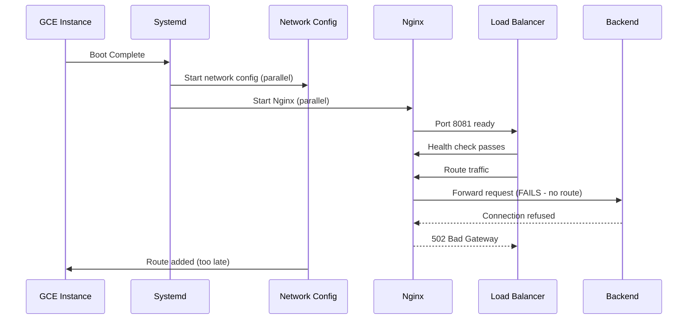

# GCE Dual NIC Nginx L4 Enhanced Routing - Comprehensive Debug & Solutions

## Executive Summary

This document provides an in-depth analysis and multiple solution approaches for resolving the 502 Bad Gateway errors occurring in GCE dual NIC Nginx instances. The root cause is a race condition where Nginx starts accepting traffic before the private network static routes are fully configured.

## Problem Analysis

### Root Cause: Service Startup Race Condition

The issue stems from parallel service initialization where:
1. **Nginx service** starts and begins listening on port 8081
2. **Network routing configuration** executes in parallel
3. **Health checks pass** before routing is complete
4. **Traffic arrives** at an instance with incomplete routing setup
5. **502 errors occur** when Nginx cannot forward to backend services

### Current Architecture Issues



## Solution Strategies

### Strategy 1: Systemd Service Dependencies (Recommended)

This approach ensures proper startup sequencing using systemd's dependency management.

#### Implementation Steps

**Step 1: Create Network Route Service**

Create `/etc/systemd/system/gce-dual-nic-routes.service`:

```ini
[Unit]
Description=Configure GCE Dual NIC Static Routes
Documentation=https://cloud.google.com/vpc/docs/multiple-network-interfaces
After=network-online.target
Wants=network-online.target
Before=nginx.service

[Service]
Type=oneshot
RemainAfterExit=yes
ExecStart=/usr/local/bin/setup-dual-nic-routes.sh
ExecStartPost=/usr/local/bin/verify-routes.sh
StandardOutput=journal
StandardError=journal
TimeoutStartSec=30

[Install]
WantedBy=multi-user.target
```

**Step 2: Create Route Setup Script**

Create `/usr/local/bin/setup-dual-nic-routes.sh`:

```bash
#!/bin/bash
set -euo pipefail

# Logging function
log() {
    echo "[$(date '+%Y-%m-%d %H:%M:%S')] $*" | systemd-cat -t gce-dual-nic
}

# Configuration
PRIVATE_NETWORK="192.168.0.0"
PRIVATE_NETMASK="255.255.255.0"
PRIVATE_GATEWAY="192.168.1.1"
BACKEND_IP="192.168.64.33"

log "Starting dual NIC route configuration"

# Add static route for private network
if ! ip route show | grep -q "${PRIVATE_NETWORK}/24"; then
    log "Adding static route: ${PRIVATE_NETWORK}/24 via ${PRIVATE_GATEWAY}"
    ip route add ${PRIVATE_NETWORK}/24 via ${PRIVATE_GATEWAY} dev eth1
    log "Static route added successfully"
else
    log "Static route already exists"
fi

# Verify backend connectivity
log "Verifying backend connectivity to ${BACKEND_IP}:443"
if timeout 5 nc -z ${BACKEND_IP} 443; then
    log "Backend connectivity verified"
else
    log "WARNING: Backend connectivity check failed"
    exit 1
fi

log "Dual NIC route configuration completed successfully"
```

**Step 3: Create Route Verification Script**

Create `/usr/local/bin/verify-routes.sh`:

```bash
#!/bin/bash
set -euo pipefail

# Verify routes are properly configured
EXPECTED_ROUTES=(
    "192.168.0.0/24 via 192.168.1.1"
)

for route in "${EXPECTED_ROUTES[@]}"; do
    if ip route show | grep -q "${route}"; then
        echo "✓ Route verified: ${route}"
    else
        echo "✗ Route missing: ${route}"
        exit 1
    fi
done

echo "All routes verified successfully"
```

**Step 4: Configure Nginx Service Dependency**

Create `/etc/systemd/system/nginx.service.d/10-dual-nic-dependency.conf`:

```ini
[Unit]
Description=Nginx with Dual NIC Route Dependencies
After=gce-dual-nic-routes.service
Requires=gce-dual-nic-routes.service
```

**Step 5: Apply Configuration**

```bash
# Make scripts executable
sudo chmod +x /usr/local/bin/setup-dual-nic-routes.sh
sudo chmod +x /usr/local/bin/verify-routes.sh

# Enable and start services
sudo systemctl daemon-reload
sudo systemctl enable gce-dual-nic-routes.service
sudo systemctl restart nginx.service

# Verify service dependencies
sudo systemctl list-dependencies nginx.service
```

### Strategy 2: Enhanced Health Check with Route Validation

Implement intelligent health checks that verify both service and network readiness.

#### Custom Health Check Endpoint

Create `/usr/local/bin/nginx-readiness-check.sh`:

```bash
#!/bin/bash
set -euo pipefail

# Health check configuration
NGINX_PORT=8081
BACKEND_IP=192.168.64.33
BACKEND_PORT=443
PRIVATE_ROUTE="192.168.0.0/24 via 192.168.1.1"

# Check 1: Nginx process running
if ! pgrep -x nginx > /dev/null; then
    echo "FAIL: Nginx process not running"
    exit 1
fi

# Check 2: Nginx listening on correct port
if ! netstat -ln | grep -q ":${NGINX_PORT}.*LISTEN"; then
    echo "FAIL: Nginx not listening on port ${NGINX_PORT}"
    exit 1
fi

# Check 3: Private network route exists
if ! ip route show | grep -q "${PRIVATE_ROUTE}"; then
    echo "FAIL: Private network route not configured"
    exit 1
fi

# Check 4: Backend connectivity
if ! timeout 3 nc -z ${BACKEND_IP} ${BACKEND_PORT} 2>/dev/null; then
    echo "FAIL: Cannot reach backend ${BACKEND_IP}:${BACKEND_PORT}"
    exit 1
fi

# Check 5: Test proxy functionality
if ! timeout 5 curl -s --connect-timeout 2 http://localhost:${NGINX_PORT}/health > /dev/null; then
    echo "FAIL: Nginx proxy health check failed"
    exit 1
fi

echo "SUCCESS: All health checks passed"
exit 0
```

#### Nginx Health Check Endpoint

Add to your nginx configuration:

```nginx
# Add to your nginx.conf in the stream block
server {
    listen 8082;
    return 200 "healthy\n";
    add_header Content-Type text/plain;
}
```

### Strategy 3: Startup Script Enhancement with Retry Logic

Create a robust startup orchestration script.

Create `/usr/local/bin/nginx-startup-orchestrator.sh`:

```bash
#!/bin/bash
set -euo pipefail

# Configuration
MAX_RETRIES=10
RETRY_INTERVAL=2
BACKEND_IP=192.168.64.33
BACKEND_PORT=443

log() {
    echo "[$(date '+%Y-%m-%d %H:%M:%S')] $*"
}

wait_for_route() {
    local retries=0
    while [ $retries -lt $MAX_RETRIES ]; do
        if ip route show | grep -q "192.168.0.0/24 via 192.168.1.1"; then
            log "Private route is ready"
            return 0
        fi
        log "Waiting for private route... (attempt $((retries + 1))/$MAX_RETRIES)"
        sleep $RETRY_INTERVAL
        ((retries++))
    done
    log "ERROR: Private route not available after $MAX_RETRIES attempts"
    return 1
}

wait_for_backend() {
    local retries=0
    while [ $retries -lt $MAX_RETRIES ]; do
        if timeout 3 nc -z $BACKEND_IP $BACKEND_PORT 2>/dev/null; then
            log "Backend connectivity verified"
            return 0
        fi
        log "Waiting for backend connectivity... (attempt $((retries + 1))/$MAX_RETRIES)"
        sleep $RETRY_INTERVAL
        ((retries++))
    done
    log "ERROR: Backend not reachable after $MAX_RETRIES attempts"
    return 1
}

# Main orchestration
log "Starting Nginx startup orchestration"

# Wait for network routes
if ! wait_for_route; then
    exit 1
fi

# Wait for backend availability
if ! wait_for_backend; then
    exit 1
fi

# Start Nginx
log "Starting Nginx service"
systemctl start nginx

# Verify Nginx is running
sleep 2
if systemctl is-active --quiet nginx; then
    log "Nginx started successfully"
else
    log "ERROR: Nginx failed to start"
    exit 1
fi

log "Startup orchestration completed successfully"
```

## Infrastructure Optimizations

### MIG Configuration Enhancements

```yaml
# Terraform configuration example
resource "google_compute_instance_template" "nginx_template" {
  name_prefix  = "nginx-dual-nic-"
  machine_type = "n1-standard-2"  # Upgraded from n1-standard-1
  
  metadata_startup_script = file("${path.module}/startup-script.sh")
  
  # Enhanced metadata
  metadata = {
    enable-oslogin = "TRUE"
    startup-script-url = "gs://your-bucket/enhanced-startup.sh"
  }
}

resource "google_compute_instance_group_manager" "nginx_mig" {
  name = "nginx-mig"
  
  # Extended initialization period
  wait_for_instances = true
  wait_for_instances_status = "STABLE"
  
  update_policy {
    type                         = "PROACTIVE"
    instance_redistribution_type = "PROACTIVE"
    minimal_action              = "REPLACE"
    max_surge_fixed            = 1
    max_unavailable_fixed      = 0
  }
  
  # Enhanced auto healing
  auto_healing_policies {
    health_check      = google_compute_health_check.nginx_health_check.id
    initial_delay_sec = 180  # Increased from 60 seconds
  }
}

resource "google_compute_health_check" "nginx_health_check" {
  name = "nginx-enhanced-health-check"
  
  timeout_sec         = 10
  check_interval_sec  = 10
  healthy_threshold   = 2
  unhealthy_threshold = 3
  
  tcp_health_check {
    port = "8081"
  }
  
  # Alternative: HTTP health check with custom endpoint
  # http_health_check {
  #   port         = "8082"
  #   request_path = "/health"
  # }
}
```

### Monitoring and Alerting

```bash
# Create monitoring script
cat > /usr/local/bin/nginx-monitoring.sh << 'EOF'
#!/bin/bash

# Collect metrics
NGINX_CONNECTIONS=$(netstat -an | grep :8081 | grep ESTABLISHED | wc -l)
ROUTE_STATUS=$(ip route show | grep -c "192.168.0.0/24 via 192.168.1.1" || echo 0)
BACKEND_STATUS=$(timeout 2 nc -z 192.168.64.33 443 && echo 1 || echo 0)

# Send to Cloud Monitoring
gcloud logging write nginx-metrics "{
  \"nginx_connections\": $NGINX_CONNECTIONS,
  \"route_configured\": $ROUTE_STATUS,
  \"backend_reachable\": $BACKEND_STATUS,
  \"timestamp\": \"$(date -Iseconds)\"
}"
EOF

# Add to crontab for regular monitoring
echo "*/1 * * * * /usr/local/bin/nginx-monitoring.sh" | crontab -
```

## Testing and Validation

### Automated Testing Script

Create `/usr/local/bin/test-dual-nic-setup.sh`:

```bash
#!/bin/bash
set -euo pipefail

# Test configuration
TESTS_PASSED=0
TESTS_FAILED=0

run_test() {
    local test_name="$1"
    local test_command="$2"
    
    echo "Running test: $test_name"
    if eval "$test_command"; then
        echo "✓ PASS: $test_name"
        ((TESTS_PASSED++))
    else
        echo "✗ FAIL: $test_name"
        ((TESTS_FAILED++))
    fi
    echo
}

# Test suite
run_test "Service Dependencies" "systemctl list-dependencies nginx.service | grep -q gce-dual-nic-routes"
run_test "Route Configuration" "ip route show | grep -q '192.168.0.0/24 via 192.168.1.1'"
run_test "Nginx Process" "pgrep -x nginx > /dev/null"
run_test "Port Listening" "netstat -ln | grep -q ':8081.*LISTEN'"
run_test "Backend Connectivity" "timeout 3 nc -z 192.168.64.33 443"
run_test "Health Check Endpoint" "/usr/local/bin/nginx-readiness-check.sh"

# Results
echo "Test Results:"
echo "Passed: $TESTS_PASSED"
echo "Failed: $TESTS_FAILED"

if [ $TESTS_FAILED -eq 0 ]; then
    echo "All tests passed! ✓"
    exit 0
else
    echo "Some tests failed! ✗"
    exit 1
fi
```

## Implementation Checklist

- [ ] **Phase 1: Preparation**
  - [ ] Backup current configuration
  - [ ] Test in staging environment
  - [ ] Create rollback plan

- [ ] **Phase 2: Core Implementation**
  - [ ] Deploy systemd service dependencies (Strategy 1)
  - [ ] Implement enhanced health checks (Strategy 2)
  - [ ] Configure startup orchestration (Strategy 3)

- [ ] **Phase 3: Infrastructure Updates**
  - [ ] Update MIG initialization period to 180 seconds
  - [ ] Upgrade instance type to n1-standard-2
  - [ ] Deploy enhanced health check configuration

- [ ] **Phase 4: Validation**
  - [ ] Run automated test suite
  - [ ] Trigger manual scaling events
  - [ ] Monitor for 502 errors
  - [ ] Validate performance metrics

- [ ] **Phase 5: Production Deployment**
  - [ ] Deploy to production with canary approach
  - [ ] Monitor system behavior for 24-48 hours
  - [ ] Document lessons learned

## Troubleshooting Guide

### Common Issues and Solutions

| Issue | Symptoms | Solution |
|-------|----------|----------|
| Route not added | `ip route` shows no private route | Check network interface names, verify gateway IP |
| Service dependency loop | Services fail to start | Review systemd dependencies, check for circular references |
| Health check failures | Instances marked unhealthy | Verify health check script permissions and logic |
| Backend unreachable | 502 errors persist | Check firewall rules, verify backend service status |

### Debug Commands

```bash
# Check service status and dependencies
sudo systemctl status gce-dual-nic-routes.service
sudo systemctl status nginx.service
sudo systemctl list-dependencies nginx.service

# Verify network configuration
ip route show
ip addr show
netstat -rn

# Test connectivity
nc -zv 192.168.64.33 443
curl -v http://localhost:8081/

# Check logs
journalctl -u gce-dual-nic-routes.service -f
journalctl -u nginx.service -f
```

This comprehensive solution addresses the race condition at its root while providing multiple layers of protection and monitoring to ensure reliable operation of your dual NIC Nginx setup.