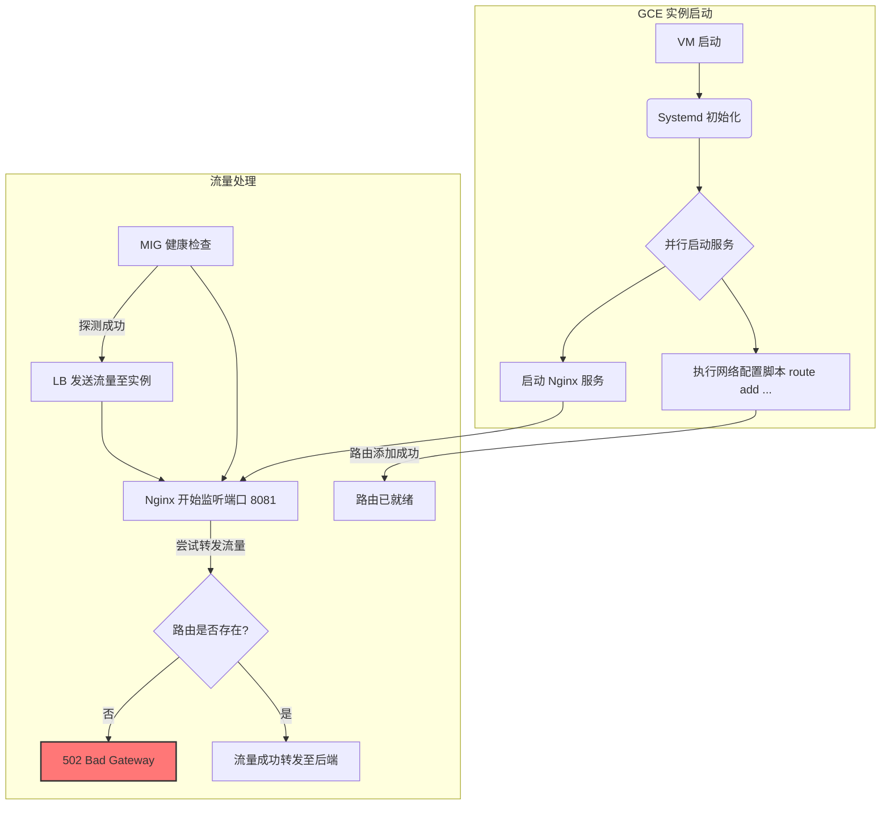
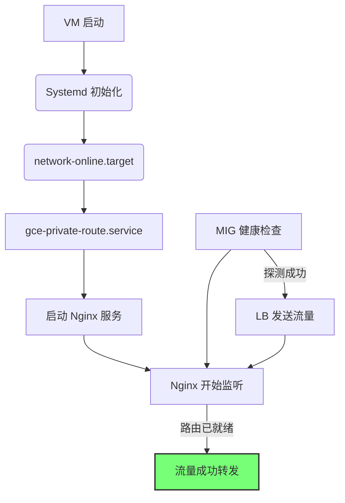

# GCE L4 Nginx 增强型路由调试与解决方案

本文档旨在深入分析和解决在 Google Compute Engine (GCE) 双网卡环境下，Nginx 服务因启动时序问题导致的 502 错误，并提供一套完整的解决方案和最佳实践。

## 1. 问题背景与根本原因分析

**核心问题**: 在托管于 GCE MIG (Managed Instance Group) 中的双网卡 Nginx 实例上，健康检查通过且流量开始进入时，其实例内部的第二网卡（私有网络）静态路由尚未配置完成，导致 Nginx 无法将流量转发至后端服务，从而产生 502 Bad Gateway 错误。

此问题在自动扩缩容（Auto-scaling）事件中尤为突出，因为新创建的虚拟机实例会立即被负载均衡器标记为健康并接收流量。

### 1.1. 启动流程竞态条件 (Race Condition)

问题的根源在于系统启动脚本与 Nginx 服务启动之间存在竞态条件。系统默认的服务启动顺序无法保证网络路由配置先于 Nginx 服务完成。

我们可以使用 Mermaid 图来清晰地展示这个错误的流程：



从上图可见，`启动 Nginx 服务 (E)` 和 `执行网络配置脚本 (D)` 是并行执行的。由于 Nginx 启动速度通常很快，导致健康检查过早成功，而此时路由尚未就绪，流量转发失败。

## 2. 解决方案

为了根治此问题，我们需要确保网络路由的就绪是 Nginx 服务启动的前置条件。以下提供两种核心解决方案，建议优先采用方案一，并将方案二作为补充增强。

### 方案一：调整 Systemd 服务依赖关系 (首选)

最稳健的方法是利用 Systemd 的依赖管理机制，明确声明 Nginx 服务必须在网络配置服务成功完成后才能启动。

**步骤 1: 为路由配置创建独立的 Systemd 服务**

假设您的路由添加命令是 `route add -net 192.168.0.0 netmask 255.255.255.0 gw 192.168.1.1`。我们将其封装成一个服务。

创建一个服务文件 `/etc/systemd/system/gce-private-route.service`:

```ini
[Unit]
Description=Setup Private Network Route for GCE Dual NIC
After=network-online.target
Wants=network-online.target

[Service]
Type=oneshot
ExecStart=/usr/sbin/route add -net 192.168.0.0 netmask 255.255.255.0 gw 192.168.1.1
RemainAfterExit=true
StandardOutput=journal

[Install]
WantedBy=multi-user.target
```

**步骤 2: 修改 Nginx 服务，添加依赖**

现在，我们需要告诉 `nginx.service` 它依赖于我们刚刚创建的 `gce-private-route.service`。

创建或编辑 `/etc/systemd/system/nginx.service.d/override.conf` 文件，添加依赖：

```ini
[Unit]
Description=The NGINX HTTP and reverse proxy server with private route dependency
After=gce-private-route.service
Requires=gce-private-route.service
```

**步骤 3: 应用变更**

执行以下命令使变更生效：

```bash
sudo systemctl daemon-reload
sudo systemctl enable gce-private-route.service
sudo systemctl restart nginx.service
```

通过以上配置，正确的启动流程将变为：



### 方案二：增强 MIG 健康检查机制

此方案可作为补充，确保即使在异常情况下，未完全就绪的实例也不会接收流量。思路是让健康检查不仅检查端口，还验证关键路由是否存在。

**步骤 1: 创建健康检查脚本**

在实例上创建一个脚本，例如 `/usr/local/bin/nginx_readiness_check.sh`：

```bash
#!/bin/bash

# 1. 检查 Nginx 进程是否在运行
pgrep nginx > /dev/null 2>&1
if [ $? -ne 0 ]; then
  exit 1
fi

# 2. 检查到后端的私有路由是否存在
ip route | grep -q "192.168.0.0/24 via 192.168.1.1"
if [ $? -ne 0 ]; then
  exit 1
fi

# 3. (可选但推荐) 尝试与后端建立连接
nc -z -w 3 192.168.64.33 443 > /dev/null 2>&1
if [ $? -ne 0 ]; then
  exit 1
fi

# 所有检查通过
exit 0
```

确保脚本有执行权限：`sudo chmod +x /usr/local/bin/nginx_readiness_check.sh`。

**步骤 2: 配置 MIG 健康检查**

在 GCE 控制台或使用 gcloud CLI，将 MIG 的健康检查从简单的 TCP 检查改为执行上述脚本。如果脚本返回退出码 `0`，则视为健康，否则为不健康。

## 3. 辅助优化措施

以下措施来自初始分析，它们虽然不能解决根本的竞态条件，但对于提升系统整体的稳定性和性能至关重要。

| 优化项 | 当前配置 | 建议配置 | 目的与说明 |
| :--- | :--- | :--- | :--- |
| **MIG 初始化周期** | 60 秒 | **180 秒** | 为实例提供更长的缓冲时间以完成所有启动任务，降低因启动缓慢而被过早投入服务的风险。 |
| **实例机器类型** | n1-standard-1 (1 vCPU) | **n1-standard-2 (2 vCPU)** | 应对高流量负载，避免 CPU 成为性能瓶颈，减少处理延迟。 |

## 4. 实施与验证清单

1.  [ ] **环境隔离**: 在预生产 (Staging) 环境中优先实施和测试。
2.  [ ] **实施方案一**: 创建 `gce-private-route.service` 并为 `nginx.service` 添加依赖。
3.  [ ] **实施方案二 (可选)**: 部署健康检查脚本并更新 MIG 配置。
4.  [ ] **调整 MIG 配置**: 将初始化周期增加到 180 秒，并根据需要升级机器类型。
5.  [ ] **触发测试**: 手动触发 MIG 扩容事件（例如，增加实例数），模拟真实场景。
6.  [ ] **监控与验证**:
    *   观察新实例的启动日志 (`journalctl -u gce-private-route` 和 `journalctl -u nginx`)，确认服务启动顺序。
    *   检查负载均衡器的后端服务日志，确认在新实例启动期间没有出现 502 错误。
    *   监控实例的 CPU 和网络指标，确保性能符合预期。
7.  [ ] **生产部署**: 在验证成功后，将相同的变更应用到生产环境。
