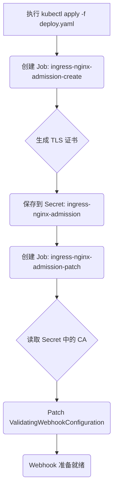
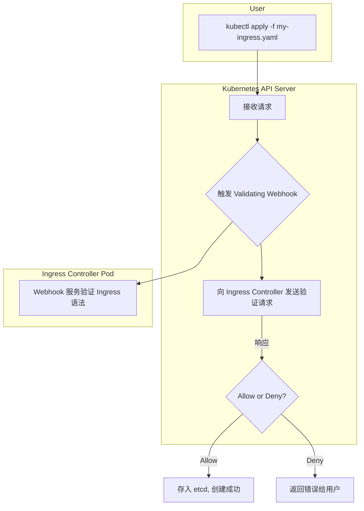

# NGINX Ingress Controller: Admission Webhook 深入解析

当部署 NGINX Ingress Controller 时，除了核心的 `ingress-nginx-controller` Pod，我们还会看到两个以 `ingress-nginx-admission-` 为前缀的 Pod。这两个 Pod 是 `Job` 类型的资源，它们在执行完一次性任务后便会成功退出，其主要职责是 **设置和配置准入控制 Webhook (Admission Control Webhook)**。

---

## **1. 各组件职责分析**

为了更好地理解，我们首先分解每个相关资源的作用。

| 资源 (Resource)                  | 类型 (Type) | 核心职责 (Core Responsibility)                                                                            | 生命周期 (Lifecycle)    |
| :------------------------------- | :---------- | :-------------------------------------------------------------------------------------------------------- | :---------------------- |
| `ingress-nginx-controller`       | Deployment  | **核心引擎**：监听 Ingress 资源变化，动态生成 Nginx 配置并重载，处理实际的流量转发。                      | 长期运行 (Long-running) |
| `ingress-nginx-admission-create` | Job         | **证书生成**：创建一个自签名的 TLS 证书，用于 K8s API Server 和 Webhook 服务之间的安全通信 (HTTPS)。      | 一次性任务 (Run-once)   |
| `ingress-nginx-admission-patch`  | Job         | **配置注入**：将 `create` Job 生成的证书公钥 (CA Bundle) 注入到 `ValidatingWebhookConfiguration` 资源中。 | 一次性任务 (Run-once)   |

### **🔹 `ingress-nginx-controller`**

这是 Ingress Controller 的大脑和心脏。它是一个长期运行的 Deployment，主要做三件事：

1.  **Watch**: 监听集群中 `Ingress`, `Service`, `Endpoint`, `Secret` 等资源的变化。
2.  **Configure**: 基于这些资源的变化，动态生成 `nginx.conf` 配置文件。
3.  **Reload**: 优雅地重载 Nginx，使新配置生效，从而实现流量路由的更新。
4.  **Serve Webhook**: 在其内部（默认 8443 端口）运行一个 HTTPS 服务，用于响应来自 K8s API Server 的验证请求。

### **🔹 `ingress-nginx-admission-create` (Job)**

这个 Pod 是一个一次性的任务，它的使命非常专一：**生成 TLS 证书**。

- **为什么需要证书？**
    Kubernetes 的准入控制 (Admission Control) 要求 API Server 和 Webhook 服务之间的通信是加密的 (HTTPS)。因此，Webhook 服务（即 `ingress-nginx-controller` Pod）需要一个 TLS 证书来提供 HTTPS 服务。

- **它做了什么？**
    1.  启动一个包含 `kube-webhook-certgen` 工具的容器。
    2.  执行 `create` 命令，生成一对自签名的 `tls.crt` 和 `tls.key`。
    3.  将这对密钥保存在一个名为 `ingress-nginx-admission` 的 Secret 资源中。
    4.  任务完成，Job 退出。

### **🔹 `ingress-nginx-admission-patch` (Job)**

这个 Pod 是第二个一次性任务，紧跟在 `create` Job 之后。它的使命是：**将证书配置与 Webhook 关联起来**。

- **为什么需要 Patch？**
    K8s API Server 在调用 Webhook 之前，需要知道如何验证 Webhook 服务的证书。`ValidatingWebhookConfiguration` 资源中有一个 `clientConfig.caBundle` 字段，用于存放 Webhook 服务证书的 CA 公钥。

- **它做了什么？**
    1.  启动一个同样包含 `kube-webhook-certgen` 工具的容器。
    2.  执行 `patch` 命令，从 `ingress-nginx-admission` Secret 中读取 CA 证书。
    3.  将 CA 证书内容（Base64 编码后）更新到 `ingress-nginx-admission` 这个 `ValidatingWebhookConfiguration` 资源的 `caBundle` 字段中。
    4.  任务完成，Job 退出。

---

## **2. 什么是 Validating Admission Webhook？**

理解了上述两个 Job 的作用后，核心问题就变成了：**这个 Webhook 到底是做什么的？**

简单来说，NGINX Ingress Controller 的 Validating Admission Webhook 是一个 **“配置语法检查器”**。

当你创建一个 `Ingress` 资源时（`kubectl apply -f my-ingress.yaml`），在 K8s 将其持久化到 etcd 之前，API Server 会将这个 `Ingress` 对象发送到 NGINX 的 Webhook 服务进行验证。

**Webhook 会检查 `Ingress` 资源的语法是否正确，特别是 `metadata.annotations` 中的 NGINX 特定注解。**

**示例：**
如果你在 Ingress 注解中写了一个错误的值：

```yaml
apiVersion: networking.k8s.io/v1
kind: Ingress
metadata:
  name: my-ingress
  annotations:
    # 错误的值，应该是 "true" 或 "false"
    nginx.ingress.kubernetes.io/ssl-redirect: "yes"
spec:
  # ...
```

在 `kubectl apply` 时，你会立刻收到来自 API Server 的报错，告诉你这个值是无效的。

> **Error from server (BadRequest): error when creating "ingress.yaml": admission webhook "validate.nginx.ingress.kubernetes.io" denied the request: annotation "nginx.ingress.kubernetes.io/ssl-redirect" has an invalid value "yes"**

**如果没有这个 Webhook**，你会成功创建 Ingress，但 `ingress-nginx-controller` 在解析时会发现配置错误，导致该 Ingress 不生效，你只能通过查阅 Controller 的日志才能发现问题。

---

## **3. 流程图**

### **安装设置流程**



### **Ingress 创建验证流程**



---

## **总结**

- **`ingress-nginx-controller`** 是处理流量的核心服务，长期运行。
- **`ingress-nginx-admission-create`** 和 **`ingress-nginx-admission-patch`** 是两个一次性的初始化 `Job`，它们共同设置了一个验证机制。
- 这个验证机制（**Admission Webhook**）能够在你创建或更新 Ingress 资源时，**提前检查配置的语法正确性**，从而避免无效配置进入集群，极大地提升了稳定性和用户体验。

因此，你看到它们启动后就消失是完全正常的，因为它们的使命在 Ingress Controller 启动之初就已经完成了。
