好的，我来帮你分析一下。

Good — let’s go step by step. You said your **Ingress uses a wildcard TLS certificate** (e.g. \*.example.com). You want to **verify** that it’s correctly applied and valid.

Here’s how to check it properly — both from **Kubernetes** and **client-side** (curl / browser / OpenSSL).

---

## **🧩 1. Verify TLS in Kubernetes**

### **Step 1 — Check Ingress TLS reference**

```
kubectl get ingress <your-ingress-name> -n <namespace> -o yaml | grep -A5 tls
```

You should see something like:

```
tls:
  - hosts:
      - "*.example.com"
    secretName: wildcard-cert
```

> ✅ Confirm that the secretName points to the TLS Secret you expect.

---

### **Step 2 — Check the TLS Secret**

```
kubectl get secret wildcard-cert -n <namespace> -o yaml
```

Look for:

```
type: kubernetes.io/tls
```

Then decode and inspect the certificate:

```
kubectl get secret wildcard-cert -n <namespace> -o jsonpath='{.data.tls\.crt}' | base64 -d | openssl x509 -noout -text | grep -E "Subject:|Issuer:|DNS"
```

You should see something like:

```
Subject: CN = *.example.com
Issuer: CN = Let's Encrypt Authority X3
X509v3 Subject Alternative Name: DNS:*.example.com, DNS:example.com
```

> ✅ Check that the CN and SAN match your wildcard domain.

---

## **🌍 2. Verify from client side (external)**

### **Option A — Using curl**

```
curl -v https://app.example.com --resolve app.example.com:<port>:<external_ip>
```

Then look for:

```
- Server certificate:
- subject: CN=*.example.com
- start date: ...
- expire date: ...
```

### **Option B — Using openssl**

```
openssl s_client -connect app.example.com:443 -servername app.example.com </dev/null 2>/dev/null | openssl x509 -noout -subject -issuer -dates
```

Expected output:

```
subject=CN = *.example.com
issuer=CN = Let's Encrypt Authority X3
notBefore=Oct 25 00:00:00 2025 GMT
notAfter=Jan 23 23:59:59 2026 GMT
```

> ✅ Confirms which certificate is served by your Ingress controller.

---

## **🧠 3. Verify at Ingress Controller level (for Nginx or GKE)**

### **For Nginx Ingress:**

```
kubectl -n ingress-nginx exec -it <nginx-pod> -- nginx -T | grep ssl_certificate
```

It should point to:

```
ssl_certificate     /etc/ingress-controller/ssl/default-wildcard-cert.pem;
ssl_certificate_key /etc/ingress-controller/ssl/default-wildcard-cert.pem;
```

### **For GKE Ingress (GLBC):**

```
kubectl describe ingress <your-ingress> -n <namespace> | grep "ManagedCertificate\|SslCertificate"
```

Then check in Cloud Console → **Network services → Load Balancing → Frontend config → Certificates**

Confirm your wildcard cert is attached.

---

## **✅ Summary Checklist**

| **Step** | **Description**                           | **Command**                          |
| -------- | ----------------------------------------- | ------------------------------------ |
| 1        | Confirm Ingress uses correct TLS secret   | kubectl get ingress -o yaml          |
| 2        | Inspect Secret’s CN and SAN               | openssl x509 -in <crt> -text         |
| 3        | Test with curl or openssl client          | openssl s_client -connect            |
| 4        | Confirm Ingress Controller uses that cert | kubectl exec <nginx-pod> -- nginx -T |

---

Would you tell me which **Ingress Controller** you’re using — NGINX, GCE (GLBC), or something else?

Then I can give you a **specific verification command** (they differ slightly).

---

## **问题分析**

在 GKE 里使用 **Ingress Controller**（例如 NGINX Ingress Controller），证书的加载逻辑和命名空间有一定要求。常见的原因是 **证书 Secret 没有在正确的 namespace 下**，导致 Ingress Controller 无法加载，从而回退到默认的自签名证书或未受信任的证书。

你的情况是：

- Ingress Controller 部署在 aibang-int-ingress-ns
- 应用 Ingress 资源部署在 aibang-api
- SSL Secret 也建在 aibang-api

外部访问提示证书不受信任 → 说明 Ingress Controller 没有用上你期望的证书。

---

## **解决方案**

关键点是 **Ingress Controller 只能读取与 Ingress 资源同一个 namespace 下的 TLS Secret**。

换句话说：

- 如果你的 Ingress 资源在 aibang-api，那么 TLS Secret **必须**也在 aibang-api。
- 并且在 Ingress 配置里引用这个 Secret。

### **1. 确认 Ingress 配置**

检查 Ingress 资源里的 tls.secretName 是否正确：

```
apiVersion: networking.k8s.io/v1
kind: Ingress
metadata:
  name: api-ingress
  namespace: aibang-api
spec:
  ingressClassName: nginx
  tls:
  - hosts:
    - api.example.com
    secretName: api-tls-secret   # 必须在 aibang-api namespace 中
  rules:
  - host: api.example.com
    http:
      paths:
      - path: /
        pathType: Prefix
        backend:
          service:
            name: api-service
            port:
              number: 80
```

### **2. 检查 Secret 是否存在**

```
kubectl get secret api-tls-secret -n aibang-api
```

必须包含 tls.crt 和 tls.key。

### **3. 确认 Ingress Controller 是否使用了默认证书**

有时如果 Secret 找不到，Ingress Controller 会退回默认的自签证书。你可以查看 Ingress Controller 日志：

```
kubectl logs -n aibang-int-ingress-ns <nginx-ingress-pod>
```

### **4. 如果要跨 namespace 共享证书**

Ingress Controller 默认不支持跨 namespace 引用 Secret。

如果你确实想复用一个证书，可以考虑：

- 使用 [cert-manager](https://cert-manager.io/) 在多个 namespace 自动签发证书。
- 或者把 Secret 同步到多个 namespace（写个 Job/Controller 做同步）。
- 对于 NGINX Ingress，还可以配置 --default-ssl-certificate=<namespace>/<secret>，作为全局默认证书（但这只支持 1 个）。

## **流程图**

```mermaid
graph TD
    A[外部请求] --> B[Ingress Controller Pod aibang-int-ingress-ns]
    B --> C[Ingress 资源 aibang-api]
    C --> D{TLS Secret?}
    D -->|存在且同namespace| E[加载证书并返回有效SSL]
    D -->|不存在或跨namespace| F[回退默认证书/自签证书]
    F --> G[浏览器提示不受信任]
```



## **注意事项**

1. **Secret 必须和 Ingress 资源在同一 namespace**。
2. 如果想统一管理证书，建议用 **cert-manager + ClusterIssuer** 来实现自动颁发。
3. 如果你外部访问报 “证书不受信任”，除了 Secret 配置错误，还可能是证书本身未被 CA 签发（自签），需要检查证书链是否完整（包含中间证书）。

---

要不要我帮你写一个 **cert-manager 的 ClusterIssuer + Ingress 配置示例**，这样你在 aibang-api 创建 Ingress 时，证书就能自动签发并生效？

```bash
我如果是每个API一个证书的话,比如我需要在对应的Namespace里面去单独配置了,还需要调整我的ingress Controller这个资源配置么?

因为我看到Ingress Controller的配置里面 有提示类似 error getting ssl certificate "aibang-api/aibang-cert-secret" local ssl certificate aibnag-api/aibang-cert-secret was not found. Using default certificate
```

## **问题分析**

你打算 **每个 API 一个证书**，对应的做法是：

- 每个 API 都在自己的 namespace 创建 Ingress。
- 每个 Ingress 引用自己 namespace 下的 TLS Secret。

**重点**：Ingress Controller 不需要额外改配置。

报错信息：

```
error getting ssl certificate "aibang-api/aibang-cert-secret"
local ssl certificate aibang-api/aibang-cert-secret was not found.
Using default certificate
```

说明 Controller 去找 aibang-api/aibang-cert-secret 但没找到，原因一般有三类：

1. Secret 根本没创建成功，或者名字不一致。
2. Secret 类型不对（必须是 kubernetes.io/tls）。
3. Secret 在别的 namespace（Controller 只会在 Ingress 所在 namespace 查找）。

---

## **解决方案**

### **1. 确认 Secret 是否存在且正确**

```
kubectl get secret aibang-cert-secret -n aibang-api -o yaml
```

正确格式应该是：

```
apiVersion: v1
kind: Secret
metadata:
  name: aibang-cert-secret
  namespace: aibang-api
type: kubernetes.io/tls
data:
  tls.crt: <base64 encoded cert>
  tls.key: <base64 encoded key>
```

### **2. 检查 Ingress 配置引用是否匹配**

```
tls:
- hosts:
  - api.example.com
  secretName: aibang-cert-secret   # 必须和 Secret 名字完全一致
```

### **3. 不需要改 Ingress Controller 配置**

只要你在对应的 namespace 里放对了 Secret，Controller 就会加载。

只有当你想配置一个 **全局默认证书** 时，才需要在 Ingress Controller Deployment 参数里加：

```
--default-ssl-certificate=<namespace>/<secretName>
```

否则无需修改。

---

## **注意事项**

- 证书 Secret 名字和 Ingress secretName 必须一模一样。
- Secret 类型必须是 kubernetes.io/tls，否则 Controller 不识别。
- 如果你看到 Controller fallback 到 default certificate，基本就是 Secret 没找到或者没法解析。

---

👉 所以结论是：

你每个 API/namespace 自己建 Secret 就可以，不需要动 Ingress Controller 的配置。

你要检查的是 Secret 有没有建好、名字对不对、类型对不对。

要不要我帮你写一个 **排查命令清单**（一步步执行，直到确定为什么 Controller 找不到证书）？
