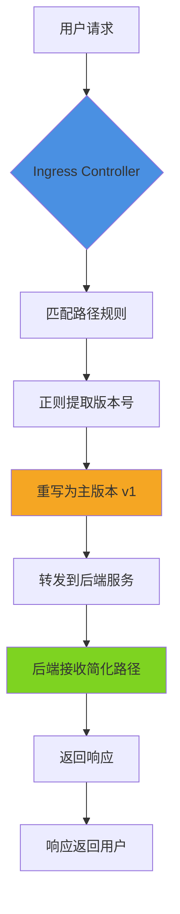

# Ingress Controller 中 API 版本号重写方案

## 问题分析

用户请求路径为 `https://domain/apiname/v1.0.4/well_known/health`，需要将详细版本号（v1.0.4）简化为主版本号（v1），实现路径重写。

## 解决方案

### 方案一：使用 Ingress Annotation 进行 URL 重写（推荐）

根据您使用的 Ingress Controller 类型，配置不同的 annotation：

#### 1. Nginx Ingress Controller

```yaml
apiVersion: networking.k8s.io/v1
kind: Ingress
metadata:
  name: api-ingress
  annotations:
    # 使用正则表达式捕获并重写路径
    nginx.ingress.kubernetes.io/rewrite-target: /$1/$2/$3
    # 捕获路径中的组件
    nginx.ingress.kubernetes.io/use-regex: "true"
spec:
  rules:
  - host: domain
    http:
      paths:
      - path: /apiname/v1\.0\.\d+/(.*)
        pathType: ImplementationSpecific
        backend:
          service:
            name: api-service
            port:
              number: 80
```

**更简洁的方案**：

```yaml
apiVersion: networking.k8s.io/v1
kind: Ingress
metadata:
  name: api-ingress
  annotations:
    nginx.ingress.kubernetes.io/rewrite-target: /apiname/v1/$1
    nginx.ingress.kubernetes.io/use-regex: "true"
spec:
  rules:
  - host: domain
    http:
      paths:
      - path: /apiname/v1\.\d+\.\d+/(.*)
        pathType: ImplementationSpecific
        backend:
          service:
            name: api-service
            port:
              number: 80
```

#### 2. Kong Ingress Controller

```yaml
apiVersion: networking.k8s.io/v1
kind: Ingress
metadata:
  name: api-ingress
  annotations:
    konghq.com/plugins: version-rewrite-plugin
spec:
  rules:
  - host: domain
    http:
      paths:
      - path: /apiname
        pathType: Prefix
        backend:
          service:
            name: api-service
            port:
              number: 80
---
apiVersion: configuration.konghq.com/v1
kind: KongPlugin
metadata:
  name: version-rewrite-plugin
plugin: request-transformer
config:
  replace:
    uri: /apiname/v1/$(uri_captures[1])
  http_method: GET
```

**Kong 高级配置**（使用 Request Transformer Advanced）：

```yaml
apiVersion: configuration.konghq.com/v1
kind: KongPlugin
metadata:
  name: version-rewrite-plugin
plugin: request-transformer-advanced
config:
  replace:
    uri:
    - "/(apiname)/v\\d+\\.\\d+\\.\\d+/(.*):/$1/v1/$2"
```

### 方案二：使用 Kong 路由正则匹配（更灵活）

```yaml
apiVersion: configuration.konghq.com/v1
kind: KongIngress
metadata:
  name: api-route-config
route:
  paths:
  - ~/apiname/v\d+\.\d+\.\d+/(?<path>.*)
  regex_priority: 10
  strip_path: false
  preserve_host: true
---
apiVersion: networking.k8s.io/v1
kind: Ingress
metadata:
  name: api-ingress
  annotations:
    konghq.com/override: api-route-config
    konghq.com/plugins: path-rewrite
spec:
  rules:
  - host: domain
    http:
      paths:
      - path: /
        pathType: Prefix
        backend:
          service:
            name: api-service
            port:
              number: 80
```

## 请求处理流程



## 最佳实践建议

### 1. 版本管理策略

|策略           |适用场景  |优点         |缺点     |
|-------------|------|-----------|-------|
|**路径重写**     |临时过渡方案|快速实现，无需修改代码|增加网关复杂度|
|**API 网关层映射**|统一版本管理|集中控制，灵活配置  |维护成本较高 |
|**后端直接支持**   |长期方案  |性能最优，逻辑清晰  |需要修改代码 |

### 2. 推荐实施步骤

**阶段一：临时方案（立即实施）**

```bash
# 1. 备份现有 Ingress 配置
kubectl get ingress api-ingress -o yaml > ingress-backup.yaml

# 2. 应用新配置
kubectl apply -f ingress-version-rewrite.yaml

# 3. 验证配置
kubectl describe ingress api-ingress
```

**阶段二：测试验证**

```bash
# 测试旧版本路径
curl -i https://domain/apiname/v1.0.4/well_known/health

# 测试新版本路径
curl -i https://domain/apiname/v1/well_known/health

# 检查后端日志
kubectl logs -f deployment/api-service --tail=50
```

**阶段三：长期优化**

考虑在后端服务中直接支持版本号简化：

```go
// 示例：Go 语言后端路由配置
router.HandleFunc("/apiname/{version:v[0-9]+}/well_known/health", healthHandler)
router.HandleFunc("/apiname/{version:v[0-9]+\\.[0-9]+\\.[0-9]+}/well_known/health", healthHandlerLegacy)
```

### 3. 多版本并存策略

```yaml
apiVersion: networking.k8s.io/v1
kind: Ingress
metadata:
  name: api-ingress-multi-version
  annotations:
    nginx.ingress.kubernetes.io/use-regex: "true"
spec:
  rules:
  - host: domain
    http:
      paths:
      # 主版本路由（v1）
      - path: /apiname/v1/(.*)
        pathType: ImplementationSpecific
        backend:
          service:
            name: api-service-v1
            port:
              number: 80
      # 详细版本路由（v1.x.x）
      - path: /apiname/v1\.\d+\.\d+/(.*)
        pathType: ImplementationSpecific
        backend:
          service:
            name: api-service-v1
            port:
              number: 80
      # 主版本路由（v2）
      - path: /apiname/v2/(.*)
        pathType: ImplementationSpecific
        backend:
          service:
            name: api-service-v2
            port:
              number: 80
```

## 注意事项

### ⚠️ 重要提醒

1. **正则表达式优先级**

- 确保详细版本规则优先级高于主版本规则
- 使用 `regex_priority` 或路径顺序控制匹配优先级

1. **缓存问题**

- 修改 Ingress 配置后，可能需要等待配置同步（通常 30-60 秒）
- 清除客户端和 CDN 缓存确保测试准确性

1. **日志监控**
   
   ```bash
   # 监控 Ingress Controller 日志
   kubectl logs -f -n ingress-nginx deployment/nginx-ingress-controller
   
   # 监控 Kong 网关日志
   kubectl logs -f -n kong deployment/kong-controller
   ```
1. **性能影响**

- 正则表达式匹配会略微增加延迟（通常 < 1ms）
- 建议在测试环境压测验证性能影响

1. **向后兼容**

- 保留对旧版本路径的支持，设置合理的废弃期限
- 在响应头中添加版本废弃警告：
  
  ```yaml
  nginx.ingress.kubernetes.io/configuration-snippet: |
    add_header X-API-Version-Deprecated "v1.0.4 will be deprecated on 2024-12-31" always;
  ```

### 🎯 推荐方案总结

**短期（1-2 周）**: 使用 Ingress 路径重写，快速解决问题  
**中期（1-3 个月）**: 在后端服务添加主版本路由支持  
**长期（3 个月后）**: 完全迁移到主版本管理，废弃详细版本路径

这种渐进式迁移策略可以最小化风险，同时保证业务连续性。​​​​​​​​​​​​​​​​

# Ingress / API 版本号规范化设计（去掉小版本号 v1.0.4 → v1）

## 1. 问题分析

当前请求路径包含**语义化版本号的小版本**：

/apiname/v1.0.4/well_known/health

你希望对外暴露 **稳定的大版本 API**：

/apiname/v1/well_known/health

核心目标通常包括：

- **URL 稳定性**（避免小版本变更导致客户端改 URL）
- **Ingress / Gateway 规则简化**
- **后端可独立演进**
- **向后兼容**

这在 **GKE + Ingress / Kong / Nginx** 架构里是一个**非常典型的问题**。

---

## 2. 行业最佳实践（结论先行）

### ✅ 推荐优先级（从高到低）

| 层级 | 方案 | 是否推荐 | 说明 |
|----|----|----|----|
| API Gateway / Ingress | **Rewrite / Normalize** | ⭐⭐⭐⭐⭐ | 标准做法 |
| 应用内部 | 版本路由适配 | ⭐⭐⭐ | 不建议强依赖 |
| Header 版本 | `Accept-Version` | ⭐⭐ | 高级玩法 |
| URL 全版本 | `/v1.0.4` | ❌ | 不推荐 |

👉 **最佳实践：在 Ingress / Gateway 层完成版本归一化（rewrite）**

---

## 3. 推荐方案一：Ingress 层做 Rewrite（最常见）

### 3.1 目标效果

外部请求:
/apiname/v1.0.4/xxx
/apiname/v1.0.9/xxx

Ingress 转发给后端:
/apiname/v1/xxx

后端 **只认 v1**

---

### 3.2 GKE Ingress（Nginx）示例

> 使用 `use-regex` + `rewrite-target`

```yaml
apiVersion: networking.k8s.io/v1
kind: Ingress
metadata:
  name: api-ingress
  annotations:
    nginx.ingress.kubernetes.io/use-regex: "true"
    nginx.ingress.kubernetes.io/rewrite-target: /apiname/v1/$2
spec:
  rules:
  - host: domain
    http:
      paths:
      - path: /apiname/v1\.[0-9]+\.[0-9]+/(.*)
        pathType: ImplementationSpecific
        backend:
          service:
            name: api-service
            port:
              number: 8080

🔍 正则含义说明

表达式	含义
v1\.	大版本 v1
[0-9]+\.[0-9]+	小版本
(.*)	真实业务路径


⸻

4. 推荐方案二：Kong Gateway 做 Path Rewrite（更推荐你们的架构）

你们平台里已经在使用 Kong Gateway，这是最干净、最可控的方案。

4.1 Kong Route（正则匹配）

paths:
  - ~^/apiname/v1\.\d+\.\d+/(.*)
strip_path: false


⸻

4.2 使用 request-transformer 插件

apiVersion: configuration.konghq.com/v1
kind: KongPlugin
metadata:
  name: api-version-rewrite
plugin: request-transformer
config:
  replace:
    uri: /apiname/v1/$(uri_captures[1])

✅ 优点
	•	版本逻辑 集中在 Gateway
	•	后端无感知
	•	易于灰度 / 回滚
	•	支持未来 v2

⸻

5. 不推荐的方案（但你可能会看到）

❌ 5.1 应用内部解析版本

/apiname/v1.0.4/health

在代码里 split 版本号

❌ 缺点：
	•	侵入业务代码
	•	所有服务都要实现一遍
	•	不利于统一治理

⸻

❌ 5.2 完整版本写死在 URL

/v1.0.4
/v1.0.5

	•	客户端频繁改 URL
	•	Ingress 规则爆炸
	•	无法向后兼容

⸻

6. 推荐的 API 版本设计规范（你可以写进平台规范）

1. URL 只体现大版本：/v1 /v2
2. 小版本由：
   - Header
   - 或服务内部版本管理
3. Gateway 负责：
   - 路径规范化
   - Rewrite
   - 兼容旧版本

示例（进阶）

GET /apiname/v1/health
Accept-Version: 1.0.4


⸻

7. 整体流量处理流程（Mermaid）

graph TD
    A["Client Request /v1.0.4"] --> B["Ingress / Kong Regex Match"]
    B --> C["Rewrite to /v1"]
    C --> D["Backend Service"]


⸻

8. 最终结论（给你一个明确答案）

在 Ingress / Kong Gateway 层使用正则匹配 + rewrite，将 /v1.x.y 统一映射为 /v1 是行业最佳实践。

如果你愿意，我可以帮你：
	•	给你 Kong Route + Plugin 的完整 YAML
	•	设计 v1 → v2 的平滑迁移方案
	•	帮你写一份 平台 API 版本规范文档（可直接给用户）

只要告诉我你现在 最终入口是在 Nginx Ingress 还是 Kong DP。

