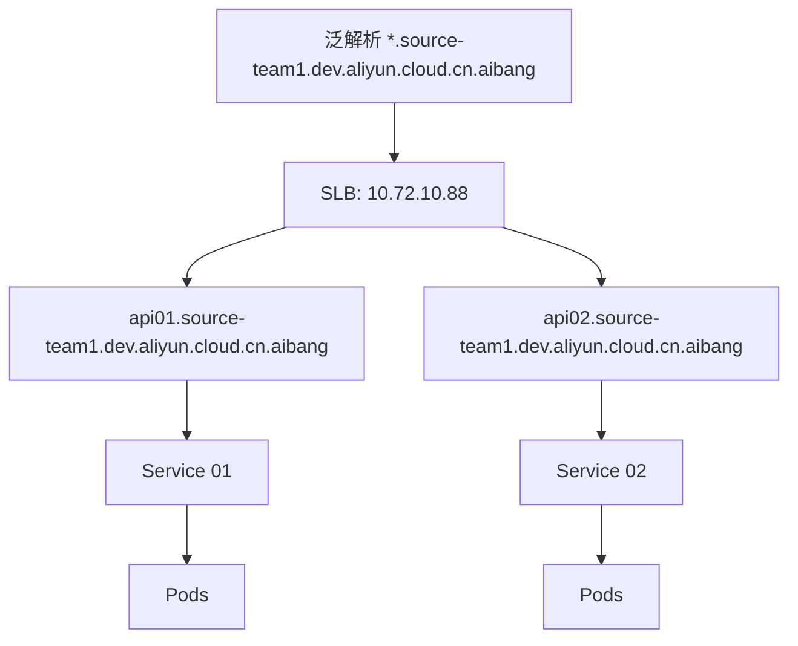
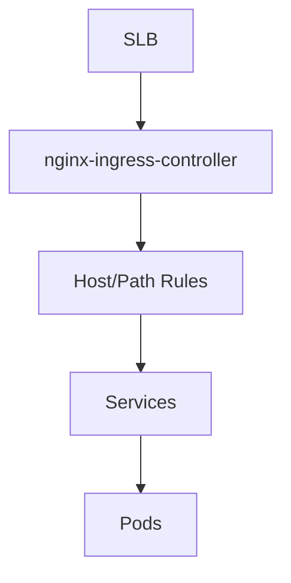
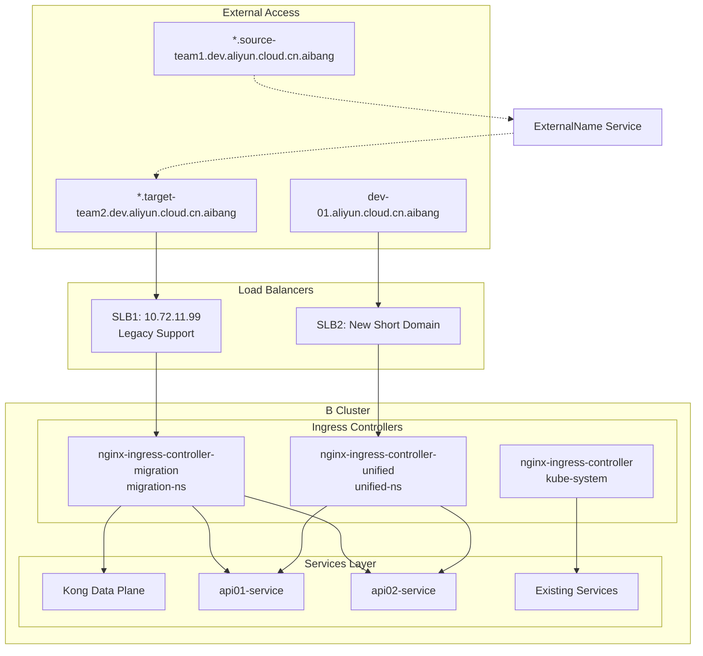

# ChatGPT  
下面给出一份面向 **阿里云 (Aliyun)** 的 A Cluster → B Cluster 迁移建议与落地规划（可直接复制到 .md 文件）。内容包含：总体方案说明、逐步迁移操作清单（含命令/示例 YAML）、DNS/ExternalName 方案评估、Kong DP 特殊项、短域名 + path 的最终方案、回滚与验证步骤，以及 mermaid 流程图帮助理解流向。

  

> 假设前提（已知）：

- > A cluster 域名：*.source-team1.dev.aliyun.cloud.cn.aibang → 10.72.10.88
    
- > B cluster 目标域名：*.target-team2.dev.aliyun.cloud.cn.aibang → 10.72.11.99
    
- > 最终短域名入口：dev-01.aliyun.cloud.cn.aibang（通过 path 路由到不同 API）
    
- > B cluster 已有若干 namespace，不冲突
    

---

# **一、总体方案建议（高层结论）**

1. 推荐在 B cluster 为迁入的服务 **创建新的独立 Ingress Controller + 独立 SLB（独立公网/内网负载） + 专用 ingressClass**，以实现隔离和逐步切换。
    
2. 在切换期，用 **DNS CNAME / SLB 转发（或阿里云 DNS）** 将 api01.source... 指向 api01.target...（长域名），或者在 B/边缘层使用 **ExternalName/反向代理** 做平滑跳转；但 **DNS 层面（CNAME）更干净、延迟小**。ExternalName 可作为临时手段，但要注意解析和证书问题。
    
3. 最终长期访问：https://dev-01.aliyun.cloud.cn.aibang/{apiName}/...，在 SLB 层做 host/path 转发到对应的独立 Ingress Controller（可以 1 个 SLB → 多 ingress controller，但建议关键 API 用独立 SLB 以便精确控制）。
    

---

# **二、迁移步骤（核心流水，按序执行）**

```
# 假定在你的工作机，并已配置 kubectl --context=cluster-a 和 cluster-b
# 导出 A cluster 下需要迁移的 namespace 资源清单（示例 namespace: team1-ns）
kubectl --context=cluster-a -n team1-ns get all,configmap,secret,ingress,svc -o yaml > team1-ns-export.yaml

# 另导出 CRD / PV / PVC / StorageClass 等（如有）
kubectl --context=cluster-a get pv,pvc,sc -o yaml > pv-pvc-sc-export.yaml

# 导出 Deployment/StatefulSet 的镜像信息以便镜像拉取策略确认
kubectl --context=cluster-a -n team1-ns get deploy -o=jsonpath='{range .items[*]}{.metadata.name}{"\t"}{.spec.template.spec.containers[*].image}{"\n"}{end}' > images-list.txt
```

1. **清点与评估（Inventory）**
    
    - 列出 Deployments、Services、Ingress、ConfigMaps、Secrets、IngressClass、ServiceAccount、RBAC、CRD、PVC、PV、StatefulSet、DaemonSet、HorizontalPodAutoscaler。
        
    - 确认是否有 NodePort / HostPort / LoadBalancer 类型 Service；确认是否使用云盘（PV）或外部依赖（Redis、RDS 等）。
        
    
2. **准备 B cluster 环境**
    
    - 部署 **新的 nginx ingress controller**（独立 namespace，专用 ingressClass），并在阿里云创建对应的 SLB（或指定已有 SLB 的监听和后端）。
        
    - 创建命名空间：kubectl --context=cluster-b create ns team1-ns。
        
    - 准备 CI/CD 或 kubectl 权限、镜像仓库访问（若镜像在内网 registry，确保 B cluster 能拉取）。
        
    
3. **资源迁移（Transform -> Apply）**
    
    - 对 team1-ns-export.yaml 做变换（去除 cluster-specific 字段：status, metadata.uid, resourceVersion, creationTimestamp, annotations 与 ingress 中的 loadBalancer info 等）。
        
    - 将域名替换：*.source-team1... → *.target-team2...（可用 sed/脚本批量替换）。示例：
        
    

```
# 简单替换示例（务必先手动 review）
sed -e 's/source-team1.dev.aliyun.cloud.cn.aibang/target-team2.dev.aliyun.cloud.cn.aibang/g' team1-ns-export.yaml > team1-ns-for-b.yaml
```

- 如果使用 Kong DP：导出 Kong 配置（routes/services/consumers/certificates），并在 Kong Admin API 在 B 环境中重新导入或调整。
    

  

4. **证书与 TLS**
    
    - 为 *.target-team2... 配置证书（阿里云证书管理或自行 CA）。短域名 dev-01... 也需要证书（可用通配或单独）。
        
    - 切换时确保原域名 api01.source... 的证书仍然有效或能被新入口接受（如果用 CNAME 则会出现 host mismatch，需同样的 cert 或做 TLS 终止 proxy）。
        
    
5. **流量镜像 / 并发测试（可选）**
    
    - 在 B 环境做流量镜像（shadow traffic）或内部压力测试（smoke tests、SIT）。
        
    
6. **DNS / ExternalName / SLB 切换策略**
    
    - 推荐主切换方式：在 DNS 层创建 CNAME 将 api01.source-team1... 指向 api01.target-team2...，并在阿里云 SLB 上把目标后端指到 B 的 ingress。
        
    - 若只能使用 ExternalName：在 B cluster 创建 ExternalName Service 指向 api01.target-team2... 并保证 DNS 能解析。但 ExternalName 主要用于 cluster 内服务引用，不是公网域名长期转发的最佳实践。
        
    
7. **最终短域名入口（dev-01）实现**
    
    - 在阿里云创建 dev-01.aliyun.cloud.cn.aibang 的 SLB（前端监听 443），后端分发到 B 的两个 ingress controller（或用一层反向代理把 path 转发到第二层 ingress）。
        
    - 在短域名 ingress 中为每个 path 做 rewrite/forward 到对应 host（api01.target…）或直接指向对应 ingress controller 的 Service。
        
    
8. **切换与监控**
    
    - 小流量灰度 → 全流量切换 → 观察 24-72 小时后回收 A cluster 的服务（或保留若干天作为回滚保障）。
        
    

````
---

# 三、关键示例 YAML（示范用途，需根据你的环境调整）

## 1) 独立 nginx ingress controller 的简单 Service + IngressClass（示例）
```yaml
apiVersion: v1
kind: Namespace
metadata:
  name: ingress-nginx-team1

---
apiVersion: v1
kind: Service
metadata:
  name: ingress-nginx-controller
  namespace: ingress-nginx-team1
spec:
  type: ClusterIP
  selector:
    app.kubernetes.io/name: ingress-nginx
  ports:
    - port: 80
      targetPort: 80
    - port: 443
      targetPort: 443

---
apiVersion: networking.k8s.io/v1
kind: IngressClass
metadata:
  name: team1-nginx
spec:
  controller: k8s.io/ingress-nginx
````

## **2) ExternalName Service（**

## **仅作 cluster 内部引用用途**

## **，不推荐作为公网长期跳转）**

```
apiVersion: v1
kind: Service
metadata:
  name: api01-to-target
  namespace: team1-ns
spec:
  type: ExternalName
  externalName: api01.target-team2.dev.aliyun.cloud.cn.aibang
```

## **3) 短域名入口的 Ingress（rewrite path 到后端 host）**

  

（以 nginx-ingress 的 annotation 示例）

```
apiVersion: networking.k8s.io/v1
kind: Ingress
metadata:
  name: dev01-aggregate
  namespace: ingress-nginx-team1
  annotations:
    kubernetes.io/ingress.class: "team1-nginx"
    nginx.ingress.kubernetes.io/rewrite-target: /$2
spec:
  tls:
    - hosts:
        - dev-01.aliyun.cloud.cn.aibang
      secretName: dev01-tls
  rules:
    - host: dev-01.aliyun.cloud.cn.aibang
      http:
        paths:
          - path: /api01(/|$)(.*)
            pathType: Prefix
            backend:
              service:
                name: api01-backend-svc
                port:
                  number: 80
          - path: /api02(/|$)(.*)
            pathType: Prefix
            backend:
              service:
                name: api02-backend-svc
                port:
                  number: 80
```

---

# **四、关于** 

# **ExternalName vs DNS CNAME vs SLB**

#  **的评估（建议）**

|**方案**|**优点**|**缺点**|**适用场景**|
|---|---|---|---|
|DNS CNAME（把 api01.source 指向 api01.target）|最简单、低延迟、适用于公网域名|需要较短的 TTL 和证书安排；CNAME 链可能受限|推荐用于切换长域名到新集群|
|SLB 转发（在阿里云 SLB 配置转发/转发规则）|可控、支持 TLS 终止和转发策略|配置复杂，可能需要修改监听 / 后端|推荐用于大流量/多入口场景|
|ExternalName 服务|在 cluster 内部方便做 CNAME 风格解析|不是面向公网长域名的可靠切换方案，证书/Host 问题|仅用于 cluster 内部迁移的短期方案|

---

# **五、Kong DP / Gateway 特殊注意**

- **Kong DP 的证书 & 客户认证**：如果 Kong DP 在 A 上持有 client cert 或 mTLS 配置，必须把对应的 consumer/cert/CA 配置迁移到 B 的 Kong（或让 Kong RT 重新注册）。
    
- **服务/route 名称唯一性**：确保迁移时 service/route 名称不会与 B 中已有项冲突；若冲突，建议前缀化 team1-。
    
- **Kong 配置导出导入**：使用 Kong Admin API 导出（/config）或使用 declarative config（yaml/json）导入。
    
- **重试与超时策略**：在迁移初期，可在 Kong 层把重试策略、超时设置调宽容，避免短暂错误导致客户端感知到故障。
    

---

# **六、切换与回滚流程（简洁版）**

1. 预热：把服务在 B 部署完成并验证健康探针与依赖。
    
2. 灰度：用 DNS（低 TTL）把 5%-20% 流量指向 B（或用 SLB 权重）。监控错误率/RTT/日志。
    
3. 全量切换：逐步调整到 100%。保留 A 的服务至少 24-72 小时（监控窗口）用于快速回滚。
    
4. 回滚：把 DNS TTL 恢复到指向 A，或在 SLB 上把权重切回 A。确认回滚后清理 B 的临时配置（若需要）。
    
5. 收尾：清理 A cluster 不再使用的资源；更新文档与监控告警。
    

---

# **七、验收与测试清单（可复制为表）**

|**验收项**|**操作/命令示例**|**期望结果**|
|---|---|---|
|k8s 资源就绪|kubectl -n team1-ns get pods|pods STATUS=Running|
|ingress 可达（长域名）|curl -v https://api01.target-team2.../health|200 OK，证书正确|
|短域名 path 路由|curl -v https://dev-01.../api01/health|200 OK，返回期望 body|
|Kong route 生效|curl -v -H "Host: api01.source..." https://<kong-proxy>/|正常路由到后端|
|监控 & 日志|Prometheus/Grafana、日志无大量 5xx|错误率低于阈值|

---

# **八、Mermaid 流程图（展示整体流向）**

```
graph TD;
    subgraph A_Cluster["A Cluster (old)"]
      A_Client[Client] --> A_SLB[SLB A]
      A_SLB --> A_Ingress[Nginx Ingress (A)]
      A_Ingress --> A_KongDP[Kong DP (A)]
      A_KongDP --> A_SVC[Service -> RT]
    end

    subgraph B_Cluster["B Cluster (new)"]
      B_SLB_new[SLB B (new)] --> B_Ingress_new[Nginx Ingress (new, team1)]
      B_Ingress_new --> B_KongDP[Kong DP (B) / or SVC -> RT]
      B_Ingress_old[Existing Ingress (other namespaces)]
      B_SLB_short[SLB dev-01 (short domain)] --> ShortIngress[Ingress for dev-01]
      ShortIngress -->|/api01/*| B_Ingress_new
      ShortIngress -->|/api02/*| B_Ingress_new
    end

    %% 切换路径与DNS映射
    A_Client -->|DNS CNAME / ExternalName| B_SLB_new
    A_Client -->|短域名 dev-01 path| B_SLB_short
```

---

# **九、注意事项（风险点）**

- **证书与 TLS hostname mismatch**：CNAME 或 proxy 后仍需确保 TLS 主机名匹配证书。
    
- **Session sticky / Statefulness**：有 stateful 服务要注意 session/persistence；StatefulSet + PVC 直接迁移要用 Velero 或手动备份恢复。
    
- **Ingress annotation 差异**：不同 ingress controller 注解差异，导入前需逐项适配。
    
- **外部依赖 IP/白名单**：第三方 API 白名单可能需要加入 B 的出口 IP（或 SLB IP）。
    
- **监控/告警**：更新监控中的 endpoint、alert rule（避免误报）。
    

---

# **十、快速参考脚本片段（导出→替换→应用）**

```
# 导出 namespace（示例）
kubectl --context=cluster-a -n team1-ns get all,cm,secret,ingress,svc -o yaml > team1-ns-export.yaml

# 清理 cluster specific metadata（示例）
cat team1-ns-export.yaml | yq 'del(.items[].metadata.clusterName,.items[].metadata.uid,.items[].metadata.resourceVersion,.items[].metadata.creationTimestamp,.items[].status)' > cleaned.yaml

# 域名替换（示例）
sed -e 's/source-team1.dev.aliyun.cloud.cn.aibang/target-team2.dev.aliyun.cloud.cn.aibang/g' cleaned.yaml > cleaned-replaced.yaml

# 在 B cluster 先做 dry-run
kubectl --context=cluster-b apply -f cleaned-replaced.yaml --dry-run=client

# 真正 apply（review 无误后）
kubectl --context=cluster-b apply -f cleaned-replaced.yaml
```

---

如果你愿意，我可以 **直接根据你给的具体 namespace 列表（或给我 team1-ns-export.yaml）生成可应用到 B 的 cleaned YAML**（包含批量替换域名、移除 cluster-specific 字段以及针对 ingress annotation 的适配示例）。但现在先给出这套可复制到 Markdown 的完整迁移规划，供你在团队内评审与执行。需要我把上面的一些命令或 YAML 适配成更具体的脚本或 velero/kubectl 自动化流程吗？

# Claude
基于你的需求，我为你设计一个完整的迁移方案和架构规划。

## 当前架构分析

### A Cluster 现状



### B Cluster 现状



## 目标架构设计

### B Cluster 最终架构



## 实施步骤

### Phase 1: 准备 B Cluster 基础设施

#### 1.1 创建新的 Ingress Controller

```yaml
# migration-nginx-controller.yaml
apiVersion: v1
kind: Namespace
metadata:
  name: migration-ingress
---
apiVersion: helm.cattle.io/v1
kind: HelmChart
metadata:
  name: nginx-ingress-migration
  namespace: migration-ingress
spec:
  chart: ingress-nginx
  repo: https://kubernetes.github.io/ingress-nginx
  targetNamespace: migration-ingress
  valuesContent: |-
    controller:
      ingressClass: nginx-migration
      service:
        annotations:
          service.beta.kubernetes.io/alibaba-cloud-loadbalancer-id: "your-slb-id"
          service.beta.kubernetes.io/alibaba-cloud-loadbalancer-force-override-listeners: "true"
```

#### 1.2 创建统一入口 Ingress Controller

```yaml
# unified-nginx-controller.yaml
apiVersion: v1
kind: Namespace
metadata:
  name: unified-ingress
---
apiVersion: helm.cattle.io/v1
kind: HelmChart
metadata:
  name: nginx-ingress-unified
  namespace: unified-ingress
spec:
  chart: ingress-nginx
  repo: https://kubernetes.github.io/ingress-nginx
  targetNamespace: unified-ingress
  valuesContent: |-
    controller:
      ingressClass: nginx-unified
      service:
        annotations:
          service.beta.kubernetes.io/alibaba-cloud-loadbalancer-id: "your-unified-slb-id"
```

### Phase 2: 迁移 A Cluster 资源

#### 2.1 创建应用资源

```bash
# 导出 A Cluster 资源
kubectl get deployment,service,configmap,secret -n your-namespace -o yaml > a-cluster-resources.yaml

# 在 B Cluster 创建资源
kubectl apply -f a-cluster-resources.yaml -n your-target-namespace
```

#### 2.2 创建长域名 Ingress 规则

```yaml
# api01-migration-ingress.yaml
apiVersion: networking.k8s.io/v1
kind: Ingress
metadata:
  name: api01-migration
  namespace: your-target-namespace
  annotations:
    kubernetes.io/ingress.class: nginx-migration
spec:
  rules:
  - host: api01.target-team2.dev.aliyun.cloud.cn.aibang
    http:
      paths:
      - path: /
        pathType: Prefix
        backend:
          service:
            name: api01-service
            port:
              number: 80
---
apiVersion: networking.k8s.io/v1
kind: Ingress
metadata:
  name: api02-migration
  namespace: your-target-namespace
  annotations:
    kubernetes.io/ingress.class: nginx-migration
spec:
  rules:
  - host: api02.target-team2.dev.aliyun.cloud.cn.aibang
    http:
      paths:
      - path: /
        pathType: Prefix
        backend:
          service:
            name: api02-service
            port:
              number: 80
```

### Phase 3: 创建短域名统一入口

#### 3.1 短域名 Ingress 规则

```yaml
# unified-ingress.yaml
apiVersion: networking.k8s.io/v1
kind: Ingress
metadata:
  name: unified-api-ingress
  namespace: your-target-namespace
  annotations:
    kubernetes.io/ingress.class: nginx-unified
    nginx.ingress.kubernetes.io/rewrite-target: /$2
spec:
  rules:
  - host: dev-01.aliyun.cloud.cn.aibang
    http:
      paths:
      - path: /api01(/|$)(.*)
        pathType: Prefix
        backend:
          service:
            name: api01-service
            port:
              number: 80
      - path: /api02(/|$)(.*)
        pathType: Prefix
        backend:
          service:
            name: api02-service
            port:
              number: 80
```

### Phase 4: 实现平滑迁移

#### 4.1 创建 ExternalName Service 用于域名重定向

```yaml
# external-redirect.yaml
apiVersion: v1
kind: Service
metadata:
  name: api01-redirect
  namespace: migration-namespace
spec:
  type: ExternalName
  externalName: api01.target-team2.dev.aliyun.cloud.cn.aibang
  ports:
  - port: 80
    targetPort: 80
    protocol: TCP
---
apiVersion: networking.k8s.io/v1
kind: Ingress
metadata:
  name: api01-source-redirect
  annotations:
    kubernetes.io/ingress.class: nginx-migration
    nginx.ingress.kubernetes.io/permanent-redirect: https://api01.target-team2.dev.aliyun.cloud.cn.aibang$request_uri
spec:
  rules:
  - host: api01.source-team1.dev.aliyun.cloud.cn.aibang
    http:
      paths:
      - path: /
        pathType: Prefix
        backend:
          service:
            name: api01-redirect
            port:
              number: 80
```

## Kong 集成方案（可选）

如果需要使用 Kong 作为 API Gateway：

```yaml
# kong-dp-ingress.yaml
apiVersion: networking.k8s.io/v1
kind: Ingress
metadata:
  name: kong-proxy-ingress
  annotations:
    kubernetes.io/ingress.class: nginx-migration
spec:
  rules:
  - host: "*.target-team2.dev.aliyun.cloud.cn.aibang"
    http:
      paths:
      - path: /
        pathType: Prefix
        backend:
          service:
            name: kong-dp-service
            port:
              number: 8000
```

## 验证和监控

### 验证脚本

```bash
#!/bin/bash
# test-migration.sh

echo "Testing long domain access..."
curl -v https://api01.target-team2.dev.aliyun.cloud.cn.aibang/health
curl -v https://api02.target-team2.dev.aliyun.cloud.cn.aibang/health

echo "Testing short domain access..."
curl -v https://dev-01.aliyun.cloud.cn.aibang/api01/health
curl -v https://dev-01.aliyun.cloud.cn.aibang/api02/health

echo "Testing redirect..."
curl -v https://api01.source-team1.dev.aliyun.cloud.cn.aibang/health
```

## 配置清单

|组件|配置项|值|说明|
|---|---|---|---|
|DNS|旧域名泛解析|*.source-team1.dev.aliyun.cloud.cn.aibang → 10.72.10.88|原有域名|
|DNS|新域名泛解析|*.target-team2.dev.aliyun.cloud.cn.aibang → 10.72.11.99|迁移后域名|
|DNS|统一入口域名|dev-01.aliyun.cloud.cn.aibang → SLB2|短域名入口|
|SLB|SLB1|10.72.11.99|长域名 SLB|
|SLB|SLB2|新分配|短域名 SLB|
|Ingress Class|迁移控制器|nginx-migration|长域名控制器|
|Ingress Class|统一控制器|nginx-unified|短域名控制器|

这个方案可以实现：

1. 平滑迁移 A Cluster 到 B Cluster
2. 通过不同 Ingress Controller 实现路由隔离
3. 支持长域名和短域名两种访问方式
4. 保持 API 名称唯一性和独立性

你觉得这个方案如何？需要我详细解释某个部分吗？