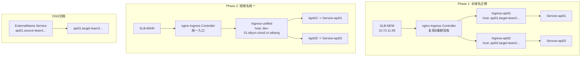
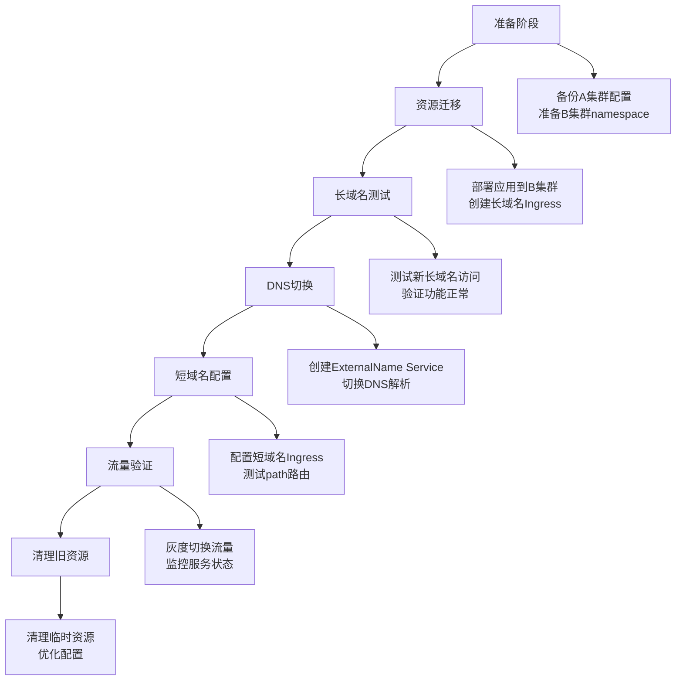

# Q
```bash
Aliyun里面的迁移建议和规划  我需要将运行在aliyun里面的A cluster迁移到aliyun  B cluster 里面去 A cluster ==> Flow  A cluster目前是通过不同的域名来提供服务。申请了泛解析比如 *.source-team1.dev.aliyun.cloud.cn.aibang ==> 10.72.10.88 api01.source-team1.dev.aliyun.cloud.cn.aibang ==> 10.72.10.88 api02.source-team1.dev.aliyun.cloud.cn.aibang ==> 10.72.10.88

B Cluster 完成2个目标 B Cluster现状 我的B里面已经运行了一些namespace. 但是A cluster里面的namespace其实和B里面不冲突 . 所以这个不是问题 我的B cluster里面的旧的正常API的Flow如下 SLB + nginx-Ingress controller [Running at kube-system]==> Host/path ==> Service 这些都是由短域名+host/path来实现访问的

B的目标如下 第一个就是把A Cluster里面的资源完全复制到B cluster B的现状如下 Ingress controller ==> A team managed Kong DP ==> SVC ==> RT Ingress controller ==> SVC ==> RT  因为更换了工程所以A迁移过来的域名会变更为 *.target-team2.dev.aliyun.cloud.cn.aibang ==> 10.72.11.99 api01.target-team2.dev.aliyun.cloud.cn.aibang ==> 10.72.11.99 api02.target-team2.dev.aliyun.cloud.cn.aibang ==> 10.72.11.99 我将使用external name的方式把api01.source-team1.dev.aliyun.cloud.cn.aibang 请求 跳转到api01.target-team2.dev.aliyun.cloud.cn.aibang 这个新的Cluster 注意这个长域名变化了 我想要迁移过来API走这样的路径 SLB + nginx Ingress Controller[这个复用我原来B集群的Ingress Controller] ==> different ingress name ==> Service这种方案是否可行 也就是还使用旧的ingress Control

第二个目标 B Cluster要通过一个短域名dev-01.aliyun.cloud.cn.aibang入口然后通过apiname+paths ==> 来提供服务。比如 [https://dev-01.aliyun.cloud.cn.aibang/api01/](https://dev-01.aliyun.cloud.cn.aibang/api01/) ==> 后面提供服务的其实就是第一个目标里的api01.team2.dev.aliyun.cloud.cn.aibang 提供的服务 当然这个短域名也是我B集群原来的入口 [https://dev-01.aliyun.cloud.cn.aibang/api02/](https://dev-01.aliyun.cloud.cn.aibang/api02/) ==》 后面提供服务的其实就是第一个目标里的api02.team2.dev.aliyun.cloud.cn.aibang 

其实说白了就是新的长期目标是短域名+ path来访问 但是想要用同一套Ingress Controller 作为入口

我理解我初步的时候 申请一个新的SLB给作为迁移第一个目标来使用. 但是从我的长期目标来看 需要确保API NAME 唯一 一个 SLB + 一个 ingress controller + 最终实现都是要求短域名+apiname +paths
```

基于你的需求，我来分析迁移方案和提供建议。

## 当前状态分析

### A Cluster 现状

```
泛域名解析: *.source-team1.dev.aliyun.cloud.cn.aibang -> 10.72.10.88
├── api01.source-team1.dev.aliyun.cloud.cn.aibang
└── api02.source-team1.dev.aliyun.cloud.cn.aibang
```

### B Cluster 现状

```
SLB -> nginx-Ingress Controller (kube-system) -> Host/Path -> Service -> Pod
```

## 迁移方案设计

### 方案一：分阶段迁移（推荐）



### 阶段一：长域名迁移配置

#### 1. 创建新域名的Ingress资源

```yaml
# api01-ingress.yaml
apiVersion: networking.k8s.io/v1
kind: Ingress
metadata:
  name: api01-long-domain
  namespace: target-namespace
  annotations:
    kubernetes.io/ingress.class: nginx
    nginx.ingress.kubernetes.io/rewrite-target: /
spec:
  rules:
  - host: api01.target-team2.dev.aliyun.cloud.cn.aibang
    http:
      paths:
      - path: /
        pathType: Prefix
        backend:
          service:
            name: api01-service
            port:
              number: 80

---
# api02-ingress.yaml  
apiVersion: networking.k8s.io/v1
kind: Ingress
metadata:
  name: api02-long-domain
  namespace: target-namespace
  annotations:
    kubernetes.io/ingress.class: nginx
spec:
  rules:
  - host: api02.target-team2.dev.aliyun.cloud.cn.aibang
    http:
      paths:
      - path: /
        pathType: Prefix
        backend:
          service:
            name: api02-service
            port:
              number: 80
```

#### 2. ExternalName Service做平滑切换

```yaml
# external-name-services.yaml
apiVersion: v1
kind: Service
metadata:
  name: api01-redirect
  namespace: source-namespace
spec:
  type: ExternalName
  externalName: api01.target-team2.dev.aliyun.cloud.cn.aibang
  ports:
  - port: 80
    targetPort: 80

---
apiVersion: v1
kind: Service
metadata:
  name: api02-redirect
  namespace: source-namespace  
spec:
  type: ExternalName
  externalName: api02.target-team2.dev.aliyun.cloud.cn.aibang
  ports:
  - port: 80
    targetPort: 80
```

### 阶段二：短域名统一入口

#### 3. 统一短域名Ingress配置

```yaml
# unified-short-domain-ingress.yaml
apiVersion: networking.k8s.io/v1
kind: Ingress
metadata:
  name: unified-api-gateway
  namespace: gateway-namespace
  annotations:
    kubernetes.io/ingress.class: nginx
    nginx.ingress.kubernetes.io/rewrite-target: /$2
    nginx.ingress.kubernetes.io/use-regex: "true"
spec:
  rules:
  - host: dev-01.aliyun.cloud.cn.aibang
    http:
      paths:
      - path: /api01/(.*)
        pathType: Prefix
        backend:
          service:
            name: api01-service
            port:
              number: 80
      - path: /api02/(.*)
        pathType: Prefix
        backend:
          service:
            name: api02-service
            port:
              number: 80
```

## SLB配置建议

### 两阶段SLB配置

|阶段|SLB用途|IP地址|域名绑定|
|---|---|---|---|
|Phase 1|长域名迁移|10.72.11.99|*.target-team2.dev.aliyun.cloud.cn.aibang|
|Phase 2|短域名统一|复用或新建|dev-01.aliyun.cloud.cn.aibang|

### Ingress Controller复用可行性分析

**✅ 可行原因：**

- 同一个nginx-Ingress Controller可以处理多个Ingress资源
- 基于Host和Path的路由不会冲突
- B集群现有的短域名服务不受影响

**⚠️ 注意事项：**

- API名称必须全局唯一
- 确保Ingress资源的namespace隔离
- 监控Ingress Controller资源使用情况

## 迁移步骤



## 风险控制

### 回滚策略

```yaml
# 快速回滚配置
apiVersion: v1
kind: Service  
metadata:
  name: api01-rollback
spec:
  type: ExternalName
  externalName: api01.source-team1.dev.aliyun.cloud.cn.aibang  # 回滚到A集群
```

### 监控检查点

|检查项|命令|期望结果|
|---|---|---|
|Ingress状态|`kubectl get ingress -A`|所有Ingress显示正确的IP|
|Service连通性|`kubectl get svc -A`|ExternalName解析正常|
|Pod健康状态|`kubectl get pods -A`|所有Pod Running|

这个方案可以实现你的两个目标，既保证平滑迁移，又能统一到短域名入口。关键是分阶段执行，降低风险。


# ChatGPT  

---

## **概览（目标）**

1. **目标1**：把 A cluster 的 namespace/资源完整复制到 B cluster，并保持对外域名可访问（A 的长域名通过 ExternalName 指向 B 的新长域名）。
    
2. **目标2（长期）**：通过 B cluster 的短域名入口 dev-01.aliyun.cloud.cn.aibang + /<apiname> 路由至对应后端（最终以短域名 + path 为主），复用 B 的 **单个 SLB + 单套 Ingress Controller**。
    

---

## **高层流程（mermaid）**

```mermaid
graph TD;
    subgraph A_Cluster["A Cluster (旧)"]
        A_CLIENT[Client -> *.source-team1.dev...]
        A_OLD_DOMAIN[api01.source-team1.dev...]
    end

    subgraph DNS["DNS"]
        CNAME_A_TO_B["externalname/CNAME -> api01.target-team2..."]
        SHORT_DEV["dev-01.aliyun.cloud.cn.aibang"]
    end

    subgraph B_Cluster["B Cluster (目标)"]
        SLB[SLB]
        Ingress[nginx Ingress Controller (kube-system)]
        Ingress_diff[不同 ingress name -> path/host]
        KongDP[Kong DP (team-managed)]
        SVC_EXT[Service (ExternalName) 或 ClusterIP -> upstream]
        RT[Runtime / App Pod]
    end

    A_CLIENT --> A_OLD_DOMAIN
    A_OLD_DOMAIN --> CNAME_A_TO_B
    CNAME_A_TO_B --> SLB
    SLB --> Ingress
    Ingress --> Ingress_diff
    Ingress_diff --> KongDP
    KongDP --> SVC_EXT
    SVC_EXT --> RT
    SHORT_DEV --> SLB
    SHORT_DEV -->|path /api01| Ingress_diff
```

---

## **可行性结论（简短）**

- **可行**：使用 B 的 Ingress Controller（同一套 SLB 或先新建 SLB）接入迁移后的服务是可行的。核心做法：
    
    1. 在 B 上部署 A 的 namespace/资源（保持 name、labels）。
        
    2. 为旧长域名 api01.source-team1... 在 DNS 做 **CNAME/泛解析** 到新的长域名 api01.target-team2...（或在 B 内用 ExternalName service 将旧域名的请求转发到新域名）。
        
    3. 使用短域名 dev-01... 做 path-based 路由，内部转发到对应 service（可以用 Ingress rewrite 或者在 Kong DP 配置 path -> upstream）。
        
    

---

## **推荐迁移策略（阶段化，可靠可回滚）**

1. **准备阶段（不影响线上）**
    
    - 在 B 创建目标 namespace（与 A 一致）。
        
    - 复制 CRD、RBAC、ServiceAccount、ConfigMap、Secrets（使用 kubectl get -o yaml 并审查）。
        
    - 同步镜像（将镜像推到可被 B 访问的镜像仓库 / Artifact Registry / 容器镜像仓库）。
        
    - 如果有持久数据（PV/PVC/数据库），设计数据迁移流程（离线、同步或双写）。
        
    
2. **部署阶段（先灰度/旁路）**
    
    - 在 B 上部署服务（Deployment/Service/Ingress/Kong Route 等）。
        
    - 验证健康检查、metrics、日志。
        
    - 给迁移服务申请新的长域名证书（api01.target-team2...），或使用通配符证书（注意 SNI）。
        
    - 在 A 的 DNS 将 api01.source-team1... 指向 api01.target-team2...（CNAME 或 ExternalName 手段），先做低 TTL 测试。
        
    
3. **切换阶段（流量切换）**
    
    - 使用新的 SLB（建议先使用单独 SLB 做灰度）或直接使用 B 的 SLB。
        
    - 将短域名 dev-01... 配置 path -> 对应 service（Ingress）。
        
    - 逐步把客户端/上游指向短域名 path（或让旧域名 DNS TTL 缩短后切换）。
        
    - 观察 2-3 个小时或多个指标（错误率、延迟、资源）。
        
    
4. **收尾/优化阶段**
    
    - 若一切正常，取消旧域名的额外路由、清理 A cluster 上的资源（或在确认后删除）。
        
    - 合并证书、清理 DNS 记录、更新文档与监控告警。
        
    - 将短域名作为长期入口。
        
    

---

## **关键注意点与风险（列举）**

- **证书/SNI**：如果同一 SLB 上托管多个 host（短域名 + 各种长域名），需保证 TLS 证书覆盖（SANs 或通配符）。短域名 dev-01 需要 cert，用于 path TLS。
    
- **Host vs Path 路由**：短域名 + path（dev-01/…）会去掉 host 信息，后端可能需要 Host header 或 rewrite；若后端依赖 host（虚拟主机），需 rewrite 或在 ingress/kong 做 host header 覆盖。
    
- **ExternalName 的限制**：ExternalName 只是 DNS 解析到外部 FQDN（kube-dns），无法做跨命名空间的 cluster-internal routing 的健康检查；若要检查健康，建议在 B 上部署 ClusterIP 的 proxy service（sidecar 或 headless + endpoints）做探测并转发。
    
- **Kong DP**：如果 B 使用 Kong DP，需确保在 Kong 中添加/upsert 对应 Service/Route/Upstream；如果使用 Ingress + Kong（Ingress controller），确保路由规则与 upstream 正确绑定。
    
- **API 名称唯一性**：建议 apiname 使用 namespace + apiname 命名约束，或在 ingress 路径上加入 team 前缀以避免冲突。
    
- **健康检查 & SLB 后端健康**：SLB 的健康检查路径需与应用 readinessProbe/ livenessProbe 对齐。
    
- **Session / Sticky**：若有会话粘性需在 SLB/nginx/Kong 中保留粘性策略或用无状态会话。
    
- **DNS TTL**：切换时减小 TTL（例如 60s）便于回滚。
    

---

## **实操命令 & YAML 示例**

  

### **1) 导出 A cluster 的 namespace 资源（示例）**

```
# 导出所有 core 资源（Deployment, Service, ConfigMap, Secret (注意 secret 机密)）
kubectl --context=cluster-a -n mynamespace get all,configmap,secret -o yaml > mynamespace-core.yaml

# 导出 CRDs/Ingress/Kong CRs separately if needed
kubectl --context=cluster-a -n mynamespace get ingress -o yaml > mynamespace-ingress.yaml
# 若使用 Kong CRD
kubectl --context=cluster-a -n mynamespace get services.konghq.com -o yaml > mynamespace-kong-svc.yaml
```

> 建议对 secret 用 kubectl get secret -o yaml 后用 sops/sealed-secrets 或 kubectl create secret 重新注入到 B，避免明文 copy。

---

### **2) 在 B 上创建 Namespace 并应用资源（示例）**

```
kubectl --context=cluster-b create namespace mynamespace

# 审查并修正 mynamespace-core.yaml（例如去除 cluster-specific 字段: clusterIP, status, resourceVersion）
kubectl --context=cluster-b apply -f mynamespace-core.yaml -n mynamespace
kubectl --context=cluster-b apply -f mynamespace-ingress.yaml -n mynamespace
```

---

### **3) ExternalName Service（将旧域名解析到新长域名）**

  

> 场景：你想让集群内对 api01.source-team1... 的调用被转到 api01.target-team2...（外部 DNS 指向），可以在 B cluster 中创建一个 Service 替代（或在 A cluster 的 DNS 做 CNAME）。

> 示例：在 B 中创建一个 external service（当 B 以内部方式访问外部域名时）：

```yaml
apiVersion: v1
kind: Service
metadata:
  name: api01-source-extern
  namespace: mynamespace
spec:
  type: ExternalName
  externalName: api01.target-team2.dev.aliyun.cloud.cn.aibang
  ports:
    - port: 80
      targetPort: 80
```

> 注意：ExternalName 只会在 DNS 层解析为目标 FQDN 的 A 记录，不会做负载或健康检查。

---

### **4) 使用 nginx-ingress 做短域名 path -> 后端（rewrite）示例**

  

如果使用 **nginx-ingress** 并希望短域名 dev-01... 的 /api01/ path 转发到 api01 service：

```yaml
apiVersion: networking.k8s.io/v1
kind: Ingress
metadata:
  name: dev01-api01
  namespace: mynamespace
  annotations:
    kubernetes.io/ingress.class: "nginx"
    nginx.ingress.kubernetes.io/rewrite-target: /$2
spec:
  rules:
  - host: dev-01.aliyun.cloud.cn.aibang
    http:
      paths:
      - path: /api01(/|$)(.*)
        pathType: ImplementationSpecific
        backend:
          service:
            name: api01-service    # 指向部署在 B 的 service
            port:
              number: 80
```

- rewrite-target 将 /api01/foo 重写为 /foo，发到 api01-service。
    
- 若后端需要 Host header 为 api01.target-team2...，可用 nginx.ingress.kubernetes.io/configuration-snippet 或 proxy_set_header Host api01.target-team2... 的 annotation 覆盖 Host。
    

---

### **5) 若使用 Kong（Kong DP）作为 ingress 中转**

  

你可以在 Kong Admin 中为 dev-01 创建 Route -> Service：

```
# 举例：创建 Service 指向 upstream (api01-service.namespace.svc.cluster.local:80)
curl -s -X POST http://<KONG-ADMIN>/services \
  --data "name=api01-service" \
  --data "url=http://api01-service.mynamespace.svc.cluster.local:80"

# 创建 Route 以 path /api01
curl -s -X POST http://<KONG-ADMIN>/services/api01-service/routes \
  --data "paths[]=/api01" \
  --data "strip_path=true"
```

> 如果 Kong DP 是外部管理的（team-managed），协调他们将 Service/Route 写入对应的 Kong Control Plane（或通过 declarative config）。

---

## **资源/配置同步清单（建议直接执行）**

```
- [ ] Namespace list: create namespace in B
- [ ] CRDs: copy needed CRDs
- [ ] RBAC: ServiceAccounts, Roles, RoleBindings
- [ ] ConfigMaps, Secrets (use sealed-secrets)
- [ ] Deployments, StatefulSets, DaemonSets
- [ ] Services: convert ExternalName or ClusterIP as needed
- [ ] Ingress / Kong Routes: create path/host rules
- [ ] Certificates: TLS certs for api01.target-team2... and dev-01...
- [ ] DNS: CNAME / A records + TTL adjustments
- [ ] SLB health checks: align with readinessProbe
- [ ] Monitoring / Logging: ensure metrics and logs pipeline identical
- [ ] Load tests: smoke test endpoints
- [ ] Rollback plan: DNS TTL short + revert CNAME
```

---

## **回滚策略（简洁）**

- 在切换前将 DNS TTL 缩短到 60s；
    
- 切换后若异常，立即把 DNS 指回旧地址或将旧 SLB 恢复权重；
    
- 或者在 B 侧关闭 Ingress rule，使流量回到旧流量路径。
    

---

## **补充建议（实战经验）**

- **优先使用短域名 path 为长期目标**：短域名降低证书管理复杂度，只需单证书覆盖 dev-01；后端用 path 区分。
    
- **域名映射阶段使用独立 SLB 做灰度**：便于回滚与流量观测；待稳定再合并到单 SLB。
    
- **API 名称唯一性**：在迁移工单里强制 team + apiname 命名规范（避免 path 冲突）。
    
- **Secrets 处理**：不要直接把 secret 明文导出到文件并 apply，建议用 sealed-secrets / Kubernetes Secret store。
    
- **验证点**：功能验证、延迟/错误率、SLB 健康检查、证书链、跨域 CORS、header（Host）依赖。
    

---

如果你愿意，我可以立刻为 **某一个具体 namespace** 生成：

- 完整的 kubectl 导出/清洗脚本（去掉 cluster 相关字段）和
    
- 在 B 上的 apply YAML 清单（含 ExternalName / Ingress 示例）——直接把要迁移的 namespace 名称和是否需要保密 secret 告诉我即可（我会直接输出可粘贴的 .yaml）。