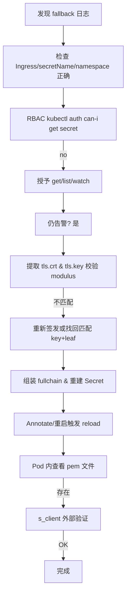

- [**1. Problem Analysis**](#1-problem-analysis)
- [**2. Investigation Timeline / 思路路径**](#2-investigation-timeline--思路路径)
- [**3. Key Diagnostics**](#3-key-diagnostics)
- [**4. Root Causes**](#4-root-causes)
- [**5. Final Remediation Steps (最终修复动作)**](#5-final-remediation-steps-最终修复动作)
- [**6. Verification Checklist**](#6-verification-checklist)
- [**7. Flow Diagram**](#7-flow-diagram)
- [**8. Lessons Learned / Best Practices**](#8-lessons-learned--best-practices)
- [**9. Quick Reference Commands**](#9-quick-reference-commands)
- [**10. Final Summary**](#10-final-summary)

## **1. Problem Analysis**

目标：Ingress TLS 不生效，日志持续报

```
Error getting SSL certificate "aibang-api/capi-name-cert-secret":
local SSL certificate ... was not found
```

并回退默认证书，同时客户端握手失败。问题最终确认是“双因子”叠加：

- RBAC 缺少 get secrets (有 list)，导致控制器无法按需获取 Secret
- TLS Secret 内证书与私钥不匹配 (modulus 不同)，控制器即使看到对象也无法构建本地可用 SSL 结构

---

## **2. Investigation Timeline / 思路路径**

1. 初见告警：控制器 fallback default cert
2. 排除 Ingress 配置：ingressClass 正确，secretName 正确，命名空间一致
3. 查看 Secret：类型正确 (kubernetes.io/tls)，但 openssl 读取第一段有时是内网 CA → 怀疑顺序/内容
4. RBAC 检查：kubectl auth can-i get secrets → no (问题确认 1)
5. 进一步 RoleBinding (get/list/watch)
6. 继续检查 → 深入验证证书与私钥：modulus MD5 不一致 (问题确认 2)
7. 由此解释：控制器无法加载 (不匹配) → 视为 not found → fallback
8. 客户端 curl schannel 报 untrusted root，属于链/信任层面副作用
9. 汇总根因并制定修复：重新签发或找到匹配私钥 + fullchain 顺序 + RBAC 修正 + reload 验证

---

## **3. Key Diagnostics**

- 控制器日志：local SSL certificate … was not found
- RBAC：get = no / list = yes
- openssl x509 / rsa modulus：不一致
- Secret 证书第一段：叶子证书 OK (后续确认)，但与 key 不匹配
- 握手日志：SSL_do_handshake() failed / bad record mac (典型 key/cert mismatch)

---

## **4. Root Causes**

| **根因**         | **说明**                          | **影响**                  |
| ---------------- | --------------------------------- | ------------------------- |
| RBAC 缺省        | informer 缓存 miss 时无法单次 Get | Secret 永远 “不可用”      |
| 证书与私钥不匹配 | 模数不同                          | Secret 被丢弃，TLS 未加载 |
| 证书链不完整     | 仅有叶 (后续)                     | 客户端不信任内部 CA       |

---

## **5. Final Remediation Steps (最终修复动作)**

1. 添加 Role/RoleBinding：给 ingress-nginx SA 授予 aibang-api secrets get/list/watch
2. 重新获取正确匹配的 leaf 证书 + 私钥 (或重新签发)
3. 拼接 fullchain: leaf + intermediate(s) (根 CA 可选)
4. 校验匹配：openssl modulus 比对一致
5. 重建 TLS Secret (kubernetes.io/tls)
6. 注解 Ingress 触发 reload 或重启控制器
7. Pod 内 /etc/ingress-controller/ssl 存在对应 pem 文件
8. openssl s_client 验证呈现证书正确
9. 客户端导入内网根 CA (消除 untrusted root)

---

## **6. Verification Checklist**

| **检查项**                                           | **期望结果**                                |
| ---------------------------------------------------- | ------------------------------------------- |
| kubectl auth can-i get/list/watch secrets -n aibang-api | 全部 yes                                    |
| tls.crt 第一段                                       | 目标域名 leaf                               |
| 证书 / 私钥 modulus                                  | 完全一致                                    |
| 控制器日志                                           | 无 “local SSL certificate … not found”      |
| Pod 内 pem 文件                                      | 存在 aibang-api-capi-name-cert-secret.pem  |
| s_client subject/issuer                              | 显示 leaf + 内部 CA                         |
| curl 不带 -k                                         | 仅可能出现信任问题 (若未导入根)，无握手错误 |

---

## **7. Flow Diagram**



---

## **8. Lessons Learned / Best Practices**

- Ingress TLS 前置校验：RBAC + modulus + 链顺序
- RBAC 最低需求：get/list/watch secrets；缺 get 会出现 “not found” 假象
- 证书链顺序：leaf → intermediates (根可选但不放最前)
- 每次变更前执行 modulus 校验脚本，避免上线后握手失败
- 使用注解触发 reload，比盲目重启更轻量
- 内部 CA 场景：客户端信任链与服务端配置是两个层面，分别处理

---

## **9. Quick Reference Commands**

```
# RBAC 验证
kubectl auth can-i get secrets -n aibang-api -- \
--as=system:serviceaccount:caep-int-ingress-ns:ingress-nginx

# 拆分与校验
kubectl get secret -n aibang-api capi-name-cert-secret -o jsonpath='{.data.tls\.crt}' | base64 -d > crt.pem
kubectl get secret -n aibang-api capi-name-cert-secret -o jsonpath='{.data.tls\.key}' | base64 -d > key.pem
openssl x509 -in crt.pem -noout -modulus | openssl md5
openssl rsa  -in key.pem -noout -modulus | openssl md5

# 重新创建 Secret
kubectl create secret tls capi-name-cert-secret \
  --cert=fullchain.pem \
  --key=capi-name.key \
  -n aibang-api --dry-run=client -o yaml | kubectl apply -f -

# 触发 reload
kubectl annotate ingress -n aibang-api capi-name-ingress reload-ts=$(date +%s) --overwrite

# 外部验证
openssl s_client -connect <LB_IP>:443 -servername capi-name...aibang | openssl x509 -noout -subject -issuer -dates
```

---

## **10. Final Summary**

本次问题核心是 **权限缺失 + 证书/私钥不匹配** 导致控制器无法加载 TLS Secret，并持续日志误导为 not found。

通过：修复 RBAC、重新构建匹配的 leaf+key+fullchain、触发 reload、验证加载与外部握手，最终闭环。

今后上线流程中前置 **RBAC + modulus + 链顺序** 三项自动化校验，可避免同类故障。

---

要不要我帮你把这个总结再精炼成一份 **团队知识库文档模板**（带复现 → 诊断 → 修复 → 验证结构），方便下次直接复用？
