证书 Secret 即使能 kubectl get 出来，也可能内容有问题（比如 key 对不上 cert，或者证书链不完整）。你可以按下面几个步骤逐步验证：

---

## **1. 导出 Secret 并解码**

```
# 查看 Secret 基本信息
kubectl get secret aibang-cert-secret -n aibang-api -o yaml

# 导出证书和私钥
kubectl get secret aibang-cert-secret -n aibang-api -o jsonpath='{.data.tls\.crt}' | base64 -d > tls.crt
kubectl get secret aibang-cert-secret -n aibang-api -o jsonpath='{.data.tls\.key}' | base64 -d > tls.key
```

---

## **2. 校验证书和私钥是否匹配**

```
# 提取公钥并比较
openssl x509 -in tls.crt -noout -modulus | openssl md5
openssl rsa  -in tls.key -noout -modulus | openssl md5
```

两者输出的 MD5 必须一致，否则证书和私钥不匹配。

---

## **3. 检查证书基本信息**

```
# 查看证书详细信息
openssl x509 -in tls.crt -noout -text
```

重点检查：

- **Subject CN / SAN** 是否包含你的域名（比如 api.example.com）
    
- **Issuer** 是否来自受信 CA
    
- **Validity** 确认时间范围是否还有效
    

---

## **4. 检查证书链完整性（如果有中间证书）**

  

有些 CA 会给你 **leaf cert** + **intermediate cert**，你必须把它们拼在一起放入 tls.crt：

```
cat leaf.crt intermediate.crt > tls.crt
```

然后再生成 Secret。否则浏览器可能报“不受信任”。

---

## **5. （可选）本地模拟验证**

  

你可以用 openssl 启一个临时 TLS 服务来确认证书是否能正常加载：

```
openssl s_server -key tls.key -cert tls.crt -accept 8443
```

然后另一个终端请求：

```
openssl s_client -connect localhost:8443 -servername api.example.com
```

可以看到证书链和域名校验是否正常。

---

## **6. 验证 Secret 类型**

```
kubectl get secret aibang-cert-secret -n aibang-api -o jsonpath='{.type}'
```

必须输出：

```
kubernetes.io/tls
```

---

✅ 通过以上检查，你就能确认 tls.crt / tls.key 是否匹配、是否包含正确域名、是否完整链路。

---

要不要我帮你写一个 **一键脚本**，比如 check-tls-secret.sh，直接传入 Secret 名和 namespace，就能自动跑完这些检查？

```bash
#!/bin/bash
# 用法: ./check-tls-secret.sh <secret-name> <namespace>

set -e

SECRET_NAME=$1
NAMESPACE=$2

if [ -z "$SECRET_NAME" ] || [ -z "$NAMESPACE" ]; then
  echo "用法: $0 <secret-name> <namespace>"
  exit 1
fi

echo "🔍 检查 Secret: $SECRET_NAME (namespace: $NAMESPACE)"
echo "------------------------------------------------------"

# 1. 确认 Secret 类型
SECRET_TYPE=$(kubectl get secret "$SECRET_NAME" -n "$NAMESPACE" -o jsonpath='{.type}')
if [ "$SECRET_TYPE" != "kubernetes.io/tls" ]; then
  echo "❌ Secret 类型错误: $SECRET_TYPE (必须是 kubernetes.io/tls)"
  exit 1
else
  echo "✅ Secret 类型正确: $SECRET_TYPE"
fi

# 2. 导出证书和私钥
kubectl get secret "$SECRET_NAME" -n "$NAMESPACE" -o jsonpath='{.data.tls\.crt}' | base64 -d > /tmp/tls.crt
kubectl get secret "$SECRET_NAME" -n "$NAMESPACE" -o jsonpath='{.data.tls\.key}' | base64 -d > /tmp/tls.key

# 3. 校验证书和私钥是否匹配
CRT_MD5=$(openssl x509 -in /tmp/tls.crt -noout -modulus | openssl md5)
KEY_MD5=$(openssl rsa -in /tmp/tls.key -noout -modulus | openssl md5)

if [ "$CRT_MD5" != "$KEY_MD5" ]; then
  echo "❌ 证书和私钥不匹配"
  echo "CRT: $CRT_MD5"
  echo "KEY: $KEY_MD5"
  exit 1
else
  echo "✅ 证书和私钥匹配"
fi

# 4. 显示证书基本信息
echo "------------------------------------------------------"
echo "📜 证书信息:"
openssl x509 -in /tmp/tls.crt -noout -subject -issuer -dates -ext subjectAltName || true

# 5. 检查是否包含中间证书
CHAIN_COUNT=$(grep -c "END CERTIFICATE" /tmp/tls.crt)
if [ "$CHAIN_COUNT" -gt 1 ]; then
  echo "✅ 证书链完整, 包含 $CHAIN_COUNT 个证书"
else
  echo "⚠️ 证书链可能不完整, 仅检测到 1 个证书"
  echo "   如果使用的是 CA 签发的证书, 请确认已包含中间证书"
fi

echo "------------------------------------------------------"
echo "🔎 检查完成"
```


# 证书和私钥不匹配

好问题 👍。

---

## **1. 什么叫证书和私钥不匹配**

- **证书 (tls.crt)** 里包含的是 **公钥**（Public Key）
    
- **私钥 (tls.key)** 是生成证书时配套的 **Private Key**
    
    二者必须配对使用。
    

  

如果你 Secret 里放的 crt 和 key 不是一对（比如证书是 A 域名申请的，但 key 却来自另一个证书生成过程），那么 NGINX Ingress Controller 在加载时会报错。

---

## **2. 实际影响**

1. **Ingress Controller 无法绑定证书**
    
    - NGINX Ingress Controller 启动时会尝试加载 Secret，如果发现 crt 和 key 不匹配，它会报错并跳过这个 Secret。
        
    - 日志里通常会看到类似：
        
    

```
error obtaining X509 key pair: tls: private key does not match public key
```

1. -   
        
    - 结果：该域名回退到 **默认证书**（通常是自签名证书或 controller 默认证书）。
        
    
2. **客户端访问报“证书无效”**
    
    - 浏览器、curl 等会收到一个“错误的证书”，提示：
        
    

```
NET::ERR_CERT_AUTHORITY_INVALID
或
SSL_ERROR_BAD_CERT_DOMAIN
```

2. -   
        
    - 对用户表现就是 **HTTPS 无法建立安全连接**。
        
    
3. **安全性风险**
    
    - 如果 crt 和 key 不匹配，意味着服务端无法完成 TLS 握手里的“签名验证”步骤。
        
    - 握手阶段会直接失败，根本不会进入业务流量阶段。
        
    

---

## **3. 对比图解**

```mermaid
sequenceDiagram
    participant Client
    participant IngressController

    Client->>IngressController: ClientHello (SNI: api.example.com)
    IngressController->>Client: ServerHello + Certificate (tls.crt)

    Client->>IngressController: 验证证书签名
    IngressController->>IngressController: 使用 tls.key 生成签名

    alt crt & key 匹配
        Client->>IngressController: 验证成功 ✅
        Client->>IngressController: 建立 TLS 通道
    else crt & key 不匹配
        Client->>IngressController: 验证失败 ❌
        Client->>IngressController: 断开连接 (证书无效)
    end
```



---

## **4. 总结**

- **证书和私钥必须匹配**，否则 Ingress Controller 会拒绝加载，最终客户端会看到“证书无效”。
    
- 常见场景：
    
    - 证书更新时忘了同步私钥。
        
    - 把别的域名的私钥误用了。
        
    - 中间证书链没拼接好，但 key 对不上 leaf cert。
        
    

---

要不要我顺便帮你写一个 **自动修复思路**（比如当检测到不匹配时，如何重新生成 Secret 并保证 crt/key 对得上）？