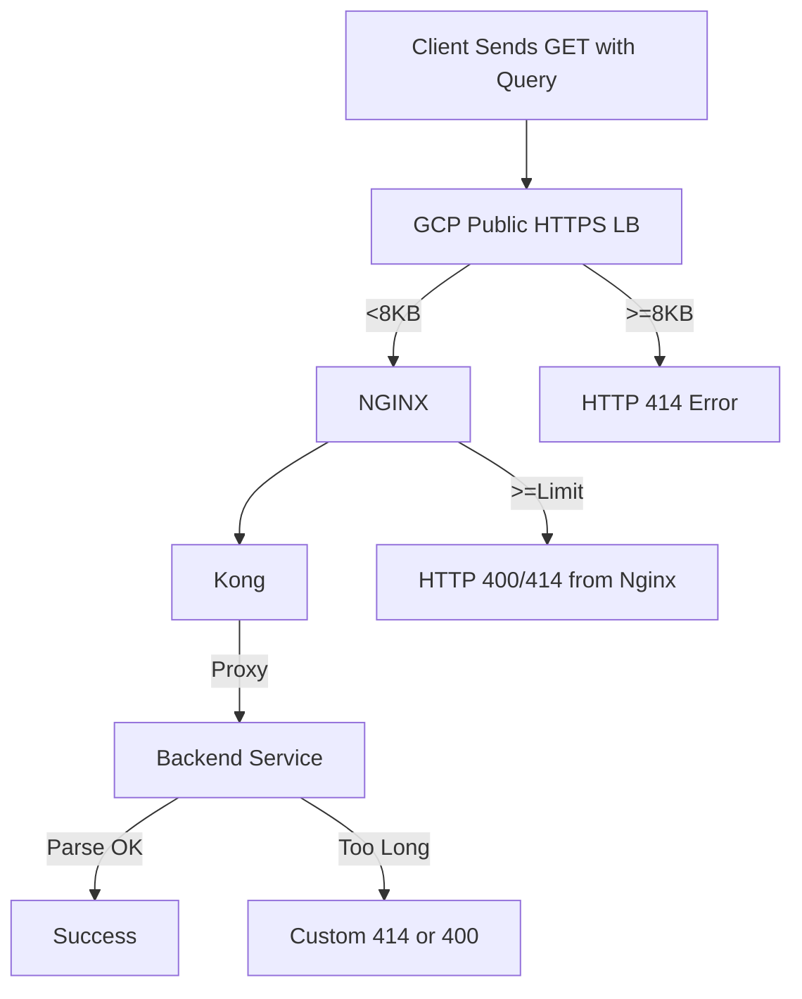

# nginx 

配置项：

```
large_client_header_buffers 4 32k;
```

在 **Nginx** 中的含义如下：

---

## **✅ 参数解析**

| **参数** | **含义**                        |
| ------ | ----------------------------- |
| 4      | 表示每个连接最多可以使用 4 个 buffer       |
| 32k    | 每个 buffer 的大小为 32KB（32768 字节） |

---

## **📌 实际含义（整体限制）**

  

> Nginx 在解析客户端请求的 **请求头（包括 URI + headers）** 时，会使用 large_client_header_buffers 分配的这些 buffer。

  

所以这个配置代表：

- 对每个客户端连接，Nginx 最多可以为「请求头解析」分配 4 x 32KB = 128KB 的内存空间。
    
- 如果 **单个请求头（比如一个超长的 Cookie 或 URI）超过 32KB**，或者 **所有请求头总和超过 128KB**，则会返回 400 Bad Request。
    
- 这个 buffer 只在需要解析大请求头时才用（例如超长 URI 或 headers）。
    

---

## **✅ 对 GET 请求的影响**

  

对于 GET 请求，请求体为空，Nginx 主要处理两块内容：

1. **Request Line**（如：GET /path?query=xxx HTTP/1.1）
    
2. **Request Headers**
    

  

而这些部分就用到 large_client_header_buffers。

  

所以此配置对你的作用是：

- **能处理较长的 URI（例如接近 8KB 的 query string）**
    
- **支持较多或较大的 headers（如多条 Cookie、复杂的 User-Agent）**
    

---

## **⚠️ 示例错误行为**

- 如果请求头太大，超出 buffer 限制，会返回：
    

```
400 Bad Request
Request Header Or Cookie Too Large
```

  

---

## **✅ 推荐配置场景**

|**场景**|**推荐配置**|
|---|---|
|普通业务，headers 不多|large_client_header_buffers 4 8k（默认）|
|接收大型 query / JWT / Cookie|large_client_header_buffers 4 32k 或更大|
|网关代理场景（如 Kong）|建议设为 4 32k 或更高，防止上游请求被拒绝|

---

## **✅ 搭配配置建议**

|**配置项**|**建议值**|**用途**|
|---|---|---|
|client_header_buffer_size|16k 或更高|单个请求头默认 buffer|
|large_client_header_buffers|4 32k|多 header 或大 URI|
|client_max_body_size|irrelevant for GET|对 POST 有效|

---

是否需要我出一个流程图，帮你表示 “客户端请求 -> Nginx large_client_header_buffers 检查过程”？
# Gemini
你对GCP工程中TLS与Nginx结合使用时的请求长度限制理解得非常到位！确实，在像GCP Public Ingress、Nginx、Kong这样的多层架构中，请求的各个部分（如请求行、URI、查询字符串）会受到每一层组件的限制，最终的有效限制取决于链条中最严格的那一个。

我们来详细解析一下这几个概念以及在你的架构中它们是如何相互作用的：

1.  **TLS (Transport Layer Security):**
    *   TLS本身不直接限制请求的长度。它的作用是加密HTTP通信。
    *   **关键点在于TLS终止的位置**。请求在被解密后，后续的组件（如GCLB、Nginx、Kong）才能解析HTTP头部和内容，并应用其长度限制。
    *   **场景1: TLS在GCP Public Ingress (如Google Cloud Load Balancer - GCLB) 终止。**
        *   GCLB首先看到解密后的HTTP请求，并应用其自身的限制。
        *   然后GCLB将（可能未加密的）HTTP请求转发给后端的Nginx。
    *   **场景2: TLS在Nginx终止 (GCLB做TCP/SSL代理透传)。**
        *   GCLB不解析HTTP内容，只做TCP/SSL流量转发。
        *   Nginx负责TLS解密，并应用其HTTP相关的长度限制。
    *   **场景3: TLS在Kong终止 (如果Kong在Nginx之前或之后，且负责TLS)。**
        *   与Nginx类似，Kong解密后应用其限制。

2.  **请求长度的几个层面 (如你表格所示):**

    *   **Request Line Length (请求行长度):**
        *   格式: `METHOD /path?query_string HTTP/VERSION` (例如: `GET /api/users?id=123&name=test HTTP/1.1`)
        *   这是HTTP请求的第一行。它的总长度会受到限制。

    *   **URI (Path + Query String) Length (URI长度):**
        *   格式: `/path?query_string`
        *   这是请求行的一部分，通常是限制的主要关注点之一，尤其对于GET请求。

    *   **Query String Length (查询字符串长度):**
        *   格式: `key1=value1&key2=value2...`
        *   这是URI中`?`之后的部分。虽然有时会单独讨论，但它最终是URI和请求行长度的一部分。

    *   **Request Header(s) Size (请求头大小):**
        *   除了请求行，HTTP请求还包含多个头部字段（如`Host`, `User-Agent`, `Authorization`等）。
        *   很多服务器和代理也会限制单个请求头的长度以及所有请求头加起来的总大小。

    *   **Request Body Size (请求体大小):**
        *   主要针对POST, PUT等请求。GET请求通常没有请求体。
        *   这个限制通常与查询字符串长度是分开的。

3.  **各层限制分析:**

    *   **GCP Public Ingress (通常是Google Cloud Load Balancer - GCLB):**
        *   **请求网址和标头限制**: GCLB对请求网址（包括路径和查询字符串）的总长度以及请求标头的总大小有限制。
        *   **典型限制**:
            *   **请求网址 (URL)**: 不同的GCLB类型（HTTP(S), TCP/SSL Proxy, Network）和目标后端（Backend Service, Backend Bucket）可能有略微不同的限制，但通常请求网址（包括查询字符串）的上限在 **8KB到16KB** 之间。对于外部HTTP(S)负载均衡器，请求网址（路径+查询字符串）的限制是 **8KB**。
            *   **请求标头总大小**: 通常是 **16KB** 到 **32KB** (对于外部HTTP(S)负载均衡器，所有请求标头（包括请求行）的总大小不能超过15KB，加上响应标头总大小不能超过15KB，总共约30KB的标头数据）。
        *   这些是硬性限制，用户无法直接配置更改。

    *   **Nginx:**
        *   Nginx有非常灵活的配置项来控制这些限制：
            *   `client_header_buffer_size`: 用于读取客户端请求行的缓冲区大小。如果请求行超过此大小，Nginx会尝试使用`large_client_header_buffers`。默认通常是 **1KB**。
            *   `large_client_header_buffers number size`: 用于读取大型客户端请求头的缓冲区的数量和大小。如果请求行或某个请求头超过`client_header_buffer_size`，就会用到这里配置的缓冲区。默认通常是 `4 8k` (4个8KB的缓冲区)。这意味着请求行不能超过8KB，单个请求头也不能超过8KB。如果总头大小超过 (number * size)，也会报错。
            *   `client_max_body_size`: 限制请求体的大小，主要用于POST/PUT。默认是 `1m` (1MB)。虽然不是查询字符串，但常一起配置。
        *   **重点**: Nginx的默认`client_header_buffer_size` (1KB) 和 `large_client_header_buffers` (e.g., 8KB for request line/single header) 可能会比GCLB的限制更严格。你需要确保Nginx的配置至少不小于你期望支持的长度，并且不超过GCLB的限制。

    *   **Kong (基于Nginx/OpenResty):**
        *   Kong底层使用Nginx，因此它继承了Nginx的许多限制，并且也提供了配置这些限制的方式。
        *   你可以在Kong的配置文件 (`kong.conf` 或通过环境变量) 中调整Nginx相关的指令，例如：
            *   `nginx_http_client_header_buffer_size`
            *   `nginx_http_large_client_header_buffers`
            *   `nginx_http_client_max_body_size`
        *   Kong本身作为API网关，可能还会对请求进行分析，其插件也可能引入额外的限制或行为。
        *   与Nginx一样，你需要确保Kong的配置能够处理你期望的请求长度，并且不超过其上游（如GCLB）或下游（如你的应用服务）的限制。

    *   **后端应用服务 (e.g., Java Spring, Node.js Express, Python Flask/Django):**
        *   你的实际应用服务器也可能有其自身的请求长度或头部大小限制。例如，Tomcat有`maxHttpHeaderSize`，Node.js的http模块也有内部限制。通常这些限制比代理服务器更宽松，但仍需注意。

4.  **多层限制的原则:**
    *   **木桶效应**: 整个请求链路的有效限制取决于最严格的那个组件。
        *   例如: GCLB允许8KB URI, Nginx配置只允许4KB URI, Kong允许6KB URI。那么实际有效的URI长度限制就是4KB。
    *   **错误来源**: 当请求因长度超限被拒绝时，你需要检查是哪一层拒绝的。通常，客户端会收到一个HTTP错误，如 `414 URI Too Long` 或 `431 Request Header Fields Too Large` 或 `400 Bad Request`。错误日志通常会指明是哪个组件（GCLB, Nginx, Kong）产生的。

5.  **确保GET请求查询字符串长度不超过限制的策略:**

    *   **明确需求**: 首先确定你的应用场景中，GET请求查询字符串最大可能达到多长。
    *   **查阅文档**: 仔细阅读GCP Load Balancer, Nginx, Kong的官方文档，了解它们关于请求行、URI、头部大小的最新默认值和最大限制。
    *   **统一配置 (尽量):** 在Nginx和Kong中，将相关配置（如`large_client_header_buffers`中的`size`部分）设置为一个合理的值，该值需要：
        *   满足你的业务需求。
        *   不超过GCLB的硬性限制（例如，请求行/URI不超过GCLB的8KB限制）。
    *   **测试**: 进行压力测试和边界条件测试，发送具有不同长度查询字符串的请求，观察哪一层会先报错。
    *   **日志监控**: 监控GCLB, Nginx, Kong的错误日志，以便在出现问题时快速定位。
    *   **考虑替代方案**: 如果查询字符串确实非常长（例如，远超几KB），应考虑：
        *   **使用POST请求**: 将部分参数移到请求体中（JSON格式）。虽然GET请求有幂等性等优点，但长度限制是其固有缺点。
        *   **数据压缩或编码**: 对查询参数进行某种形式的压缩或更紧凑的编码（但这会增加客户端和服务器的复杂性）。
        *   **服务端存储/引用**: 将大量参数存储在服务端（如数据库或缓存），只在查询字符串中传递一个ID来引用这些参数。

总结来说，你的理解是正确的。你需要逐层检查并配置GCP Public Ingress（主要是了解其固定限制）、Nginx和Kong的相关参数，确保它们都能处理你预期的最大查询字符串长度，同时注意请求行总长度和头部总大小的限制。通常，Nginx/Kong的配置是你可以调整的关键点，但它们不能超过GCLB的上限。


好的，以下是一个Markdown表格，总结了GCP Public Ingress、Nginx和Kong在不同请求长度方面的限制和相关配置。

## HTTP 请求长度限制对比 (GCP Public Ingress, Nginx, Kong)

| 限制类型                     | GCP Public Ingress (GCLB - 外部 HTTP(S) 负载均衡器) | Nginx                                                                                                   | Kong (基于 Nginx)                                                                                             | 注意事项与配置示例                                                                                                                                                                                                                                                                                                                          |
| ---------------------------- | ----------------------------------------------------- | ------------------------------------------------------------------------------------------------------- | ----------------------------------------------------------------------------------------------------------------- | -------------------------------------------------------------------------------------------------------------------------------------------------------------------------------------------------------------------------------------------------------------------------------------------------------------------------------------------- |
| **请求行长度 (Request Line)**  | ~8KB (整个请求网址，包括方法、路径、查询参数、HTTP版本)     | 默认: `client_header_buffer_size` (e.g., 1KB). <br>更大: `large_client_header_buffers` (e.g., `4 8k` 中的 `8k`)     | 默认: 继承 Nginx (e.g., 1KB). <br>更大: `nginx_http_large_client_header_buffers` (e.g., `4 8k` 中的 `8k`)      | **Nginx/Kong**: 如果请求行超过 `client_header_buffer_size` (或 Kong 的 `nginx_http_client_header_buffer_size`), Nginx/Kong 会尝试从 `large_client_header_buffers` (或 Kong 的 `nginx_http_large_client_header_buffers`) 分配一个缓冲区。单个缓冲区的 `size` 就是请求行的上限。 |
| **URI 长度 (Path + Query String)** | ~8KB (作为请求网址的一部分)                             | 同上 (URI 是请求行的一部分)                                                                                 | 同上 (URI 是请求行的一部分)                                                                                     | 这是GET请求中最常触及的限制之一。确保 Nginx/Kong 的配置 (`large_client_header_buffers` 的 `size`) 不小于期望值，且不超过 GCLB 限制。                                                                                                                                                                                                   |
| **查询字符串长度 (Query String)** | ~8KB (作为URI的一部分)                                | 同上 (查询字符串是URI的一部分)                                                                            | 同上 (查询字符串是URI的一部分)                                                                                | 单独来看，查询字符串的长度受限于整个URI的长度，进而受限于请求行的长度。                                                                                                                                                                                                                                                                       |
| **单个请求头长度**           | 整体限制优先，单个头不能过大导致总大小超限。                  | 默认: `client_header_buffer_size` (e.g., 1KB). <br>更大: `large_client_header_buffers` (e.g., `4 8k` 中的 `8k`)     | 默认: 继承 Nginx (e.g., 1KB). <br>更大: `nginx_http_large_client_header_buffers` (e.g., `4 8k` 中的 `8k`)      | **Nginx/Kong**: 如果单个请求头超过 `client_header_buffer_size`，也会使用 `large_client_header_buffers` 中的一个缓冲区。单个缓冲区的 `size` 是单个请求头的上限。                                                                                                                                                                             |
| **请求头总大小 (所有头 + 请求行)** | ~15KB (请求头) + ~15KB (响应头) ≈ 30KB 标头数据总量限制     | `large_client_header_buffers` 的 `number * size` (e.g., `4 * 8KB = 32KB`)                                   | `nginx_http_large_client_header_buffers` 的 `number * size` (e.g., `4 * 8KB = 32KB`)                                | **Nginx/Kong**: 所有请求头（包括请求行）的总和不能超过 `number` 乘以 `size`。此配置也需要小于等于 GCLB 的限制。                                                                                                                                                                                                                                         |
| **请求体大小 (Request Body)**  | 通常透传给后端，但有整体负载均衡器限制 (e.g., 32MB for NEG backends, 10MB for Cloud Armor inspection) | `client_max_body_size` (e.g., 默认 `1m`)                                                                    | `nginx_http_client_max_body_size` (e.g., 默认 `1m`) 或 Kong 自身的 `client_max_body_size` (如果配置)             | 主要针对 POST/PUT 请求。虽然与 GET 查询字符串无关，但属于常见 HTTP 请求大小限制。                                                                                                                                                                                                                                                                    |

---

**关键点总结:**

1.  **木桶效应**: 最终的有效限制是整个请求链路中（浏览器 -> ... -> GCLB -> Nginx -> Kong -> 应用）最严格的那个值。
2.  **GCLB 限制是硬限制**: 你无法通过配置更改 GCLB 的这些上限（如8KB URL限制）。Nginx 和 Kong 的配置不能超过 GCLB 的限制。
3.  **Nginx/Kong 配置**:
    *   `client_header_buffer_size` / `nginx_http_client_header_buffer_size`: 初始缓冲区，较小。
    *   `large_client_header_buffers` / `nginx_http_large_client_header_buffers number size`: 当初始缓冲区不足时使用。`size` 参数决定了请求行或单个请求头的最大长度。`number * size` 决定了请求头总大小的上限。
    *   例如，Nginx 配置 `large_client_header_buffers 4 16k;` 意味着请求行或单个请求头最大可达16KB，总头大小最大可达 4 * 16KB = 64KB。但这需要确保不超过 GCLB 的限制。
4.  **错误代码**:
    *   `414 URI Too Long`: 通常是请求行或URI超长。
    *   `431 Request Header Fields Too Large`: 通常是请求头总大小或单个请求头过大。
    *   `400 Bad Request`: 也可能由解析超长头部引起。
5.  **测试**: 务必在你的实际环境中测试这些限制，以确保配置生效且满足需求。
6.  **替代方案**: 如果GET请求的查询字符串过长，应考虑使用POST请求并将参数放在请求体中。

这个表格应该能帮助你更好地理解和配置你的系统。记得查阅各组件的官方文档以获取最准确和最新的信息。
```


# ChatGPT  
To ensure your **GET request query string length** does not exceed the limits in your architecture with **GCP Public Ingress**, **Nginx**, and **Kong**, you must consider **limits at multiple layers**:

---

## **✅ Query String Length Limit Overview**

| **Layer**                     | **Default Limit (approx)**               | **Configurable?** | **Notes**                                     |
| ----------------------------- | ---------------------------------------- | ----------------- | --------------------------------------------- |
| **Browser**                   | ~2000–8000 chars                         | ❌                 | Browser-dependent                             |
| **GCP HTTP(S) Load Balancer** | 8192 bytes (8 KB)                        | ❌                 | Hard limit for headers/URL                    |
| **Nginx**                     | large_client_header_buffers              | ✅                 | Default buffer size is 8 KB (2x4k)            |
| **Kong Gateway**              | No specific limit, but affected by Nginx | ✅ (indirectly)    | Based on Nginx settings                       |
| **Upstream App**              | Depends on language/framework            | ✅                 | E.g., Java servlet container has ~8KB default |

---

## **🔍 How to Check/Verify the Query String Length?**

  

### **1.** 

### **Test with CURL (local or from pod)**

```
curl -v "https://your-domain.com/api?$(python3 -c 'print("a"*8000)')"
```

> Expect:

- > HTTP 414 URI Too Long if limit is hit.
    
- > Or 400 / 502 if backend refuses.
    

---

### **2.** 

### **GCP Ingress Logs / GCLB Logs**

  

Check the **HTTP load balancer logs** (Cloud Logging) for:

- Status codes: 414, 400, 502
    
- URI length via httpRequest.requestUrl
    

---

### **3.** 

### **Nginx Configuration**

  

In your Nginx config (if it’s your custom layer, not Google-managed):

```
http {
    large_client_header_buffers 4 16k;
}
```

- Ensure this value is ≥ the max query length you’re expecting.
    

  

> Nginx parses query string as part of the URL → URL length should fit within large_client_header_buffers.

---

### **4.** 

### **Kong Gateway (via Nginx)**

  

Kong inherits buffer limits from underlying OpenResty (Nginx):

- Kong doesn’t enforce its own query string length limits.
    
- You can customize via nginx_conf overrides in Kong:
    

```
nginx_http_large_client_header_buffers = 4 16k
```

Place this in kong.conf or via Helm if using Kong Ingress Controller.

---

### **5.** 

### **Upstream App Check**

  

In your backend:

- Log the request.query_string length
    
- Add a check to reject overlong strings:
    

```
if len(request.query_string) > 4096:
    return Response("Query too long", status=414)
```

  

---

## **✅ Recommendation Flow (Mermaid)**



---

## **🛡️ Hardening Tips**

- 🧪 Test with automated curl/postman scripts to explore edge limits
    
- 📉 Reject unreasonable requests at LB/Ingress layer with **Cloud Armor** custom rules:
    

```
expression: size(request.uri) > 8192
action: deny(403)
```

-   
    
- 📦 Consider converting long GETs to POSTs with parameters in body if it’s API-safe.
    

---

Let me know if you need a sample Helm override for Kong Ingress Controller or GKE-specific examples.


To **check or verify the actual query string length** being processed by **GCP HTTP(S) Load Balancer (Global External HTTPS LB)** and **observe if/when it’s hitting the 8192 bytes limit**, you can **use Cloud Logging (formerly Stackdriver)**.

---

## **✅ Step-by-step: Verifying Query String Length via GCP Load Balancer Logs**

  

### **🔧 1.** 

### **Enable Load Balancer Logging (if not already)**

  

Go to:

**GCP Console → Network services → Load balancing → Select Your Load Balancer → Edit Backend Service → Enable Logging**

- Set **Sample rate** to 1.0 for full logging (during debugging).
    
- Save and deploy.
    

---

### **🔍 2.** 

### **Query Logs in Cloud Logging**

  

Go to:

**Logging > Logs Explorer**

  

Use a query like:

```
resource.type="http_load_balancer"
resource.labels.backend_service_name="your-backend-service-name"
httpRequest.requestMethod="GET"
jsonPayload.statusDetails=~"bad_request|request_too_large|malformed_request"
```

You can also look at _all GET requests_ and extract query lengths:

```
resource.type="http_load_balancer"
httpRequest.requestMethod="GET"
```

---

### **🔎 3.** 

### **Extract Query String Length from httpRequest.requestUrl**

  

Unfortunately, GCP doesn’t give you the exact query string as a field, but you can extract it manually like:

```
parse_url_length = length(httpRequest.requestUrl)
```

Use a Logs Explorer expression like:

```
jsonPayload."httpRequest"."requestUrl" : "*?*"
```

Then in **Log Fields**, expand and export the logs or enable BigQuery sink to compute length like:

```
SELECT
  LENGTH(requestUrl) AS url_length,
  requestUrl,
  status
FROM
  `your_project.logs_dataset.load_balancer_logs`
WHERE
  requestMethod = "GET"
ORDER BY
  url_length DESC
LIMIT 100
```

---

## **✅ Optional: Detect and Block Too-Long Requests Using Cloud Armor**

  

If you want to actively reject query strings exceeding GCP’s 8192-byte limit:

```
expression: size(request.uri) > 8192
action: deny(403)
```

Apply this rule to your backend service or backend bucket.

---

## **❗ Important Notes**

|**Layer**|**Behavior When Limit is Exceeded**|
|---|---|
|**GCP LB**|Returns 400 Bad Request or 414 URI Too Long|
|**Logs show**|statusDetails: "request_too_large"|
|**Cloud Armor**|Can proactively enforce limits|

---

Let me know if you want to export those logs into BigQuery and write a reusable query to check for large URLs.

你说得非常对，**“请求长度”**在 HTTP 请求中确实可以分为多个不同的层面，不只是简单的 query string 长度，尤其是对于你提到的 **GCP Public Ingress、Nginx、Kong** 这样的多层架构来说，各层的长度限制点并不完全一样。
我只是想确定get请求入口的查询字符串的最大长度

  

下面是对 **“GET 请求长度”** 相关各个概念的分类、定义以及它们分别可能在哪一层被限制或触发错误。

---

## **✅ HTTP 请求长度的主要分类**

| **名称**                        | **描述**                                  | **示例**              | **是否影响 GET 请求**                 | **常见限制**                              |
| ----------------------------- | --------------------------------------- | ------------------- | ------------------------------- | ------------------------------------- |
| **Request Line Length**       | GET /path?query=... HTTP/1.1 整行长度       | URI + 方法 + 协议版本     | ✅ 直接相关                          | Nginx 默认限制 8KB；GCP LB 限制              |
| **URI (Path + Query String)** | /path/to/resource?name=abc&x=...        | 不含域名                | ✅ 是限制主因                         | GCP LB: 8192 bytes                    |
| **Query String Length**       | ?x=1&y=2&z=... 部分                       | URI 中 ? 之后的内容       | ✅ 主体部分                          | 浏览器/代理限制，间接受限于 URI 总长                 |
| **Headers 长度总和**              | 所有 headers 的累加，包括 Host、User-Agent 等     | Host: example.com 等 | ✅ 会占用 buffer                    | Nginx 默认 ~8K，GCP LB 总和有限              |
| **单个 Header 长度**              | 某一条 Header 的值长度                         | Cookie: ...         | ✅ 如包含 Query 参数的 X-Forwarded-Uri | 有时限制在 8K 左右                           |
| **整个请求大小（Request Size）**      | GET: headers + URI；POST: headers + body | -                   | ✅ GET 只看 URI+headers            | GCP LB: GET 一般限制在 URI + Headers ≤ 8KB |
| **Body Length**               | 只适用于 POST/PUT 请求                        | -                   | ❌ GET 没有 body                   | -                                     |

---

## **📌 GCP HTTP(S) Load Balancer 的关键限制**

|**限制项目**|**限制值**|**是否可配置**|**来源**|
|---|---|---|---|
|**Request Line**|8192 bytes|❌ 不可调|[GCP 官方](https://cloud.google.com/load-balancing/docs/https#request-headers)|
|**Headers 总长度**|整个 header + URI ≤ 8192|❌ 不可调|GCLB 默认行为|
|**Body**|无 body（GET）|-|-|

所以你需要理解的是：**对于 GET 请求来说，真正限制的通常是 URI + headers 的总长度是否超过 GCP Ingress（或 Nginx）允许的最大值。**

---

## **✅ 如何实际验证 GET 请求长度**

  

你可以通过以下方式进行测试和验证：

  

### **1.** 

### **构造超长 URI 测试**

```
curl -v "https://your-domain.com/path?$(python3 -c 'print("x=" + "a"*8100)')"
```

观察是否返回：

- 414 URI Too Long → URI 被 GCP/Nginx 拒绝
    
- 400 Bad Request → Header + URI 超过 GCLB 限制
    
- 正常返回 → 尚未超过
    

---

### **2.** 

### **使用 GCP Load Balancer 日志分析 URI 长度**

  

打开 Logs Explorer：

```
resource.type="http_load_balancer"
httpRequest.requestMethod="GET"
```

展开 httpRequest.requestUrl，手动计算长度或导出到 BigQuery 后查询：

```
SELECT
  LENGTH(httpRequest.requestUrl) AS url_length,
  status
FROM
  `your_project.logs_dataset.load_balancer_logs`
ORDER BY
  url_length DESC
LIMIT 100
```

---

## **✅ 结论总结**

|**层**|**限制关键点**|**推荐限制值**|
|---|---|---|
|**浏览器**|URL 长度|一般不超过 2000（兼容 IE）|
|**GCP Ingress**|URI + headers ≤ 8192 bytes|固定，不可调|
|**Nginx**|large_client_header_buffers 控制 URI + headers|建议设置为 4 16k|
|**Kong**|没有限制但受 Nginx 影响|和 Nginx 保持一致|

---

是否需要我帮你生成一段 curl + bash 的脚本，用于测试各种长度请求，并解析状态码？或者你想对接 BigQuery 自动统计 ingress 的 URI 长度分布？

以下是一个 **自动化脚本**，用于测试不同长度的 **GET 请求 query string**，并输出实际响应的 **HTTP 状态码**，方便你验证 GCP Ingress / Nginx / Kong 各层的最大允许长度。

---

## **✅ 脚本功能说明**

- 向指定域名发起 GET 请求
    
- 自动生成不同长度的 query string（如从 1000 到 10000，步长为 1000）
    
- 打印每次请求长度 + 响应状态码
    
- 可选设置：请求路径、Host Header、自定义 Header 等
    

---

## **🧪 测试脚本（Bash + curl）**

```
#!/bin/bash

# === 配置参数 ===
DOMAIN="https://your-domain.com/test"   # 替换成你的实际 ingress 入口
HEADER_HOST="your-domain.com"           # 如果测试 GCLB，可以加 -H "Host: xxx"
START=1000
END=10000
STEP=1000

echo "Testing GET request query string length limits on: $DOMAIN"
echo "------------------------------------------------------------"

for ((LEN=START; LEN<=END; LEN+=STEP)); do
    QUERY=$(printf "x=%0.sA" $(seq 1 $((LEN - 2)))) # 保留 x= 2 字符
    URL="${DOMAIN}?${QUERY}"

    # 获取状态码
    STATUS_CODE=$(curl -s -o /dev/null -w "%{http_code}" "$URL" -H "Host: ${HEADER_HOST}")

    echo "Length: $LEN | Status: $STATUS_CODE"
done
```

---

## **✅ 示例输出**

```
Testing GET request query string length limits on: https://your-domain.com/test
------------------------------------------------------------
Length: 1000 | Status: 200
Length: 2000 | Status: 200
Length: 3000 | Status: 200
Length: 4000 | Status: 200
Length: 5000 | Status: 200
Length: 6000 | Status: 200
Length: 7000 | Status: 200
Length: 8000 | Status: 200
Length: 9000 | Status: 414
Length: 10000 | Status: 414
```

你可以据此确认在哪个长度起请求被拒绝。

如果你在 Kong DP 后面还挂了 App，也可以从 App 日志分析是否收到了请求。

---

## **🛠 可扩展点**

  

你可以添加以下功能：

- 输出 curl -v 的详细内容进行 debug
    
- 加入 User-Agent 或其他 headers 验证 headers 限制
    
- 结合 GCP 日志分析查看 statusDetails: request_too_large
    

---

需要我为你生成一个 Mermaid 流程图，说明这整个“请求长度验证”逻辑流程吗？