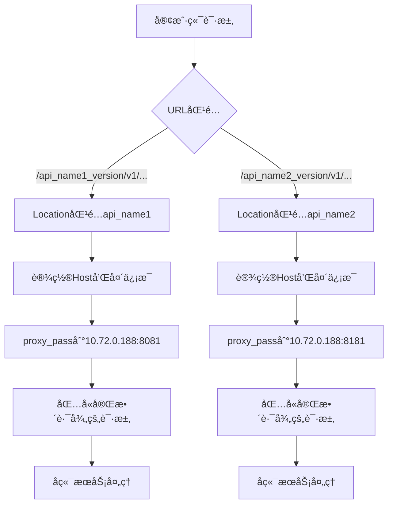

# 最佳å®è·µ
# Nginx é…置最佳å®è·µè¯„ä¼°
- 使用å˜é‡å‡å°‘é‡å¤
- 
## é…置核对

您æ供的é…置是一个很好的最佳å®è·µç¤ºä¾‹ï¼Œé€‚用äºåŸºäº API å称进行路由分å‘的场景。

```nginx
location /api_name2_version/v1/ {
    proxy_pass https://10.72.0.188:8181;
    proxy_set_header Host www.aibang.com;
    proxy_set_header X-Real-IP $remote_addr;
    proxy_read_timeout 300s;
    proxy_connect_timeout 300s;
    proxy_send_timeout 300s;
}

location /api_name1_version/v1/ {
    proxy_pass https://10.72.0.188:8081;
    proxy_set_header Host www.aibang.com;
    proxy_set_header X-Real-IP $remote_addr;
    proxy_read_timeout 300s;
    proxy_connect_timeout 300s;
    proxy_send_timeout 300s;
}
```

## é…置优点

1. **路径ä¿ç•™**：ä¸ä½¿ç”¨ç»“尾斜æ çš„ `proxy_pass` ç¡®ä¿å°†å®Œæ•´è·¯å¾„传递给å端æœåŠ¡
2. **清晰路由**：æ¯ä¸ª API 有独立的 location å—，易äºç»´æŠ¤
3. **正确的头信æ¯**：设置了必è¦çš„ `Host` å’Œ `X-Real-IP` 头
4. **åˆç†çš„超时设置**：300 秒的超时设置对大多数 API 足够

## 进一步优化建议

虽然当å‰é…置已ç»å¾ˆå¥½ï¼Œä½†è¿˜å¯ä»¥è€ƒè™‘以下优化：

1. **使用å˜é‡å‡å°‘é‡å¤**：

```nginx
# 在 http 或 server å—中定义
proxy_set_header Host www.aibang.com;
proxy_set_header X-Real-IP $remote_addr;
proxy_read_timeout 300s;
proxy_connect_timeout 300s;
proxy_send_timeout 300s;

location /api_name2_version/v1/ {
    proxy_pass https://10.72.0.188:8181;
}

location /api_name1_version/v1/ {
    proxy_pass https://10.72.0.188:8081;
}
```

2. **å¦‚æœ API æ•°é‡å¤šï¼Œå¯ä»¥è€ƒè™‘使用正则匹é…**：

```nginx
location ~ ^/api_name(\d+)_version/v1/ {
    proxy_pass https://10.72.0.188:818$1;
    proxy_set_header Host www.aibang.com;
    # 其他头信æ¯...
}
```

3. **添加缓存æ§åˆ¶**（如æœé€‚用）：

```nginx
location /api_name1_version/v1/ {
    proxy_pass https://10.72.0.188:8081;
    proxy_set_header Host www.aibang.com;
    proxy_set_header X-Real-IP $remote_addr;
    
    # 缓存æ§åˆ¶
    proxy_cache_bypass $http_pragma;
    proxy_cache_revalidate on;
    proxy_cache_min_uses 1;
    proxy_cache_use_stale error timeout updating http_500 http_502 http_503 http_504;
    
    # 超时设置
    proxy_read_timeout 300s;
    proxy_connect_timeout 300s;
    proxy_send_timeout 300s;
}
```

4. **添加å¥åº·æ£€æŸ¥å’Œæ•…障转移**（如æœéœ€è¦é«˜å¯ç”¨æ€§ï¼‰ï¼š

```nginx
upstream api_name1_backend {
    server 10.72.0.188:8081 max_fails=3 fail_timeout=30s;
    server 10.72.0.189:8081 backup;
}

location /api_name1_version/v1/ {
    proxy_pass https://api_name1_backend;
    # 其他é…ç½®...
}
```

## æµç¨‹å›¾



## 结论

您æ供的é…置是一个很好的最佳å®è·µï¼Œåªéœ€æ³¨æ„：

1. **ä¿æŒç®€å•**：ä¸ä½¿ç”¨å¤æ‚çš„ rewrite 规则，é¿å…之å‰é‡åˆ°çš„问题
2. **ä¿æŒä¸€è‡´**：所有 location å—使用相åŒçš„é…ç½®é£æ ¼
3. **路径完整**：确ä¿å°†å®Œæ•´è·¯å¾„传递给å端æœåŠ¡

è¿™ç§é…置方å¼ç®€æ´æ˜äº†ï¼Œæ˜“äºç»´æŠ¤ï¼Œå¹¶ä¸”在高负载下也能ä¿æŒç¨³å®šæ€§ã€‚您的当å‰é…置已ç»å¾ˆæ¥è¿‘最佳å®è·µï¼Œåªéœ€æ ¹æ®æ‚¨çš„具体需求考虑是å¦é‡‡ç”¨ä¸Šè¿°ä¼˜åŒ–建议。


# 我的æ¶æ„æµæ•´ä¸ªæµé‡è·¯å¾„:

1. æµé‡è·¯å¾„:
用户请求 -> A(7层Nginx) -> B(4层Nginx) -> C(Kong DP) -> D(GKE RT)
用户请求
   ↓
A: 7层Nginx（Shared VPC，å•ç½‘å¡ï¼‰
   ↓
B: 4层Nginx（åŒç½‘å¡ï¼Œè¿æ¥ Shared VPC ä¸ Private VPC）
   ↓
C: Kong DP（192.168.64.33，Private VPC）
   ↓
D: GKE Runtime（最终æœåŠ¡ï¼‰

æµé‡åˆ†å±‚处ç†ï¼š

A组件(7层Nginx)è´Ÿè´£API路由和HTTP头部处ç†
B组件(4层Nginx)负责跨网络的TCP转å‘
Kong DP处ç†å…·ä½“çš„API网关功能
GKE RT作为最终的æœåŠ¡è¿è¡Œæ—¶

2. 网络æ¶æ„分æ:
- A 组件: å•ç½‘å¡, Shared VPC网络
- B 组件: åŒç½‘å¡(Shared VPC: 10.72.0.188 + Private VPC: 192.168.0.35) é…置了é™æ€è·¯ç”±å¯ä»¥è®¿é—®åˆ°192.168.64.33
- C 组件: Kong DP, 对外暴露IP 192.168.64.33
- D 组件: GKE Runtime

3. é…置分æ:

A组件(7层Nginx)é…ç½®:
- 处ç†äº†å¤šä¸ªAPI路由,这里侧é‡çš„是多个API Name的转å‘
    - /api_name1_version/v1/
    - /api_name2_version/v1/ 
- 使用rewriteé‡å†™URL
- 转å‘到B组件(10.72.0.188:8081)
- 设置了适当的超时å‚æ•°
- ä¿ç•™äº†åŸå§‹å®¢æˆ·ç«¯IP

B组件(4层Nginx)é…ç½®:
- SSL Preread模å¼
- 简å•çš„TCP转å‘到Kong(192.168.64.33:443)
- 设置了è¿æ¥è¶…æ—¶ 5s 

A也就是Nginxçš„é…置如下
api_name1
```nginx
location /api_name1_version/v1/ {
rewrite ^(.*)$ "://www.aibang.com$1"
rewrite ^(.*)$ "https$1" break;
proxy_pass https://10.72.0.188:8081/;
proxy_set_header Host www.aibang.com;
proxy_set_header X-Real-Ip $remote_addr;
    proxy_read_timeout 300s;
    proxy_connect_timeout 300s;
    proxy_send_timeout 300s;
}
```
api_name2
```nginx
location /api_name2_version/v1/ {
rewrite ^(.*)$ "://www.aibang.com$1"
rewrite ^(.*)$ "https$1" break;
proxy_pass https://10.72.0.188:8081/;
proxy_set_header Host www.aibang.com;
proxy_set_header X-Real-Ip $remote_addr;
    proxy_read_timeout 300s;
    proxy_connect_timeout 300s;
    proxy_send_timeout 300s;
}
```
Bçš„Nginx.confé…ç½®
```bash
 server {
   listen 8081;
   ssl_preread on;
   proxy_connect_timeout 5s;
   proxy_pass 192.168.64.33:443;
 }
```


如æœä½ ç¡®è®¤ç›®å‰è¿™æ®µé…ç½®å¯ä»¥æ­£å¸¸å·¥ä½œï¼Œé‚£ä¹ˆå¾ˆå¯èƒ½æœ‰ä»¥ä¸‹å‡ ç§æƒ…况存在，使得é…置“虽然语法有误或冗余但ä¾ç„¶ç”Ÿæ•ˆâ€ï¼š

⸻

✅ ä½ ç°æœ‰é…置的行为æ¨æµ‹ä¸è§£é‡Š

1. rewrite 语å¥è™½ç„¶æ— æ•ˆï¼Œä½†æœªä¸­æ–­è¯·æ±‚

rewrite ^(.*)$ "://www.aibang.com$1"
rewrite ^(.*)$ "https$1" break;

	•	è¿™ä¸¤æ¡ rewrite 写法ä¸ç¬¦åˆé¢„期格å¼ï¼ˆåº”该是 rewrite ^ /new-path [flag];）
	•	但 Nginx 在解æ失败时ä¸ä¼šç»ˆæ­¢é…置加载，而是忽略或默认匹é…路径继续执行 proxy_pass
	•	所以这些语å¥è™½ç„¶â€œå†™é”™äº†â€ï¼Œä½†ä¸å½±å“ proxy_pass 正常工作 —— 请求其å®æ˜¯ç›´æ¥èµ°äº† proxy_pass

2. 为什么 proxy_pass å¯ä»¥èµ·æ•ˆ

proxy_pass https://10.72.0.188:8081/;

	•	å³ä½¿ rewrite 语å¥é”™è¯¯ï¼ŒNginx 在匹é…到该 location å，ä¾æ—§å°†è¯·æ±‚通过 proxy_pass 代ç†ç»™äº†ç›®æ ‡æœåŠ¡
	•	如æœä½ å¸Œæœ›ä¿ç•™è¯·æ±‚路径 /api_name1_version/v1/，那么 / 是没问题的，因为你åŸè·¯å¾„和目标路径相åŒ

⸻

âš ï¸ æ½œåœ¨é£é™©å’Œç»´æŠ¤å»ºè®®

虽然é…置目å‰â€œèƒ½è·‘â€ï¼Œä½†å®ƒå…·æœ‰ä»¥ä¸‹éšæ‚£ï¼š

问题	é£é™©	建议
rewrite 写法ä¸è§„范	下次 reload å¯èƒ½å›  Nginx å‡çº§æˆ–å˜åŠ¨å‡ºé”™	删除或改为åˆæ³•æ ¼å¼
rewirte 拼写错误	虽ä¸ç”Ÿæ•ˆä½†é€ æˆå›°æ‰°	清ç†å†—余无效é…ç½®
æ—¥åè¿ç§»ã€æ¥æ‰‹äººç†è§£æˆæœ¬é«˜	维护ä¸ä¾¿	精简é…置仅ä¿ç•™æœ‰æ•ˆæŒ‡ä»¤


⸻

✅ æ¨è最终精简版本（功能ä¸å˜ï¼Œè¯­æ³•åˆæ³•ï¼‰

location /api_name1_version/v1/ {
    proxy_pass https://10.72.0.188:8081/;
    proxy_set_header Host www.aibang.com;
    proxy_set_header X-Real-IP $remote_addr;
    proxy_read_timeout 300s;
    proxy_connect_timeout 300s;
    proxy_send_timeout 300s;
}


⸻

是å¦ä½ æœ‰æŸç§éœ€è¦é€šè¿‡ rewrite æ¥ä¿®æ”¹è·¯å¾„或å议的具体目的？如æœä½ èƒ½è¯´æ˜èƒŒå的用æ„，我å¯ä»¥æ›´æœ‰é’ˆå¯¹æ€§åœ°æ供替代写法。


我需è¦åˆ†æA组件(7层Nginx)çš„é…置文件是å¦æ­£ç¡®æˆ–åˆç†ã€‚我将检查rewrite规则的语法ã€proxy_passé…ç½®ã€è¶…时设置以åŠæ•´ä½“结æ„，并ä¸Nginx最佳å®è·µå¯¹æ¯”。虽然é…置能工作，但å¯èƒ½å­˜åœ¨è¯­æ³•é—®é¢˜æˆ–优化空间，我会æ供详细分æ和改进建议。

          
我需è¦æŸ¥çœ‹å®Œæ•´çš„nginx-conf.md文件内容，以便全é¢åˆ†æA组件(7层Nginx)çš„é…置是å¦æ­£ç¡®æˆ–åˆç†ã€‚
        
            
toolName: view_files
            
status: success
          
            
filePath: /Users/lex/git/knowledge/nginx/nginx-conf.md
          
# Nginxé…置文件分æ

## A组件(7层Nginx)é…置分æ

ç»è¿‡å¯¹æ‚¨æ供的Nginxé…置文件的详细检查，我å‘ç°è™½ç„¶é…置能够工作，但存在一些语法问题和优化空间。

### ç°æœ‰é…置的问题

1. **rewrite规则语法ä¸è§„范**：
   ```nginx
   rewrite ^(.*)$ "://www.aibang.com$1"
   rewrite ^(.*)$ "https$1" break;
   ```
   这两æ¡rewrite语å¥çš„写法ä¸ç¬¦åˆNginx标准语法格å¼ã€‚正确的rewrite语法应为：`rewrite 匹é…æ¨¡å¼ æ›¿æ¢å†…容 [flag];`

2. **为什么é…ç½®ä»ç„¶èƒ½å·¥ä½œ**：
   - Nginx在解æ到ä¸è§„范的rewrite语å¥æ—¶ï¼Œä¼šå¿½ç•¥è¿™äº›è¯­å¥è€Œä¸æ˜¯ç»ˆæ­¢é…置加载
   - 请求å®é™…上是直æ¥é€šè¿‡`proxy_pass`转å‘的，而ä¸æ˜¯ä¾èµ–rewrite规则
   - ç”±äº`proxy_pass`é…置正确，所以整体功能ä»ç„¶æ­£å¸¸

3. **é…置冗余**：
   - 两个API路径（api_name1å’Œapi_name2）的é…置完全相åŒï¼Œå¯ä»¥è€ƒè™‘åˆå¹¶

### é…置的åˆç†æ€§åˆ†æ

1. **超时设置**：
   - `proxy_read_timeout`ã€`proxy_connect_timeout`å’Œ`proxy_send_timeout`都设置为300秒
   - 这些值相对较高，但如æœæ‚¨çš„上游æœåŠ¡ç¡®å®éœ€è¦è¾ƒé•¿çš„处ç†æ—¶é—´ï¼Œè¿™æ˜¯åˆç†çš„

2. **请求头设置**：
   - 正确设置了`Host`å’Œ`X-Real-Ip`头，这有助äºä¸Šæ¸¸æœåŠ¡è¯†åˆ«è¯·æ±‚æ¥æº

3. **SSLé…ç½®**：
   - 使用HTTPS进行上游è¿æ¥ï¼Œè¿™ä¿è¯äº†ä¼ è¾“安全性

## 优化建议

### 1. 精简版é…置（功能ä¸å˜ï¼Œè¯­æ³•åˆæ³•ï¼‰

对äºapi_name1：
```nginx
location /api_name1_version/v1/ {
    proxy_pass https://10.72.0.188:8081/;
    proxy_set_header Host www.aibang.com;
    proxy_set_header X-Real-IP $remote_addr;
    proxy_read_timeout 300s;
    proxy_connect_timeout 300s;
    proxy_send_timeout 300s;
}
```

对äºapi_name2：
```nginx
location /api_name2_version/v1/ {
    proxy_pass https://10.72.0.188:8081/;
    proxy_set_header Host www.aibang.com;
    proxy_set_header X-Real-IP $remote_addr;
    proxy_read_timeout 300s;
    proxy_connect_timeout 300s;
    proxy_send_timeout 300s;
}
```

### 2. 如æœéœ€è¦ä¿ç•™URLé‡å†™åŠŸèƒ½

如æœæ‚¨ç¡®å®éœ€è¦URLé‡å†™åŠŸèƒ½ï¼Œæ­£ç¡®çš„语法应为：
```nginx
location /api_name1_version/v1/ {
    # 将请求é‡å†™ä¸ºhttps://www.aibang.com/åŸå§‹è·¯å¾„
    rewrite ^/api_name1_version/v1/(.*)$ /api_name1_version/v1/$1 break;
    proxy_pass https://10.72.0.188:8081;
    proxy_set_header Host www.aibang.com;
    proxy_set_header X-Real-IP $remote_addr;
    proxy_read_timeout 300s;
    proxy_connect_timeout 300s;
    proxy_send_timeout 300s;
}
```

### 3. å¯é€‰çš„性能优化

1. **åˆå¹¶ç›¸åŒé…ç½®**：
   如æœä¸¤ä¸ªAPI路径的处ç†é€»è¾‘完全相åŒï¼Œå¯ä»¥ä½¿ç”¨æ­£åˆ™è¡¨è¾¾å¼åˆå¹¶ï¼š
   ```nginx
   location ~ ^/(api_name1_version|api_name2_version)/v1/ {
       proxy_pass https://10.72.0.188:8081/;
       proxy_set_header Host www.aibang.com;
       proxy_set_header X-Real-IP $remote_addr;
       proxy_read_timeout 300s;
       proxy_connect_timeout 300s;
       proxy_send_timeout 300s;
   }
   ```

2. **添加缓冲设置**：
   ```nginx
   proxy_buffers 16 4k;
   proxy_buffer_size 2k;
   ```

3. **考虑添加错误处ç†**：
   ```nginx
   proxy_next_upstream error timeout http_500;
   ```

## 结论

您的Nginxé…置虽然能够工作，但存在语法ä¸è§„范和冗余的问题。建议采用精简版é…置，这样更易äºç»´æŠ¤ä¸”é™ä½äº†æ½œåœ¨é£é™©ã€‚如æœæ‚¨ç¡®å®éœ€è¦URLé‡å†™åŠŸèƒ½ï¼Œè¯·ä½¿ç”¨æ­£ç¡®çš„rewrite语法。

总体而言，é…置的核心功能（代ç†è½¬å‘ã€å¤´éƒ¨è®¾ç½®ã€è¶…æ—¶æ§åˆ¶ï¼‰æ˜¯åˆç†çš„，åªéœ€è¦ä¿®æ­£è¯­æ³•é—®é¢˜å³å¯ä½¿é…置更加规范和å¯é ã€‚


# Nginxé…置分æä¸å»ºè®®

## 简化é…置是å¦æ»¡è¶³éœ€æ±‚

æ ¹æ®æ‚¨çš„æ述，您的平å°æ˜¯ä¸€ä¸ªæ供统一域åå…¥å£(www.aibang.com)çš„APIæœåŠ¡ï¼Œé€šè¿‡ä¸åŒçš„location路径(APIå称+版本)æ¥åŒºåˆ†ä¸åŒçš„APIæœåŠ¡ã€‚对äºè¿™ç§éœ€æ±‚，简化åçš„é…置基本å¯ä»¥æ»¡è¶³è¦æ±‚，但有几点需è¦è€ƒè™‘：

### é…置分æ

```nginx
location /api_name1_version/v1/ { 
    proxy_pass https://10.72.0.188:8081/; 
    proxy_set_header Host www.aibang.com; 
    proxy_set_header X-Real-IP $remote_addr; 
    proxy_read_timeout 300s; 
    proxy_connect_timeout 300s; 
    proxy_send_timeout 300s; 
}
```

### 关键考虑点

1. **路径处ç†**：
   - 当å‰é…置中，`proxy_pass` URL末尾有斜æ (`/`)，这æ„味ç€Nginx会**å»é™¤**匹é…çš„locationå‰ç¼€ï¼Œåªå°†å‰©ä½™éƒ¨åˆ†ä¼ é€’给上游æœåŠ¡å™¨
   - 例如：请求`/api_name1_version/v1/users`会被代ç†åˆ°`https://10.72.0.188:8081/users`
   - 如æœæ‚¨å¸Œæœ›ä¿ç•™å®Œæ•´è·¯å¾„，应移除`proxy_pass`末尾的斜æ 

2. **Host头设置**：
   - 您设置了`Host: www.aibang.com`，这确ä¿äº†ä¸Šæ¸¸æœåŠ¡å™¨èƒ½è¯†åˆ«è¯·æ±‚的域å
   - 这对äºåŸºäºè™šæ‹Ÿä¸»æœºçš„上游æœåŠ¡æ˜¯å¿…è¦çš„

3. **缺少URLé‡å†™åŠŸèƒ½**：
   - 简化é…置移除了åŸæœ‰çš„rewrite语å¥
   - 如æœæ‚¨ç¡®å®éœ€è¦URLé‡å†™åŠŸèƒ½(例如修改请求路径或添加å‚æ•°)，则需è¦æ·»åŠ æ­£ç¡®æ ¼å¼çš„rewrite语å¥

## 建议é…ç½®

æ ¹æ®æ‚¨çš„需求，以下是两ç§å¯èƒ½çš„é…置方案：

### 方案1：ä¸ä¿ç•™API路径å‰ç¼€(当å‰ç®€åŒ–é…ç½®)

```nginx
location /api_name1_version/v1/ { 
    proxy_pass https://10.72.0.188:8081/; 
    proxy_set_header Host www.aibang.com; 
    proxy_set_header X-Real-IP $remote_addr; 
    proxy_read_timeout 300s; 
    proxy_connect_timeout 300s; 
    proxy_send_timeout 300s; 
}
```

è¿™ç§é…置会将`/api_name1_version/v1/endpoint`转å‘为`/endpoint`

### 方案2：ä¿ç•™API路径å‰ç¼€
```nginx
location /api_name2_version/v1/ {
    proxy_pass https://10.72.0.188:8181;
    proxy_set_header Host www.aibang.com;
    proxy_set_header X-Real-IP $remote_addr;
    proxy_read_timeout 300s;
    proxy_connect_timeout 300s;
    proxy_send_timeout 300s;
}
```

```nginx
location /api_name1_version/v1/ { 
    proxy_pass https://10.72.0.188:8081; 
    proxy_set_header Host www.aibang.com; 
    proxy_set_header X-Real-IP $remote_addr; 
    proxy_read_timeout 300s; 
    proxy_connect_timeout 300s; 
    proxy_send_timeout 300s; 
}
```

Nginx proxy_pass 行为详解
让我们æ˜ç¡® Nginx çš„ proxy_pass 行为：

带斜æ çš„ proxy_pass：proxy_pass https://example.com/;

会将 location 匹é…éƒ¨åˆ†ä» URI 中截æ‰
例如：/api_name1_version/v1/path → https://example.com/path


ä¸å¸¦æ–œæ çš„ proxy_pass：proxy_pass https://example.com;

ä¿ç•™å®Œæ•´çš„åŸå§‹ URI
例如：/api_name1_version/v1/path → https://example.com/api_name1_version/v1/path


è¿™ç§é…置会将`/api_name1_version/v1/endpoint`转å‘为`/api_name1_version/v1/endpoint`

也就是比如用户请求
https://www.aibang.com/api_name1_version/v1/query
会被转å‘到
https://10.72.0.188:8081/api_name1_version/v1/query


选择哪ç§æ–¹æ¡ˆå–决äºæ‚¨çš„上游æœåŠ¡(B组件和Kong DP)期望æ¥æ”¶çš„URLæ ¼å¼ã€‚


是的，你当å‰çš„é…置：

location /api_name1_version/v1/ {
    proxy_pass https://10.72.0.188:8081;
    ...
}

ç¡®å®ä¼šä¿ç•™åŸå§‹è·¯å¾„å‰ç¼€ /api_name1_version/v1/ 并将整个路径转å‘ç»™å端æœåŠ¡ã€‚
也就是说：
	•	请求：https://www.aibang.com/api_name1_version/v1/query
	•	å®é™…转å‘ç»™å端的是：https://10.72.0.188:8081/api_name1_version/v1/query

⸻

✅ åŸç†è§£é‡Šï¼šproxy_pass 路径行为规则

在 Nginx 中，proxy_pass 行为å–决äºæ˜¯å¦å¸¦æœ‰ URI 路径部分。

情况对比：

✅ ä½ ç°åœ¨çš„写法：

location /api_name1_version/v1/ {
    proxy_pass https://10.72.0.188:8081;
}

	•	没有结尾路径：Nginx 默认会ä¿ç•™ location 路径å‰ç¼€ã€‚
	•	所以 /api_name1_version/v1/query → /api_name1_version/v1/query

🔠如æœä½ å†™æˆï¼š

proxy_pass https://10.72.0.188:8081/;

（注æ„最åçš„ /）
	•	ç»“å°¾å¸¦æ–œæ  /：Nginx ä¼šæˆªæ‰ location 匹é…部分，åªä¿ç•™å缀。
	•	所以 /api_name1_version/v1/query → /query

⸻

✅ ä½ çš„é…置是å¦æ­£ç¡®ï¼Ÿ

是的，目å‰è¿™ä¸ªé…置是行为清晰ã€è¯­ä¹‰æ­£ç¡®çš„，åªè¦å端æœåŠ¡å°±æ˜¯æœŸæœ›æ”¶åˆ°å¸¦è·¯å¾„å‰ç¼€çš„请求（比如 Kong DP 或上游æœåŠ¡è‡ªè¡ŒåŒ¹é… /api_name1_version/v1/*），那你当å‰å†™æ³•å°±æ˜¯æ¨èæ–¹å¼ã€‚

⸻

是å¦è¿˜éœ€è¦å¯¹ B（4层 Nginx）的 stream 转å‘é…置也åšä¸€æ¬¡æ ¸å¯¹ï¼Ÿ