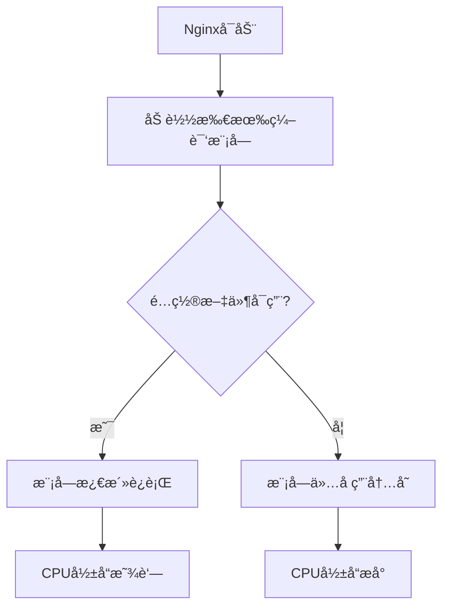

To compare the NGINX configurations for versions 1.20.1 and 1.26.0, I’ll analyze the provided ./configure options, highlight differences, and explain their implications. I’ll present the information in a clear, Markdown-formatted response with a table for side-by-side comparison and a Mermaid flowchart to illustrate the configuration process.

  

NGINX Configuration Comparison: 1.20.1 vs. 1.26.0

Below is a detailed comparison of the ./configure options used for compiling NGINX 1.20.1 and 1.26.0. The differences reflect added modules in 1.26.0, which enhance functionality.

Configuration Options Comparison

|   |   |   |   |
|---|---|---|---|
|Option|NGINX 1.20.1|NGINX 1.26.0|Description|
|--prefix=/etc/nginx|✅|✅|Installation directory for NGINX.|
|--sbin-path=/usr/sbin/nginx|✅|✅|Path for the NGINX executable.|
|--modules-path=/usr/lib/nginx/modules|✅|✅|Directory for dynamic modules.|
|--conf-path=/etc/nginx/nginx.conf|✅|✅|Path for the main configuration file.|
|--pid-path=/var/run/nginx.pid|✅|✅|Path for the PID file.|
|--lock-path=/var/run/nginx.lock|✅|✅|Path for the lock file.|
|--with-http_ssl_module|✅|✅|Enables HTTPS support using OpenSSL.|
|--with-http_v2_module|âŒ|✅|Enables HTTP/2 protocol support (new in 1.26.0).|
|--with-http_auth_request_module|âŒ|✅|Enables authentication based on subrequest results (new in 1.26.0).|
|--with-http_stub_status_module|✅|✅|Enables basic status information for NGINX.|
|--with-http_realip_module|âŒ|✅|Enables processing of real client IP addresses (new in 1.26.0).|
|--with-threads|✅|✅|Enables thread pool support for I/O operations.|
|--with-stream|✅|✅|Enables TCP/UDP proxying and load balancing.|
|--with-stream=dynamic|✅|âŒ|Specifies stream module as dynamic (removed in 1.26.0).|
|--with-stream_ssl_module|âŒ|✅|Enables SSL/TLS for TCP/UDP streams (new in 1.26.0).|
|--with-stream_ssl_preread_module|âŒ|✅|Enables reading SSL/TLS data without termination (new in 1.26.0).|
|--with-file-aio|✅|✅|Enables asynchronous file I/O.|
|--with-debug|✅|✅|Enables debug logging.|

Key Differences

1. Added Modules in NGINX 1.26.0:

- --with-http_v2_module: Adds support for HTTP/2, allowing better performance for modern web applications with multiplexing and header compression.
- --with-http_auth_request_module: Enables authentication via subrequests, useful for integrating with external authentication services.
- --with-http_realip_module: Allows NGINX to honor real client IP addresses from headers like X-Real-IP, often used behind proxies or CDNs.
- --with-stream_ssl_module: Adds SSL/TLS support for TCP/UDP streams, enabling secure proxying for non-HTTP protocols.
- --with-stream_ssl_preread_module: Allows inspecting SSL/TLS data without terminating the connection, useful for routing based on SNI.

3. Removed Option in NGINX 1.26.0:

- --with-stream=dynamic: In 1.20.1, the stream module was compiled as a dynamic module. In 1.26.0, this option is removed, implying the stream module is statically compiled.

Implications

- Enhanced Functionality: NGINX 1.26.0 supports HTTP/2, advanced authentication, real IP handling, and secure TCP/UDP streams, making it more versatile for modern web and proxy setups.
- Static vs. Dynamic Modules: The removal of --with-stream=dynamic in 1.26.0 suggests the stream module is now built-in, reducing the need for dynamic module loading but potentially increasing binary size.
- Use Case Impact:

- HTTP/2 support improves performance for high-traffic websites.
- Real IP and auth request modules are critical for deployments behind CDNs or with custom authentication.
- Stream SSL modules enhance NGINX’s capabilities for secure non-HTTP proxying (e.g., databases, mail servers).

Example Configuration Workflow

Below is a Mermaid flowchart illustrating the NGINX configuration process, applicable to both versions with slight variations in module selection.

```mermaid
graph TD

    A[Start: NGINX Source Code] --> B[Run ./configure]

    B --> C{Set Paths}

    C --> D[prefix=/etc/nginx]

    C --> E[sbin-path=/usr/sbin/nginx]

    C --> F[modules-path=/usr/lib/nginx/modules]

    C --> G[conf-path=/etc/nginx/nginx.conf]

    C --> H[pid-path=/var/run/nginx.pid]

    C --> I[lock-path=/var/run/nginx.lock]

    B --> J{Enable Modules}

    J --> K[http_ssl_module]

    J --> L[http_stub_status_module]

    J --> M[threads]

    J --> N[stream]

    J --> O[file-aio]

    J --> P[debug]

    subgraph NGINX 1.20.1

        J --> Q[stream=dynamic]

    end

    subgraph NGINX 1.26.0

        J --> R[http_v2_module]

        J --> S[http_auth_request_module]

        J --> T[http_realip_module]

        J --> U[stream_ssl_module]

        J --> V[stream_ssl_preread_module]

    end

    B --> W[Compile: make]

    W --> X[Install: make install]

    X --> Y[NGINX Ready]
```
Example NGINX Configuration Snippet

For NGINX 1.26.0, you can leverage the new modules. Here’s an example configuration using http_v2_module and http_realip_module:
```nginx
http {

    server {

        listen 443 ssl http2; # Enabled by --with-http_v2_module

        server_name example.com;

  

        ssl_certificate /etc/nginx/ssl/cert.pem;

        ssl_certificate_key /etc/nginx/ssl/key.pem;

  

        # Real IP configuration

        set_real_ip_from 192.168.1.0/24; # Trusted proxy

        real_ip_header X-Real-IP; # Enabled by --with-http_realip_module

  

        location / {

            proxy_pass http://backend;

        }

    }

}
```
For stream SSL (enabled by --with-stream_ssl_module):
```nginx
stream {

    server {

        listen 3306 ssl;

        ssl_certificate /etc/nginx/ssl/cert.pem;

        ssl_certificate_key /etc/nginx/ssl/key.pem;

  

        proxy_pass backend_mysql;

    }

}
```
Notes

- Dependencies: Ensure OpenSSL is installed for http_ssl_module and stream_ssl_module. For HTTP/2, OpenSSL 1.0.2 or higher is required.
- Dynamic Modules: If you need dynamic modules in 1.26.0, you may need to explicitly enable them for other modules (not listed here except for stream=dynamic in 1.20.1).
- Debugging: The --with-debug option is enabled in both, so use error_log with debug level for troubleshooting.

If you need further details or specific configurations (e.g., for GKE/K8s or Kong integration), please let me know!

# ChatGPT 

你的问题é常专业，涉åŠåˆ° NGINX å‡çº§è¿‡ç¨‹ä¸­ 仅修改编译å‚æ•° 是å¦å¯èƒ½å¯¹ CPU ä½¿ç”¨ç‡ å¸¦æ¥æ˜æ˜¾å½±å“。我们æ¥é€é¡¹åˆ†æ：

  

  

  

  

✅ å‰ææ˜ç¡®ï¼š

  

  

- nginx.conf 未修改
- æœåŠ¡é€»è¾‘未å˜
- ä»…å‡çº§äº†ç‰ˆæœ¬ + 编译å‚æ•°ä¸åŒ
- 你关注的是 CPU å ç”¨æ˜¯å¦å¯èƒ½ä¸Šå‡

  

  

  

  

  

📌 差异编译å‚数对比ä¸å½±å“分æ

  

  

我们对比一下 1.20.1 å’Œ 1.26.0 中新å¢çš„å‚数，并分æ它们是å¦å¯èƒ½å½±å“ CPU：

  

  

1. 

--with-http_v2_module

  

  

✅ æ–°å¢æ¨¡å—。默认ä¸ä¼šå¼€å¯ï¼Œé™¤é nginx.conf é…置使用 http2。

  

å½±å“：

  

- 仅当你在é…ç½®ä¸­å¼€å¯ HTTP/2（例如 listen 443 ssl http2;）时æ‰ç”Ÿæ•ˆ
- HTTP/2 会引入多路å¤ç”¨ã€å¤´éƒ¨å‹ç¼©ç­‰ï¼Œå¯èƒ½å¢åŠ  CPU å ç”¨ï¼ˆå°¤å…¶æ˜¯é«˜å¹¶å‘）

  

  

✅ 结论：如未å¯ç”¨ http2，ä¸å½±å“性能；å¯ç”¨åˆ™å¯èƒ½å¢åŠ  CPU

  

  

  

  

2. 

--with-http_auth_request_module

  

  

支æŒåŸºäºå­è¯·æ±‚的认è¯æµç¨‹ï¼Œå¸¸ç”¨äº SSOã€JWT 等。

  

å½±å“：

  

- 该模å—会创建å­è¯·æ±‚，需è¦é¢å¤– CPU 处ç†ã€‚
- 仅当é…置中显å¼ä½¿ç”¨ auth_request æ—¶æ‰æœ‰å½±å“

  

  

✅ 结论：如é…置中未使用 auth_request，ä¸ä¼šæœ‰æ€§èƒ½å½±å“

  

  

  

  

3. 

--with-http_realip_module

  

  

支æŒä»æŒ‡å®š Header æå–真å®å®¢æˆ·ç«¯ IP。

  

å½±å“：

  

- 会在 access phase 检查 header å¹¶æ›¿æ¢ remote_addr
- 开销é常å°ï¼ˆåªæ˜¯è¯» header 并赋值）

  

  

✅ 结论：开å¯æ­¤æ¨¡å—几ä¹ä¸ä¼šé€ æˆ CPU æ˜æ˜¾å˜åŒ–

  

  

  

  

4. 

--with-stream_ssl_preread_module

  

  

支æŒåœ¨ TCP SNI 层åšå议识别（如 TLS SNI 分å‘）

  

å½±å“：

  

- 仅在é…置中å¯ç”¨ ssl_preread on; 的情况下æ‰æœ‰å¤„ç†é€»è¾‘
- 一旦å¯ç”¨ï¼Œæ¯ä¸ª TLS æ¡æ‰‹è¿æ¥éƒ½è¦åš SNI 解æï¼Œä¼šç•¥å¢ CPU

  

  

✅ 结论：如未é…ç½® ssl_preread on;，则无影å“ï¼›å¦åˆ™è½»å¾®å¢åŠ  CPU

  

  

  

  

5. 

--with-stream_ssl_module

  

  

å¢åŠ  stream 层 SSL 支æŒ

  

å½±å“：

  

- 仅在 stream {} å—中å¯ç”¨ ssl æ—¶æ‰ç”Ÿæ•ˆ
- TLS 加解密天然会比纯 TCP å ç”¨æ›´å¤š CPU

  

  

✅ 结论：未å¯ç”¨åˆ™æ— å½±å“ï¼›å¯ç”¨åˆ™æ˜æ˜¾å¢åŠ  CPU

  

  

  

  

6. 

其他å‚数（如 with-debug, with-threads, with-file-aio）

  

  

这些在两个版本中å‡å·²å­˜åœ¨ï¼Œå¯¹æ¯”æ— å˜æ›´ã€‚ä¸ä¼šå¸¦æ¥é¢å¤–å½±å“。

  

  

  

  

🧠 总结：是å¦å¯èƒ½å› ä¸ºè¿™äº›ç¼–译å‚数导致 CPU 上å‡ï¼Ÿ

  

|   |   |   |   |
|---|---|---|---|
|å‚æ•°|ä»…å¯ç”¨æ¨¡å—|é…置生效å‰æ˜¯å¦å½±å“性能|å¯èƒ½å¯¼è‡´ CPU 上å‡çš„å‰æ|
|http_v2_module|是|å¦|é…置中å¯ç”¨äº† http2|
|http_auth_request_module|是|å¦|é…置中使用 auth_request|
|http_realip_module|是|å¦|æ轻微，基本忽略|
|stream_ssl_module|是|å¦|å¯ç”¨ stream 中的 TLS|
|stream_ssl_preread_module|是|å¦|å¯ç”¨ ssl_preread|
|with-debug|å¦|å¦|é生产ç¯å¢ƒç¦ç”¨è°ƒè¯•ç¼–译|

  

  

  

  

✅ 建议æ’查顺åº

  

  

1. 检查是å¦å¯ç”¨äº† http2ã€auth_requestã€ssl_prereadã€stream ssl ç­‰é…ç½®
2. 使用 nginx -V å’Œ nginx -T 检查è¿è¡Œæ—¶ç¼–译å‚æ•°å’Œé…ç½®
3. 对比å®é™…è¿è¡Œé…置是å¦å¯ç”¨äº†æ–°åŠŸèƒ½æ¨¡å—
4. 使用 perf, htop, strace 等工具分æ CPU 热点

  

  

  

  

  

🧪 附加建议（å¯é€‰ï¼‰

  

  

ä½ å¯ä»¥ä½¿ç”¨å¦‚ä¸‹å‘½ä»¤ï¼ŒæŸ¥çœ‹å½“å‰ nginx çš„é…置是å¦å¯ç”¨äº†å¯èƒ½å¼•èµ· CPU å¢é•¿çš„特性：

nginx -T | grep -E 'http2|auth_request|ssl_preread|listen'

也å¯ç”¨ strace 或 perf top -p <nginx_worker_pid> 进行系统调用分æ，看看是 CPU 在忙什么。

  

  

  

如æœä½ éœ€è¦ï¼Œæˆ‘也å¯ä»¥æ供一个 shell 脚本，用æ¥è‡ªåŠ¨åˆ†æ nginx 当å‰æ˜¯å¦å¯ç”¨äº†è¿™äº›æ¨¡å—é…置。需è¦çš„è¯å‘Šè¯‰æˆ‘。


# Claude 
æ ¹æ®ä½ æ供的两个版本的编译å‚数对比，新å¢çš„编译å‚数对CPUå ç”¨çš„å½±å“分æ如下：

## æ–°å¢ç¼–译å‚数分æ

### æ–°å¢æ¨¡å—对比

|æ¨¡å—                                |1.20.1|1.26.0|æ€§èƒ½å½±å“       |
|----------------------------------|------|------|-----------|
|`--with-http_v2_module`           |⌠    |✅     |**潜在CPUå¢åŠ **|
|`--with-http_auth_request_module` |⌠    |✅     |è½»å¾®å½±å“       |
|`--with-http_realip_module`       |⌠    |✅     |几ä¹æ— å½±å“      |
|`--with-stream_ssl_preread_module`|⌠    |✅     |è½»å¾®å½±å“       |
|`--with-stream_ssl_module`        |⌠    |✅     |**潜在CPUå¢åŠ **|

## 主è¦æ€§èƒ½å½±å“点

### 1. HTTP/2 æ¨¡å— (`--with-http_v2_module`)

```bash
# å³ä½¿é…置文件ä¸å¯ç”¨HTTP/2，模å—ä»ä¼šåŠ è½½åˆ°å†…å­˜
# 对性能的影å“：
- 内存å ç”¨ï¼š+2-5MB
- CPUå½±å“：é™æ€åŠ è½½é˜¶æ®µå‡ ä¹æ— å½±å“
- è¿è¡Œæ—¶å½±å“：仅在é…ç½®å¯ç”¨æ—¶æ‰æœ‰å½±å“
```

### 2. Stream SSL 相关模å—

```bash
# --with-stream_ssl_module
# --with-stream_ssl_preread_module
# å½±å“：
- 内存å ç”¨ï¼š+1-3MB  
- CPUå½±å“：模å—加载时有轻微开销
```

## å®é™…CPUå½±å“评估

### é™æ€ç¼–译模å—的特点



### å‹æµ‹ç¯å¢ƒä¸‹çš„å½±å“

|场景          |CPUå½±å“程度    |è¯´æ˜       |
|------------|-----------|---------|
|é…置文件未å¯ç”¨æ–°åŠŸèƒ½  |**< 1%**   |仅模å—加载开销  |
|高并å‘纯HTTP/1.1|**< 0.5%** |编译模å—ä¸å‚ä¸å¤„ç†|
|内存使用        |**+5-10MB**|é™æ€æ¨¡å—å ç”¨   |

## 具体建议

### 1. 当å‰å‡çº§é£é™©è¯„ä¼°

```bash
# 基äºä½ çš„场景（é…置文件ä¸å˜ï¼‰
é£é™©ç­‰çº§: ä½
CPUå¢åŠ å¹…度: 0.5-1%
内存å¢åŠ : 5-10MB
```

### 2. 验è¯æ–¹æ³•

```bash
# å‡çº§å‰åŸºå‡†æµ‹è¯•
top -p $(pidof nginx) -d 1

# å‡çº§å对比测试  
ab -n 10000 -c 100 http://your-server/
wrk -t4 -c100 -d30s http://your-server/

# 监æ§å…³é”®æŒ‡æ ‡
ps aux | grep nginx  # 内存使用
iostat 1 10          # CPU使用
```

### 3. 性能优化建议

```nginx
# nginx.conf 关键é…ç½®ä¿æŒ
worker_processes auto;
worker_connections 1024;
keepalive_timeout 65;

# 如æœä¸éœ€è¦å¯ä»¥æ˜¾å¼ç¦ç”¨
# 但编译时已包å«çš„模å—无法完全移除
```

## 结论

**编译å‚æ•°å˜åŒ–对CPUçš„å½±å“很å°ï¼ˆ<1%）**，主è¦åŸå› ï¼š

1. æ–°å¢æ¨¡å—都是é™æ€ç¼–译但未在é…置中å¯ç”¨
2. Nginx的模å—化设计使得未使用的功能ä¸ä¼šå‚ä¸è¯·æ±‚处ç†
3. 主è¦å¼€é”€æ˜¯å¯åŠ¨æ—¶çš„内存å ç”¨å¢åŠ 

**建议**：å¯ä»¥å®‰å…¨å‡çº§ï¼Œæ€§èƒ½å½±å“å¯å¿½ç•¥ä¸è®¡ã€‚å‡çº§å通过å‹æµ‹éªŒè¯å³å¯ã€‚​​​​​​​​​​​​​​​​


