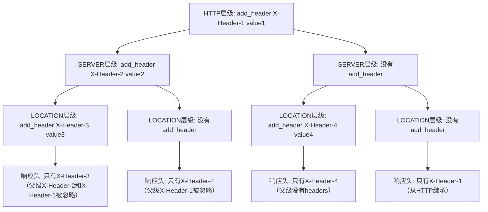
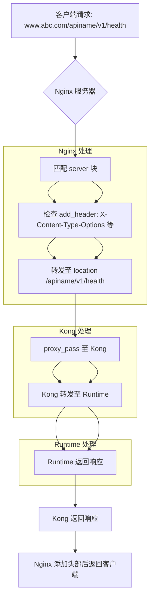
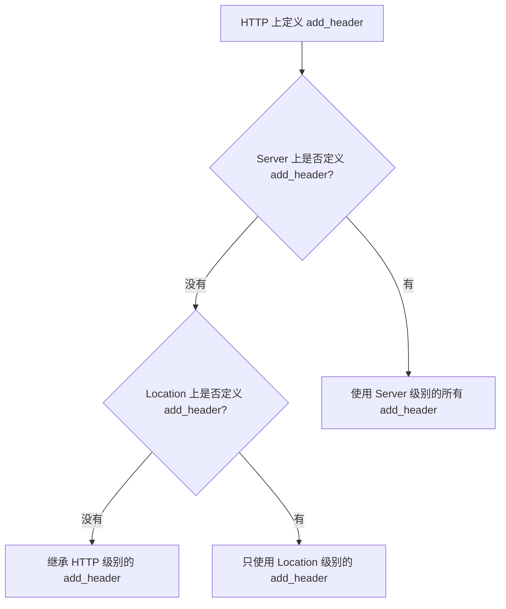

CWE-16
Misconfigured Access-Control-Allow-Origin Header

好的，我们来详细解释一下如何修复这个 Nginx 的 `Missing X-Content-Type-Options Header` Violation 以及添加这个参数可能带来的影响。

---

### 1. 什么是 X-Content-Type-Options 头？

`X-Content-Type-Options` 是一个 HTTP 响应头，主要用于指示浏览器**不要**尝试猜测（"sniffing"）资源的 MIME 类型，而必须严格遵守服务器在 `Content-Type` 头中声明的类型。

**为什么需要它？**

某些浏览器有“MIME sniffing”的行为。如果服务器发送的 `Content-Type` 头不明确、缺失或者看起来不正确，浏览器会尝试检查文件内容，猜测其实际类型。这种行为可能被利用：

*   **跨站脚本攻击 (XSS):** 攻击者可能上传一个看起来像图片或文本文件（例如，`Content-Type: image/jpeg`），但实际上包含可执行的 JavaScript 代码。如果浏览器进行 MIME sniffing 并决定将其作为 HTML 或 JavaScript 执行，就会导致 XSS 攻击。

设置 `X-Content-Type-Options: nosniff` 可以有效阻止这种类型的攻击，强制浏览器信任服务器指定的 `Content-Type`。

---

### 2. 如何修复 (添加 Header)

你需要修改你的 Nginx 配置文件来添加这个响应头。通常，这个配置可以加在 `http`, `server`, 或 `location` 块中。

**步骤：**

1.  **定位 Nginx 配置文件:**
    *   主配置文件通常是 `/etc/nginx/nginx.conf`。
    *   站点相关的配置通常在 `/etc/nginx/conf.d/` 目录下或 `/etc/nginx/sites-available/` (然后链接到 `/etc/nginx/sites-enabled/`) 目录下的特定 `.conf` 文件中。你需要找到你想要应用这个规则的 `server` 块所在的配置文件。

2.  **编辑配置文件:**
    使用你喜欢的文本编辑器（如 `vim`, `nano`）打开相应的配置文件。
    ```bash
    sudo nano /etc/nginx/sites-available/your-site.conf
    # 或者其他你的配置文件路径
    ```

3.  **添加 `add_header` 指令:**
    将 `add_header X-Content-Type-Options nosniff always;` 这行代码添加到合适的配置块中。

    *   **全局应用 (推荐):** 添加到 `http` 块，这样它将应用于所有虚拟主机，除非被 `server` 或 `location` 块覆盖。
        ```nginx
        http {
            # ... 其他 http 配置 ...

            add_header X-Content-Type-Options nosniff always;

            # ... 其他 http 配置 ...

            server {
                # ... server 配置 ...
            }
        }
        ```
    *   **特定站点应用:** 添加到你关心的 `server` 块中。
        ```nginx
        server {
            listen 80;
            server_name example.com www.example.com;

            add_header X-Content-Type-Options nosniff always;

            # ... 其他 server 配置 ...

            location / {
                # ... location 配置 ...
            }
        }
        ```
    *   **特定路径应用:** 如果只想对特定路径应用，可以添加到 `location` 块中（不太常见，通常这个头是全局或站点级别的）。

    **解释 `always` 参数:**
    *   `always` 关键字确保这个头不仅在成功的响应（如 200 OK）中添加，也会在错误响应（如 404 Not Found, 500 Internal Server Error）中添加。对于安全相关的头，使用 `always` 是推荐的最佳实践。

4.  **测试 Nginx 配置:**
    在保存并关闭文件后，务必检查配置文件的语法是否正确。
    ```bash
    sudo nginx -t
    ```
    如果看到 `syntax is ok` 和 `test is successful`，则表示配置无误。

5.  **重新加载 Nginx 服务:**
    应用更改需要重新加载 Nginx 配置。
    ```bash
    sudo systemctl reload nginx
    # 或者如果你的系统不用 systemd
    # sudo service nginx reload
    ```

---

### 3. 对现有环境的最大可能影响

添加 `add_header X-Content-Type-Options nosniff always;` 的主要目的是提升安全性，通常情况下**影响很小或没有负面影响**，前提是你的 Web 服务器和应用程序**正确地设置了所有资源的 `Content-Type` 头**。

**潜在的负面影响（只在特定情况下发生）：**

*   **如果你的服务器错误地发送了 Content-Type:**
    *   **场景:** 假设你有一个 JavaScript 文件 (`.js`)，但你的服务器由于某种原因（错误的配置、应用程序 Bug）将其 `Content-Type` 设置为 `text/plain`。在没有 `nosniff` 的情况下，一些浏览器可能会进行 MIME sniffing，识别出它是 JavaScript 并执行它。
    *   **添加 `nosniff` 后的影响:** 当你添加了 `nosniff` 头，浏览器会严格遵守 `Content-Type: text/plain`，将该文件视为纯文本，**不会执行其中的 JavaScript**。这可能导致你的网站功能失效（依赖该 JS 文件的功能无法工作）。
    *   **类似情况:** 同样的问题可能发生在 CSS 文件被错误地标记为 `text/plain`（导致样式不应用）、图片被错误标记（导致无法显示）等。

*   **依赖浏览器嗅探才能正常工作的旧资源或第三方资源:**
    *   极少数情况下，你可能使用了某些旧的或配置不当的资源，它们依赖于浏览器的 MIME sniffing 行为才能被正确加载或执行。添加 `nosniff` 会破坏这种依赖。

**总结影响:**

*   **正面影响:** 提高安全性，防止基于 MIME sniffing 的 XSS 攻击。这是主要目的，也是绝大多数情况下的结果。
*   **负面影响（罕见，但可能）:** 如果你的服务器或应用程序在设置 `Content-Type` 方面本身就存在**错误**，添加 `nosniff` 会**暴露**这些错误，导致原本（侥幸）能工作的资源（如 JS、CSS）加载失败或无法正确解析。

**如何判断是否有风险？**

1.  **检查 Nginx 的 MIME 类型配置:** 确保你的 Nginx 配置中包含了 `mime.types` 文件，并且该文件是最新的。通常在 `http` 块中有 `include mime.types;` 并且 `default_type application/octet-stream;`。这确保了 Nginx 能根据文件扩展名正确设置静态文件的 `Content-Type`。
2.  **检查应用程序:** 如果你的应用程序动态生成内容或提供文件下载，确保它在设置 HTTP 响应头时总是包含正确且具体的 `Content-Type`。
3.  **测试:** 在添加该 Header 后，**务必彻底测试你的网站/应用程序**。检查：
    *   所有页面的样式 (CSS) 是否正确加载？
    *   JavaScript 功能是否正常工作？（检查浏览器开发者控制台有无报错）
    *   图片、视频、字体等资源是否正常显示？
    *   文件下载功能是否正常？

**结论:**

添加 `add_header X-Content-Type-Options nosniff always;` 是一个**推荐的安全增强措施**。潜在的负面影响通常只发生在你的 Web 服务器或应用本身就存在 `Content-Type` 配置错误的情况下。因此，最佳实践是：

1.  添加这个 Header。
2.  彻底测试你的应用。
3.  如果发现问题，不要移除这个 Header，而是去**修复导致 `Content-Type` 不正确的根本原因**（修正 Nginx 配置或应用程序代码）。

当然可以。我们来详细分析这个指令的作用、潜在影响，以及它为何重要。

⸻

💡 指令含义

add_header X-Content-Type-Options nosniff always;

这是一个 HTTP 安全相关的响应头。其作用是阻止浏览器对响应内容类型进行 “MIME type sniffing”。

⸻

🔒 为什么需要这个 Header？

某些浏览器会尝试根据内容来猜测 MIME 类型（而不是使用服务器发送的 Content-Type）。这可能导致以下安全风险：
	•	跨站脚本攻击（XSS）：例如，如果你返回了一个 .txt 文件，但它内容中有 <script>，浏览器可能会当作 HTML 执行它。
	•	绕过上传限制：攻击者上传了 .jpg，但内容是 JS，浏览器“猜”错类型后执行了 JS。

这个 header 明确告诉浏览器：“不要猜，严格按照 Content-Type 来处理内容。”

⸻

✅ 加上这个配置的好处
	•	提高网页的 安全性。
	•	阻止不当执行脚本、HTML 或其他类型。
	•	是很多安全扫描工具（如 Qualys SSL Labs、OWASP ZAP）推荐项。

⸻

⚠️ 可能影响
	1.	对老旧系统的兼容性
某些依赖浏览器自动 MIME 猜测的旧网页或旧 JS 逻辑，可能在现代浏览器中变得不可用。
	2.	Content-Type 设置错误时会暴露问题
如果你网站本身在返回资源时 Content-Type 设置有误，加上这个 header 后浏览器会严格按照这个错误类型处理，导致：
	•	图片无法显示
	•	JS/CSS 不加载
	•	文件下载格式错误
所以 务必确认你所有静态资源的 Content-Type 设置正确。

⸻

✅ 推荐做法

如果你希望安全性优先，同时又避免出错，可以：
	•	先在 开发或 staging 环境 开启该 Header，观察是否有资源加载问题。
	•	配合使用正确的 mime.types 配置文件，确保所有资源类型匹配。

⸻

需要我帮你检查 Nginx 静态文件设置是否正确，或者给个配置示例吗？


在 Nginx 中添加 X-Content-Type-Options Header 的标准做法是修改配置文件，添加如下指令：

add_header X-Content-Type-Options nosniff always;

修复步骤
	1.	定位配置文件
找到你的 Nginx 主要配置文件（通常是 /etc/nginx/nginx.conf）或对应虚拟主机的配置文件。
	2.	添加配置
在 server {} 或 location {} 块中添加上面的指令。如果你希望全局生效，可以直接放在 http 块中。例如：
```nginx
http {
    ...
    add_header X-Content-Type-Options nosniff always;
    ...
    server {
        listen 80;
        server_name your-domain.com;
        ...
    }
}
```

	3.	测试配置
使用以下命令检查配置是否正确无误：

`nginx -t`


	4.	重载服务
如果没有错误，重载 Nginx 服务：

`nginx -s reload`


参数影响分析

作用：
	•	防止 MIME 类型嗅探： 该 Header 告诉浏览器按照服务器返回的 MIME 类型来处理内容，而不是自动去猜测（MIME sniffing）。这有助于防止一些由错误的 MIME 类型导致的安全问题，比如 XSS 攻击。

可能的影响：
	•	正面效果：
	•	加强安全性：减少由错误解析导致的潜在攻击风险。
	•	浏览器严格遵守内容类型：确保静态资源按照设置的 MIME 类型来加载，从而减少浏览器安全漏洞利用的可能性。
	•	潜在的负面影响：
	•	资源加载问题： 如果你的某些文件没有设置正确的 Content-Type，浏览器在收到 nosniff 指令后可能拒绝加载这些资源。例如，如果某个 JavaScript 文件未正确设置为 application/javascript，浏览器可能不会执行它。
	•	历史兼容性： 某些老旧或未经过严格配置的前端资源可能会因为 MIME 类型与实际内容不符而导致加载失败。因此，确保所有资源（CSS、JS、图片等）的 MIME 类型配置都正确尤为重要。

建议：
在将该配置推广到生产环境之前，建议先在测试环境进行验证，确保所有资源均能被正确加载且不会出现异常。特别是对第三方资源或动态生成内容，务必保证它们的 Content-Type 都已正确设置。

⸻

通过以上步骤，你可以修复当前的 Nginx Violation，同时了解这个参数在现有环境中可能产生的影响，确保安全性提升的同时不破坏应用正常的资源加载。


非常好！你已经启用了多个关键的 HTTP 安全响应头，让我们逐条分析这两条配置的含义、作用、以及是否与 X-Content-Type-Options: nosniff 有冲突（答案提前告诉你：没有冲突，反而是相辅相成的 👇）

⸻

✅ 配置一：

add_header Strict-Transport-Security "max-age=3153600; includeSubDomains; preload" always;

🧠 含义解析

这是 HTTP Strict Transport Security（HSTS） 头，用于告诉浏览器：

“你今后访问我这个站点，只能用 HTTPS，不要再试图用 HTTP。”

	•	max-age=3153600：表示 3153600 秒（约 1 年）内强制启用 HTTPS。
	•	includeSubDomains：表示这个策略也适用于所有子域名。
	•	preload：允许你的站点被加入到 浏览器的预加载 HSTS 列表，提前内置在 Chrome、Firefox 等浏览器中。

🛡️ 作用

防止 SSL stripping（将 HTTPS 降级为 HTTP 的中间人攻击）。

⸻

✅ 配置二：

add_header X-Frame-Options "DENY";

🧠 含义解析

这个是 防点击劫持（Clickjacking）的响应头。
	•	DENY 表示：完全禁止页面被嵌套在 iframe 中，无论是同源还是跨源。
	•	也可以选择：
	•	SAMEORIGIN：仅允许同源的页面嵌套。
	•	ALLOW-FROM uri：只允许特定的 URL 嵌套（这个支持度差）。

🛡️ 作用

防止攻击者在你不知情的情况下把你的网站放在自己的网页中，用透明 iframe 引诱用户操作，进而盗取信息或操作账户。

⸻

✅ 配置三（你将要加的）：

add_header X-Content-Type-Options nosniff always;

🧠 含义解析

如前所述，防止浏览器猜测 MIME 类型，防止 HTML/JS 注入攻击。

⸻

🔍 它们之间有冲突吗？

🟢 没有冲突，而且这些安全头的组合是很多安全扫描推荐的“基础三件套”，彼此之间功能互补：

| Header | 功能领域 |
|--------|----------|
| X-Content-Type-Options | 防止 MIME 类型嗅探（XSS） |
| X-Frame-Options | 防止点击劫持（Clickjacking） |
| Strict-Transport-Security | 强制使用 HTTPS 连接 |


⸻

✅ 推荐建议
	•	✅ 继续使用并启用这三项安全头。
	•	✅ 确保你的页面不会依赖被嵌入在 iframe 中（如果用 X-Frame-Options: DENY）。
	•	✅ 如果你使用了 CDN（如 Cloudflare），也确认这些 header 没有被覆盖或重复添加。
	•	⚠️ 如果你启用了某些第三方服务（如 Web IDE、内嵌页面）需要嵌套你的站点，X-Frame-Options: DENY 可能需要改为 SAMEORIGIN。

需要的话我可以帮你生成一个 Nginx 安全头标准模板，适用于生产环境。要不要？

# claude
针对 Nginx 的 CWE-16 违规（安全配置缺陷）修复，我将详细解释 `add_header X-Content-Type-Options nosniff always;` 的配置位置、继承规则和最佳实践。

## `add_header` 指令的作用域

`add_header` 指令可以在三个不同的上下文中配置：

| 上下文 | 作用范围 |
|--------|---------|
| http   | 影响所有虚拟主机和所有位置 |
| server | 仅影响特定虚拟主机内的所有位置 |
| location | 仅影响特定的路径匹配 |

## 覆盖规则（很重要）

**关键点**: Nginx 的 `add_header` 指令有**不继承而是覆盖**的特性。如果在子级上下文中定义了任何 `add_header` 指令，则父级上下文中的所有 `add_header` 指令都会被完全忽略！



## 你的问题分析

1. **HTTP 段落配置不生效**: 当你在 `http` 块添加了 `add_header`，但在任何子级 `server` 或 `location` 块中也有自己的 `add_header` 指令时，HTTP 级别的指令会被完全忽略。

2. **多个 add_header 指令**: 在同一级别（如 server 块）中的多个 `add_header` 指令**不会**互相覆盖，而是全部生效。你的示例中的三个 header 都会被添加到响应中。

## 最佳实践

考虑到请求会经过多次跳转，确保每一步都添加所需的安全头部：

```nginx
# 在http块中添加基础安全头
http {
    # 基础配置...
    
    # 创建一个可重用的片段
    include security_headers.conf;
    
    server {
        # 如果这个server没有自己的add_header指令，将继承http块的
        # 如果有自定义header需求，需要包含共享配置
        
        location /apiname/v1/ {
            # 如果这个location有自己的add_header需求，
            # 必须再次包含共享配置，否则http级别的会被忽略
            include security_headers.conf;
            
            # 其他location特定配置...
        }
    }
}
```

在 `security_headers.conf` 文件中:

```nginx
# 安全头部集中配置
add_header X-Content-Type-Options nosniff always;
add_header Strict-Transport-Security "max-age=31536000; includeSubDomains; preload" always;
add_header X-Frame-Options DENY always;
# 可添加其他安全头部...
```

## 处理多级代理的情况

对于多级代理环境（如 `用户 -> Nginx -> Kong -> 后端服务`），确保安全头部在最接近用户的部分正确配置：

1. 在面向用户的 Nginx 中正确配置所有安全头部
2. 确保代理配置不会删除这些头部
3. 对于需要在每个响应级别添加的头部，在 Kong 中也进行配置

## 总结

1. 配置 `add_header` 指令时要记住它的覆盖而非继承特性
2. 使用 `include` 指令集中管理安全头部配置
3. 在每个可能的响应路径上（http、server、location）都确保包含安全头部
4. `always` 参数确保头部在所有响应状态码中都添加（包括错误码）

如有特定的代理环境配置问题，可以提供更多详细信息进行进一步分析。​​​​​​​​​​​​​​​​


# grok

直接回答
	•	关键点：
	◦	建议在 server 块中设置 add_header X-Content-Type-Options nosniff always;，因为它适用于该服务器下的所有位置块，且你发现这样配置有效。
	◦	在 http 块设置可能无效，可能是由于更具体的 server 或 location 块覆盖了它，或配置有语法错误。
	◦	多个 add_header 指令（如 X-Content-Type-Options、Strict-Transport-Security 和 X-Frame-Options）可以共存，不会相互覆盖，只要它们是不同的头部。
	◦	使用 always 参数确保头部在所有响应（包括重定向和错误）中生效，推荐 Nginx 1.7.5+ 版本。
配置位置
	•	http 块：全局生效，但可能被 server 或 location 块覆盖。
	•	server 块：适用于该服务器下的所有位置块，推荐你的场景。
	•	location 块：仅对特定路径生效，可能覆盖父级设置。
为什么 http 块无效
可能是因为：
	•	server 块或 location 块有自己的 add_header，覆盖了 http 块的设置。
	•	配置文件包含其他文件，存在冲突的 server 块。
	•	配置语法错误，导致 http 块未正确解析。
多个 `add_header` 是否覆盖
不会覆盖，只要是不同头部（如 X-Content-Type-Options 和 Strict-Transport-Security），它们会同时生效。例如：
```nginx.conf
add_header X-Content-Type-Options nosniff always;
add_header Strict-Transport-Security "max-age=31536000; includeSubDomains; preload" always;
add_header X-Frame-Options DENY always;
```
以上三个头部都会出现在响应中。
重定向和多层代理
	•	使用 always 参数确保头部包含在重定向响应中。
	•	对于多层代理（如 Nginx → Kong → Runtime），确保每层都设置头部，但 Nginx 的设置已覆盖初始响应。
最佳实践
	•	在 server 块设置头部，适用于所有位置块。
	•	使用 always 参数，确保所有响应包含头部。
	•	测试配置：运行 nginx -t 检查语法。

调查笔记
以下是关于 Nginx 配置 add_header X-Content-Type-Options nosniff always; 的详细分析，涵盖你的问题和相关背景，基于 Nginx 配置的最佳实践和网络协议知识。
配置 `add_header` 的位置和作用
Nginx 的配置层次结构为 http → server → location，每个层次的 add_header 指令有不同的作用：
	•	http 块：这是 HTTP 相关配置的顶级块，设置在这里的 add_header 全局生效，适用于所有 server 和 location 块，除非被更具体的块覆盖。
	•	server 块：定义虚拟服务器（如 www.abc.com），add_header 这里设置只对该服务器下的所有 location 生效。
	•	location 块：定义特定 URL 路径的处理逻辑，add_header 这里设置仅对该路径生效，并可能覆盖父级（http 或 server）的设置。
根据 Nginx HTTP Headers Module，add_header 指令在当前级别定义时，会覆盖上一级的设置。这解释了为什么你在 http 块设置无效，而在 server 块设置有效：可能是 server 块或其下的 location 块有自己的 add_header，导致 http 级别的设置被忽略。
为什么 `http` 块设置无效
你提到在 http 块设置 add_header X-Content-Type-Options nosniff always; 无效，但在 server 块设置后生效。可能的原因为：
	1	覆盖问题：根据 Stack Overflow: Nginx add_header not working，如果 server 或 location 块有自己的 add_header，它会覆盖 http 块的设置。即使 server 块没有显式定义，location 块可能有自己的头部定义，导致 http 级别的头部被“撤销”。
	2	配置包含：你提到使用 include 引用其他配置文件，这些文件可能包含自己的 server 块。如果这些 server 块没有继承 http 块的 add_header，或有冲突设置，可能会导致头部未生效。
	3	语法或解析问题：如果 http 块配置有语法错误（如块未正确关闭或拼写错误），Nginx 可能无法正确解析，导致 add_header 未生效。建议运行 nginx -t 检查配置。
例如，假设你的配置如下：
```nginx.conf
http {
    add_header X-Content-Type-Options nosniff always;
}

server {
    listen 80;
    server_name www.abc.com;

    location /apiname/v1/health {
        proxy_pass http://kong;
        # 如果这里有 add_header，它会覆盖 http 块的设置
    }
}
```
如果 location 块有自己的 add_header，http 块的设置会被忽略。
多个 `add_header` 指令是否覆盖
你问如果 server 块中有三行 add_header 是否会有覆盖关系，例如：
```nginx.conf
add_header X-Content-Type-Options nosniff always;
add_header Strict-Transport-Security "max-age=31536000; includeSubDomains; preload" always;
add_header X-Frame-Options DENY always;
```
根据 KeyCDN Support: Using the Nginx add_header Directive，多个 add_header 指令可以共存，只要它们设置的是不同头部。Nginx 会将所有头部添加到响应中，不会相互覆盖。例如：
	•	X-Content-Type-Options: nosniff
	•	Strict-Transport-Security: max-age=31536000; includeSubDomains; preload
	•	X-Frame-Options: DENY
只有当两个 add_header 设置相同头部时，后面的会覆盖前面的。但你的例子中三个头部不同，因此都会生效。
以下是相关行为的表格总结：
头部名称
设置位置
是否覆盖其他头部
生效范围
X-Content-Type-Options
server 块
否（不同头部）
该服务器所有位置块
Strict-Transport-Security
server 块
否（不同头部）
该服务器所有位置块
X-Frame-Options
server 块
否（不同头部）
该服务器所有位置块
重定向和多层代理的头部设置
你提到请求经过多次跳转（如 www.abc.com/apiname/v1/health → Kong → Runtime），需要确保每次都设置 X-Content-Type-Options。根据 Claudia Kuenzler’s Blog: Nginx add_header not working，add_header 默认适用于成功响应（200 OK）和重定向（301、302），但不适用于错误响应（4xx、5xx），除非使用 always 参数。
	•	使用 always 参数：在 Nginx 1.7.5+ 版本中，add_header ... always; 确保头部包含在所有响应中，包括重定向和错误响应。例如：
add_header X-Content-Type-Options nosniff always;
	•	
这适合你的场景，确保重定向响应也包含头部。
	•	多层代理：你的架构涉及 Nginx → Kong → Runtime。由于 Kong 和 Runtime 可能也处理响应，确保它们也设置头部很重要。但对于 Nginx 层，设置 add_header 已覆盖初始响应。如果 Kong 或 Runtime 是最终服务器，建议在它们配置中也设置安全头部。
最佳实践和你的场景
鉴于你的使用场景（开源 Nginx，包含多个 API，每个 API 有对应 location 块），以下是建议：
```nginx.conf
	1	位置：在 server 块设置 add_header，如：
server {
	2	    listen 80;
	3	    server_name www.abc.com;
	4	    add_header X-Content-Type-Options nosniff always;
	5	    add_header Strict-Transport-Security "max-age=31536000; includeSubDomains; preload" always;
	6	    add_header X-Frame-Options DENY always;
	7	    location /apiname/v1/health {
	8	        proxy_pass http://kong;
	9	    }
	10	}
```
	11	
这样确保所有位置块继承这些头部。
	12	测试配置：运行 nginx -t 检查语法，确保无错误。
	13	重定向处理：使用 always 参数，确保重定向响应也包含头部。
	14	多层代理：如果 Kong 或 Runtime 需要设置头部，分别在它们配置中添加。例如，Kong 可能也支持类似 add_header 的设置，具体看其文档。
以下是流程图，展示请求处理和头部设置的逻辑：

网络协议相关
X-Content-Type-Options: nosniff 是 HTTP 安全头部，防止浏览器进行 MIME 类型嗅探，减少驱动下载或 MIME 类型混淆攻击的风险。它基于 HTTP 协议，属于响应头部，客户端（如浏览器）在接收到后会根据头部调整行为。这与 TCP 层无关，但 Nginx 作为 HTTP 代理，确保头部正确设置对安全至关重要。
总结
	•	在 server 块设置 add_header，使用 always 参数，确保所有响应包含头部。
	•	多个 add_header 指令共存，不会覆盖。
	•	检查配置，确保无语法错误，运行 nginx -t 测试。
	•	对于多层代理，确保每层都设置头部，但 Nginx 的设置已覆盖初始响应。

关键引文
	•	Nginx HTTP Headers Module Documentation
	•	Stack Overflow: Nginx add_header not working
	•	KeyCDN Support: Using the Nginx add_header Directive
	•	Claudia Kuenzler’s Blog: Nginx add_header not working


# ChatGPT 

Nginx add_header 指令在不同上下文中的继承与覆盖机制

继承机制（Http/Server/Location上下文的差异）

Nginx 中的 add_header 指令遵循层级继承规则：默认情况下，如果一个配置块（例如 server 或 location）中未定义任何 add_header 指令，则会继承上一级配置（如 http 或 server）中的所有 add_header 指令；一旦在当前级别定义了至少一条 add_header，则不再继承上级的任何 add_header。这意味着，如果在 http 块中定义了 add_header X-Content-Type-Options nosniff always;，但在某个 server 或 location 中存在任意其它 add_header，那么 http 块的那个指令就不会传递到该上下文中  。换言之，子级（server 或 location）一旦有自己的 add_header，就仅以该级别的指令为准，不叠加父级的指令。例如：
```nginx.conf
http {
    add_header X-Content-Type-Options nosniff always;
}
server {
    listen 80;
    server_name example.com;
    # 假设定义了一条 add_header，则下面的 location 将不继承 http 中的 add_header
    add_header X-Frame-Options SAMEORIGIN;
    location / {
        proxy_pass http://backend;
        # 即使 http 层有 nosniff 指令，这里也不会生效，因为本层已有 add_header
    }
}
```
上述配置中，location / 会忽略 http 块的 X-Content-Type-Options 指令，只输出 X-Frame-Options；而如果 server 或 location 块没有任何 add_header，则会继承其上级。为了帮助理解，下面的流程图示意了 add_header 的查找和继承逻辑：

此外，always 参数用于确保在所有响应状态码下都添加头部（包括 4xx/5xx 错误码和重定向）。在 Nginx 1.7.5 及以上版本，可使用 always 关键字；否则默认仅对 200、201、204、206、301、302、303、304、307、308 等状态码生效  。因此，如果不加 always，那么在错误页或特定状态码时可能看不到头部。总之，add_header 的生效依赖于继承规则和状态码限制：在 http 层声明可能被后续层覆盖（而且默认仅应用于成功和部分重定向响应），而放在 server 或 location 中则更接近最终处理点、更易生效。

同级别多条 add_header 指令的叠加

在同一个配置块中可以定义多条 add_header 来添加不同的响应头，它们是并列生效的，不会互相覆盖。官方文档指出：“可以有多条 add_header 指令” 。例如，如果在 server 块中依次定义了：
```bash
add_header X-Content-Type-Options nosniff always;
add_header X-Frame-Options SAMEORIGIN always;
add_header Strict-Transport-Security "max-age=31536000; includeSubDomains; preload" always;
```
那么最终响应会同时包含上述三个头字段。这些指令不会因为顺序而互相覆盖；覆盖问题只会在不同层级出现：如果 location 里定义了任何 add_header，它就会忽略同 server（或 http）层定义的指令 。若确实需要在某个 location 同时返回所有头，则必须在该 location 内重复定义所有需要的 add_header，或采用公共配置片段（如 include 文件）来减少重复 。

含 include 和多次 proxy_pass 场景下的头部策略

在实际环境中，配置文件通常通过 include 分割，不同 API 对应各自的 location 块，且请求可能经过多层 proxy_pass 转发。此时要确保最终响应头包含必要的安全头（如 X-Content-Type-Options），需注意以下几点：
	•	继承规则： 如果一个 location 里有自己的 add_header，它不会继承上级的定义。因此，若 http 或 server 级定义了安全头，但每个 location 有额外的 add_header，就需要在每个 location 中也声明这些安全头，否则它们会缺失。如使用统一的包含文件，可以在每个 location 里 include security-headers.conf;，或干脆在每个 location 块开头重复添加所需头部。这保证了不管分散在哪个文件或层级，最终都能设置这些头。
	•	always 参数： 强烈建议给安全头使用 always，尤其是在多层代理或错误页场景下，避免因为状态码而漏加头。例如：

add_header X-Content-Type-Options nosniff always;

如上配置可保证即使响应状态码是 404、500、302 等，也会出现 X-Content-Type-Options  （[24]表明 Nginx 1.7.5+ 可用 always 覆盖所有状态码）。

	•	多级转发： Nginx 作为反向代理时，默认会将上游响应的自定义头部转发给客户端。如果上一级代理已经添加了某头，下一级（或最终）的 Nginx 默认会透传该头，前提是下一级配置中没有针对该头的其他 add_header 或 proxy_hide_header 设置。最保险的做法是在最外层（接近客户端的 Nginx 实例）再次声明所需头，以防中间层配置不同导致丢失。
	•	公共包含： 可将常用安全头放在单独文件，如 security_headers.conf，然后在 http、server 或具体 location 引用：
```nginx.conf
# security_headers.conf
add_header X-Content-Type-Options nosniff always;
add_header X-Frame-Options SAMEORIGIN always;
add_header Strict-Transport-Security "max-age=31536000; includeSubDomains; preload" always;

然后：

server {
    listen 80;
    server_name example.com;
    include security_headers.conf;
    location /api1 {
        # 无其他 add_header，可继承 server 中的安全头
        proxy_pass http://backend1;
    }
    location /api2 {
        # 如果此处需要增加新的 add_header，
        # 则应在此处再次包含安全头文件，否则安全头将不被继承
        include security_headers.conf;
        proxy_pass http://backend2;
    }
}
```
这样可以确保无论请求走到哪个 location，都统一添加了所需安全头。

最佳实践建议

为了最大程度保证安全头在所有路径和跳转后的响应中生效，通常建议：
	•	使用 always 参数： 对所有安全相关的 add_header 指令添加 always，保证无论是成功响应、重定向还是错误页，都包含这些头  。
	•	尽量在高层次定义： 如果可能，将安全头放在 http 或 server 上层，这样一来未被子级覆盖的所有请求都会带上它们。但要严格遵守继承规则：一旦在子级有定义，父级就不再生效，所以需避免在不同层级间出现定义冲突。
	•	配置重用： 利用 include 将安全头统一在一个片段里，避免在多个 location 重复粘贴。如果必须在 location 定义额外头部，就在同一个文件中保持所有头部的定义。
	•	避免使用 if 来设置头： 如果在 if 语句中使用 add_header，同样遵循“当前块有定义则覆盖父级”的规则，也需要在该 if 内列出所有需要的头，否则也会丢失父级头 。（这里的【26】指 Nginx 官方Trac票号 2059，总结了此行为。）
	•	考虑第三方模块（可选）： 如果需要更灵活的控制，可以使用第三方模块如 headers_more，它允许追加而不受继承限制。但在只用开源 Nginx 的情况下，上述规则即可满足一般需求。

总之，要确保安全头总是出现，关键在于理解 Nginx 的继承机制，合理放置 add_header。在现实项目中，一种常见做法是：在 http 或 server 层统一定义一组安全头（带 always），并通过 include 或在每个 location 中引用它们，以防止由于层级覆盖而丢失任何头。这样可以在所有路径、跳转或错误响应中都生效，提升安全性。

参考资料： Nginx 官方文档  、StackOverflow/Nginx 社区问答  等。


# gemini

Nginx中add_header指令的深入解析与最佳实践：修复CWE-16漏洞
I. 引言
Web服务器配置的安全性与合规性对于保护应用程序和用户数据至关重要。通用缺陷枚举（CWE-16）涉及配置错误，可能导致各种安全漏洞。在Nginx中，正确配置HTTP响应头是缓解此类风险的关键措施之一。X-Content-Type-Options: nosniff 是一个重要的安全响应头，用于防止浏览器进行MIME类型嗅探，从而降低某些类型的跨站脚本（XSS）攻击和其他基于内容解释的攻击风险。
本报告旨在深入探讨Nginx的 add_header 指令，特别是关于 X-Content-Type-Options nosniff always; 的配置。我们将详细分析该指令在Nginx配置（如 http、server 和 location 块）中不同位置的放置方式及其各自的影响。报告还将阐明 add_header 的继承规则，解释为何仅在 http 块中添加可能无法生效，并讨论多个 add_header 指令同时存在时的行为。此外，我们将探讨 always 参数的重要性，尤其是在处理重定向和确保所有响应（包括错误页面）都包含必要头部时的作用。最后，本报告将提供在Nginx开源版本中，结合 include 指令管理复杂配置的最佳实践，并介绍一种替代方案——ngx_http_headers_more_module 模块，以应对标准 add_header 指令在继承方面的某些局限性。
II. 理解Nginx的add_header指令
add_header 指令是Nginx ngx_http_headers_module 模块的核心功能之一，允许向客户端响应中添加自定义的HTTP头部字段 。
A. 基本语法和上下文
add_header 指令的基本语法如下 ：
add_header name value [always];
 * name: 要添加的HTTP头部的名称。
 * value: HTTP头部的值，可以包含Nginx变量。
 * always (可选参数): 指定后，无论响应状态码是什么，都会添加该头部。如果未指定，则仅在响应状态码为200, 201, 204, 206, 301, 302, 303, 304, 307, 或 308 时添加头部 。
此指令可以在以下Nginx配置上下文中找到并使用 ：
 * http: 在此上下文中定义的 add_header 指令理论上会应用于所有虚拟主机（server块）的响应。
 * server: 在此上下文中定义的 add_header 指令会应用于特定虚拟主机的所有响应。
 * location: 在此上下文中定义的 add_header 指令仅应用于匹配特定URI模式的请求响应。
 * if in location: 在 location 块内的 if 条件语句中也可以使用。
B. always 参数的重要性
always 参数在Nginx 1.7.5版本中引入 。对于安全相关的HTTP头部，如 X-Content-Type-Options、Strict-Transport-Security 和 X-Frame-Options，强烈建议使用 always 参数 。这是因为这些头部对于保护用户免受攻击至关重要，即使在发生错误（如404 Not Found或500 Internal Server Error）或重定向（3xx）时也应存在 。若不使用 always，这些关键的安全头部可能在非成功响应中缺失，从而留下安全隐患。例如，一个恶意行为者可能会利用错误页面上缺失的安全头部来尝试攻击。确保在所有响应中一致地应用安全头部是纵深防御策略的一部分 。
III. X-Content-Type-Options 头部详解
X-Content-Type-Options HTTP响应头主要用于指示浏览器禁用MIME类型嗅探（MIME sniffing）。
A. 目的：防止MIME类型嗅探
MIME类型嗅探是某些浏览器（如旧版Internet Explorer和Chrome）的一种行为，它们会尝试猜测资源的正确MIME类型，而不是严格依赖服务器通过 Content-Type 头部声明的类型 。虽然这有时可以纠正服务器错误的 Content-Type 配置，但也可能被攻击者利用。当 X-Content-Type-Options 设置为 nosniff 时，它告诉浏览器必须严格遵守服务器提供的 Content-Type，禁止嗅探行为 。
B. 安全意义：缓解CWE-16相关的风险
不正确的MIME类型处理是CWE-16（配置错误）的一个方面，可能导致严重的安全问题。如果浏览器错误地将一个本应是纯文本或图像的文件解释为HTML或脚本，就可能执行嵌入其中的恶意代码。这通常发生在攻击者能够上传看似无害但包含恶意内容的文件时。
X-Content-Type-Options: nosniff 通过以下方式增强安全性：
 * 防止MIME混淆攻击：确保浏览器不会将例如 text/plain 文件（即使其内容看起来像HTML）渲染为HTML，从而阻止其中可能包含的脚本执行 。
 * 减少XSS风险：如果一个网站允许用户上传文件，攻击者可能会上传一个包含JavaScript的文本文件，并诱使用户访问它。如果服务器发送了不正确的 Content-Type 或者浏览器进行了嗅探并将其视为HTML，脚本就可能执行。nosniff 有助于防止这种情况 。
 * 强化内容策略：它是内容安全策略（CSP）的一个补充，共同构成了抵御内容注入攻击的多层防御 。
因此，将 X-Content-Type-Options 设置为 nosniff 是OWASP等安全组织推荐的一项重要安全措施 。
IV. Nginx配置上下文与add_header
add_header 指令可以放置在Nginx配置的多个层级（上下文）中，其生效范围和行为因此而异。
A. http 块
在 http 块中定义的 add_header 指令旨在作为全局设置，应用于该Nginx实例处理的所有虚拟服务器的响应 。例如：
http {
    add_header X-Global-Header "GlobalValue" always;
    #... 其他 http 配置...
}

理论上，所有由此Nginx实例服务的响应都应包含 X-Global-Header。然而，这受到下一节将讨论的继承规则的严格制约。
B. server 块
在 server 块中定义的 add_header 指令特定于该虚拟服务器。它会应用于该 server 块处理的所有请求的响应，除非在更具体的 location 块中被覆盖或修改 。
server {
    listen 80;
    server_name example.com;
    add_header X-Server-Specific-Header "ServerSpecificValue" always;
    #... 其他 server 配置...
}

在此示例中，发往 example.com 的请求响应将包含 X-Server-Specific-Header。
C. location 块
在 location 块中定义的 add_header 指令具有最细致的控制级别，仅应用于匹配该 location URI模式的请求响应 。
location /api/ {
    add_header X-API-Header "APIValue" always;
    #... 其他 location 配置...
}

只有对 /api/ 路径下资源的请求响应才会包含 X-API-Header。
D. 各上下文的区别总结
 * http 块：最高层级，旨在提供全局默认值。
 * server 块：针对特定域名或IP:端口组合的设置。
 * location 块：针对特定URI路径的设置，提供最细粒度的控制。
关键在于理解这些上下文之间的继承关系，尤其是 add_header 指令独特的继承行为。
V. add_header 的继承规则——核心问题
Nginx中 add_header 指令的继承规则是导致许多配置困惑的根源，也是用户最初将 X-Content-Type-Options nosniff always; 放在 http 块却未生效的直接原因。
A. Nginx的“覆盖而非追加”原则
Nginx的官方文档明确指出：“这些指令（add_header）从先前的配置级别继承，当且仅当当前级别上没有定义 add_header 指令时。” 。
这意味着，如果一个子块（如 server 或 location）定义了任何自己的 add_header 指令，那么它将 完全不会 继承其父块（如 http 或 server）中定义的任何 add_header 指令。此时，只有当前块内定义的 add_header 指令会生效。这是一种“全有或全无”的继承模式，更准确地说是“覆盖”模式，而非“追加”模式 。
B. 为何在http块添加可能无效
用户最初将 add_header X-Content-Type-Options nosniff always; 放置在 http 块中，期望它能全局生效。然而，当后续测试发现在 server 块中添加才有效时，这强烈暗示了该 server 块（或其内部的某个 location 块）也定义了其他的 add_header 指令。
例如，考虑以下配置：
http {
    add_header X-Content-Type-Options "nosniff" always; // 全局安全头
    add_header X-Global "From HTTP block" always;

    server {
        listen 80;
        server_name example.com;

        # 假设此 server 块添加了其他头部，例如用于缓存控制
        add_header Cache-Control "no-cache" always; // 这个 add_header 会导致 http 块的头部不被继承

        location / {
            #...
        }
    }
}

在这个例子中，对 example.com 的响应将只包含 Cache-Control: no-cache 头部，而不会包含在 http 块中定义的 X-Content-Type-Options 和 X-Global 头部 。这是因为 server 块中存在 add_header Cache-Control "no-cache" always; 这一指令，它阻止了从 http 块的继承。
这种设计选择虽然使得每个配置块的头部集合更加明确（即，查看当前块就知道所有头部，无需向上追溯，除非当前块没有 add_header），但也导致了在需要全局应用某些头部（如安全头部）同时又在特定位置应用其他头部（如缓存头部）时，配置变得冗余和易错 。
C. 继承链：http -> server -> location
继承链遵循从外到内的顺序。
 * 如果 location 块有 add_header，则它只应用自己的，不继承 server 或 http 块的。
 * 如果 location 块没有 add_header，但其父 server 块有，则 location 块继承 server 块的 add_header，而不继承 http 块的。
 * 只有当 location 和其父 server 块都没有 add_header 时，它们才会继承 http 块的 add_header 指令。
这种行为解释了为何用户在 http 块添加无效，但在 server 块添加有效：因为相关的 server 块或其下的 location 块中存在至少一个 add_header 指令，从而“切断”了从 http 块的继承。
VI. 同一块内的多个add_header指令
当在同一个Nginx配置块（如 server 或 location）内定义多个 add_header 指令时，它们的行为是明确的。
A. 不同名称头部的累加效应
如果在一个块内有多个 add_header 指令，且它们用于设置 不同名称 的HTTP头部，那么所有这些头部都会被添加到响应中 。例如，用户提供的 server 块中的配置：
add_header X-Content-Type-Options nosniff always;
add_header Strict-Transport-Security "max-age=31536000; includeSubDomains; preload" always;
add_header X-Frame-Options DENY always;

这三个指令分别设置了三个不同的安全头部。在这种情况下，Nginx会将这三个头部都添加到从该 server 块（或继承此配置的 location 块）发出的响应中。它们之间不存在覆盖关系，因为它们是独立的头部字段。
B. 同名头部的处理（注意事项）
虽然用户的问题主要涉及不同名称的头部，但值得注意的是，如果多次使用 add_header 为 相同名称 的头部设置值，Nginx的行为可能因头部类型和具体情况而异。根据HTTP规范 (RFC 7230, Section 3.2.2)，多个同名字段值可以被视为一个逗号分隔的列表，或者某些头部只允许出现一次 。对于大多数自定义头部或允许重复的头部，Nginx可能会发送多个同名头部，或者将它们合并。然而，对于某些标准头部（如 Access-Control-Allow-Origin，它只允许一个值 ），多次添加可能会导致客户端行为异常或验证失败。通常，应避免为同一个头部名称多次使用 add_header，除非明确知道其预期的合并行为。如果需要修改已存在的头部，或者更精细地控制头部，可能需要 ngx_http_headers_more_module 这样的模块 。
对于用户的情况，由于涉及的是三个不同的安全头部，它们会全部生效，只要它们位于同一个有效的配置块中，并且该块的 add_header 规则已如前述被触发。
VII. always 参数与重定向及多次跳转
用户提到请求会经过多次跳转，并需要确保在每次跳转（以及最终响应）中都应用所需的头部特性，例如 X-Content-Type-Options nosniff always;。
A. always 对3xx响应的影响
如前所述，add_header 指令默认仅对特定成功响应码（2xx和部分3xx）生效 。当发生HTTP重定向时（例如，状态码301或302），如果未使用 always 参数，自定义头部可能不会被添加到重定向响应中。
使用 always 参数后，add_header 指令会将其指定的头部添加到 所有 响应中，无论状态码如何，包括3xx重定向响应 。这意味着，如果Nginx自身发出一个重定向（例如，从HTTP到HTTPS的跳转，或通过 return 301...; 指令），并且相关的配置块中包含 add_header X-Content-Type-Options nosniff always;，那么这个301/302响应本身就会带有 X-Content-Type-Options: nosniff 头部。
B. 确保在多次跳转和最终响应中生效
对于用户访问 http://www.abc.com/apiname/v1/health 这样的地址，如果请求路径经历多次Nginx内部或外部的跳转：
 * Nginx内部重定向/处理：如果跳转是由Nginx通过 rewrite... last; 或 try_files 内部完成，最终由某个 location 块处理并发送响应，那么该最终 location 块的 add_header 规则将决定头部。
 * 客户端可见的HTTP重定向 (3xx)：
   * 第一次重定向：例如，从 http://www.abc.com/... 到 https://www.abc.com/...。处理 http 请求的 server 块（通常包含 return 301 https://$host$request_uri;）必须应用 add_header... always; 才能使该301响应包含头部。
   * 后续重定向：如果 https://www.abc.com/apiname/v1/health 又因为其他原因（例如，应用逻辑、代理后的服务器响应）发生进一步的3xx重定向，那么处理该重定向请求的Nginx配置块（或代理的后端服务）也需要确保头部被添加。
   * 最终响应：客户端最终到达的非重定向资源（例如，200 OK响应）所在的Nginx location 或 server 块，同样需要应用 add_header... always;。
为了确保在整个请求链（包括所有中间的3xx响应和最终的2xx/4xx/5xx响应）中都包含 X-Content-Type-Options nosniff 头部，最佳实践是：
 * 在所有可能处理该请求路径（包括其重定向的中间阶段和最终阶段）的 server 和 location 块中，都一致地应用 add_header X-Content-Type-Options nosniff always;。
 * 这通常通过在 http 块定义一个包含所有安全头部的 include 文件，然后在每个 server 块以及每个定义了自身 add_header 的 location 块中重新 include 这个文件来实现（详见下一节）。
 * 如果使用 proxy_pass，Nginx添加的头部是在从上游服务器收到响应之后、发送给客户端之前。因此，add_header 应该放在包含 proxy_pass 的 location 块中 。
如果跳转是由后端应用发起的，Nginx默认不会修改后端应用设置的头部，除非使用了如 proxy_hide_header 或 ngx_http_headers_more_module 来操纵它们。Nginx的 add_header 是在Nginx层面添加头部。
使用 error_page 指令处理特定状态码（如301）并导向一个命名 location 块，可以在该命名 location 中添加头部，同时使用 $sent_http_location 变量来保留原始的 Location 重定向目标 。这是一种更精细地控制重定向响应头的方法，但对于全局应用的安全头，确保其在所有相关配置块中声明通常更为直接。
VIII. include 指令与 add_header 的交互及最佳实践
Nginx的 include 指令允许将配置文件分割成多个小文件，以提高可管理性和组织性 。用户提到使用了 include 来引用每个API对应的 location 配置文件，这是一种常见的做法。
A. include 对继承规则的影响
include 指令的行为非常直接：它将其指定文件的内容原样插入到 include 指令所在的位置 。这意味着，如果一个被包含的文件中含有 add_header 指令，那么这些指令就如同直接写在了包含它的那个父块（例如 http、server 或 location 块）中。
因此，include 指令本身 不改变 add_header 的继承规则。继承规则仍然基于 add_header 指令最终被解析到哪个配置块（http, server, location）中。
例如，如果一个 location 块通过 include 引入了一个包含 add_header Cache-Control...; 的文件，那么这个 location 块就被视为定义了自己的 add_header 指令。因此，它将不会从其父 server 块或 http 块继承任何 add_header 指令，除非在被包含的文件中或该 location 块的其他地方也显式地重新声明了那些期望继承的头部 。
B. 使用include管理通用头部的策略
为了在使用标准Nginx的 add_header 时保持配置的清晰和一致性，特别是在有多个 server 和 location 块（可能通过 include 引入）且它们各自可能需要添加特定头部（如缓存控制、CORS头部等）的情况下，推荐采用以下策略：
 * 创建通用的安全头部配置文件：
   将所有希望全局应用的安全头部（如 X-Content-Type-Options, Strict-Transport-Security, X-Frame-Options 等）定义在一个单独的文件中，例如 /etc/nginx/snippets/security_headers.conf 。
   # /etc/nginx/snippets/security_headers.conf
add_header X-Content-Type-Options nosniff always;
add_header Strict-Transport-Security "max-age=31536000; includeSubDomains; preload" always;
add_header X-Frame-Options DENY always;
# 可以添加其他安全头部，如 Content-Security-Policy, Referrer-Policy 等
# add_header Content-Security-Policy "default-src 'self';" always; [span_64](start_span)[span_64](end_span)[span_65](start_span)[span_65](end_span)
# add_header X-XSS-Protection "1; mode=block" always; [span_66](start_span)[span_66](end_span)[span_67](start_span)[span_67](end_span)[span_68](start_span)[span_68](end_span) (尽管CSP通常优于X-XSS-Protection [span_26](start_span)[span_26](end_span))

 * 在http块中包含通用头部：
   在主 nginx.conf 文件的 http 块的顶层包含这个通用头部文件。这为那些没有任何自定义 add_header 的 server 或 location 块提供了默认的安全头部。
   http {
    include /etc/nginx/snippets/security_headers.conf;
    #...
}

 * 在定义了其他add_header的块中重新包含：
   这是关键步骤。任何 server 块或 location 块（无论其内容是直接编写还是通过 include 引入的），如果它定义了 任何 自己的 add_header 指令（例如用于缓存、CORS、API特定头部等），那么它 必须 再次 include /etc/nginx/snippets/security_headers.conf;，以确保这些全局安全头部不会丢失 。
   例如，如果一个API的 location 块需要添加 Cache-Control 头部：
   location /api/resource {
    include /etc/nginx/snippets/security_headers.conf; // 重新包含以确保安全头部
    add_header Cache-Control "no-store" always;      // 添加此API特定的缓存头部
    #... proxy_pass 等指令...
}

   这种做法虽然看起来有些冗余（在多个地方 include 同一个文件），但它是在标准Nginx中确保头部一致性且明确表达意图的最可靠方法。它使得在查看任何一个配置块时，都能清晰地知道哪些头部最终会应用于该块的响应，而无需过多依赖对复杂继承规则的记忆。这种明确性是以牺牲一些简洁性为代价的，但在安全配置方面，明确通常优于隐式。
C. 测试和验证
在对Nginx配置进行任何涉及头部的更改后，进行彻底的测试至关重要。
 * 使用浏览器的开发者工具（网络面板）或命令行工具如 curl -I <URL> 来检查不同类型响应（200 OK, 3xx 重定向, 4xx 客户端错误, 5xx 服务器错误）的头部 。
 * 特别要测试那些定义了自身 add_header 的 location 块，以及那些通过 include 引入配置的 location 块，以确保 X-Content-Type-Options 和其他期望的安全头部都按预期存在。
IX. 替代方案：ngx_http_headers_more_module
标准 add_header 指令的继承行为虽然有其逻辑一致性，但在实际应用中常常导致配置复杂和易错，尤其是在管理大量具有不同头部需求的 location 时。ngx_http_headers_more_module 是一个流行的第三方Nginx模块，旨在提供更直观和灵活的HTTP头部控制方式 。
A. ngx_http_headers_more_module 简介
该模块不是Nginx开源版本的标准组成部分，需要额外安装。它的核心指令之一是 more_set_headers，用于设置响应头部。
B. more_set_headers 如何解决继承问题
与 add_header 的覆盖行为不同，more_set_headers 指令通常表现为 累加 行为。在父块（如 http 或 server）中用 more_set_headers 设置的头部，在子块（server 或 location）中使用 more_set_headers 时 不会 被清除。通常情况下，两组头部都会存在于最终响应中 。
例如（基于  的概念）：
// 假设 ngx_http_headers_more_module 已加载
http {
    more_set_headers "X-Global: GlobalValue";
    server {
        listen 80;
        more_set_headers "X-Server: ServerValue"; // X-Global 和 X-Server 都会存在
        location / {
            more_set_headers "X-Location: LocationValue"; // X-Global, X-Server, 和 X-Location 都会存在
        }
    }
}

这种行为更符合许多用户对头部继承的直观预期，即子块的头部设置是对父块的补充而非替换。
C. ngx_http_headers_more_module 的其他特性
除了改进的继承行为，ngx_http_headers_more_module 还提供了其他强大功能 ：
 * 清除内置头部：可以清除或修改Nginx内置的头部，如 Server, Content-Type, Content-Length 等。
 * 条件化设置头部：可以使用 -s <status-code-list> 选项根据响应状态码列表设置头部，或使用 -t <content-type-list> 选项根据Content-Type列表设置头部。
 * 默认应用于所有状态码：其指令默认应用于所有状态码，类似于 add_header... always; 的行为。
 * 操作输入头部：还提供了 more_set_input_headers 和 more_clear_input_headers 来修改请求头部。
D. 开源Nginx的安装
对于开源Nginx用户，安装 ngx_http_headers_more_module 通常需要：
 * 从源码编译Nginx：在编译Nginx时，使用 --add-module=/path/to/headers-more-nginx-module 参数指向模块的源码路径 。这要求有编译环境，并且在Nginx升级时需要重新编译。
 * 使用预编译包：某些操作系统发行版可能通过特定的包（如Debian/Ubuntu上的 nginx-extras ）提供此模块，或者可以通过第三方RPM仓库（如GetPageSpeed ）安装。
 * 加载模块：如果作为动态模块编译或安装，可能需要在 nginx.conf 的顶层（main上下文）添加 load_module modules/ngx_http_headers_more_filter_module.so; (或在macOS上为 .dylib) 。
Nginx Plus 用户可以通过其动态模块机制更简单地安装此模块 。由于提问者使用的是开源版本，上述方法更为相关。
ngx_http_headers_more_module 的存在和广泛推荐本身就说明了标准 add_header 继承模型对许多Nginx用户而言是一个显著的操作挑战 。它是社区针对核心模块中一个被认为是设计局限性的问题所驱动的解决方案。虽然 headers_more 提供了更好的头部继承可用性，但对于开源Nginx用户而言，它带来了自定义编译或依赖第三方包的“成本” 。这可能使部署、升级和维护比仅使用标准模块更为复杂。用户在考虑此替代方案时需要权衡这些因素。
E. add_header 与 more_set_headers 对比
下表总结了 add_header 和 more_set_headers 的主要区别：
| 特性 | add_header (ngx_http_headers_module) | more_set_headers (ngx_http_headers_more_module) | 参考资料 |
|---|---|---|---|
| 继承行为 | 如果当前块有任何add_header，则覆盖父块头部。 | 默认累加；父块头部通常被保留。 |  |
| 默认状态码 | 特定列表 (2xx, 3xx)，除非使用 always。 | 默认应用于所有状态码 (类似 add_header...always)。 |  |
| 清除内置头部 | 不易清除如 Server 等内置头部 (可设置为空字符串 )。 | 可清除/修改内置头部 (例如 Server, Content-Type)。 |  |
| 条件化 (状态码/类型) | 无内置的按指令条件标志。需配合 if 块。 | -s <status_codes> 和 -t <content_types> 选项。 |  |
| 可用性 | Nginx标准模块。 | 第三方模块；开源版需额外安装。 |  |
X. 总结性建议与配置示例
A. 关键原则回顾
 * add_header 覆盖规则：牢记如果一个块（server 或 location）定义了任何 add_header，它将不会从父块继承任何 add_header。
 * always 的必要性：对于所有安全相关的HTTP头部，务必使用 always 参数，以确保它们在所有类型的响应（包括错误和重定向）中都存在。
 * “重新包含”或“重新声明”模式：在使用标准Nginx时，为保持一致性，应在定义了自身 add_header 的块中重新包含或重新声明通用的安全头部。
B. 用户场景的配置示例 (标准Nginx)
以下示例展示了如何组织Nginx配置，以确保 X-Content-Type-Options nosniff always; 及其他安全头部在用户的 http://www.abc.com/apiname/v1/health 场景（包括可能的重定向）中正确应用。
# /etc/nginx/nginx.conf

```nginx.conf
http {
    # 定义通用安全头部的snippet文件
    include /etc/nginx/snippets/security_headers.conf;

    server {
        listen 80;
        server_name www.abc.com;

        # 此server块将从http块继承security_headers.conf中定义的头部，
        # 因为它没有定义自己的add_header指令。
        # 如果它有自己的add_header（例如用于特定的重定向日志），则需要重新include security_headers.conf。
        # add_header X-Redirect-Log "HTTP to HTTPS redirect";
        # include /etc/nginx/snippets/security_headers.conf; # 如果上面一行存在，则需要此行

        return 301 https://$host$request_uri;
    }

    server {
        listen 443 ssl;
        server_name www.abc.com;
        # SSL证书等配置
        # ssl_certificate /path/to/your/fullchain.pem;
        # ssl_certificate_key /path/to/your/privkey.pem;

        # 再次包含安全头部，因为此server块通常会有其他add_header，
        # 例如HSTS（虽然在本例中HSTS已移至security_headers.conf）。
        # 如果HSTS是直接在这里用add_header定义的，那么重新包含是必须的。
        include /etc/nginx/snippets/security_headers.conf;

        location /apiname/ {
            # 此location块很可能有其自身的特定配置，
            # 可能包括其他的add_header指令（例如，用于此API的CORS或缓存控制）。
            # 因此，需要重新包含安全头部。
            include /etc/nginx/snippets/security_headers.conf;

            # 示例：为此API添加其他特定头部
            add_header X-API-Version "v1" always;
            add_header Cache-Control "no-store" always; // 若无上面的include，此行会清除父块头部

            # 包含特定API的location逻辑，例如针对 /apiname/v1/health
            # 假设用户的 include 结构是为每个API的特定版本和路径创建文件
            # include /etc/nginx/api_locations/apiname_v1.conf;
            # 或者更具体的
            location /apiname/v1/health {
                # 如果此嵌套的location块也有自己的add_header，它也需要重新include security_headers.conf
                # include /etc/nginx/snippets/security_headers.conf;
                # add_header X-Health-Check "Specific" always;
                proxy_pass http://backend_api_server/health;
            }
        }

        location / {
            # 通用location块，如果它有自己的add_header，也需要重新包含
            include /etc/nginx/snippets/security_headers.conf;
            # add_header X-General-Purpose "SiteRoot" always;
            #... 其他配置...
        }
    }
}
```
# /etc/nginx/snippets/security_headers.conf
add_header X-Content-Type-Options nosniff always;
add_header Strict-Transport-Security "max-age=31536000; includeSubDomains; preload" always;
add_header X-Frame-Options DENY always;
# add_header Content-Security-Policy "default-src 'self';" always;

C. 使用 ngx_http_headers_more_module 的配置示例 (如果用户考虑采用)
如果用户选择安装并使用 ngx_http_headers_more_module，配置可以大大简化，因为其头部继承行为更为直观。
# /etc/nginx/nginx.conf
# 确保在顶层(main上下文)加载模块: load_module modules/ngx_http_headers_more_filter_module.so;
```nginx.conf
http {
    # 使用 more_set_headers 定义全局安全头部
    # 'always' 对于 more_set_headers 是隐式的，它默认应用于所有状态码
    more_set_headers "X-Content-Type-Options: nosniff";
    more_set_headers "Strict-Transport-Security: max-age=31536000; includeSubDomains; preload";
    more_set_headers "X-Frame-Options: DENY";
    # more_set_headers "Content-Security-Policy: default-src 'self';";

    server {
        listen 80;
        server_name www.abc.com;
        return 301 https://$host$request_uri;
        // 来自 http 块的 more_set_headers 会自动被继承并应用
    }

    server {
        listen 443 ssl;
        server_name www.abc.com;
        # SSL证书等配置

        // 来自 http 块的 more_set_headers 会自动被继承

        location /apiname/ {
            // 来自 http 块的 more_set_headers 会自动被继承
            // 添加API特定头部，而不会丢失全局头部
            more_set_headers "X-API-Version: v1";
            more_set_headers "Cache-Control: no-store";

            location /apiname/v1/health {
                 // 同样继承所有父块的 more_set_headers
                 // more_set_headers "X-Health-Check: Specific";
                proxy_pass http://backend_api_server/health;
            }
        }

        location / {
            // 来自 http 块的 more_set_headers 会自动被继承
            // more_set_headers "X-General-Purpose: SiteRoot";
            #... 其他配置...
        }
    }
}
```
D. 最终检查清单
 * 验证Nginx版本：确保Nginx版本支持 always 参数（1.7.5+）。
 * 追踪add_header路径：仔细检查配置中从 http 到 server 再到 location（包括所有 include 文件）的 add_header 指令。明确哪个块定义了 add_header，这将决定继承行为。
 * 彻底测试：在每次配置更改后，使用 curl -I 或浏览器开发者工具全面测试各种URL和响应类型（200, 3xx, 4xx, 5xx），确保期望的头部（特别是 X-Content-Type-Options）始终存在。
 * 考虑ngx_http_headers_more_module：如果标准 add_header 的复杂性变得难以管理，或者需要更高级的头部操作功能，可以评估安装和使用 ngx_http_headers_more_module 的可行性。
Nginx的配置，尤其是涉及 include 和多层级块的头部管理，其复杂性意味着迭代优化和彻底测试是不可或缺的。一个看似无害、深层嵌套在 include 文件中的用于缓存的 add_header，就可能悄无声息地禁用掉关键的全局安全头部。因此，对Nginx头部管理不能掉以轻心，它需要持续的关注和验证，尤其是在配置演进的过程中。
XI. 结论
正确配置HTTP响应头是Nginx安全管理的关键组成部分。为了有效部署 add_header X-Content-Type-Options nosniff always; 以修复CWE-16相关的配置漏洞，并确保其在包括多次跳转在内的所有场景下均能生效，必须深刻理解Nginx add_header 指令的上下文和继承规则。
核心在于，add_header 指令在子配置块（server 或 location）中出现时，会覆盖而非追加父配置块（http 或 server）的 add_header 设置。这解释了为何仅在 http 块中添加该指令可能无效，如果下级块中存在任何其他 add_header 指令。always 参数对于确保安全头部在所有响应码（包括错误和重定向）中都存在至关重要。
对于使用标准Nginx的用户，最佳实践包括将通用安全头部（如 X-Content-Type-Options、Strict-Transport-Security、X-Frame-Options，均带 always）定义在统一的 include 文件中。然后，在 http 块中包含此文件作为全局默认，并在任何定义了自身 add_header 指令的 server 或 location 块中（包括通过 include 引入配置的块）显式地重新包含该通用头部文件。这种“重新包含”策略虽然增加了配置的冗余度，但保证了意图的明确性和头部应用的一致性。
如果标准 add_header 的继承行为导致配置过于复杂和难以维护，ngx_http_headers_more_module 提供了一个更直观的替代方案。其 more_set_headers 指令通常具有累加效应，简化了多层级配置中的头部管理。然而，对于开源Nginx用户，采用此模块需要额外的安装步骤（通常是源码编译或依赖特定包）。
无论选择哪种方法，彻底的测试都是不可或缺的环节。管理员必须验证所有关键头部在各种请求路径、响应类型和跳转场景下都按预期出现。通过细致的配置和严格的验证，可以显著提升Nginx服务器的安全性，有效缓解CWE-16等配置相关的风险。


