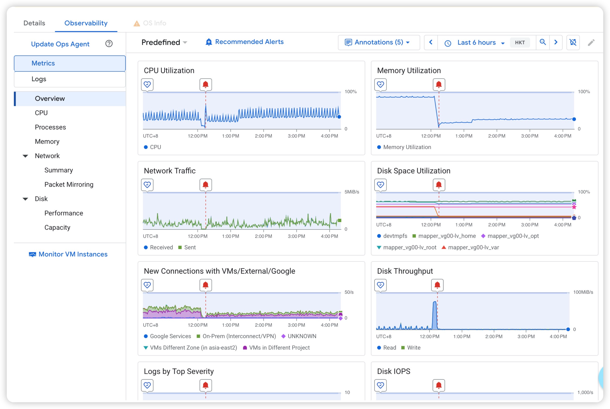

# Summary

- explorer

```bash
(1) 查找并定义谷歌计算引擎（GCE）的托管实例组（MIG）和单个虚拟机实例（Instance）的核心概念，为理解监控指标提供必要的背景知识。
(2) 针对托管实例组（MIG），研究用户列出的每一项性能指标，包括：
(a) 自动扩缩器利用率（Autoscaler utilization）：解释其如何基于CPU利用率来管理实例组的容量和实际利用情况。
(b) CPU利用率（CPU utilization）：定义实例组的“平均利用率”是如何聚合计算的。
(c) 磁盘I/O（字节与操作）：解释整个组的平均读/写吞吐量和IOPS。
(d) 网络流量（字节与数据包）：解释整个组的平均传入/传出吞吐量和数据包速率。
(3) 针对单个虚拟机实例（Instance），研究与MIG相对应的同一系列性能指标，并阐明它们在单个计算单元上的具体含义。
(4) 分析每个指标的性能意义，解释其数值高低对于运行Nginx L7负载的应用可能意味着什么，例如计算瓶颈、存储限制或网络饱和等。
(5) 综合所有收集到的信息，创建两个独立的Markdown表格，一个用于MIG，另一个用于单个实例。
(6) 在表格中，为每个指标提供“指标名称”、“详细解释”和“性能影响解读”等列，并用清晰的语言填充内容，确保解释的准确性和实用性。
```

- 

# Gemini

# GCE Nginx L7 性能监控深度解析：从单一实例到托管实例组的专家指南

## 第一部分：性能监控的战略框架

### 1.1 导论：超越阈值监控

在现代云原生架构中，对 Nginx L7 这类关键应用进行性能监控，其意义已远超传统基于静态阈值的被动告警模式（例如，当 CPU 利用率超过 90%时发送警报）。一种更先进、更具前瞻性的监控哲学，是将系统视为一个动态的、相互关联的整体。这种理念要求我们从被动响应转向主动分析，其核心目标在于理解系统行为、预测潜在瓶颈，并最终保障服务的可靠性与用户体验。

为了构建这一分析框架，可以借鉴 Google SRE 团队提出的“四个黄金信号”（Four Golden Signals）理论：延迟（Latency）、流量（Traffic）、错误（Errors）和饱和度（Saturation）。您所关注的四个核心指标领域可以精确地映射到这个理论框架中：

- **饱和度 (Saturation):** 这是衡量服务资源压力最直接的指标，描述了系统“有多满”。**CPU 利用率**、**磁盘 I/O** 和 **网络流量** 都是饱和度的关键体现。监控饱和度旨在回答：“我们的系统还能承受多大的负载？”
- **流量 (Traffic):** 这是衡量服务需求高低的指标。对于托管实例组（MIG），**自动扩缩器利用率** 本质上是系统为响应流量（Traffic）变化而采取的自动化调节能力的量化体现。

本报告将基于此框架，深入剖析每一项指标，并阐明它们之间的内在联系。

### 1.2 监控哲学的二元性：静态资产 vs. 动态集群

在 Google Cloud Engine (GCE) 环境中，单一实例（Standalone Instance）和托管实例组（Managed Instance Groups, MIG）代表了两种截然不同的部署与运维哲学，因此它们的监控策略也应有所区别。

- 单一实例：视为“宠物 (Pet)”
    一个独立的虚拟机实例，如同一个精心照料的宠物。它的身份是唯一的，不可轻易替代。因此，对其监控的重点在于保障其个体健康、性能极限和长期稳定性。分析的目标是最大化这一个点的性能和可靠性，任何异常都需要被精确诊断和修复。我们会深入到该实例的内核层面，分析 CPU 的每一种状态、磁盘的每一次操作。
- 托管实例组：视为“牛群 (Cattle)”
    一个 MIG 中的实例群，则更像是一个庞大的牛群。群体中的每个个体都是同质化且可替代的。如果一个实例出现问题，最有效的处理方式往往是替换它，而不是修复它。因此，监控的重点从个体健康转向群体行为的健康、伸缩策略的有效性以及整体服务的可用性。分析的目标是确保整个集群能够作为一个整体，高效、经济地承载业务流量，而非纠结于某一个别实例的瞬时波动。

这一“宠物”与“牛群”的理念差异，是理解和实施有效监控策略的根本出发点，并将贯穿本报告的后续所有分析。

## 第二部分：单一实例（Standalone Instance）的性能剖析

本部分将聚焦于构成计算基础的单个虚拟机，为其建立一个精确、多维度的性能画像。对于“宠物”般的单一实例，任何性能的细微抖动都值得深入探究。

### 2.1 CPU 利用率：工作负载的核心引擎

CPU 是执行 Nginx 工作负载的核心计算单元。然而，简单地观察一个总的 CPU 利用率指标（如 `compute.googleapis.com/instance/cpu/utilization`）往往会掩盖问题的本质。一个看似“健康”的 CPU 利用率背后，可能隐藏着严重的性能瓶颈。要进行深度诊断，必须将 CPU 时间进行细粒度的拆解。

通过安装并使用 Cloud Monitoring Agent，可以获取到更深层次的 CPU 指标 `agent.googleapis.com/cpu/utilization`，该指标通过 `state` 标签提供了对 CPU 时间构成的详细视图。对于 Nginx L7 服务，以下几种状态尤为关键：

- **`user` (用户态时间):** 这部分 CPU 时间主要消耗在执行 Nginx worker 进程的用户空间代码上。具体活动包括处理 HTTP 请求、执行 Gzip 压缩、运行嵌入的 Lua 脚本或处理 SSL/TLS 握手（软件加密部分）。高 `user` 时间通常直接与业务逻辑的复杂度和请求处理量成正比。
- **`system` (内核态时间):** 这部分时间用于执行内核代码以响应 Nginx 进程的系统调用。主要活动包括网络套接字（socket）的读写、磁盘文件的读写、进程调度等。高吞吐量的 Nginx 服务通常会伴随着显著的 `system` 时间占比。
- **`iowait` (I/O 等待时间):** 这是 CPU 因等待磁盘 I/O 操作（如读或写）完成而处于空闲状态的时间。**`iowait` 是诊断磁盘性能瓶颈最直接、最明确的信号**。如果 Nginx 配置了同步写入访问日志，而底层磁盘性能不足，`iowait` 将会飙升，直接阻塞 Nginx worker 进程，导致请求处理能力下降和延迟增加。
- **`softirq` (软中断时间):** 对于网络密集型应用如 Nginx，**`softirq` 是一个至关重要但常常被忽视的性能指标**。网络数据包的接收和发送由硬件中断触发，但大量后续处理工作（如将数据包从驱动程序缓冲区复制到内核协议栈）是在一种名为“软中断”的机制中完成的。当网络流量，特别是每秒数据包数（Packets Per Second, PPS）极高时，内核需要花费大量的 CPU 时间来处理这些软中断。

一个典型的性能陷阱是：系统总 CPU 利用率可能只有 60%，看似远未饱和。但如果通过分解发现，其中 40% 的时间都消耗在了 `softirq` 上，那么留给 `user` 空间执行 Nginx 业务逻辑的 CPU 时间就非常有限了。这会导致 Nginx 无法及时处理新请求，表现为高延迟和连接拒绝，尽管宏观 CPU 指标看起来“正常”。因此，将 `softirq` 利用率与网络 PPS 指标进行关联分析，是发现此类“CPU 伪空闲”瓶颈的关键。

此外，GCE 提供的不同机器系列对 CPU 性能有显著影响。例如，计算优化型（C-series）的 C2 实例提供最高的单核性能，非常适合 CPU 密集型的 Nginx 任务（如大量 SSL 计算或复杂重写规则）。通用型（N-series）的 N2 实例则在性能和成本之间提供了良好的平衡。选择与工作负载特征相匹配的机器系列是性能优化的第一步。

下表总结了用于深度分析 Nginx CPU 性能的关键指标。

**表 1：关键 CPU 指标详解**

| 参数/指标名称 (Metric Name)                              | 描述 (Description)                                                    | 单位 (Unit)     | 对 Nginx 的解读与重要性 (Interpretation & Significance for Nginx)                                                                        |
| -------------------------------------------------------- | --------------------------------------------------------------------- | --------------- | ---------------------------------------------------------------------------------------------------------------------------------------- |
| `compute.googleapis.com/instance/cpu/utilization`        | 由 GCE Hypervisor 提供的标准化 CPU 利用率，其值为 0 到 1 之间的小数。 | 比例 (Fraction) | 宏观饱和度指标。适合用于高层仪表盘展示、基础告警和自动扩缩容策略的触发信号。                                                             |
| `agent.googleapis.com/cpu/utilization` (state="user")    | CPU 用于执行用户空间进程的时间占比。                                  | 百分比 (%)      | 直接反映 Nginx worker 进程执行业务逻辑（如 Gzip 压缩、Lua 脚本）的繁忙程度。此值过高表明应用层逻辑是瓶颈。                               |
| `agent.googleapis.com/cpu/utilization` (state="system")  | CPU 用于执行内核空间代码的时间占比。                                  | 百分比 (%)      | 反映系统调用开销，主要与网络和文件 I/O 相关。高网络吞吐量会自然推高此值。                                                                |
| `agent.googleapis.com/cpu/utilization` (state="iowait")  | CPU 因等待块设备（磁盘）I/O 而空闲的时间占比。                        | 百分比 (%)      | **磁盘瓶颈的明确信号**。直接关联到 Nginx 日志写入或从磁盘缓存读取文件的性能。持续的 `iowait` 会严重影响请求延迟。                        |
| `agent.googleapis.com/cpu/utilization` (state="softirq") | CPU 用于处理软中断（特别是网络数据包）的时间占比。                    | 百分比 (%)      | **网络性能瓶颈的核心诊断指标**。高 PPS（每秒数据包数）会直接导致此值飙升，是诊断网络处理能力饱和的先行指标，其影响甚至先于网络带宽饱和。 |

### 2.2 磁盘 I/O：沉默的性能杀手

磁盘 I/O 常常是 Web 服务器中一个被低估的性能瓶颈。对于 Nginx 而言，其对磁盘的依赖主要体现在两个方面：作为静态文件服务器或缓存服务器时的文件读取，以及记录访问日志和错误日志时的文件写入。监控磁盘性能需要区分两个维度：吞吐量（Bytes/s）和每秒操作数（IOPS）。

- **吞吐量 (Throughput):** 由 `read_bytes_count` 和 `write_bytes_count` 指标体现。当 Nginx 用于分发大文件（如视频流、软件安装包、ISO 镜像）时，磁盘的顺序读取吞吐量是关键瓶颈。
- **操作数 (IOPS):** 由 `read_ops_count` 和 `write_ops_count` 指标体现。当 Nginx 处理大量短小请求，并且为每个请求记录访问日志时，磁盘的写入 IOPS 成为决定性因素。

**Nginx 日志是导致磁盘 I/O 瓶颈最常见的元凶**。其背后的因果关系链条非常清晰：

1. 在默认配置下（`access_log /path/to/log main;`），Nginx 会对每一个接收到的请求进行一次同步或接近同步的磁盘写入操作。
2. 在一个高流量的网站上，例如 QPS (Queries Per Second) 达到 10,000，这意味着磁盘系统需要承受接近每秒 10,000 次的写入操作（Write IOPS）。
3. Google Cloud 的标准永久性磁盘（`pd-standard`）是基于 HDD 的，其 IOPS 性能非常有限，通常每 GB 容量仅提供 0.75 次写入 IOPS，远不能满足高 QPS 场景的需求。
4. 一旦请求的写入 IOPS 超过磁盘的处理上限，写操作就会被阻塞。由于 Nginx worker 进程需要等待写日志操作完成才能处理下一个请求，这将导致进程被挂起，无法接收新连接，最终体现为请求处理延迟急剧上升，甚至出现请求超时或丢失。

因此，选择合适的持久化磁盘（Persistent Disk）类型至关重要。对于需要高频写入日志或用作缓存的 Nginx 服务器，**SSD 永久性磁盘（`pd-ssd`）是必然选择**，因为它能提供远高于标准磁盘的 IOPS 性能。一个更具成本效益的优化是在 Nginx 配置中为 `access_log` 指令启用缓冲区（例如 `buffer=32k`）。这使得 Nginx 先将日志写入内存缓冲区，待缓冲区满或满足特定条件后再一次性批量写入磁盘，从而将大量随机的小写入合并为较少次数的顺序大写入，极大缓解了对磁盘 IOPS 的压力。在极端情况下，如果访问日志不是强需求，直接关闭 (`access_log off;`) 是最立竿见影的性能提升手段。

**表 2：关键磁盘 I/O 指标详解**

| 参数/指标名称 (Metric Name)                              | 描述 (Description)                         | 单位 (Unit)    | 对 Nginx 的解读与重要性 (Interpretation & Significance for Nginx)                                                  |
| -------------------------------------------------------- | ------------------------------------------ | -------------- | ------------------------------------------------------------------------------------------------------------------ |
| `compute.googleapis.com/instance/disk/read_bytes_count`  | 从磁盘读取的字节总数，通常以速率形式观察。 | Bytes/s        | 衡量 Nginx 作为静态文件服务器或反向缓存时，从磁盘提供服务的吞吐能力。需对照磁盘类型的吞吐量上限进行分析。          |
| `compute.googleapis.com/instance/disk/write_bytes_count` | 写入磁盘的字节总数，通常以速率形式观察。   | Bytes/s        | 主要反映日志写入的吞吐量。通常与写入 IOPS 一起分析，以判断是写入数据量大还是写入频率高。                           |
| `compute.googleapis.com/instance/disk/read_ops_count`    | 磁盘读取操作的次数，通常以速率形式观察。   | Count/s (IOPS) | 衡量 Nginx 读取缓存文件或静态文件的频率。对于大量小文件的场景，此指标比吞吐量更重要。                              |
| `compute.googleapis.com/instance/disk/write_ops_count`   | 磁盘写入操作的次数，通常以速率形式观察。   | Count/s (IOPS) | **Nginx 日志性能的关键诊断指标**。高 QPS 会直接转化为高写入 IOPS。此指标接近磁盘上限是服务延迟上升的强烈预警信号。 |

### 2.3 网络流量：数据流动的生命线

网络是 Nginx 作为 L7 代理的生命线。与磁盘 I/O 类似，网络性能的监控也需要从字节数（带宽）和数据包数（PPS）两个维度进行。

- **字节数 (Bytes):** 由 `received_bytes_count` 和 `sent_bytes_count` 指标体现。这通常被称为带宽利用率，反映了数据传输的总量。对于提供大文件下载、视频流或高清图片的 Nginx 服务，出口带宽（`sent_bytes_count`）是主要瓶颈。需要密切关注该指标是否接近 GCE 实例类型所规定的出口带宽上限。
- **数据包数 (Packets):** 由 `received_packets_count` 和 `sent_packets_count` 指标体现。这通常被称为 PPS (Packets Per Second)，反映了网络交互的频率。对于作为 API 网关、微服务入口或处理大量短连接（如心跳、轮询）的 Nginx 服务，PPS 是一个比带宽更为关键的指标。

**PPS 是一个比带宽更隐蔽、也更危险的性能瓶颈**。其根本原因在于，处理每一个网络数据包（无论大小）都需要消耗一定的 CPU 资源，这部分开销主要体现在前文所述的 `softirq` 上。一个处理大量小尺寸 API 请求的 Nginx 服务器，其网络带宽可能非常低（例如只有几十 Mbps），但其 PPS 可能极高（数十万甚至上百万）。在这种情况下，系统很可能在远未达到 GCE 实例的带宽上限时，就因为 PPS 过高而耗尽了 CPU 处理网络数据包的能力（即 `softirq` 占用率达到 100%），导致内核开始随机丢弃数据包（drop packets），从而引发严重的延迟抖动和请求失败。

因此，对 Nginx 服务器的监控，必须将网络 PPS 指标与 CPU `softirq` 指标并列分析。当发现 `softirq` 异常升高时，应立即检查 PPS 指标，以确认瓶颈是否源于网络数据包处理压力。

此外，通过观察 `received_bytes_count` 和 `sent_bytes_count` 的比例，可以快速判断 Nginx 的工作模式。如果 `sent` 远大于 `received`，它很可能主要扮演内容分发服务器的角色。如果两者大致相当，它可能在执行更复杂的反向代理、API 网关或负载均衡任务。

**表 3：关键网络流量指标详解**

| 参数/指标名称 (Metric Name)                                      | 描述 (Description)                               | 单位 (Unit)     | 对 Nginx 的解读与重要性 (Interpretation & Significance for Nginx)                                                  |
| ---------------------------------------------------------------- | ------------------------------------------------ | --------------- | ------------------------------------------------------------------------------------------------------------------ |
| `compute.googleapis.com/instance/network/sent_bytes_count`       | 从实例网络接口发送的字节总数，通常以速率观察。   | Bytes/s         | 衡量 Nginx 对外提供服务的总带宽。需对照 GCE 实例类型的出口带宽上限 进行容量规划和瓶颈分析。                        |
| `compute.googleapis.com/instance/network/received_bytes_count`   | 实例网络接口接收的字节总数，通常以速率观察。     | Bytes/s         | 衡量 Nginx 从客户端或上游服务接收数据的带宽。对于反向代理，此值与 `sent_bytes_count` 共同反映了流量特征。          |
| `compute.googleapis.com/instance/network/sent_packets_count`     | 从实例网络接口发送的数据包总数，通常以速率观察。 | Packets/s (PPS) | **API 网关和小请求处理场景下的核心性能指标**。高 PPS 会直接增加 CPU `softirq` 负载，是网络处理能力饱和的先行指标。 |
| `compute.googleapis.com/instance/network/received_packets_count` | 实例网络接口接收的数据包总数，通常以速率观察。   | Packets/s (PPS) | 同上，反映了入口请求的频率。在遭受 DDoS 攻击（如 SYN Flood）时，此指标会异常飙升。                                 |

## 第三部分：托管实例组（MIG）的动态监控与治理

当部署模式从单一实例转向托管实例组（MIG），监控的焦点也必须从微观的个体健康转向宏观的集群治理。在这里，我们关注的不再是“这台服务器怎么样了？”，而是“整个服务集群是否健康？我们的自动化策略是否有效？”

### 3.1 自动扩缩容的艺术：目标与现实

MIG 的核心价值在于其自动扩缩容（Autoscaling）能力，它能根据负载动态调整实例数量，以在保障服务可用性的同时优化成本。监控自动扩缩容行为的关键指标是 `autoscaler/instance_group/utilization`。

这个指标的计算方式是：

Utilization=Target ValueActual Measured Value​

其中，“Actual Measured Value”是当前从实例组中采集到的指标的平均值（例如，平均 CPU 利用率），而“Target Value”是您在自动扩缩容策略中设定的目标值（例如，目标 CPU 利用率为 60%）。

理解此指标的关键在于，它是一个**控制平面 (Control Plane) 的指标**，而非数据平面 (Data Plane) 的性能指标。它反映的不是实例的真实性能，而是**扩缩容决策的“输入信号强度”**。

- 当 `utilization` **持续大于 1.0** 时，意味着当前负载已超过目标设定，自动扩缩容器将触发**扩容（Scale Out）**决策，增加实例数量。
- 当 `utilization` **持续小于 1.0** 时，意味着当前资源存在冗余，自动扩缩容器将触发**缩容（Scale In）**决策，减少实例数量。
- 当 `utilization` **在 1.0 附近平稳波动**时，表明系统已达到或接近理想的平衡状态。

一个健康的自动扩缩容系统，其 `utilization` 指标不应长期显著偏离 1.0。对该指标的时间序列图进行分析，可以诊断扩缩容策略的健康度：

- **延迟 (Lag):** 从 `utilization` 超过 1.0 到新实例成功创建并开始处理流量，存在一个固有的时间延迟。如果流量增长非常迅速，可能会看到 `utilization` 持续高于 1.0 一段时间，这表明扩容速度跟不上流量增长。
- **抖动 (Thrashing):** 如果 `utilization` 指标在 1.0 上下剧烈、频繁地穿越，同时伴随着实例数量的反复增减，这通常被称为“抖动”。它可能由不合理的冷却期（`coolDownPeriodSec`）设置导致。冷却期定义了一次扩缩容活动后，系统需要等待多长时间才能进行下一次活动，以防止对短暂的指标波动做出过度反应。
- **过早缩容:** 如果在流量低谷后，`utilization` 刚刚降到 1.0 以下，实例就被迅速缩容，而紧接着流量回升又导致紧急扩容，这可能是稳定期（`stabilizationPeriodSec`）设置过短。稳定期要求指标持续低于目标一段时间后，才做出缩容决策，以避免对短暂的流量波动做出误判。

因此，监控 `autoscaler/instance_group/utilization` 的目的，不是看实例的 CPU 忙不忙，而是为了**评估和优化自动扩缩容策略本身是否健康、高效和经济**。

**表 4：自动扩缩器关键指标详解**

| 参数/指标名称 (Metric Name)                  | 描述 (Description)                                              | 单位 (Unit)     | 解读与治理策略 (Interpretation & Governance Strategy)                                                                                                                    |
| -------------------------------------------- | --------------------------------------------------------------- | --------------- | ------------------------------------------------------------------------------------------------------------------------------------------------------------------------ |
| `autoscaler/instance_group/utilization`      | 实例组当前观测到的指标值与扩缩容策略中设定的目标值的比率。      | 比例 (Fraction) | **核心决策信号**。持续 > 1.1 可能表示扩容速度跟不上流量增长或目标值设置过低；持续 < 0.9 可能表示缩容过于保守或目标值设置过高；剧烈震荡表示冷却期或稳定期等策略需要调整。 |
| `autoscaler/instance_group/num_instances`    | 实例组中当前处于 `RUNNING` 状态的实例总数量。                   | 整数 (Count)    | **扩缩容行为的直接结果**。将此指标与 `utilization` 指标叠加在同一图表中分析，可以直观地验证扩缩容决策是否被正确执行，以及执行的延迟情况。                                |
| `autoscaler/instance_group/recommended_size` | 自动扩缩容器根据当前 `utilization` 计算后，建议的理想实例数量。 | 整数 (Count)    | **扩缩容器的“意图”**。当 `recommended_size` 与 `num_instances` 不一致时，通常表示正在进行扩缩容操作，或者扩缩容请求受到了 `maxReplicas` 或 `minReplicas` 限制。          |

### 3.2 从个体到群体：聚合指标解读

在 MIG 环境中，我们通常首先关注聚合指标，例如整个实例组的平均 CPU 利用率、P95 响应延迟等。这提供了一个快速了解集群整体健康状况的宏观视图。

然而，**平均值会掩盖个体问题**。一个性能低下的“慢”实例或一个完全故障的实例，其负面影响可能被大量健康实例的良好数据所稀释，导致平均值看起来依然正常。这正是“牛群”监控理念中需要警惕的陷阱。

因此，一套成熟的 MIG 监控与诊断策略应采用**“自顶向下，逐层下钻 (Top-down, Drill-down)”** 的方法：

1. **Top-down (自顶向下):** 从聚合指标（如平均值、P95、P99）开始监控。当发现聚合指标出现异常（例如，整个 MIG 的平均 CPU 利用率上升）时，触发告警或进行调查。
2. **Drill-down (逐层下钻):** 一旦发现宏观异常，立即利用 Cloud Monitoring 的分组（Group By）功能，按 `instance_id` 或 `zone` 等维度对指标进行拆分。这样可以迅速定位到是哪个或哪些具体的实例导致了整体指标的恶化，即找到“害群之马”。

为了实现有效的下钻分析，必须确保所有从实例收集的指标和日志都包含了可用于识别个体的标签，如 `instance_id` 和 `zone`。只有这样，才能在庞大的“牛群”中，快速隔离并处理有问题的个体。

## 第四部分：综合诊断与优化策略

孤立地看任何一个指标都可能得出片面的结论。真正的专家级诊断在于将所有相关指标联系起来，构建一个完整的性能画像，并基于此进行系统性优化。

### 4.1 关联性分析：构建完整的性能画像

以下通过两个典型的 Nginx 性能问题案例，展示如何通过关联不同维度的指标进行根本原因分析。

#### 案例研究 1：日志引发的“静默风暴”

- **现象:** 应用层监控系统报告，Nginx 服务的 P99 响应延迟在流量高峰期无预兆地急剧上升。然而，Cloud Monitoring 仪表盘上，MIG 的平均 CPU 利用率却维持在 60% 左右的健康水平。
- **诊断路径:**
    1. **初步怀疑与排查:** 平均 CPU 利用率正常，排除了计算能力饱和的普遍性问题。开始怀疑是 I/O 瓶颈或某个别实例的问题。
    2. **下钻分析:** 将 CPU 利用率指标按 `instance_id` 分组，并分解 CPU 时间状态。发现有几个实例的总 CPU 利用率虽然不高，但其 `agent.googleapis.com/cpu/utilization` 指标中 `state="iowait"` 的部分占比异常地高（例如达到 30-40%）。
    3. **关联磁盘指标:** 针对这些高 `iowait` 的实例，检查其磁盘 I/O 指标。发现 `instance/disk/write_ops_count` 指标非常高，已经触及或非常接近其所使用的 `pd-standard` 磁盘的 IOPS 上限。
    4. **追溯应用配置:** 检查部署在实例上的 Nginx 配置文件，确认 `access_log` 指令处于开启状态，并且没有配置 `buffer` 参数。
    5. **结论:** 问题根源被定位。高 QPS 导致了海量的日志写入请求，这些请求耗尽了标准磁盘的写入 IOPS 能力。磁盘写入的阻塞导致 Nginx worker 进程被挂起，无法处理新的客户端请求，从而引发了应用层可观测到的高延迟。这是一个典型的、由磁盘 I/O 瓶颈引发的“静默风暴”，因为它在宏观 CPU 指标上几乎不可见。

#### 案例研究 2：小包攻击下的 CPU 耗尽

- **现象:** 运维团队收到告警，MIG 正在基于 CPU 利用率策略进行紧急扩容。然而，查看网络监控仪表盘时，发现实例组的总出口带宽 `sent_bytes_count` 利用率极低，远未达到带宽上限。
- **诊断路径:**
    1. **初步怀疑与排查:** 带宽使用率低排除了大流量攻击。CPU 利用率高但带宽低，这是一个反常的信号，指向了 CPU 消耗在了非数据传输的任务上。
    2. **分解 CPU 指标:** 查看实例的 CPU 时间分解图，发现 `agent.googleapis.com/cpu/utilization` 指标中 `state="softirq"` 的部分占比极高，甚至超过了 `user` 和 `system` 时间的总和。
    3. **关联网络指标:** 检查网络数据包指标。发现 `instance/network/received_packets_count` 和 `sent_packets_count` 指标达到了历史峰值，比正常时期高出数个数量级。
    4. **结论:** 根本原因清晰。服务正遭受大量小数据包的网络冲击（可能是低速率的 DDoS 攻击，如 UDP/TCP Flood，或由配置错误的客户端引发）。处理海量数据包的开销（`softirq`）耗尽了 CPU 资源，导致 Nginx worker 进程无法获得足够的 CPU 时间来处理正常业务，从而触发了基于 CPU 的扩容。这是一个典型的 PPS 瓶颈案例，证明了监控 PPS 和 `softirq` 的重要性。

### 4.2 优化建议：从响应式到预测式

基于以上分析，可以从应用、系统和基础设施三个层面进行综合优化。

- **Nginx 应用调优:**
    - **日志管理:** 为 `access_log` 启用 `buffer` 和 `flush` 参数，或将日志推送到专门的日志收集服务，避免本地磁盘写入瓶颈。
    - **工作进程调优:** 合理设置 `worker_processes` (通常设为 CPU 核心数) 和 `worker_connections` (单个 worker 进程能处理的最大连接数)。
    - **连接管理:** 调整 `keepalive_timeout` 和 `keepalive_requests`，在长连接带来的性能优势和资源占用之间取得平衡。
- **操作系统内核调优 (`sysctl`):**
    - 针对高并发连接场景，调高内核参数，如 `net.core.somaxconn` (TCP 监听队列长度) 和 `net.ipv4.tcp_max_syn_backlog` (SYN 半连接队列长度)。
    - 启用 `net.ipv4.tcp_tw_reuse`，允许快速重用处于 `TIME_WAIT` 状态的套接字，以应对大量短连接。
- **GCE 基础设施优化:**
    - **实例与磁盘选型:** 根据工作负载特征选择最合适的机器类型（如为 CPU 密集型任务选择 C2）和磁盘类型（为高 IOPS 需求选择 `pd-ssd`）。
    - **自动扩缩容策略调优:** 基于历史负载数据，反复调整自动扩缩容的目标值、冷却期和稳定期，使其与业务流量模式相匹配，避免抖动和延迟。
    - **采用预测性扩缩容:** 对于具有明显周期性（如工作日白天流量高，夜间低）的业务，应配置**计划性扩缩容 (Scheduled Autoscaling)**。在预期流量高峰到来之前，提前增加实例数量，变被动的响应式扩容为主动的预测式扩容，从而消除扩容延迟，确保高峰期服务的平滑和稳定。


# Enhance instance nginx

这是一个非常经典的问题，答案是：**“这取决于具体情况”**。为一台配置为 1vCPU 和 8GB 内存的 Nginx L7 转发服务器提供一个精确的每秒请求数（RPS）指标是极其困难的，因为最终的性能表现受到多个相互关联的变量的严重影响。

不过，基于您的配置和行业内的基准测试，我们可以给出一个合理的预估范围，并深入探讨决定性能上限的关键因素。对于一个纯粹作为 API 网关、处理简单转发和 SSL 卸载的单核 Nginx 实例，其性能范围可能在 **每秒几百到几千个请求** 之间。

- 如果后端 API 响应迅速（例如，<50ms），并且启用了所有优化，您可能会看到数千 RPS 1。
    
- 然而，由于您的配置中包含了 SSL/TLS 的“再加密”（即 `proxy_pass` 到一个 `https://` 地址），这将显著增加 CPU 负载，可能会将性能拉低到数百 RPS 的水平，尤其是在有大量新建连接时 3。
    

真正的价值不在于一个模糊的数字，而在于理解哪些因素正在消耗您唯一的那个 CPU 核心的宝贵资源，以及如何优化它们。下面，我们将结合您的配置文件，对这些关键因素进行详细分析。

### 决定 Nginx 性能上限的四大核心因素

#### 1. CPU 与 SSL/TLS 处理（最大的性能瓶颈）

对于一个单核实例来说，CPU 是最宝贵的资源。在您的场景中，CPU 的主要工作是处理网络连接和执行 SSL/TLS 加密/解密。

- **SSL 终止与再加密**：您的配置 `listen 443 ssl;` 意味着 Nginx 需要解密来自客户端的传入流量（SSL 终止）。紧接着，`proxy_pass https://10.98.0.188:8081/;` 指令又要求 Nginx 重新加密流量，并与后端服务器建立一个新的 SSL 连接。这个“解密再加密”的过程，使得每一次请求的 SSL 计算成本**增加了一倍**。这是您当前配置中最大的性能消耗点。
    
- **SSL 握手**：每个新的 HTTPS 连接都需要一次完整的 SSL 握手，这是一个非常消耗 CPU 的过程。后续的请求可以通过会话复用（Session Resumption）来避免这次握手，从而大幅提升性能。
    

**优化建议：**

- **（最重要）避免再加密**：如果您的 Nginx 实例和后端 API 服务器（`10.98.0.188`）位于一个安全的私有网络中（例如，同一个 VPC 内），强烈建议将 `proxy_pass` 指向后端的 HTTP 端口，而非 HTTPS 端口。这将消除一半的 SSL 计算开销，是提升性能最有效的方法。
    
- **启用 SSL 会话缓存**：您的配置中缺少 `ssl_session_cache` 指令。没有它，Nginx 无法有效缓存 SSL 会话，导致更多代价高昂的完整握手。请在 `http` 块中添加此配置 4：
    
    Nginx
    
    ```
    http {
        #... 其他配置...
        ssl_session_cache shared:SSL:10m; # 10MB 缓存大约可存储 40,000 个会话
        ssl_session_timeout 1h;
        #... 其他配置...
    }
    ```
    
    `ssl_session_cache` 通过在服务器端缓存会话信息来减少握手开销，而 `ssl_session_tickets`（默认为 on）则是将加密的会话信息存储在客户端 5。启用
    
    `ssl_session_cache` 是标准的高性能实践。
    

#### 2. 上游（后端）连接管理

Nginx 如何与您的后端 API 通信，对其自身的性能和吞吐量有直接影响。

- **连接复用**：默认情况下，Nginx 可能为每个代理请求都与后端建立一个新的 TCP 连接。在高流量下，频繁地创建和销毁连接（特别是昂贵的 SSL 连接）会带来巨大的开销。
    
- **后端延迟**：Nginx 的速度受限于它所代理的后端服务的响应速度。如果后端 API 响应缓慢，Nginx 的 `worker_connections` 将被长时间占用，等待响应，从而无法处理新的传入请求。
    

**优化建议：**

- **启用上游 Keepalive**：为了复用与后端服务器的连接，您应该使用 `upstream` 块，并启用 `keepalive`。这会为到后端服务器的连接维护一个连接池，极大地减少延迟和资源消耗 8。
    
    修改您的配置如下：
    
    Nginx
    
    ```
    http {
        #...
        upstream api_backend_1 {
            server 10.98.0.188:8081;
            keepalive 32; # 每个 worker 进程缓存的到上游的空闲连接数
        }
    
        server {
            #...
            location /api_name1_version/v1/ {
                proxy_pass https://api_backend_1; # 指向 upstream 块
                proxy_http_version 1.1;
                proxy_set_header Connection "";
                proxy_set_header Host www.aibang.com;
                proxy_set_header X-Real-IP $remote_addr;
            }
            #...
        }
        #...
    }
    ```
    
    注意，启用 `proxy_keepalive` 需要将 `proxy_http_version` 设置为 `1.1`，并将 `Connection` 头设置为空字符串 10。
    

#### 3. 日志记录

日志记录虽然对于调试和监控至关重要，但它也是一项 I/O 操作，在高并发下可能成为瓶颈 11。

- **同步写入**：您的配置 `access_log /appvol/nginx/logs/access.log correlation;` 会为每个请求向磁盘写入一条日志。在高 RPS 下，这意味着大量的磁盘 I/O 操作，可能会导致 CPU 出现 `iowait`，从而阻塞 Nginx worker 进程。
    

**优化建议：**

- **启用访问日志缓冲**：通过添加 `buffer` 参数，可以让 Nginx 先将日志写入内存缓冲区，然后批量写入磁盘，从而显著降低 I/O 压力 13。
    
    Nginx
    
    ```
    access_log /appvol/nginx/logs/access.log correlation buffer=32k;
    ```
    

#### 4. Worker 配置

您的 `worker_processes` 和 `worker_connections` 配置是性能的基础。

- `worker_processes 1;`: 对于单核 CPU 是正确的设置，这避免了不必要的进程间上下文切换开销 14。
    
- `worker_connections 1024;`: 这意味着您的单个 worker 进程最多可以处理 1024 个连接。由于作为反向代理时，每个客户端请求会占用两个连接（客户端到 Nginx，Nginx 到后端），因此理论上您的服务器可以同时处理 `1024 / 2 = 512` 个并发客户端请求 9。这个值通常足够，但如果您的 API 响应时间很长，可能需要根据
    
    `ulimit -n` 的值适当调高。
    

### 结论与行动指南

要确定您的 Nginx 实例的真实容量，**唯一的可靠方法是进行压力测试** 4。使用

`wrk` 或 `ab` 等工具，模拟您的真实 API 请求流量，并监控 CPU 利用率、延迟和 RPS。

在进行测试之前，强烈建议您实施以下**三大优化**，它们将对性能产生最显著的提升：

1. **启用 SSL 会话缓存**：在 `http` 块中添加 `ssl_session_cache shared:SSL:10m;`。
    
2. **启用上游 Keepalive**：使用 `upstream` 块并配置 `keepalive` 指令。
    
3. **（如果网络安全允许）消除向上游的再加密**：将 `proxy_pass` 的目标从 `https://...` 改为 `http://...`。
    

通过实施这些优化并进行基准测试，您将能够准确地了解您的 Nginx 实例在特定工作负载下的真实性能上限，并为其找到最佳配置。