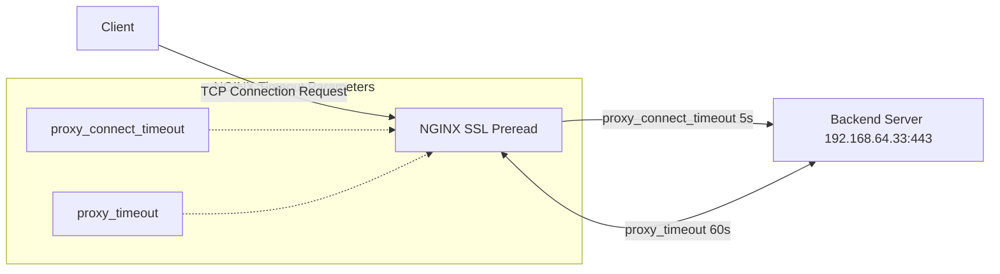
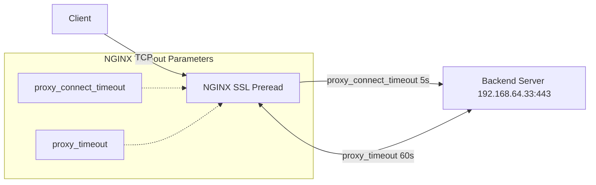

- [nginx l4 status](#nginx-l4-status)
- [Claude](#claude)
  - [chinese](#chinese)
    - [proxy\_connect\_timeout 的作用](#proxy_connect_timeout-的作用)
    - [问题分析](#问题分析)
    - [相关超时参数](#相关超时参数)
    - [建议配置](#建议配置)
    - [流量流向图](#流量流向图)
    - [问题排查建议](#问题排查建议)
  - [English](#english)
    - [Purpose of proxy\_connect\_timeout](#purpose-of-proxy_connect_timeout)
    - [Problem Analysis](#problem-analysis)
    - [Related Timeout Parameters](#related-timeout-parameters)
    - [Recommended Configuration](#recommended-configuration)
- [Gemini 2.5](#gemini-25)
  - [chinese](#chinese-1)
- [English Translation](#english-translation)

# nginx l4 status 
```nginx.conf
user nxadm nxgrp;
worker_processes 1;
#error_log logs/error.log;
#error_log logs/error.log notice;
#error_log logs/error.log info;
error_log /appvol/nginx/logs/error.log info;
#pid logs/nginx.pid;
events {
    worker_connections 1024;
}
stream {
    log_format basic '$remote_addr [$time_local] '
                    '$protocol $status $bytes_sent $bytes_received '
                    "$session_time $ssl_preread_server_name $server_port";
    include /etc/nginx/conf.d/*.conf;
}
```

conf.d 下

```bash
 server {
   listen 8081;
   ssl_preread on;
   proxy_connect_timeout 5s;
   proxy_pass 192.168.64.33:443;
 }
```
我这如果是一个nginx的4层服务的配置,那么我想了解这个proxy_connect_timeout 5s的配置是否还有意义? 因为我们发现好像有这个组件proxy_pass到后段192.168.64.33:443的超时出现? 所以我想了解类似这些参数是否有意义? proxy_connect_timeout 30s; proxy_read_timeout 120s; proxy_send_timeout 60s;

# Claude

## chinese
`proxy_connect_timeout 5s` 在您的 NGINX stream 模块配置中确实是有意义的，但需要理解其适用范围和局限性。

### proxy_connect_timeout 的作用

在 stream 模块中，`proxy_connect_timeout` 参数控制 NGINX 与上游服务器建立 TCP 连接的超时时间。如果在指定时间内无法建立连接（即完成 TCP 三次握手），则 NGINX 会放弃连接尝试并返回错误。

### 问题分析

如果您遇到连接到后端 192.168.64.33:443 的超时问题，可能有以下几个原因：

1. **连接建立超时**：如果 5 秒内无法完成 TCP 握手，就会触发 `proxy_connect_timeout`
2. **数据传输超时**：在 stream 模块中，没有配置数据传输超时时间

### 相关超时参数

在 stream 模块中，可用的超时参数有：

- `proxy_connect_timeout`：建立 TCP 连接的超时时间
- `proxy_timeout`：两次成功读/写操作之间的超时时间（您的配置中缺少此参数）

与 HTTP 模块不同，stream 模块没有 `proxy_read_timeout` 和 `proxy_send_timeout`，而是使用单一的 `proxy_timeout` 参数。

### 建议配置

```
server {
  listen 8081;
  ssl_preread on;
  proxy_connect_timeout 5s;   # TCP连接建立超时
  proxy_timeout 60s;          # 传输数据超时
  proxy_pass 192.168.64.33:443;
}
```

### 流量流向图



### 问题排查建议

1. 检查后端服务器是否正常运行
2. 使用 `tcpdump` 或 Wireshark 捕获 NGINX 与后端服务器之间的通信
3. 查看 NGINX 错误日志（已配置在 `/appvol/nginx/logs/error.log`）

记住，在 stream 模块中，`proxy_read_timeout` 和 `proxy_send_timeout` 是无效的，应使用 `proxy_timeout` 替代。

## English 



The `proxy_connect_timeout 5s` setting in your NGINX stream module configuration is indeed meaningful, but it's important to understand its scope and limitations.

### Purpose of proxy_connect_timeout

In the stream module, the `proxy_connect_timeout` parameter controls the timeout for NGINX to establish a TCP connection with the upstream server. If a connection cannot be established within the specified time (i.e., completing the TCP three-way handshake), NGINX will abandon the connection attempt and return an error.

### Problem Analysis

If you're experiencing timeout issues connecting to the backend 192.168.64.33:443, there could be several reasons:

1. **Connection Establishment Timeout**: If the TCP handshake cannot complete within 5 seconds, `proxy_connect_timeout` will trigger
2. **Data Transfer Timeout**: In the stream module, there's no data transfer timeout configured

### Related Timeout Parameters

In the stream module, the available timeout parameters are:

- `proxy_connect_timeout`: Timeout for establishing TCP connections
- `proxy_timeout`: Timeout between two successful read/write operations (missing in your configuration)

Unlike the HTTP module, the stream module doesn't use `proxy_read_timeout` and `proxy_send_timeout`, but instead uses a single `proxy_timeout` parameter.

### Recommended Configuration


# Gemini 2.5
## chinese 
是的，这些参数在 Nginx 的 `stream` (四层) 服务配置中**非常有意义**，并且直接影响到 Nginx 与后端服务器 (`192.168.64.33:443`) 之间连接的稳定性和行为。

`ssl_preread on;` 的作用是在 Nginx 真正将连接代理到后端之前，预读取 TLS ClientHello 消息，这样 Nginx 就可以获取到 SNI (Server Name Indication) 等信息 (例如通过变量 `$ssl_preread_server_name`)。这通常用于基于 SNI 动态选择后端服务器。但它**并不处理或终止 TLS 连接本身**，Nginx 仍然是作为 TCP 代理转发流量。因此，Nginx 仍然需要与后端服务器建立一个 TCP 连接。

让我们分析你提到的每个参数：

1.  **`proxy_connect_timeout 5s;` (你当前的配置)**
    *   **意义**: 定义了 Nginx 尝试与后端服务器 (`192.168.64.33:443`) 建立 TCP 连接的超时时间。
    *   **影响**: 如果 Nginx 在 5 秒内无法与后端服务器完成 TCP 三次握手，连接就会失败，Nginx 会向客户端关闭连接（或根据错误处理逻辑操作）。
    *   **你遇到的问题**: "发现好像有这个组件proxy_pass到后段192.168.64.33:443的超时出现"。如果这个超时是**连接建立阶段**的超时，那么 `proxy_connect_timeout 5s` 这个值可能太短了。后端服务器可能因为负载高、网络延迟或其他原因，无法在 5 秒内响应 Nginx 的连接请求。

2.  **`proxy_connect_timeout 30s;` (你提议修改的)**
    *   **意义**: 将连接后端服务器的超时时间延长到 30 秒。
    *   **影响**: 这给了后端服务器更长的时间来接受 Nginx 的连接请求。如果后端确实响应慢，这可以减少因连接超时导致的失败。

3.  **`proxy_read_timeout 120s;`**
    *   **意义**: 定义了 Nginx 从后端服务器读取数据的超时时间。这个超时不是指整个传输过程的总时间，而是指在**两次成功的读操作之间**的最大间隔时间。如果 Nginx 已经连接到后端，并且正在等待后端发送数据，但后端在 120 秒内没有任何数据发送过来，Nginx 就会关闭这个连接。
    *   **影响**: 如果你的后端服务处理某些请求需要较长时间（例如，一个长的数据库查询或文件操作），并且在这期间不发送任何数据给 Nginx，那么这个超时就可能触发。将其设置为 120 秒意味着 Nginx 会等待更长时间。

4.  **`proxy_send_timeout 60s;`**
    *   **意义**: 定义了 Nginx向后端服务器发送数据的超时时间。同样，这不是指整个发送过程的总时间，而是指在**两次成功的写操作之间**的最大间隔时间。如果 Nginx 正在向后端发送数据（从客户端接收到的数据），但后端由于某种原因（比如 TCP 接收缓冲区满）在 60 秒内无法接收更多数据，Nginx 就会关闭这个连接。
    *   **影响**: 如果后端服务器接收数据的速度较慢，这个超时可能会触发。

**总结和建议：**

*   **`proxy_connect_timeout`**: **非常重要**。如果你观察到连接建立超时，**将 `proxy_connect_timeout` 从 `5s` 增加到一个更合理的值（例如 `10s` 或 `30s`）是首要步骤**。
    ```nginx
    server {
        listen 8081;
        ssl_preread on;
        proxy_connect_timeout 30s; # 增加连接超时
        proxy_pass 192.168.64.33:443;
    }
    ```

*   **`proxy_read_timeout`**: 如果连接建立成功，但在后续数据传输中，Nginx 等待后端响应数据时超时，那么这个参数就很重要。
*   **`proxy_send_timeout`**: 如果连接建立成功，但在后续数据传输中，Nginx 向后端发送数据时后端不接收导致超时，那么这个参数就很重要。

**如何判断是哪种超时？**

查看 Nginx 的错误日志 (`/appvol/nginx/logs/error.log`)。
*   如果看到类似 `upstream timed out (110: Connection timed out) while connecting to upstream` 的错误，这通常指向 `proxy_connect_timeout`。
*   如果看到类似 `upstream timed out (110: Connection timed out) while reading from upstream` 或 `upstream timed out (110: Connection timed out) while sending to upstream`，则分别对应 `proxy_read_timeout` 或 `proxy_send_timeout`。

**结论：**

这些超时参数在 `stream` 模块中**绝对有意义**，并且是控制 Nginx 与后端服务器之间 TCP 连接行为的关键。`ssl_preread` 只是在连接初期对客户端数据进行预读，并不影响后续 Nginx 与后端服务器之间连接建立和数据传输的超时机制。

如果你的后端服务 `192.168.64.33:443` 确实存在响应慢或处理时间长的情况，调整这些超时值是必要的。建议从 `proxy_connect_timeout` 开始调整。

# English Translation

These parameters in Nginx's `stream` (Layer 4) service configuration are **very significant** and directly affect the stability and behavior of connections between Nginx and the backend server (`192.168.64.33:443`).

The purpose of `ssl_preread on;` is to pre-read TLS ClientHello messages before Nginx actually proxies the connection to the backend, allowing Nginx to obtain information such as SNI (Server Name Indication) (for example, through the variable `$ssl_preread_server_name`). This is typically used for dynamically selecting backend servers based on SNI. However, it **does not process or terminate the TLS connection itself** - Nginx still acts as a TCP proxy forwarding traffic. Therefore, Nginx still needs to establish a TCP connection with the backend server.

Let's analyze each parameter you mentioned:

1. **`proxy_connect_timeout 5s;` (your current configuration)**
   * **Meaning**: Defines the timeout for Nginx to establish a TCP connection with the backend server (`192.168.64.33:443`).
   * **Impact**: If Nginx cannot complete the TCP three-way handshake with the backend server within 5 seconds, the connection will fail, and Nginx will close the connection to the client (or operate according to error handling logic).
   * **Your issue**: "It seems there's a timeout occurring when proxy_pass to backend 192.168.64.33:443". If this timeout occurs during the **connection establishment phase**, then `proxy_connect_timeout 5s` might be too short. The backend server might not be able to respond to Nginx's connection request within 5 seconds due to high load, network latency, or other reasons.

2. **`proxy_connect_timeout 30s;` (your proposed modification)**
   * **Meaning**: Extends the timeout for connecting to the backend server to 30 seconds.
   * **Impact**: This gives the backend server more time to accept Nginx's connection request. If the backend is indeed responding slowly, this can reduce failures due to connection timeouts.

3. **`proxy_read_timeout 120s;`**
   * **Meaning**: Defines the timeout for Nginx to read data from the backend server. This timeout doesn't refer to the total time of the entire transfer process, but rather the maximum interval **between two successful read operations**. If Nginx is connected to the backend and waiting for data, but the backend doesn't send any data within 120 seconds, Nginx will close the connection.
   * **Impact**: If your backend service takes longer to process certain requests (e.g., a long database query or file operation) and doesn't send any data to Nginx during this time, this timeout might trigger. Setting it to 120 seconds means Nginx will wait longer.

4. **`proxy_send_timeout 60s;`**
   * **Meaning**: Defines the timeout for Nginx to send data to the backend server. Similarly, this isn't the total time for the entire sending process, but the maximum interval **between two successful write operations**. If Nginx is sending data to the backend (received from the client), but the backend can't receive more data for some reason (e.g., TCP receive buffer is full) within 60 seconds, Nginx will close the connection.
   * **Impact**: If the backend server is slow in receiving data, this timeout might trigger.

**Summary and Recommendations:**

* **`proxy_connect_timeout`**: **Very important**. If you observe connection establishment timeouts, **increasing `proxy_connect_timeout` from `5s` to a more reasonable value (e.g., `10s` or `30s`) is the first step**.
    ```nginx
    server {
        listen 8081;
        ssl_preread on;
        proxy_connect_timeout 30s; # Increase connection timeout
        proxy_pass 192.168.64.33:443;
    }
    ```

* **`proxy_read_timeout`**: Important if the connection is established successfully but times out while Nginx is waiting for response data from the backend during subsequent data transfer.
* **`proxy_send_timeout`**: Important if the connection is established successfully but times out when Nginx is sending data to the backend and the backend isn't receiving it during subsequent data transfer.

**How to Determine Which Timeout?**

Check Nginx's error log (`/appvol/nginx/logs/error.log`).
* If you see errors like `upstream timed out (110: Connection timed out) while connecting to upstream`, this usually points to `proxy_connect_timeout`.
* If you see errors like `upstream timed out (110: Connection timed out) while reading from upstream` or `upstream timed out (110: Connection timed out) while sending to upstream`, these correspond to `proxy_read_timeout` or `proxy_send_timeout` respectively.

**Conclusion:**

These timeout parameters in the `stream` module are **absolutely meaningful** and are key to controlling TCP connection behavior between Nginx and backend servers. `ssl_preread` only pre-reads client data during the initial connection phase and doesn't affect the subsequent timeout mechanisms for connection establishment and data transfer between Nginx and backend servers.

If your backend service `192.168.64.33:443` does have slow response times or long processing times, adjusting these timeout values is necessary. It's recommended to start with adjusting `proxy_connect_timeout`.
