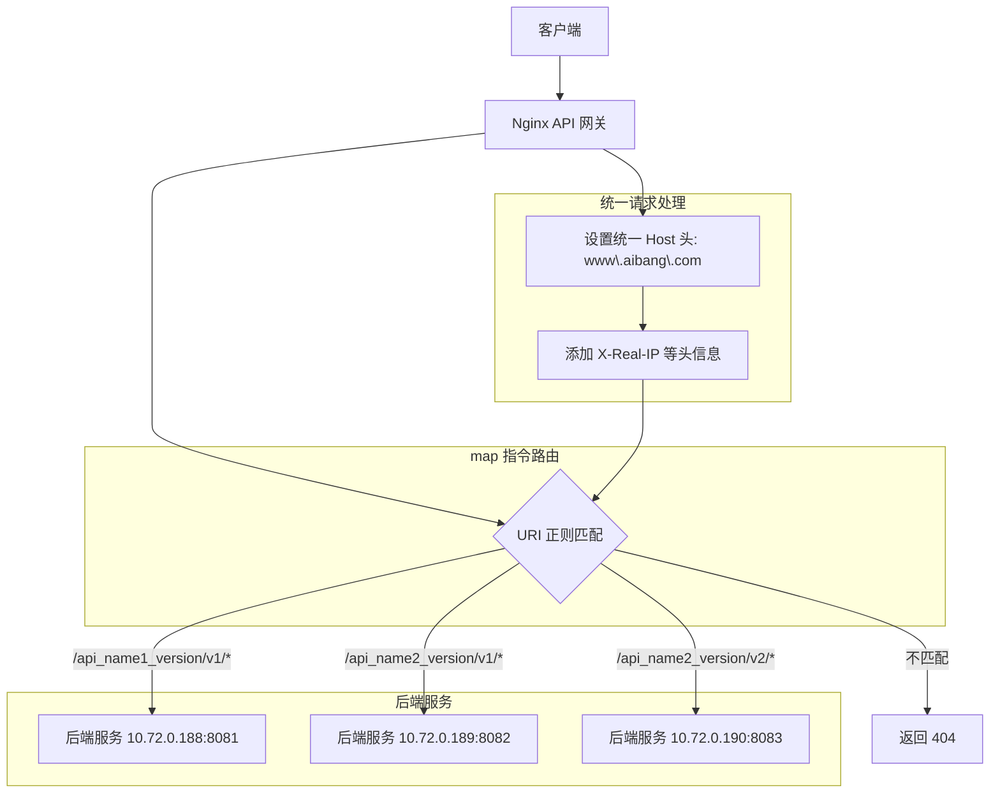

- [ ] For a large number of API routes, map can improve configuration readability, maintainability, and potentially parsing performance compared to many if statements or numerous regex locations.[26, 27, 28, 29] User's current prefix match is efficient for simple cases.
```nginx
map $uri $api_target {
    ~^/api_name1_version/v1/    "https://10.72.0.188:8081/";
    ~^/api_name1_version/v2/    "https://10.72.0.189:8081/";
    # 更多API映射...
    default                    "";
}

server {
    # ...
    location /api_ {
        proxy_pass $api_target$request_uri;
        proxy_set_header Host www.aibang.com;
        # 其他代理设置...
    }
}
```
# calude 

Nginx配置有如下部分,也是我目前的正确配置
这个是我验证的正确的转发
```nginx
location /api_name1_version/v1/ {
    proxy_pass https://10.72.0.188:8081/;
    proxy_set_header Host www.aibang.com;
    proxy_set_header X-Real-IP $remote_addr;
}
```
我要确保完整转发,如果我有大量的API 要优化少使用location 
使用map指令 应该如何实现
另外需要考虑设计一个易于管理的API平台配置结构

明白了，你的所有 API 都使用相同的 API 主机名 `www.aibang.com`，仅通过路径和版本号进行区分。以下是基于此需求优化的配置：

## 使用 map 指令优化 Nginx 配置

```nginx
# 定义 API 映射表，基于路径前缀映射到后端服务
map $uri $api_backend {
    ~^/api_name1_version/v1/(.*)  "https://10.72.0.188:8081/$1";
    ~^/api_name2_version/v1/(.*)  "https://10.72.0.189:8082/$1";
    ~^/api_name2_version/v2/(.*)  "https://10.72.0.190:8083/$1";
    default                       "";
}

server {
    listen 80;
    server_name www.aibang.com;

    # 使用一个统一的 location 处理所有 API 请求
    location ~ ^/[^/]+_version/v[0-9]+/ {
        # 如果没有匹配到 API，返回 404
        if ($api_backend = "") {
            return 404;
        }
        
        proxy_pass $api_backend;
        proxy_set_header Host www.aibang.com;  # 所有请求都使用同一个 Host
        proxy_set_header X-Real-IP $remote_addr;
        proxy_set_header X-Forwarded-For $proxy_add_x_forwarded_for;
        proxy_set_header X-Forwarded-Proto $scheme;
    }
}
```

## 模块化配置结构

为了更易于管理，我们可以将所有 API 映射放在单独的配置文件中：

```nginx
# /etc/nginx/conf.d/api_mappings.conf
map $uri $api_backend {
    include /etc/nginx/api_mappings/*.conf;
    default "";
}
```

然后在单独的文件中定义每个 API 的映射:

```nginx
# /etc/nginx/api_mappings/api_name1_v1.conf
~^/api_name1_version/v1/(.*)  "https://10.72.0.188:8081/$1";

# /etc/nginx/api_mappings/api_name2_v1.conf
~^/api_name2_version/v1/(.*)  "https://10.72.0.189:8082/$1";

# /etc/nginx/api_mappings/api_name2_v2.conf
~^/api_name2_version/v2/(.*)  "https://10.72.0.190:8083/$1";
```

## 完整的服务器配置

```nginx
# /etc/nginx/nginx.conf 或 /etc/nginx/conf.d/api_gateway.conf
include /etc/nginx/conf.d/api_mappings.conf;

server {
    listen 80;
    server_name www.aibang.com;
    
    # API 请求处理
    location ~ ^/[^/]+_version/v[0-9]+/ {
        if ($api_backend = "") {
            return 404 "API not found or invalid version";
        }
        
        proxy_pass $api_backend;
        proxy_set_header Host www.aibang.com;
        proxy_set_header X-Real-IP $remote_addr;
        proxy_set_header X-Forwarded-For $proxy_add_x_forwarded_for;
        proxy_set_header X-Forwarded-Proto $scheme;
        
        # 可选：添加 API 日志
        access_log /var/log/nginx/api_access.log combined;
    }
    
    # 默认返回
    location / {
        return 404 "Invalid API endpoint";
    }
}
```

## API 网关架构流程图



## 管理和维护建议

1. **API 版本管理**：按照这种模式组织你的配置文件，可以轻松添加新 API 或新版本
2. **监控和日志**：为每个 API 添加单独的日志文件，便于排查问题
3. **批量更新**：使用简单的脚本批量生成或更新 API 配置
4. **配置测试**：在应用前使用 `nginx -t` 验证配置是否正确

这种方法的优点：
1. 只需一个 `location` 指令处理所有 API 请求
2. 通过 `map` 指令和模块化配置文件，使管理大量 API 变得简单
3. 配置清晰，易于理解和维护
4. 支持轻松扩展和添加新 API


# Describe 

让我详细解释Map指令优化以及如何设计一个易于管理的API平台配置结构。

## 1. Map指令优化详解

`map` 指令是Nginx中一个强大的功能，它允许您基于一个或多个变量创建一个新变量。在API路由场景中，它可以根据请求URI动态决定目标服务器，避免编写大量重复的location块。

### 基本工作原理：

```nginx
map $uri $api_target {
    ~^/api_name1_version/v1/    "https://10.72.0.188:8081/";
    ~^/api_name1_version/v2/    "https://10.72.0.189:8081/";
    default                     "";
}
```

这个是我验证的正确的转发
```nginx
location /api_name1_version/v1/ {
    proxy_pass https://10.72.0.188:8081/;
    proxy_set_header Host www.aibang.com;
    proxy_set_header X-Real-IP $remote_addr;
}
我要确保完整转发


这段配置的含义是：
1. 创建一个名为`$api_target`的新变量
2. 根据`$uri`变量的值进行模式匹配
3. 如果URI以`/api_name1_version/v1/`开头，则`$api_target`的值设为`https://10.72.0.188:8081/`
4. 如果URI以`/api_name1_version/v2/`开头，则`$api_target`的值设为`https://10.72.0.189:8081/`
5. 如果没有匹配，`$api_target`的值为空字符串

### 在location中使用：

```nginx
location /api_ {
    proxy_pass $api_target$request_uri;
    proxy_set_header Host www.aibang.com;
    # 其他代理设置...
}
```

这里的`$request_uri`包含完整的原始请求URI（包括查询参数）。假设请求是`/api_name1_version/v1/users?id=123`：

1. Nginx匹配到`location /api_`
2. `$uri`值为`/api_name1_version/v1/users`
3. Map指令匹配到`~^/api_name1_version/v1/`，所以`$api_target`被设置为`https://10.72.0.188:8081/`
4. `proxy_pass`值变为`https://10.72.0.188:8081//api_name1_version/v1/users?id=123`

### 使用Capture组优化路径：

更高级的用法是使用正则表达式捕获组，避免URI前缀重复：

```nginx
map $uri $api_target {
    ~^/api_name1_version/v1/(.*)$    "https://10.72.0.188:8081/$1";
    ~^/api_name1_version/v2/(.*)$    "https://10.72.0.189:8081/$1";
    default                         "";
}

location /api_ {
    proxy_pass $api_target;
    # 其他设置...
}
```

这样，如果请求是`/api_name1_version/v1/users?id=123`：
1. 正则表达式捕获`users`到`$1`
2. `$api_target`被设置为`https://10.72.0.188:8081/users`
3. 最终`proxy_pass`值为`https://10.72.0.188:8081/users?id=123`

这种方式移除了路径中的版本信息，使后端服务不需要处理版本路径。如果您希望保留版本路径，可以调整正则表达式。

## 2. 易于管理的API平台配置结构

### 分离配置文件架构

### 实现方案

#### 1. 主配置文件 (nginx.conf)

```nginx
user nxadm ngxgrp;
worker_processes auto;
worker_rlimit_nofile 65535;
error_log /appvol/nginx/logs/error.log info;

events {
    worker_connections 4096;
    multi_accept on;
    use epoll;
}

http {
    include mime.types;
    default_type application/octet-stream;

    # 包含基础设置
    include /etc/nginx/conf.d/common.conf;
    include /etc/nginx/conf.d/security.conf;
    include /etc/nginx/conf.d/logging.conf;
    
    # 包含上游服务器定义
    include /etc/nginx/conf.d/upstreams.conf;
    
    # 包含API映射规则
    include /etc/nginx/conf.d/maps.conf;
    
    server {
        listen 443 ssl http2;
        server_name localhost;
        
        # 包含SSL设置
        include /etc/nginx/conf.d/ssl.conf;
        
        # API请求统一入口
        location /api_ {
            include /etc/nginx/conf.d/proxy_settings.conf;
            proxy_pass $api_target;
        }
        
        # 健康检查
        location /health {
            access_log off;
            return 200 "OK\n";
        }
        
        location / {
            root /dev/null;
            return 404;
        }
    }
}
```

#### 2. API映射配置 (maps.conf)

```nginx
# 定义API映射规则
map $uri $api_target {
    # 包含所有API配置
    include /etc/nginx/api.d/*.conf;
    
    # 默认返回404
    default "";
}

# 记录API名称，用于监控和日志
map $uri $api_name {
    ~^/api_name1_version/v[0-9]+/    "api_name1";
    ~^/api_name2_version/v[0-9]+/    "api_name2";
    default                          "unknown";
}

# 记录API版本，用于监控和日志
map $uri $api_version {
    ~^/api_[^/]+_version/v([0-9]+)/  "v$1";
    default                          "unknown";
}
```

#### 3. 个别API配置文件 (api.d/api_name1_v1.conf)

```nginx
# API: api_name1 版本: v1
~^/api_name1_version/v1/(.*)$    "https://backend_api1_v1/$1";
```

#### 4. 上游服务器配置 (upstreams.conf)

```nginx
# API 1 v1 上游服务器
upstream backend_api1_v1 {
    server 10.72.0.188:8081;
    keepalive 32;
    # 健康检查
    health_check interval=5s fails=3 passes=2;
}

# API 1 v2 上游服务器
upstream backend_api1_v2 {
    server 10.72.0.189:8081;
    keepalive 32;
}

# API 2 v1 上游服务器
upstream backend_api2_v1 {
    server 10.72.0.190:8081;
    keepalive 32;
}
```

#### 5. 代理设置 (proxy_settings.conf)

```nginx
# 超时配置
proxy_connect_timeout 10s;
proxy_read_timeout 300s;
proxy_send_timeout 60s;

# HTTP/1.1启用keepalive
proxy_http_version 1.1;
proxy_set_header Connection "";

# 设置请求头
proxy_set_header Host www.aibang.com;
proxy_set_header X-Real-IP $remote_addr;
proxy_set_header X-Forwarded-For $proxy_add_x_forwarded_for;
proxy_set_header X-Forwarded-Proto $scheme;
proxy_set_header X-API-Name $api_name;
proxy_set_header X-API-Version $api_version;

# 添加请求时间跟踪
proxy_set_header X-Request-Start-Time $msec;

# 错误处理
proxy_intercept_errors on;
proxy_next_upstream error timeout http_502;
```

### API用户Onboarding流程优化

为了简化新API的添加和现有API的管理，我建议实现以下流程：

#### 1. 创建API注册脚本

#### 2. API配置管理工具

#### 3. 自动化部署流程

为了彻底简化API onboarding流程，您可以考虑以下自动化部署流程：

### API管理的最佳实践

1. **使用版本控制系统**
   - 将所有Nginx配置文件存储在Git仓库中
   - 通过Pull Request流程审核配置变更
   - 保留配置变更历史和审计跟踪

2. **实现配置即代码**
   - 使用模板生成配置文件
   - 通过变量替换生成不同环境的配置
   - 使用验证工具确保配置符合标准

3. **API版本控制策略**
   - 支持多种版本控制风格：
     - URI路径版本：`/api_name1_version/v1/resource`
     - 查询参数版本：`/api_name1_version/resource?version=v1`
     - 请求头版本：`X-API-Version: v1`

4. **自动化配置生成器**
   - 创建Web界面或CLI工具管理API注册
   - 支持批量导入/导出API配置
   - 提供配置预览功能

5. **API文档与监控集成**
   - 从Nginx配置自动生成API网关文档
   - 集成APM工具监控API性能
   - 实现API调用量和错误率仪表板

### 完整解决方案总结

1. **分离关注点**
   - 主配置文件负责加载所有组件
   - 每个API有独立的配置文件
   - 通用设置集中管理

2. **自动化工具链**
   - API注册脚本简化新API添加
   - 配置管理工具处理版本删除/更新
   - CI/CD集成实现自动部署

3. **高效路由机制**
   - 使用map指令动态路由请求
   - 减少location块数量提高性能
   - 支持灵活的API版本控制策略

4. **可维护性设计**
   - 结构化文件组织便于管理
   - 详细注释增强可读性
   - 配置验证减少错误风险

这套解决方案既优化了性能，又简化了管理。通过脚本和工具链，您可以更高效地管理API生命周期，无论是新用户onboarding还是现有API更新，都能轻松完成。


