```mermaid
sequenceDiagram
    participant Client
    participant Nginx
    participant Upstream Server

    Client->>+Nginx: 发送请求 (Request with Body)
    Nginx-->>Nginx: 将请求体完整存入缓冲区 (内存或磁盘)
    Note over Nginx: 直到接收完所有数据...
    Nginx->>+Upstream Server: 发送完整的请求
    Upstream Server-->>-Nginx: 处理后返回响应
    Nginx-->>-Client: 转发响应
```

```mermaid
sequenceDiagram
    participant Client
    participant Nginx
    participant Upstream Server

    Client->>+Nginx: 开始发送请求体
    Nginx->>+Upstream Server: 立即建立连接并开始转发数据 (流式)
    Client->>Nginx: ...持续发送数据...
    Nginx->>Upstream Server: ...持续转发数据...
    Note over Nginx, Upstream Server: 在整个上传期间，连接被持续占用
    Upstream Server-->>-Nginx: 处理后返回响应
    Nginx-->>-Client: 转发响应
```

# Nginx `proxy_request_buffering` 详解

`proxy_request_buffering` 是 Nginx 中一个至关重要的代理指令，它决定了 Nginx 在将客户端的请求发送到上游（Upstream）服务器之前，是否要完整地缓冲（buffer）整个请求体（Request Body）。

## 默认配置

在 Nginx 中，此指令的默认值是 `on`。

```nginx
# 语法: proxy_request_buffering on | off;
# 默认: proxy_request_buffering on;
# 上下文: http, server, location
```

默认开启此功能，意味着 Nginx 会先将从客户端接收到的请求体完整地读入一个缓冲区，然后再将整个请求一次性发送给后端服务。

---

## 工作机制与影响

`proxy_request_buffering` 的开启与关闭，对服务器的性能、资源使用和客户端体验有着截然不同的影响。

### 1. `proxy_request_buffering on;` (默认行为)

当指令开启时，Nginx 的工作流程如下：

1.  Nginx 接收到客户端的请求头。
2.  Nginx 开始接收请求体，并将其写入内存中的缓冲区（由 `client_body_buffer_size` 定义）。
3.  如果请求体大小超过了内存缓冲区，Nginx 会将超出部分写入一个临时的磁盘文件。
4.  只有当 Nginx 接收到**完整**的请求体后，它才会与后端上游服务器建立连接，并将整个请求体一次性发送过去。
5.  上游服务器处理请求，并将响应返回给 Nginx，Nginx 再将响应转发给客户端。

#### 工作流程图 (Mermaid)



#### 优点

-   **保护上游服务器**：上游服务器只需处理一个完整的、快速的请求，而无需等待可能很慢的客户端网络。这使得上游服务器的连接可以被快速处理和释放，极大地提高了其吞吐能力和资源利用率。
-   **提高后端效率**：后端服务可以专注于业务逻辑，而不必处理慢速网络连接带来的复杂性。

#### 缺点

-   **延迟增加**：对于客户端而言，特别是上传大文件时，必须等到整个文件上传到 Nginx 并被完整接收后，后端服务才开始处理。这会增加客户端感受到的“首字节响应时间”（Time to First Byte, TTFB）。
-   **Nginx 资源消耗**：如果并发上传量很大，会消耗 Nginx 服务器大量的内存和磁盘 I/O，因为每个请求都需要一个缓冲区。

### 2. `proxy_request_buffering off;`

当指令关闭时，Nginx 的行为会发生根本性改变：

1.  Nginx 接收到客户端请求头后，会立即与上游服务器建立连接。
2.  Nginx 会以“流式”（Streaming）的方式，一边接收客户端的数据，一边将其同步转发给上游服务器。请求体不会被完整地保存在 Nginx 的缓冲区中。

#### 工作流程图 (Mermaid)



#### 优点

-   **低延迟**：后端服务几乎可以实时地接收到客户端发送的数据，非常适合需要即时处理数据的场景（如流式上传、实时通信）。
-   **减少 Nginx 资源消耗**：Nginx 不需要为每个请求分配大块内存或写入磁盘文件，资源占用更少。

#### 缺点

-   **占用上游服务器连接**：如果客户端网络很慢，那么这个慢速的上传过程会长时间占用一个宝贵的上游服务器连接。在高并发场景下，这很容易耗尽上游服务器的可用工作进程（Worker Processes），导致其无法处理新的请求，从而造成服务阻塞甚至雪崩。

---

## 配置示例

你可以在 `http`, `server`, 或 `location` 块中配置此指令。

```nginx
location /upload {
    # 对于需要即时处理的大文件上传或流式 API，建议关闭
    proxy_request_buffering off;
    proxy_pass http://my_backend;
}

location /api {
    # 对于普通的 API 请求（如 POST JSON 数据），建议保持默认开启
    proxy_request_buffering on;
    proxy_pass http://my_backend;
}
```

## 总结与最佳实践

| 配置 | 优点 | 缺点 | 适用场景 |
| :--- | :--- | :--- | :--- |
| **`on` (默认)** | 保护和解放后端服务，提高后端吞吐量。 | 增加客户端上传延迟，消耗 Nginx 资源。 | 大多数 Web 应用、API 接口、常规文件上传。 |
| **`off`** | 低延迟，数据实时传递，Nginx 资源占用少。 | 长时间占用后端连接，易受慢客户端攻击。 | 视频/音频流式上传、gRPC、WebSocket 代理、需要实时处理数据的长连接服务。 |

总的来说，`proxy_request_buffering` 的默认设置为 `on` 是一个安全且高效的选择，它优化了后端服务器的性能。只有在你明确知道需要进行流式处理，并且能够接受其对后端连接占用的影响时，才应该考虑将其设置为 `off`。

---

## 在 Kong 与 GKE 环境下的延伸探讨

在 `Nginx + Kong DP + GKE Runtime` 这样的现代云原生架构中，对请求缓冲的控制同样重要，但配置方式和理解层面需要结合 Kong 的抽象来考虑。

### `proxy_request_buffering off` 与 `client_body_buffer_size` 的关系

这是一个常见的混淆点。简单来说，**这两个指令的作用完全不同，不能等同看待**。

-   **`proxy_request_buffering`**: 这是控制 **代理行为模式** 的“总开关”。`off` 意味着 Nginx 收到任何请求体数据后，会立刻将其转发给后端（流式），而不是等待整个请求体接收完毕。
-   **`client_body_buffer_size`**: 这个指令定义了 Nginx 用来 **接收客户端请求体** 的初始内存缓冲区大小。**无论 `proxy_request_buffering` 是 `on` 还是 `off`，这个缓冲区都会被使用**。
    -   当 `proxy_request_buffering` 为 `on` 时，它是缓冲完整请求体的第一块内存区域，如果不够，数据会溢出到磁盘。
    -   当 `proxy_request_buffering` 为 `off` 时，Nginx 依然使用这个缓冲区来临时存放从客户端收到的数据块。一旦这个缓冲区被填满，Nginx 就会将这部分数据“刷送”（flush）给后端服务，然后清空缓冲区继续接收下一块数据。

**结论**：`proxy_request_buffering off` 是开启流式代理的**唯一正确方式**。将 `client_body_buffer_size` 设置为 `0` 并不能达到同样的效果，这不符合 Nginx 的设计，可能会导致其行为异常或自动回退到某个默认的最小缓冲区大小。在流式模式下，`client_body_buffer_size` 影响的是数据块转发的“粒度”，而不是“是否缓冲”这个行为本身。

**不冲突，但不等同；不要把 client_body_buffer_size 设为 0 作为“关闭内存缓冲”的手段**。
  

# **结论（一句话）**

- proxy_request_buffering off 控制 **是否把整个客户端请求体缓存在 Nginx 再统一转发给上游**（off = 一边读一边转发，流式转发）。
    
- client_body_buffer_size 控制 **Nginx 在内存中为读取客户端请求体分配的缓冲区大小**；如果请求体超过该大小，剩余部分会写入临时文件。把它设为 0 不是官方用法且可能引发异常（有人报 400/异常行为），不要用 0 来“禁用内存缓冲”。
    

  

# **细节解释（要点式）**

1. **proxy_request_buffering 的语义**
    
    - on（默认）：Nginx 会先把**整个**请求体读完（可能在内存也可能落到临时文件），然后再把请求交给 upstream。这样的好处是上游可以立即收到完整的请求（便于重试/负载均衡），坏处是会占用磁盘/内存并增加延迟。
        
    - off：Nginx 一边从客户端读取数据一边向 upstream 转发（streaming）。优点：不需要事先把大文件全部写到磁盘，适合大文件/长时间上传。缺点：一旦开始转发就不能再切换到其他 upstream（不能重试）；上游必须能接受 chunked/流式请求。
        
    
2. **client_body_buffer_size 的语义**
    
    - 这是读客户端请求体时的**内存缓冲区大小**（可以在 http/server/location 设置）。默认等于**两页内存**（常见平台为 8k 或 16k）。如果请求体 > 该缓冲区，则 Nginx 会把剩余写到 client_body_temp_path 指定的临时文件。
        
    
3. **为什么不要用 client_body_buffer_size 0**
    
    - 官方文档没有把 0 当作关闭内存缓冲的标准方式。社区/issue 中有用户把 0 设为“想强制写入磁盘”，结果遇到 400 或其他异常行为的报告（实现/版本差异会导致不稳定）。用 client_body_in_file_only 才是强制写回磁盘的正确手段（但该指令也有副作用，见下）。
        
        那么client_body_buffer_size 0的含义是什么?
        好问题 👍官方 **nginx 文档** 对 client_body_buffer_size 的说明是：

  

> 设置在读取客户端请求体时分配的缓冲区大小。默认是两页内存（通常是 8k 或 16k）。如果请求体大于这个值，则多余部分会写到 client_body_temp_path。

> （文档里没有提到 0 是合法取值）

---

### **那么** ### **client_body_buffer_size 0**

###  **到底是什么含义？**

1. **不是标准语义**
    
    - 在官方文档中，0 没有明确说明代表什么，也没有“关闭内存缓冲”的说法。
        
    - 不同版本的 Nginx/OpenResty/Ingress Controller，0 可能会被当成非法值，或者被解析成 **0 字节内存缓冲**。
        
    
2. **可能的实现逻辑（源码层面）**
    
    - Nginx 在分配请求体缓冲区时会调用 ngx_parse_size()，0 就是“0 字节”。
        
    - 这意味着 **没有内存缓冲**，一旦读到数据就立刻写入 client_body_temp_path 的临时文件。
        
    - 这不是设计上的常规用法，实际运行中有用户反馈会导致 400 Bad Request 或者 Nginx 无法正常处理请求体。
        
    
3. **社区反馈（经验）**
    
    - 一些用户想通过 client_body_buffer_size 0 来“强制全部写入磁盘”，结果遇到异常。
        
    - 正确的方式是用 [client_body_in_file_only](http://nginx.org/en/docs/http/ngx_http_core_module.html#client_body_in_file_only) 来强制写文件，而不是用 0。
        
    

---

### **小结**

- client_body_buffer_size 0 ≈ **0 字节内存缓冲**，也就是所有请求体数据直接落盘，不走内存。
    
- 但这不是官方推荐方式，容易出问题。
    
- 如果确实想避免内存缓冲，请用：
    

```
client_body_in_file_only on;
```

而不是 client_body_buffer_size 0。

---

要不要我帮你把 **“client_body_buffer_size 的几种不同配置值含义对比表格”**（比如 0 / 8k / 1m / 很大值）整理出来？这样你在文档里也能一眼看明白不同取值的实际效果。
    
4. **chunked（Transfer-Encoding: chunked） 的陷阱**
    
    - 如果客户端使用 chunked 传输，Nginx 在某些情况下仍然会缓存请求体，**除非**你同时为 proxy 设置 proxy_http_version 1.1（并保证上游能处理 chunked）；否则 chunked 请求常被写入临时文件或导致 buffering 行为不同。也就是说：proxy_request_buffering off + chunked 请求时需要额外注意 proxy_http_version。
        
    
5. **client_body_in_file_only**（如果你确实要“只写文件”）
    
    - 该指令可以强制把请求体写入文件（用于调试或特殊场景），但会保留临时文件（on 会保留，clean 可清理），并且可能影响你如何把 body 交给 upstream（需用 $request_body_file 等或调整 proxy_pass_request_body）。不是普通生产场景下用来“节省内存”的首选。
        
    

  

# **实际配置示例（直接可复制）**

```
# 1) 推荐：流式上传到 upstream（减少 Nginx IO / disk 临时文件）
location /upload {
    proxy_pass http://backend;
    proxy_request_buffering off;       # 一边读一边发给 upstream
    proxy_http_version 1.1;            # 支持 chunked 转发到 upstream
    client_body_buffer_size 16k;       # 小缓冲即可（默认通常 8k/16k）
    proxy_read_timeout 3600s;
    proxy_send_timeout 3600s;
}
```

（说明：适用于 upstream 能流式接收并支持 chunked 的场景；注意超时、上游兼容性）

```
# 2) 如果你想强制写入磁盘（调试或特殊场景），使用官方指令
location /upload2 {
    client_body_in_file_only on;       # 强制写入临时文件（会保留）
    client_body_temp_path /var/nginx/client_body_temp;
    proxy_pass http://backend;
    # 注意：此模式下，处理临时文件、权限和清理非常重要
}
```

```
# 3) 不要这样做（示例：避免）
# client_body_buffer_size 0;   # 不推荐：未被官方说明为“合法”关闭方式，可能导致异常
```

# **快速决策表（三句话）**

- 想**立即把上传的每一块转发到上游**：proxy_request_buffering off + proxy_http_version 1.1，并确保上游支持流式（chunked）。
    
- 想**减少内存临时占用但不破坏正常传递**：把 client_body_buffer_size 设小（比如 8k 或 16k），让大体写到 tmp 文件；不要设 0。
    
- 要**强制写盘且用到 $request_body_file**：使用 client_body_in_file_only（并处理临时文件）。
    

  

# **小提示 & 风险**

- 流式（proxy_request_buffering off）**会降低 Nginx 在上游故障时重试的能力**（因为已经开始发送 body，不能安全切换到别的 upstream）。
    
- 如果上游是 HTTP/1.0 或不支持 chunked，你可能必须保证 proxy_http_version 1.1 且上游能处理；否则 Nginx 仍会做 buffering 或失败。
    
- 监控 client_body_temp_path 的磁盘使用，避免临时文件堆积。
    
- 各 Nginx 版本/patch（例如 OpenResty / Kong / ingress-nginx）在实现细节上可能有差异，部署前请在目标版本做小规模验证。
    

  

# **帮你快速可视化（mermaid）**

```
graph LR
  Client -->|POST body| Nginx
  Nginx -->|<= client_body_buffer_size| MemoryBuffer
  Nginx -->|> client_body_buffer_size| TempFile
  MemoryBuffer -->|proxy_request_buffering on| BufferThenSend[缓冲后再送 upstream]
  MemoryBuffer -->|proxy_request_buffering off| StreamToUpstream[一边读一边发 upstream]
  TempFile --> Upstream[Upstream 由 Nginx 读取并发送]
```

---

需要我帮你基于你当前的 Nginx 版本（或 Ingress/Kong 变体）把上面的配置写成完整 server {} 配置并列出测试步骤与注意点吗？如果给我你现在的 Nginx 版本 / 是不是在 k8s ingress / Kong 之类的环境里，我可以直接给出更精确的配置片段。

### 在 Kong Gateway (DP) 中的配置

在你的架构中，请求首先到达 Nginx（可能作为四层负载均衡器），然后进入 Kong 数据平面（DP），最后由 Kong 代理到 GKE 中运行的后端服务。你应当在 Kong 的层面进行配置，而不是直接修改底层的 Nginx 配置文件。

Kong 已经将 `proxy_request_buffering` 抽象为一个简单的布尔配置。你可以在 Kong 的 **Service** 对象上进行设置。

-   `request_buffering: true` (默认值) -> 对应 Nginx 的 `proxy_request_buffering on;`
-   `request_buffering: false` -> 对应 Nginx 的 `proxy_request_buffering off;`

#### Kong for Kubernetes (Ingress Controller) 配置示例

如果你使用 Kong Ingress Controller 在 GKE 中管理服务，可以通过修改 `KongIngress` 自定义资源或直接在 Service 的注解中实现。更推荐的方式是直接配置 Service 本身。

这是一个通过 `annotations` 在 Kubernetes Service 上禁用请求缓冲的例子：

```yaml
apiVersion: v1
kind: Service
metadata:
  name: my-streaming-app
  annotations:
    # 通过注解将 Kong 的 request_buffering 设置为 false
    konghq.com/request-buffering: "false" 
spec:
  ports:
  - name: http
    port: 80
    protocol: TCP
    targetPort: 8080
  selector:
    app: my-streaming-app
```

当 Kong Ingress Controller 处理这个 Service 时，它会自动在生成的 Nginx 配置中为对应的 `upstream` 设置 `proxy_request_buffering off;`。

### 架构总结与建议

| 层次 | 关注点 | 推荐配置 | 效果 |
| :--- | :--- | :--- | :--- |
| **Client** | 发起流式请求 | (例如：上传大文件) | - |
| **Nginx (L4 LB)** | TCP 负载均衡 | `proxy_protocol` (可选) | 将流量转发到 Kong DP 节点，可选传递真实客户端 IP。 |
| **Kong DP** | **核心配置层** | 在 Kong Service 设置 `request_buffering: false` | **实现流式代理的关键**。Kong DP 不会缓冲整个请求体。 |
| **GKE Runtime** | 后端业务逻辑 | 能够处理流式请求 | 服务可以实时处理传入的数据流。 |

综上所述，在 `Nginx + Kong DP + GKE` 架构中想要实现流式、低延迟的请求转发，正确的做法是在 Kong 的 Service 定义中明确设置 **`request_buffering: false`**。你不需要，也不应该尝试通过设置 `client_body_buffer_size: 0` 来达到此目的。