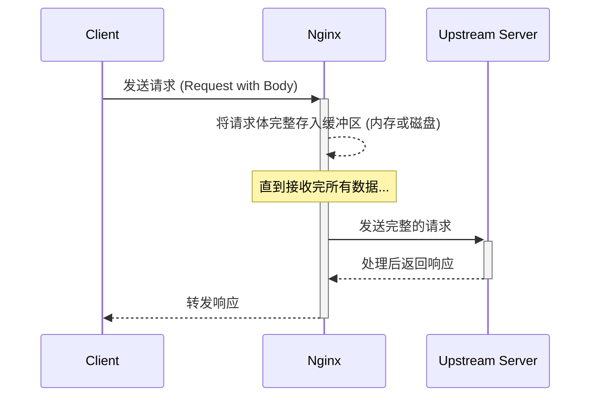
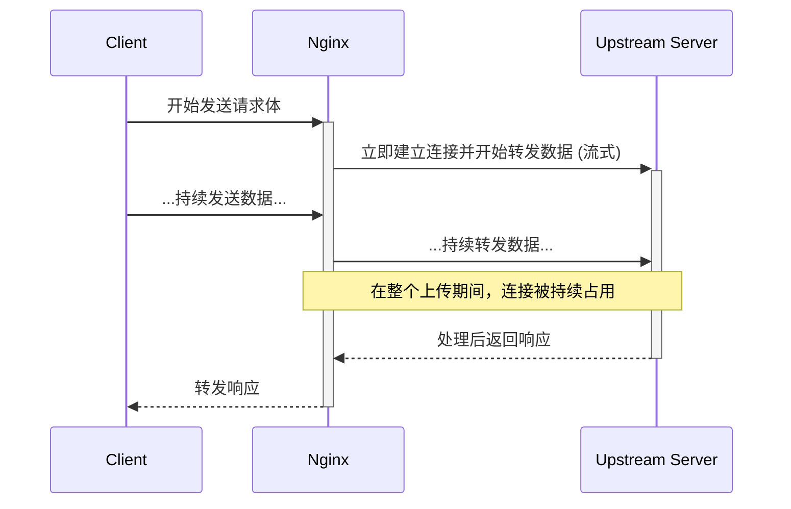

# Nginx `proxy_request_buffering` 详解

`proxy_request_buffering` 是 Nginx 中一个至关重要的代理指令，它决定了 Nginx 在将客户端的请求发送到上游（Upstream）服务器之前，是否要完整地缓冲（buffer）整个请求体（Request Body）。

## 默认配置

在 Nginx 中，此指令的默认值是 `on`。

```nginx
# 语法: proxy_request_buffering on | off;
# 默认: proxy_request_buffering on;
# 上下文: http, server, location
```

默认开启此功能，意味着 Nginx 会先将从客户端接收到的请求体完整地读入一个缓冲区，然后再将整个请求一次性发送给后端服务。

---

## 工作机制与影响

`proxy_request_buffering` 的开启与关闭，对服务器的性能、资源使用和客户端体验有着截然不同的影响。

### 1. `proxy_request_buffering on;` (默认行为)

当指令开启时，Nginx 的工作流程如下：

1.  Nginx 接收到客户端的请求头。
2.  Nginx 开始接收请求体，并将其写入内存中的缓冲区（由 `client_body_buffer_size` 定义）。
3.  如果请求体大小超过了内存缓冲区，Nginx 会将超出部分写入一个临时的磁盘文件。
4.  只有当 Nginx 接收到**完整**的请求体后，它才会与后端上游服务器建立连接，并将整个请求体一次性发送过去。
5.  上游服务器处理请求，并将响应返回给 Nginx，Nginx 再将响应转发给客户端。

#### 工作流程图 (Mermaid)



#### 优点

-   **保护上游服务器**：上游服务器只需处理一个完整的、快速的请求，而无需等待可能很慢的客户端网络。这使得上游服务器的连接可以被快速处理和释放，极大地提高了其吞吐能力和资源利用率。
-   **提高后端效率**：后端服务可以专注于业务逻辑，而不必处理慢速网络连接带来的复杂性。

#### 缺点

-   **延迟增加**：对于客户端而言，特别是上传大文件时，必须等到整个文件上传到 Nginx 并被完整接收后，后端服务才开始处理。这会增加客户端感受到的“首字节响应时间”（Time to First Byte, TTFB）。
-   **Nginx 资源消耗**：如果并发上传量很大，会消耗 Nginx 服务器大量的内存和磁盘 I/O，因为每个请求都需要一个缓冲区。

### 2. `proxy_request_buffering off;`

当指令关闭时，Nginx 的行为会发生根本性改变：

1.  Nginx 接收到客户端请求头后，会立即与上游服务器建立连接。
2.  Nginx 会以“流式”（Streaming）的方式，一边接收客户端的数据，一边将其同步转发给上游服务器。请求体不会被完整地保存在 Nginx 的缓冲区中。

#### 工作流程图 (Mermaid)



#### 优点

-   **低延迟**：后端服务几乎可以实时地接收到客户端发送的数据，非常适合需要即时处理数据的场景（如流式上传、实时通信）。
-   **减少 Nginx 资源消耗**：Nginx 不需要为每个请求分配大块内存或写入磁盘文件，资源占用更少。

#### 缺点

-   **占用上游服务器连接**：如果客户端网络很慢，那么这个慢速的上传过程会长时间占用一个宝贵的上游服务器连接。在高并发场景下，这很容易耗尽上游服务器的可用工作进程（Worker Processes），导致其无法处理新的请求，从而造成服务阻塞甚至雪崩。

---

## 配置示例

你可以在 `http`, `server`, 或 `location` 块中配置此指令。

```nginx
location /upload {
    # 对于需要即时处理的大文件上传或流式 API，建议关闭
    proxy_request_buffering off;
    proxy_pass http://my_backend;
}

location /api {
    # 对于普通的 API 请求（如 POST JSON 数据），建议保持默认开启
    proxy_request_buffering on;
    proxy_pass http://my_backend;
}
```

## 总结与最佳实践

| 配置 | 优点 | 缺点 | 适用场景 |
| :--- | :--- | :--- | :--- |
| **`on` (默认)** | 保护和解放后端服务，提高后端吞吐量。 | 增加客户端上传延迟，消耗 Nginx 资源。 | 大多数 Web 应用、API 接口、常规文件上传。 |
| **`off`** | 低延迟，数据实时传递，Nginx 资源占用少。 | 长时间占用后端连接，易受慢客户端攻击。 | 视频/音频流式上传、gRPC、WebSocket 代理、需要实时处理数据的长连接服务。 |

总的来说，`proxy_request_buffering` 的默认设置为 `on` 是一个安全且高效的选择，它优化了后端服务器的性能。只有在你明确知道需要进行流式处理，并且能够接受其对后端连接占用的影响时，才应该考虑将其设置为 `off`。
