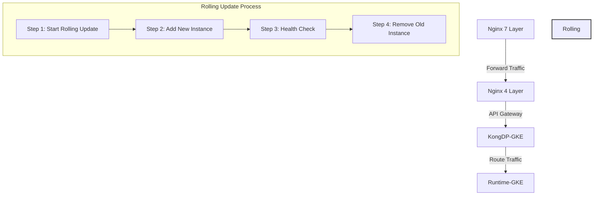
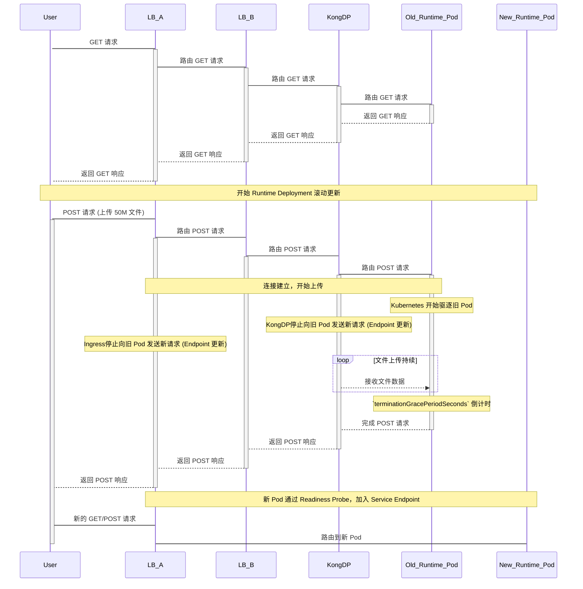

# summary 

我有一个关于GCP工程里面Rolling的问题，比如我的FLow是各组Instance之间的跳转，这些Instance都配置了MIG。都是对应的LB
比如组建顺序如下A（Nginx 7 layer） + B (Nginx+4 layer) + C (GKE KongDP) + D（GKE Runtime）
我现在有这样一个问题，我看到假设我有一个Get请求，那么我在Rolling我的任意一个组建的同时，能确保我的Get请求不中断 也就是这个过程没有Downtime的，那么如果我的请求是一个Post请求呢，比如我上传一个50M的文件到我的Runtime里面去
那么我想确认这个过程是没有中断的。帮我分析这个Flow。如果可以画出一个markdown的mermaid


# Gemini2
详细分析在你的GCP架构下进行滚动更新时，如何保证GET和POST请求的连续性，特别是对于大文件上传的POST请求。

**架构概览**

你的架构是一个典型的多层应用架构，使用GCP的托管服务，包括：

* **A (Nginx 7 Layer):**  作为入口点的七层负载均衡，负责SSL termination，路由等。
* **B (Nginx + 4 Layer):**  四层负载均衡，可能用于更细粒度的流量控制或者作为内部负载均衡。
* **C (KongDP):**  API Gateway，负责鉴权、限流、路由等API管理功能。
* **D (Runtime):**  实际运行你的应用程序的实例。

所有组件都配置了MIG（Managed Instance Groups），并由对应的负载均衡器（可能是HTTP(S)负载均衡或TCP负载均衡）进行管理。

**滚动更新的核心机制**

GCP的滚动更新机制允许你在不中断服务的情况下更新MIG中的实例。其核心步骤如下：

1. **创建新版本的实例模板或容器镜像。**
2. **更新MIG的配置，指定新的实例模板或容器镜像。**
3. **MIG会逐步创建新的实例，同时保留旧的实例。**
4. **新的实例通过健康检查后，会被添加到负载均衡器的后端服务中，开始接收流量。**
5. **MIG会逐步移除旧的实例。**
6. **在移除旧实例之前，负载均衡器会停止向这些实例发送新的请求，并等待正在处理的请求完成（连接耗尽/Connection Draining）。**

**GET请求的滚动更新**

由于GET请求通常是无状态的，因此在滚动更新过程中中断的风险相对较低。

* **流程分析:**
    1. 用户发送GET请求到负载均衡器A。
    2. 负载均衡器A根据配置将请求路由到B。
    3. 负载均衡器B将请求路由到C。
    4. KongDP处理请求，并将其路由到D。
    5. 正在进行滚动更新时，假设D组的某个旧实例正在被移除。
    6. 负载均衡器（A, B）和KongDP（如果配置了健康检查和动态路由）会停止向正在移除的实例发送新的请求。
    7. 已经建立的连接可能会继续处理完当前的请求。
    8. 新创建的D组实例通过健康检查后，会被添加到负载均衡器的后端，可以接收新的GET请求。

* **保证无中断:**
    * **健康检查:** 确保只有健康的实例才能接收流量。
    * **连接耗尽 (Connection Draining):**  在移除旧实例之前，负载均衡器会等待当前连接完成，确保正在处理的GET请求不会被中断。

**POST请求（大文件上传）的滚动更新**

POST请求，特别是大文件上传，由于涉及持续的数据传输和状态保持，在滚动更新过程中更容易受到影响。

* **流程分析:**
    1. 用户开始上传50M文件，发送POST请求到负载均衡器A。
    2. 负载均衡器A将请求路由到B。
    3. 负载均衡器B将请求路由到C。
    4. KongDP将请求路由到D组的某个实例。
    5. 在上传过程中，假设D组的这个实例所在的MIG正在进行滚动更新，该实例需要被移除。

* **潜在中断风险:**
    * **连接中断:** 如果在文件上传完成之前，负载均衡器强制关闭到旧实例的连接，上传会被中断。
    * **状态丢失:** 如果上传过程需要在Runtime实例上维护状态（例如，分块上传的中间状态），切换到新实例可能会导致状态丢失，需要重新上传。

* **保证无中断的关键机制:**

    * **连接耗尽 (Connection Draining):** 这是最关键的机制。负载均衡器（A和B）以及KongDP（如果配置了）必须配置合理的连接耗尽超时时间。这个超时时间应该足够长，以允许正在处理的请求（包括大文件上传）完成。
        * **配置示例 (GCP HTTP(S) 负载均衡):** 在后端服务配置中，可以设置`connectionDraining.drainTimeoutSec`。你需要根据你的应用和预期的最大上传时间来调整这个值。

    * **请求缓冲 (Request Buffering):**  某些负载均衡器或API Gateway可以缓冲一部分请求数据。如果旧实例在接收完部分数据后被移除，新的请求会被路由到新实例，但需要确保新实例能够处理部分上传的情况（通常需要应用层面支持）。

    * **会话粘性 (Session Affinity / Stickiness):**  虽然不推荐用于长期保持状态，但在某些情况下，可以配置负载均衡器将来自同一客户端的请求路由到相同的后端实例一段时间。这可以增加上传过程中不切换实例的概率，但会影响负载均衡的均匀性。

    * **应用层面的容错和恢复:** 最佳实践是在应用程序层面设计容错机制，例如：
        * **断点续传:** 支持客户端在上传中断后从上次的位置继续上传。
        * **分块上传:** 将大文件分割成小块分别上传，即使某个请求失败，也只需重新上传失败的块。
        * **状态持久化:** 如果上传过程需要在服务端维护状态，将状态持久化到外部存储，以便在切换实例后恢复。

**Mermaid 流程图**


**总结和最佳实践**

* **对于GET请求:**  依赖于GCP负载均衡器的健康检查和连接耗尽机制，通常可以实现无中断。
* **对于POST请求（大文件上传）:**  连接耗尽是关键，需要合理配置超时时间。同时，应用层面的容错设计（断点续传、分块上传）是提高可靠性的重要手段。
* **配置连接耗尽:** 确保在GCP负载均衡器（HTTP(S) 负载均衡和TCP负载均衡）以及KongDP上都配置了合理的连接耗尽超时时间。这个时间应该大于预期的最长请求处理时间，包括大文件上传。
* **健康检查:** 配置完善的健康检查，确保只有健康的实例才能接收流量。
* **逐步滚动更新:**  控制MIG的更新速度，不要一次性替换所有实例。
* **监控和告警:**  监控滚动更新过程中的关键指标，例如请求延迟、错误率等，及时发现并解决问题。
* **考虑金丝雀发布或蓝绿部署:**  对于高敏感的应用，可以考虑更保守的发布策略，例如金丝雀发布或蓝绿部署，以进一步降低风险。

通过理解GCP滚动更新的机制，并结合合适的配置和应用层面的设计，你可以最大限度地保证在滚动更新过程中用户请求的连续性，即使是像大文件上传这样的复杂操作。记住，连接耗尽是保证正在进行的请求不被中断的核心机制。


# Chatgpt
在你的场景中，为了确保 Rolling 更新过程中无中断 (Zero Downtime)，需要针对不同类型的请求（GET 和 POST）的特性进行分析和方案设计。以下是详细分析和解决方案：

问题分析
	1.	GET 请求（无状态）：
	•	GET 请求通常是无状态的（stateless），例如静态资源的获取。
	•	在 Rolling Update 过程中，使用负载均衡器（LB）可以动态剔除不可用实例，并将流量转发至健康的实例。
	•	因此，GET 请求在无状态的情况下比较容易实现无中断。
	2.	POST 请求（有状态）：
	•	POST 请求通常是有状态的，例如文件上传或数据库写操作。
	•	如果在 Rolling Update 过程中，文件上传请求转发到一个实例，而这个实例被更新或者重启，可能导致上传失败或中断。
	•	需要实现请求完整性保证，例如：
	•	会话粘性（Session Affinity）：确保请求在整个生命周期内路由到同一个实例。
	•	预处理策略（Pre-Stop Hook）： 让正在处理的请求完成后再剔除实例。

解决方案设计

1. 负载均衡层（A 和 B 层）
	•	健康检查（Health Check）： 配置 Rolling Update 时，让 LB 动态剔除正在更新的实例。
	•	连接保持（Connection Draining）： 确保旧实例在停止前完成所有活跃连接。

2. GKE 层（C 和 D 层）
	•	Rolling Update 策略：
	•	设置 maxUnavailable=0 和 maxSurge=1，确保新实例完全就绪后再更新旧实例。
	•	会话粘性：
	•	在 LB 上配置基于 Cookie 或 Header 的会话粘性，确保整个文件上传过程路由到同一实例。
	•	Pre-Stop Hook：
	•	在更新或重启 Pod 之前，通过钩子确保正在处理的请求完成。

3. 网络可靠性
	•	超时和重试机制： 客户端和服务端都需要合理设置超时和重试逻辑，避免因网络波动导致的请求失败。

完整流程图

以下是整个架构的 Flow 及 Rolling Update 过程中的行为描述：

注意事项
	1.	POST 请求的中断处理
	•	对于文件上传等长时间的 POST 请求，确保连接持久化是关键。启用以下功能：
	•	会话粘性（Session Affinity）。
	•	预处理钩子（Pre-Stop Hook）。
	•	超时重试（Timeout & Retry）。
	2.	Rolling Update 策略
	•	确保 maxUnavailable=0，避免在更新期间出现实例不可用的情况。
	3.	LB 配置
	•	动态剔除不可用实例（通过健康检查）。
	•	启用连接保持（Connection Draining）。

通过以上策略，可以确保 GET 和 POST 请求在 Rolling Update 过程中保持无中断。


# gemini2
好的，让我们来详细分析在你的 GKE 工程中进行滚动更新时，如何保证 GET 和 POST 请求（特别是大文件上传）的连续性。

**架构概览**

你的架构是一个典型的微服务架构，部署在 GKE 上，使用了多层负载均衡：

* **A (Nginx 7 Layer):**  很可能是 GKE Ingress Controller (基于 Nginx)，作为入口点的七层负载均衡，负责 SSL 终止，HTTP 路由等。
* **B (Nginx + 4 Layer):** 可能是 Service of type `LoadBalancer` 前置的 Nginx 实例，用于 TCP 或 UDP 流量的负载均衡，也可能用于更细粒度的内部路由。
* **C (GKE KongDP):**  Kong API Gateway 部署在 GKE 上，负责 API 管理，例如路由、鉴权、限流等。Kong 通常以 Deployment 的形式部署。
* **D (GKE Runtime):**  你的应用程序运行时，部署在 GKE 上，同样通常以 Deployment 的形式部署。

所有组件都通过 Kubernetes Service 进行暴露，并通过负载均衡器进行访问。

**滚动更新的核心机制 (基于 Kubernetes Deployments)**

在 GKE 中，对于 Deployment 的滚动更新，Kubernetes 提供了内置的机制，保证在更新过程中尽量减少甚至避免服务中断。其核心步骤如下：

1. **创建新的 ReplicaSet:** 当你更新 Deployment 的 Pod 模板（例如，更新容器镜像版本）时，Kubernetes 会创建一个新的 ReplicaSet。
2. **逐步创建新的 Pod:** 新的 ReplicaSet 会按照配置（`strategy: RollingUpdate`）逐步创建新的 Pod。
3. **健康检查 (Readiness Probe):** 新的 Pod 启动后，Kubernetes 会通过 Readiness Probe 来检查 Pod 是否准备好接收流量。只有通过健康检查的 Pod 才会添加到对应 Service 的 Endpoint 列表中。
4. **逐步移除旧的 Pod:** 一旦新的 Pod 准备就绪，旧的 ReplicaSet 中的 Pod 会逐步被移除。
5. **连接耗尽 (Connection Draining):** 在移除旧的 Pod 之前，Kubernetes 会将其从 Service 的 Endpoint 列表中移除，这样新的请求就不会路由到该 Pod。同时，Kubernetes 会等待一定的超时时间（`terminationGracePeriodSeconds`），让正在处理的请求有时间完成。

**GET 请求的滚动更新**

由于 GET 请求通常是无状态的，因此在滚动更新过程中中断的风险相对较低。

* **流程分析:**
    1. 用户发送 GET 请求到负载均衡器 A (Ingress)。
    2. Ingress 根据配置将请求路由到 B (Service of type `LoadBalancer`)。
    3. 负载均衡器 B 将请求路由到 C (Kong Service)。
    4. Kong 根据路由规则将请求路由到 D (Runtime Service)。
    5. 正在进行滚动更新时，假设 D 组的某个旧 Pod 正在被移除。
    6. Kubernetes 会先停止向该旧 Pod 发送新的请求（通过更新 Endpoint 列表）。
    7. 负载均衡器 (A, B) 和 Kong (如果配置了健康检查和动态路由) 会感知到 Endpoint 的变化，停止向正在移除的 Pod 发送新的请求。
    8. 已经建立的连接可能会继续处理完当前的 GET 请求。
    9. 新创建的 D 组 Pod 通过 Readiness Probe 后，会被添加到 Service 的 Endpoint 列表中，可以接收新的 GET 请求。

* **保证无中断:**
    * **Readiness Probe:** 确保只有健康的 Pod 才能接收流量。
    * **连接耗尽 (`terminationGracePeriodSeconds`):**  Deployment 的配置中需要设置合理的 `terminationGracePeriodSeconds`，给正在处理的请求足够的时间完成。Ingress 和 Kong 也会有相应的连接超时配置。
    * **负载均衡器的健康检查:**  Ingress 和 Service 的负载均衡器也会定期检查后端的健康状态。

**POST 请求（大文件上传）的滚动更新**

POST 请求，特别是大文件上传，由于涉及持续的数据传输和状态保持，在滚动更新过程中更容易受到影响。

* **流程分析:**
    1. 用户开始上传 50M 文件，发送 POST 请求到负载均衡器 A (Ingress)。
    2. 请求经过 B 和 C，最终被路由到 D 组的某个旧 Pod。
    3. 在上传过程中，假设 D 组的这个 Pod 所在的 Deployment 正在进行滚动更新，该 Pod 需要被移除。

* **潜在中断风险:**
    * **连接中断:** 如果在文件上传完成之前，Kubernetes 强制终止到旧 Pod 的连接，上传会被中断。
    * **状态丢失:** 如果上传过程需要在 Runtime Pod 上维护状态（例如，分块上传的中间状态），切换到新 Pod 可能会导致状态丢失，需要重新上传。

* **保证无中断的关键机制:**

    * **连接耗尽 (`terminationGracePeriodSeconds`):** 这是最关键的机制。你需要确保 Deployment 的 `terminationGracePeriodSeconds` 设置得足够长，以允许正在进行的上传完成。这个时间应该大于你预期的最长上传时间。
        * **配置示例 (Deployment):**
          ```yaml
          spec:
            template:
              spec:
                terminationGracePeriodSeconds: 300 # 例如，设置为 5 分钟
          ```
    * **Ingress 和 Kong 的超时配置:**  Ingress Controller 和 Kong API Gateway 也需要配置适当的请求超时和连接超时时间，以避免过早地断开连接。
        * **Ingress 配置示例 (Nginx Ingress):** 可以通过 Annotations 设置 `nginx.ingress.kubernetes.io/proxy-body-size` (允许上传的最大 body 大小) 和 `nginx.ingress.kubernetes.io/proxy-send-timeout` / `nginx.ingress.kubernetes.io/proxy-read-timeout` (超时时间)。
        * **Kong 配置:** 在 Kong 的 Service 或 Route 配置中，可以设置 `proxy_timeout`。
    * **会话粘性 (Session Affinity / Stickiness):**  虽然不推荐用于长期保持状态，但在某些情况下，可以配置 Ingress 或 Kong 将来自同一客户端的请求路由到相同的后端 Pod 一段时间。这可以增加上传过程中不切换 Pod 的概率，但会影响负载均衡的均匀性。在 GKE 中，可以通过 Service 的 `sessionAffinity: ClientIP` 或 Kong 的插件来实现。
    * **应用层面的容错和恢复:** 最佳实践是在应用程序层面设计容错机制，例如：
        * **断点续传:** 支持客户端在上传中断后从上次的位置继续上传。
        * **分块上传:** 将大文件分割成小块分别上传，即使某个请求失败，也只需重新上传失败的块。
        * **状态持久化:** 如果上传过程需要在服务端维护状态，将状态持久化到外部存储（例如，数据库、对象存储），以便在切换 Pod 后恢复。

**Mermaid 流程图**

好的，这是更正后的 Mermaid 流程图，移除了 `participant` 定义中的括号：

对不起，我检查了我的 Mermaid 代码，你指出的错误是正确的。在第 48 行，箭头方向可能写反了，导致 Mermaid 解析失败。

正确的语法应该是 `KongDP -->> Old_Runtime_Pod: 接收文件数据`，表示数据从 `KongDP` 发送到 `Old_Runtime_Pod`。

这是更正后的 Mermaid 代码：



**我主要修改了以下一行：**

* 将 `Old_Runtime_Pod <-- KongDP: 接收文件数据`
* 更正为 `KongDP -->> Old_Runtime_Pod: 接收文件数据`

再次感谢你指出这个错误！希望这次的代码能够正确解析。


```mermaid
sequenceDiagram
    participant User
    participant LB_A
    participant LB_B
    participant KongDP
    participant Old_Runtime_Pod
    participant New_Runtime_Pod

    activate User
    User->LB_A: GET 请求
    activate LB_A
    LB_A->LB_B: 路由 GET 请求
    activate LB_B
    LB_B->KongDP: 路由 GET 请求
    activate KongDP
    KongDP->Old_Runtime_Pod: 路由 GET 请求
    activate Old_Runtime_Pod
    Old_Runtime_Pod-->KongDP: 返回 GET 响应
    deactivate Old_Runtime_Pod
    KongDP-->LB_B: 返回 GET 响应
    deactivate KongDP
    LB_B-->LB_A: 返回 GET 响应
    deactivate LB_B
    LB_A-->User: 返回 GET 响应
    deactivate LB_A

    Note over User,New_Runtime_Pod: 开始 Runtime Deployment 滚动更新

    User->LB_A: POST 请求 (上传 50M 文件)
    activate User
    LB_A->LB_B: 路由 POST 请求
    activate LB_A
    LB_B->KongDP: 路由 POST 请求
    activate LB_B
    KongDP->Old_Runtime_Pod: 路由 POST 请求
    activate KongDP
    activate Old_Runtime_Pod

    Note over LB_A,Old_Runtime_Pod: 连接建立，开始上传

    Note over Old_Runtime_Pod: Kubernetes 开始驱逐旧 Pod

    Note over KongDP: KongDP停止向旧 Pod 发送新请求 (Endpoint 更新)

    Note over LB_A: Ingress停止向旧 Pod 发送新请求 (Endpoint 更新)

    loop 文件上传持续
        Old_Runtime_Pod <-- KongDP: 接收文件数据
    end

    Note over Old_Runtime_Pod:  `terminationGracePeriodSeconds` 倒计时

    Old_Runtime_Pod-->KongDP: 完成 POST 请求
    deactivate Old_Runtime_Pod
    KongDP-->LB_B: 返回 POST 响应
    deactivate KongDP
    LB_B-->LB_A: 返回 POST 响应
    deactivate LB_B
    LB_A-->User: 返回 POST 响应
    deactivate LB_A

    Note over LB_A,New_Runtime_Pod: 新 Pod 通过 Readiness Probe，加入 Service Endpoint

    User->LB_A: 新的 GET/POST 请求
    LB_A->New_Runtime_Pod: 路由到新 Pod

    deactivate User
```


**总结和最佳实践**

* **对于 GET 请求:**  依赖于 Kubernetes 的滚动更新机制、Readiness Probe 和连接耗尽，通常可以实现无中断。
* **对于 POST 请求（大文件上传）:**
    * **`terminationGracePeriodSeconds` 是关键:**  确保 Deployment 的 `terminationGracePeriodSeconds` 设置得足够长。
    * **Ingress 和 Kong 的超时配置:**  合理配置 Ingress 和 Kong 的超时时间。
    * **应用层面的容错:**  强烈建议在应用程序层面实现断点续传、分块上传等机制。
* **健康检查 (Readiness Probe):**  配置合适的 Readiness Probe，确保只有准备就绪的 Pod 才能接收流量。
* **逐步滚动更新:**  Kubernetes Deployment 默认的滚动更新策略已经做得很好，但可以根据需要调整 `maxSurge` 和 `maxUnavailable` 参数。
* **监控和告警:**  监控滚动更新过程中的关键指标，例如请求延迟、错误率等，及时发现并解决问题。
* **考虑更高级的发布策略:**  对于高敏感的应用，可以考虑更保守的发布策略，例如蓝绿部署或金丝雀发布，以进一步降低风险。

通过理解 GKE 的滚动更新机制，并结合合适的配置和应用层面的设计，你可以最大限度地保证在滚动更新过程中用户请求的连续性，即使是像大文件上传这样的复杂操作。记住，`terminationGracePeriodSeconds` 是保证正在进行的请求不被中断的核心配置。


