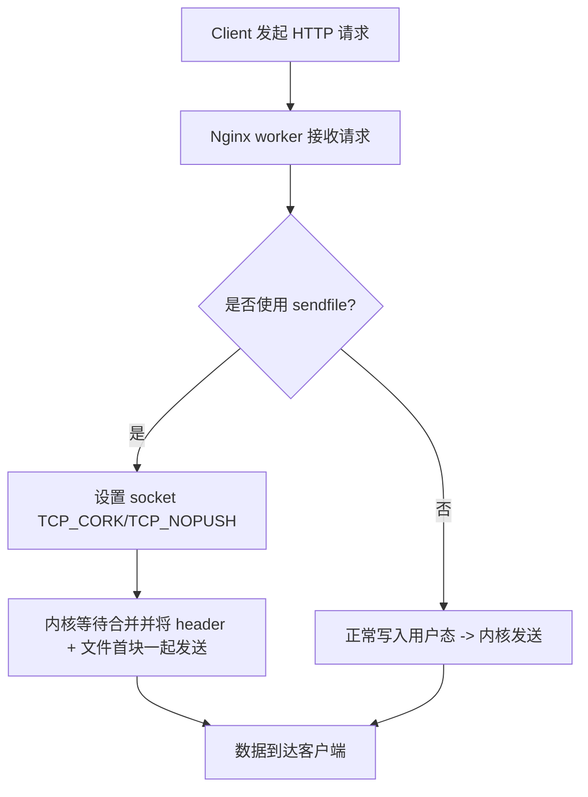

# **问题分析**

你要了解的指令是 tcp_nopush on;（Nginx 配置）。这是一个与操作系统 TCP 套接字选项相关联的性能调优项，主要在利用 sendfile / 静态文件分发时影响数据包的合并与发送时机。正确理解它与 sendfile、tcp_nodelay、SSL、gzip、proxy 等的相互作用，有助于在高并发/大文件场景下减少包数、降低 context-switch、提升吞吐，但在小响应或动态/加密内容下也会带来延迟或无效。

---

# **解决方案（概念与行为详解）**

- **作用（简述）**
    tcp_nopush on; 告诉内核对该 socket 使用“corking”行为（Linux 上对应 TCP_CORK，BSD/macOS 上对应 TCP_NOPUSH）。内核会把要发送的数据“塞住”不马上发出，直到：
    1. cork 被清除（Nginx 再切换回正常发送），或
    2. 缓冲区填满，或
    3. 发送操作完成触发的隐式刷新。

        这样可以把 HTTP 响应头部和文件数据合并到最少数量的 TCP 包里（通常把头部和首个数据块放在一起），减少包数和系统调用开销。
- **为什么常与 sendfile 连用**
    sendfile 将文件直接从内核页缓存发送到 socket（避免用户态复制）。如果没有 tcp_nopush，内核可能先把响应头发出（小包），随后再发送文件数据（多个包），导致头部和首数据包分离、多包。tcp_nopush on 可保证头部与文件的第一块一同发送，效果明显提升静态文件场景吞吐。
- **与 tcp_nodelay（Nagle） 的关系**
    - tcp_nodelay 直接影响 Nagle 算法（是否立即发小包）。tcp_nopush（TCP_CORK）与 Nagle（TCP_NODELAY）在内核层次上会相互影响：cork 意味着把小写操作合并，nodelay 则是立即发送小包。Nginx 在实现上会在适当时机设置/清除这些选项以避免冲突，但理解两者用途很重要：
        - 静态大文件：tcp_nopush on 有利，通常配合 sendfile on 使用；同时设置 tcp_nodelay on 可保证在 cork 清除后后续小控制包即时发送。
        - 动态小响应：优先 tcp_nodelay on（禁用 Nagle），不要依赖 tcp_nopush。
- **在 HTTPS（SSL/TLS）场景下**
    SSL/TLS 在用户态对数据加密，标准 sendfile 在多数情况下无法直接用于加密连接（因为加密需要用户态处理）。因此 tcp_nopush 在 HTTPS 下对 sendfile 的收益通常有限。简言之：**如果启用了 TLS，tcp_nopush 的效果会下降或无效**。
- **Proxy / upstream 场景**
    如果 Nginx 做反向代理（proxy_pass），且上游是 HTTP/1.1 streaming 或开启了代理缓冲，sendfile 未必被使用（或无效），此时 tcp_nopush 不会带来预期提升。
- **副作用/风险**
    - 对非常小且要求低延迟的响应，tcp_nopush on 可能引入可感知延迟（内核等待合并）。
    - 如果全局开启但大部分是动态/HTTPS 流量，可能没有收益反而增加复杂度。
    - 与长连接/keepalive、sendfile 大块传输互相作用时，可能需要配合 sendfile_max_chunk 限制一次发送大小以避免阻塞 worker。

---

# **配置示例（推荐做法与测试步骤）**

### **全局（http）推荐：静态文件服务场景**

```
http {
    sendfile          on;
    tcp_nopush        on;
    tcp_nodelay       on;
    # 限制单次 sendfile 最大块，避免长时间占用 worker
    sendfile_max_chunk 1m;

    server {
        listen 80;
        server_name example.com;

        location /static/ {
            # 静态文件目录
            root /var/www/html;
            # 对静态内容启用（可放到 http/server/location 任选其一）
            sendfile on;
            tcp_nopush on;
        }
    }
}
```

### **只在静态 location 使用（减少副作用）**

```
location /assets/ {
    sendfile on;
    tcp_nopush on;
    # 可以单独控制 tcp_nodelay，视需求决定
    tcp_nodelay on;
    root /var/www/assets;
}
```

### **测试与验证（在修改配置前请先检查权限并备份配置）**

1. 检查 nginx 配置语法并重载：

```
sudo nginx -t
sudo systemctl reload nginx
# 或 nginx -s reload
```

2. 使用 tcpdump 抓包观察响应包是否把头部与首个数据块合并：

```
# 抓包（把 <iface> 和 <client-ip> 替换成真实值）
sudo tcpdump -i <iface> -s 0 -w /tmp/nginx_capture.pcap tcp port 80 and host <client-ip>
# 生成请求
curl -v http://<nginx-ip>/static/largefile.bin -o /dev/null
# 停止抓包后在 Wireshark 中观察首个响应包大小和是否包含 HTTP body
```

3. 可对比：开启/关闭 tcp_nopush 的抓包差异，查看包数与首包是否包含数据。

---

# **流程图（简单示意 — 数据如何通过 Nginx/内核被合并发送）




---

# **注意事项与故障排查建议**

- **在执行前**：确认你有重载 Nginx 的权限，并备份当前配置。每次改动后用 nginx -t 验证语法。
- **SSL/TLS 场景**：若站点用 HTTPS，先确认是否仍使用 sendfile（大多数情形下 sendfile 对 TLS 无效），不要期望 tcp_nopush 带来明显改善。
- **gzip/压缩**：开启 gzip 会改变数据流（数据需先压缩，不能直接用 sendfile），因此 tcp_nopush 对 gzip 情况帮助有限。
- **proxy_pass/upstream**：代理场景下，检查是否启用 proxy_buffering、是否为 streaming 模式（会影响 sendfile 与 tcp_nopush 的效果）。
- **性能监控**：在高并发场景进行 A/B 测试（开启 vs 关闭），监控：
    - 带宽 / 吞吐（bytes/s）
    - 平均响应时间（p95/p99）
    - 系统调用 / context-switch 频率
    - 包统计（用 tcpdump 分析包数）
- **常见问题**：
    - 出现延迟：可能是 tcp_nopush 在等待合并，尝试仅在静态 location 打开或关闭该选项做对比。
    - 无明显收益：检查是否使用 sendfile、是否为 TLS 流量或是否有 gzip。
    - 大文件占用 worker：配合 sendfile_max_chunk 限制，避免单次 sendfile 长时间占用 worker 导致其他连接延迟。

---

如果你愿意，我可以：

1. 根据你当前的 Nginx 配置（贴出相关片段）给出针对性的优化建议；或者
2. 给出一套用于对比测试的脚本（自动化抓包 + curl 压测 + 报告），便于量化 tcp_nopush 的影响。
