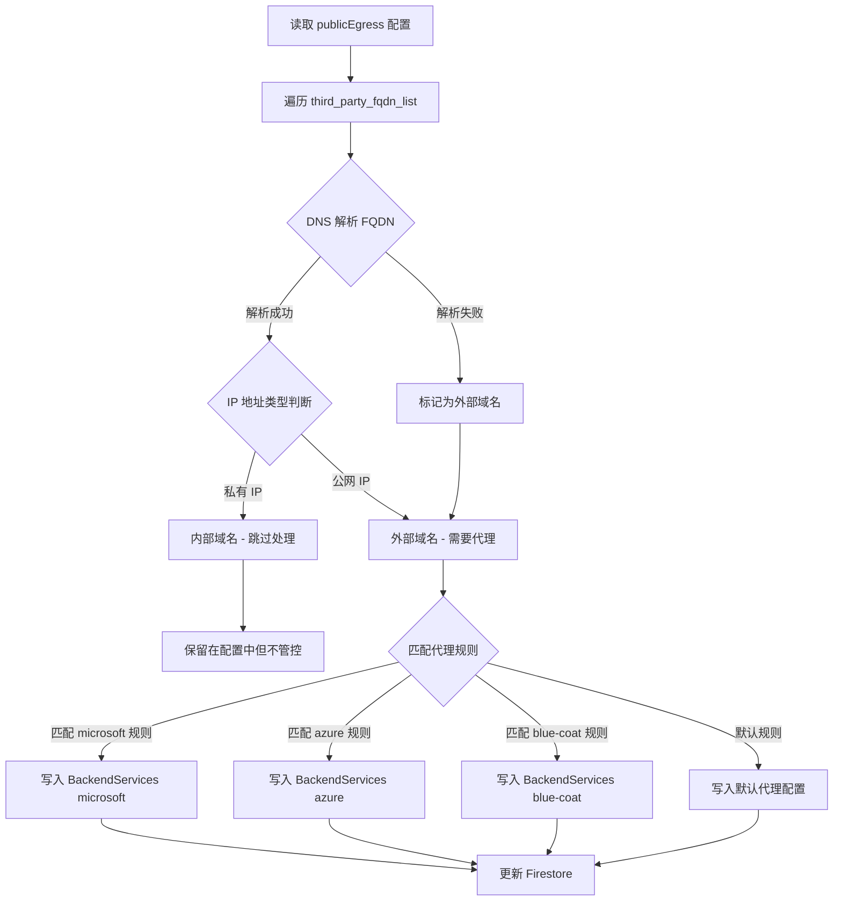
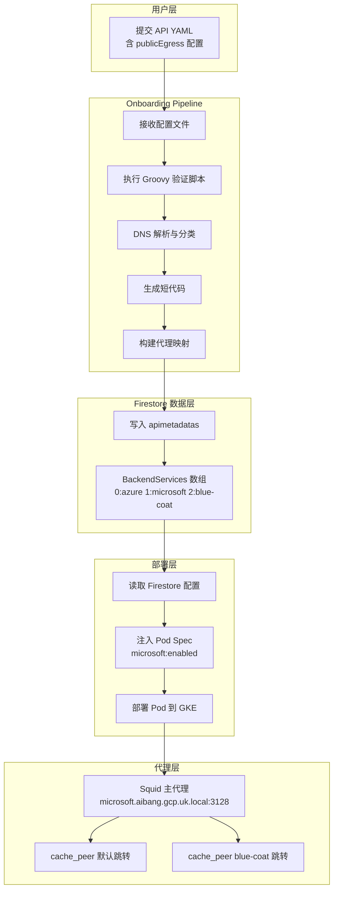
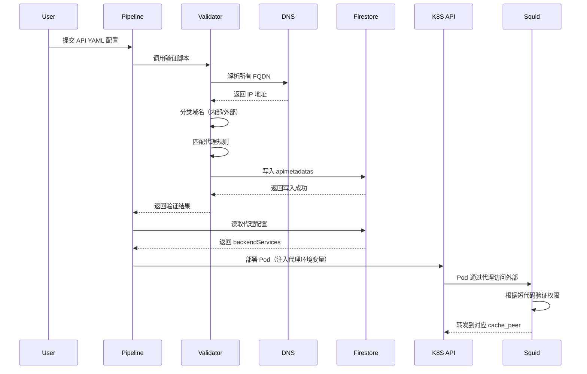

# Public Egress 管理优化方案

## 问题分析

当前需求核心点：

1. 用户在 onboarding 时配置第三方域名访问
2. 不同域名类型需要路由到不同代理（Squid cache_peer）
3. 新增 blue-coat 模式支持多跳代理
4. 需要在 onboarding pipeline 自动识别和分类域名
5. 用户无需关心代理模式细节，只需要最终的代理 FQDN

---

## 解决方案架构

### 1. 域名分类验证逻辑



### 2. 完整流程泳道图



---

## 实现方案

### 3. Groovy 验证脚本框架

```groovy
@Grab('com.google.cloud:google-cloud-firestore:3.0.0')
import com.google.cloud.firestore.*
import groovy.yaml.YamlSlurper

class PublicEgressValidator {
    
    // IP 地址类型判断
    static boolean isPrivateIP(String ip) {
        def patterns = [
            ~/^10\..*/,
            ~/^172\.(1[6-9]|2[0-9]|3[0-1])\..*/,
            ~/^192\.168\..*/,
            ~/^127\..*/,
            ~/^169\.254\..*/
        ]
        return patterns.any { ip ==~ it }
    }
    
    // DNS 解析并判断 IP 类型
    static String classifyFQDN(String fqdn) {
        try {
            def addresses = InetAddress.getAllByName(fqdn)
            def firstIP = addresses[0].getHostAddress()
            
            if (isPrivateIP(firstIP)) {
                return 'INTERNAL'
            } else {
                return 'EXTERNAL'
            }
        } catch (UnknownHostException e) {
            // 解析失败默认为外部域名
            return 'EXTERNAL'
        }
    }
    
    // 根据域名匹配代理规则
    static String matchProxyRule(String fqdn) {
        def rules = [
            'microsoft': [
                ~/.*\.microsoftonline\.com/,
                ~/.*\.microsoft\.com/,
                ~/login\.live\.com/
            ],
            'azure': [
                ~/.*\.azure\.com/,
                ~/.*\.azurewebsites\.net/
            ],
            'blue-coat': [
                ~/.*\.bluecoat\.com/,
                ~/.*\.symantec\.com/
            ]
        ]
        
        for (entry in rules) {
            if (entry.value.any { fqdn ==~ it }) {
                return entry.key
            }
        }
        
        return 'default'
    }
    
    // 主验证逻辑
    static Map<String, List<Map>> validatePublicEgress(Map config) {
        def result = [
            internal: [],
            external: [],
            backendServices: []
        ]
        
        def backendMap = [:]
        def fqdnList = config.publicEgress?.third_party_fqdn_list ?: []
        
        fqdnList.each { entry ->
            def fqdn = entry.fqdn
            def port = entry.port
            def classification = classifyFQDN(fqdn)
            
            if (classification == 'INTERNAL') {
                result.internal << [fqdn: fqdn, port: port]
                println "✓ 内部域名跳过: ${fqdn} (私有 IP)"
            } else {
                def proxyType = matchProxyRule(fqdn)
                result.external << [
                    fqdn: fqdn, 
                    port: port, 
                    proxyType: proxyType
                ]
                
                if (!backendMap.containsKey(proxyType)) {
                    backendMap[proxyType] = result.backendServices.size()
                    result.backendServices << [
                        index: result.backendServices.size(),
                        type: proxyType,
                        enabled: true,
                        fqdns: []
                    ]
                }
                
                def index = backendMap[proxyType]
                result.backendServices[index].fqdns << fqdn
                
                println "✓ 外部域名: ${fqdn} -> 代理类型: ${proxyType}"
            }
        }
        
        return result
    }
    
    // 生成短代码
    static String generateShortCode(String apiName) {
        def hash = apiName.hashCode().abs()
        return hash.toString(36).take(6).toUpperCase()
    }
    
    // 写入 Firestore
    static void writeToFirestore(String apiName, Map<String, List<Map>> validationResult) {
        // Firestore 初始化（需要配置 GCP 认证）
        def firestore = FirestoreOptions.getDefaultInstance().getService()
        
        def shortCode = generateShortCode(apiName)
        def docRef = firestore.collection('apimetadatas').document(apiName)
        
        def data = [
            shortCode: shortCode,
            backendServices: validationResult.backendServices,
            updatedAt: FieldValue.serverTimestamp()
        ]
        
        docRef.set(data, SetOptions.merge())
        println "✓ 已写入 Firestore: apimetadatas/${apiName}"
        println "  - 短代码: ${shortCode}"
        println "  - 代理服务数: ${validationResult.backendServices.size()}"
    }
}

// 使用示例
def yamlContent = '''
publicEgress:
  enabled: true
  third_party_fqdn_list:
    - fqdn: user-ai-api.azure.com
      port: 443
    - fqdn: login.microsoftonline.com
      port: 443
    - fqdn: internal-service.aibang.gcp.uk.local
      port: 8080
    - fqdn: api.bluecoat.com
      port: 443
'''

def config = new YamlSlurper().parseText(yamlContent)
def result = PublicEgressValidator.validatePublicEgress(config)

// 输出验证结果
println "\n=== 验证结果 ==="
println "内部域名 (跳过): ${result.internal.size()} 个"
println "外部域名 (需代理): ${result.external.size()} 个"
println "\n后端服务配置:"
result.backendServices.each { service ->
    println "  [${service.index}] ${service.type}: ${service.fqdns.join(', ')}"
}

// 写入 Firestore
PublicEgressValidator.writeToFirestore('my-api', result)
```

---

### 4. Pod Deployment 模板注入

```yaml
apiVersion: apps/v1
kind: Deployment
metadata:
  name: user-api-deployment
spec:
  template:
    spec:
      containers:
      - name: app
        env:
        # 从 Firestore 读取并注入
        - name: PROXY_MICROSOFT_ENABLED
          value: "true"
        - name: PROXY_MICROSOFT_HOST
          value: "microsoft.aibang.gcp.uk.local"
        - name: PROXY_MICROSOFT_PORT
          value: "3128"
        - name: PROXY_AZURE_ENABLED
          value: "true"
        - name: PROXY_BLUE_COAT_ENABLED
          value: "false"
        # 短代码用于 Squid ACL 验证
        - name: API_SHORT_CODE
          value: "A3X9K2"
```

---

### 5. Squid 配置示例（支持 blue-coat 模式）

```bash
# /etc/squid/squid.conf

# ACL 定义 - 基于短代码
acl api_a3x9k2 src 10.0.1.0/24  # 从 Firestore 动态生成

# 代理规则匹配
acl microsoft_domains dstdomain .microsoftonline.com .microsoft.com
acl azure_domains dstdomain .azure.com .azurewebsites.net
acl bluecoat_domains dstdomain .bluecoat.com .symantec.com

# 默认 cache_peer
cache_peer default-proxy.example.com parent 3128 0 no-query default

# Blue-coat cache_peer（新增）
cache_peer blue-coat-proxy.example.com parent 8080 0 no-query round-robin

# 路由规则
cache_peer_access default-proxy.example.com allow microsoft_domains
cache_peer_access default-proxy.example.com allow azure_domains
cache_peer_access blue-coat-proxy.example.com allow bluecoat_domains

# 短代码验证
http_access allow api_a3x9k2 microsoft_domains
http_access allow api_a3x9k2 azure_domains
http_access deny all
```

---

## 数据结构设计

### 6. Firestore 数据模型

```javascript
// Collection: apimetadatas
// Document: {apiName}
{
  "shortCode": "A3X9K2",
  "backendServices": [
    {
      "index": 0,
      "type": "azure",
      "enabled": true,
      "proxyHost": "azure.aibang.gcp.uk.local",
      "proxyPort": 3128,
      "fqdns": [
        "user-ai-api.azure.com",
        "storage.azure.com"
      ]
    },
    {
      "index": 1,
      "type": "microsoft",
      "enabled": true,
      "proxyHost": "microsoft.aibang.gcp.uk.local",
      "proxyPort": 3128,
      "fqdns": [
        "login.microsoftonline.com",
        "graph.microsoft.com"
      ]
    },
    {
      "index": 2,
      "type": "blue-coat",
      "enabled": false,
      "proxyHost": "blue-coat.aibang.gcp.uk.local",
      "proxyPort": 8080,
      "fqdns": []
    }
  ],
  "createdAt": "2025-12-31T10:30:00Z",
  "updatedAt": "2025-12-31T10:30:00Z"
}
```

---

## 部署流程时序图



---

## 注意事项

### 安全考虑

- DNS 解析超时设置为 5 秒，避免阻塞 pipeline
- Firestore 写入失败需要重试机制（最多 3 次）
- 短代码需要定期轮换（建议 90 天）
- Squid ACL 需要同步更新，避免权限漏洞

### 性能优化

- DNS 解析结果缓存 5 分钟
- Firestore 批量写入减少 API 调用
- Pipeline 异步处理验证逻辑

### 监控告警

- 记录所有域名分类结果到日志
- 监控 Firestore 写入失败率
- Squid 代理访问日志审计

### 最佳实践

1. **渐进式迁移**：先在测试环境验证完整流程
2. **向后兼容**：保留旧配置格式的支持路径
3. **文档同步**：更新用户 onboarding 文档
4. **灰度发布**：按 API 数量逐步启用新验证逻辑

---

## 后续优化方向

### 短期（1-2 周）

- [ ] 实现基础 DNS 解析和分类
- [ ] 完成 Groovy 脚本集成到 pipeline
- [ ] 测试 Firestore 写入和读取

### 中期（1 个月）

- [ ] 增加更多代理规则匹配模式
- [ ] 支持正则表达式域名匹配
- [ ] 实现短代码自动轮换机制

### 长期（3 个月）

- [ ] 支持用户自定义代理规则
- [ ] 实现智能路由选择（基于延迟和可用性）
- [ ] 提供 Web UI 管理界面

---

这个方案将复杂的逻辑封装在 onboarding pipeline 中，用户只需要配置域名列表，系统自动完成分类、代理分配和权限管理。是否需要我进一步细化某个模块的实现细节？