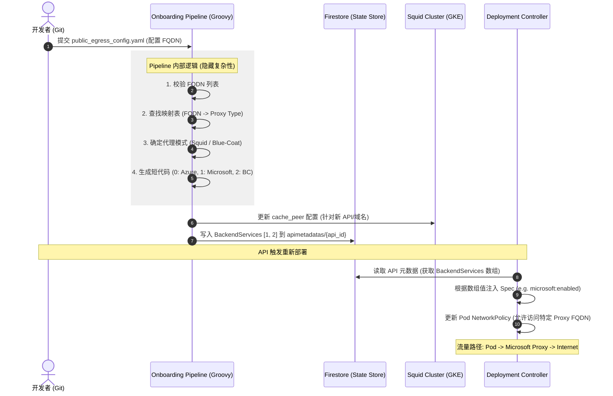

# GCP API Platform: Public Egress Onboarding 架构演进文档

## 1. 业务背景与需求概述

随着平台 API 对外部第三方服务（如 Azure, Microsoft, SaaS 工具等）访问需求的增加，我们需要对出口流量进行更精细的管理。

### 核心变更点：
- **代理拆分**：不再使用单一全局代理，而是根据目标域名（FQDN）路由到特定的内部代理实例（如 Squid）。
- **多模式支持**：引入 **Blue-Coat** 代理模式，通过 Squid 的 `cache_peer` 机制实现二级跳。
- **自动化集成**：
    1. **Onboarding 阶段**：自动识别代理模式并分配“短代码”。
    2. **元数据管理**：短代码存储在 Firestore 的 `apimetadatas/BackendServices` 数组中。
    3. **部署阶段**：根据元数据在 API Deployment 中注入对应的环境变量或 Label（如 `microsoft:enabled`）。

---

## 2. 系统架构流程图 (Swimlane)

该流程展示了从用户修改配置文件到最终 API 部署的闭环逻辑。



---

## 3. 数据映射逻辑 (Internal Mapping Table)

用户只需配置 `fqdn`，Pipeline 内部维护一张映射表来处理所有后台逻辑。

### 逻辑表设计示例：

| 目标域名 (Target FQDN) | 内部代理 FQDN (Proxy FQDN) | 短代码 (Shortcode) | 代理模式 (Mode) | 注入标记 (Label/Spec) |
| :--- | :--- | :--- | :--- | :--- |
| `*.azure.com` | `azure.aibang.gcp.uk.local` | `0` | Direct Squid | `azure:enabled` |
| `login.microsoftonline.com` | `microsoft.aibang.gcp.uk.local` | `1` | Direct Squid | `microsoft:enabled` |
| `third-party-saas.Saas.com` | `bc.aibang.gcp.uk.local` | `2` | **Blue-Coat** | `bluecoat:enabled` |

---

## 4. Firestore 数据模型

在 Firestore 的 `apimetadatas` 集合中，我们通过一个整型数组来维护该 API 启用的后端服务能力。

```json
// Firestore Document: apimetadatas/my-test-api
{
  "apiId": "my-test-api",
  "team": "search-team",
  "publicEgress": {
    "enabled": true
  },
  "BackendServices": [0, 1], // 0=Azure, 1=Microsoft
  "updatedAt": "2025-12-31T08:00:00Z"
}
```

---

## 5. Pipeline (Groovy) 实现建议

在 Onboarding 流程中，建议通过 Groovy 脚本实现以下伪代码逻辑：

```groovy
def processPublicEgress(config) {
    if (!config.publicEgress.enabled) return

    def activeBackends = []
    config.third_party_fadn_list.each { entry ->
        // 根据 FQDN 匹配内部预定义的代理配置
        def proxyInfo = MappingTable.find(entry.fqdn)
        
        if (proxyInfo) {
            println "Mapping FQDN ${entry.fqdn} to Proxy: ${proxyInfo.name} (Mode: ${proxyInfo.mode})"
            activeBackends << proxyInfo.shortcode
            
            // 如果是 Blue-Coat 模式，可能需要额外的 cache_peer 处理
            if (proxyInfo.mode == "blue-coat") {
                updateSquidCachePeer(proxyInfo.upstream)
            }
        }
    }

    // 更新 Firestore (需保证原子性)
    firestoreService.updateBackendServices(apiId, activeBackends.unique())
}
```

---

## 6. 核心优势与最佳实践

```infographic
infographic list-grid-badge-card
data
  title 方案优势总结
  items
    - label 屏蔽复杂性
      value 用户感知不到 Blue-Coat 或 Squid 的切换，只需关注业务域名。
      icon mdi/shield-check
    - label 细粒度控制
      value 基于短代码的注入，确保只有授权的 Pod 能够解析和访问特定代理。
      icon mdi/security
    - label 动态可扩展
      value 新增模式（如另一个下一跳代理）只需在 Pipeline 映射表中添加一行配置。
      icon mdi/arrow-expand
    - label 审计与可追溯
      value Firestore 记录了所有 API 的后端权限状态，方便 BigQuery 分析流量来源。
      icon mdi/database-search
```

## 7. 风险点与注意事项

1. **一 API 一代理约束**：目前设计支持一个 API 对应多个短代码（数组），但如果物理代理 FQDN 不同，需确保用户 Pod 的网络策略（NetworkPolicy）能同时覆盖。
2. **Squid 配置同步**：当 Pipeline 更新 `cache_peer` 时，需确保 Squid 集群能够平滑重载（Reload）而不中断现有连接。
3. **缓存一致性**：Firestore 写入后，Deployment 服务需能够及时感知变更并触发同步。

---
*Generated by Alma @ 2025-12-31*
