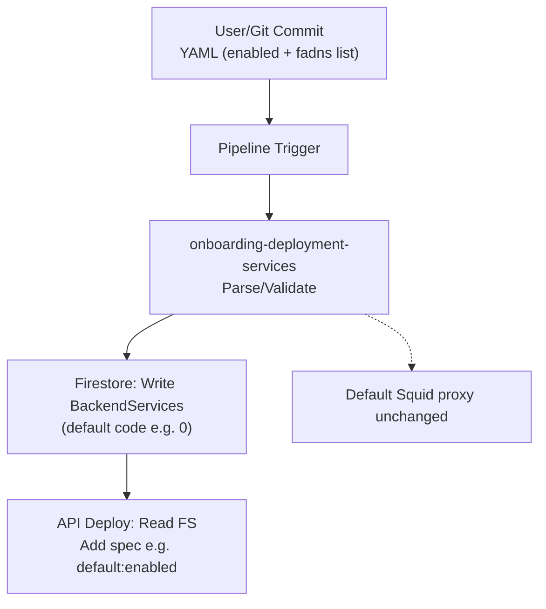
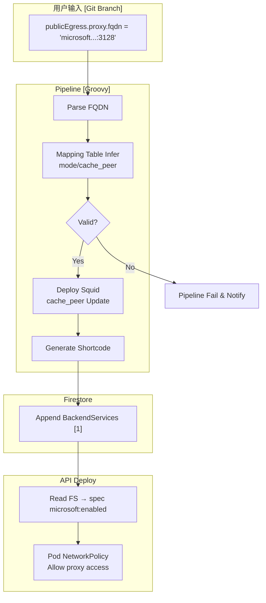

# GCP API Platform Public Egress Onboarding Enhancement

整理 `public_egress_config.yaml` 的增强方案，支持第三方出口域名拆分与多代理模式（Squid + Blue-Coat）。目标：用户仅提供代理 FQDN，平台 Pipeline 内部处理模式映射、Squid 配置与 Firestore 写入。

## 当前状态分析

### public_egress_config.yaml 示例

```yaml
## public egress yaml file on API Level 

publicEgress:
   ## enabled indicate if this API will need to go out from abjx or not 
   ## only with value true, this API can reach to fadns list in third_party_fadn_list part 

   enabled: true
## update below list to set the external connectivity 

  third_party_fadn_list:
    - fqdn: user-ai-api.azure.com
      port: 443
    - fqdn: login.microsoftonline.com
      port: 443

```

**特点**：用户维护目标 FQDN 列表，走**默认单一代理**。Firestore `apimetadatas/BackendServices` 写入默认短代码（e.g., 0: azure）。

### 当前流程图



## 新需求

- **域名拆分**：e.g., `login.microsoftonline.com` → `microsoft.aibang.gcp.uk.local:3128` (Squid)
- **多模式支持**：新增 `blue-coat` 模式，Squid 通过 `cache_peer` 区分下一跳
- **用户体验**：用户**仅提供代理 FQDN**，不关心模式
- **唯一性**：一 API 一代理（代理支持多外部 FQDN）
- **Pod 控制**：Firestore 短代码 → Deploy spec label (e.g., `microsoft:enabled`)

## 最佳实验方案

### 控制点：**Onboarding Pipeline Groovy 脚本**

用户不关心内部逻辑，全部封装在 Pipeline 中。

#### 1. YAML Schema 优化

```yaml
publicEgress:
  enabled: true
  proxy:
    fqdn: "microsoft.aibang.gcp.uk.local:3128"  # 用户唯一输入

    # mode: auto (inferred)

```

移除 `third_party_fadn_list`，平台预定义 per 代理支持的 FQDN。

#### 2. Pipeline Groovy 伪代码

```groovy
def proxyFqdn = config.publicEgress.proxy.fqdn
def mapping = [
  ~/microsoft\\.aibang\\.gcp\\.uk\\.local:3128/: [code: 1, name: 'microsoft', mode: 'squid', cache_peer: 'ms-peer.internal:3128'],
  ~/bluecoat\\.aibang\\.gcp\\.uk\\.local:3128/: [code: 2, name: 'blue-coat', mode: 'bluecoat', cache_peer: 'bc-peer.internal:8080'],
  ~/azure\\.aibang\\.gcp\\.uk\\.local:3128/: [code: 0, name: 'azure', mode: 'squid', cache_peer: 'azure-peer.internal:3128']
]

def proxyConfig = mapping.findResult { k, v -> proxyFqdn ==~ k ? v : null }
if (!proxyConfig) {
  error("Unsupported proxy FQDN: ${proxyFqdn}")
}

// 幂等部署 Squid
kubectl apply -f squid-config.yaml --dry-run=client \\
  | sed "s/cache_peer .*/cache_peer ${proxyConfig.cache_peer}/"
  | kubectl apply -f -

// Firestore 更新 (Transaction)
def apiDoc = firestore.collection('apimetadatas').document(apiMetadataId)
def current = apiDoc.get().data
if (!current.BackendServices?.contains(proxyConfig.code)) {
  apiDoc.update([
    BackendServices: current.BackendServices + [proxyConfig.code]
  ])
}

```

#### 3. 增强流程图 (泳道图)



## 风险评估 & 缓解 (SWOT)

| 维度 | 详细内容 |
| :--- | :--- |
| **威胁 (Threats)** | - FQDN 映射错误 → 单元测试 Pipeline stage<br/>- Squid 配置覆盖 → ConfigMap 版本化 |
| **弱点 (Weaknesses)** | - Firestore 并发 → 使用 Transaction<br/>- 旧用户兼容 → Dual-parser |
| **机会 (Opportunities)** | - 扩展新代理 → Mapping Table YAML<br/>- 审计日志 → BigQuery Pipeline Events |
| **优势 (Strengths)** | - GitOps 幂等 → 标准 & 可回滚<br/>- 用户简洁 → 只 FQDN |

## 迁移策略

1. **兼容旧 YAML**：Pipeline 先 check `third_party_fadn_list`，fallback 默认代理
2. **渐进迁移**：新 Onboarding 用新 schema，监控 BigQuery 成功率
3. **回滚机制**：Firestore 支持 remove BackendServices[index]
4. **测试计划**：E2E test 新/旧 YAML

## 实施推荐

- **立即**：实现 Groovy mapping prototype
- **短期**：Update YAML schema + Pipeline stage
- **长期**：Secret Manager 存 cache_peer，RBAC Pod access

---
*文档生成日期：2025-12-31*
*基于 ob Skill & 当前 codebase*