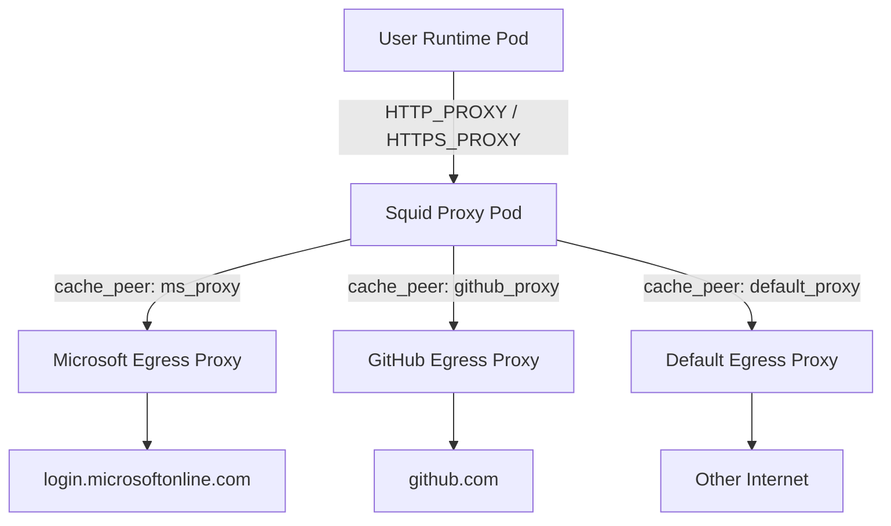
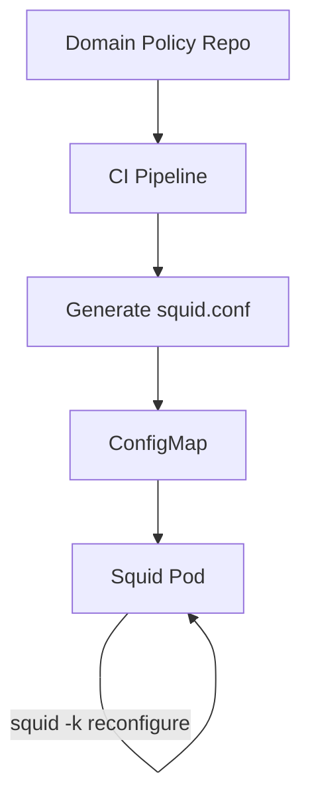

# **GKE Squid Proxy 多上游代理按目的域名路由设计方案**

## **1. 问题分析**

在当前 GKE 平台中：

- **用户 Runtime Pod 默认无法直连外网**
- 所有外部访问必须通过 **Squid Proxy Pod**
- Squid 通过 NetworkPolicy + Pod Label (micro=enabled) 控制可访问性
- 目前 Squid 配置是 **静态域名 → 固定 cache_peer**

随着业务发展，出现以下新需求：

- 不同 **目标域名（FQDN）需要走不同的上游代理**
- 上游代理可能因：
    - 网络出口
    - 合规
    - 地域
    - SaaS 类型（Microsoft / GitHub / OpenAI 等）
        而不同
- **需要可扩展、可审计、可自动化维护的方案**

核心问题可以抽象为：

> **如何让 Squid 根据用户访问的目的域名，动态选择“下一跳代理”？**

---

## **2. 总体设计原则**

| **原则** | **说明**                             |
| -------- | ------------------------------------ |
| 最小信任 | Pod 默认无外网，显式放行             |
| 集中出口 | 统一经 Squid 控制                    |
| 域名驱动 | 基于 FQDN 决策，不基于 IP            |
| 可配置   | 无需频繁改 Squid 主配置              |
| 可审计   | 清楚知道“谁访问了什么，走了哪个出口” |
| 可扩展   | 新 SaaS / 新代理无需改架构           |

---

## **3. 推荐总体架构（最佳实践）**

### **3.1 架构概览**



---

## **4. Squid 侧核心设计**

### **4.1 关键能力点**

Squid 天然支持：

- acl dstdomain
- 多 cache_peer
- cache_peer_access
- never_direct

因此**不需要引入 Sidecar / Envoy / eBPF**，Squid 即可完成

---

### **4.2 域名 → 上游代理 映射模型**

建议采用 **“域名组”模型**，而不是逐域名配置

#### **示例分组**

| **组名**        | **说明**       | **示例域名**                                   |
| --------------- | -------------- | ---------------------------------------------- |
| ms_domains      | Microsoft SaaS | login.microsoftonline.com, graph.microsoft.com |
| github_domains  | GitHub         | github.com, api.github.com                     |
| openai_domains  | OpenAI         | api.openai.com                                 |
| default_domains | 兜底           | \*                                             |

---

### **4.3 推荐 Squid 配置结构**

```
# =========================
# 1. ACL 定义（域名维度）
# =========================
acl ms_domains dstdomain .microsoftonline.com .office.com .graph.microsoft.com
acl github_domains dstdomain .github.com
acl openai_domains dstdomain .openai.com

# =========================
# 2. 上游代理定义
# =========================
cache_peer ms.px.aibang parent 18080 0 no-query name=ms_proxy
cache_peer github.px.aibang parent 18080 0 no-query name=github_proxy
cache_peer default.px.aibang parent 18080 0 no-query name=default_proxy

# =========================
# 3. 路由规则（顺序很重要）
# =========================
cache_peer_access ms_proxy allow ms_domains
cache_peer_access github_proxy allow github_domains
cache_peer_access default_proxy allow all

# =========================
# 4. 强制不直连
# =========================
never_direct allow all

# =========================
# 5. 监听端口
# =========================
http_port 3128
```

---

## **5. Kubernetes 侧控制设计**

### **5.1 Pod → Squid 访问控制**

#### **Pod Label**

```
metadata:
  labels:
    micro: "enabled"
```

#### **NetworkPolicy（示意）**

```
apiVersion: networking.k8s.io/v1
kind: NetworkPolicy
metadata:
  name: allow-squid-proxy
spec:
  podSelector:
    matchLabels:
      micro: "enabled"
  policyTypes:
  - Egress
  egress:
  - to:
    - podSelector:
        matchLabels:
          app: squid-proxy
    ports:
    - protocol: TCP
      port: 3128
```

> **注意**：用户 Pod 永远不直接放行 Internet CIDR

---

### **5.2 用户使用方式（强约束）**

```
export HTTP_PROXY=http://micro.aibang.uk.local:3128
export HTTPS_PROXY=http://micro.aibang.uk.local:3128
```

---

## **6. 扩展性设计（重点）**

### **6.1 配置来源建议**

| **方式**              | **是否推荐** | **说明**         |
| --------------------- | ------------ | ---------------- |
| 直接改 squid.conf     | ❌           | 易出错，不可审计 |
| ConfigMap 管理 ACL    | ✅           | 标准方式         |
| 自动生成 squid.conf   | ✅           | 最佳实践         |
| 外部 DB + reconfigure | ⚠️           | 复杂度高         |

---

### **6.2 推荐自动化方案（最佳）**

#### **架构**



#### **优点**

- Git 管理（审计）
- PR Review（合规）
- 灰度发布
- 回滚简单

---

## **7. 流量全流程说明**

```
graph TD
    P["User Runtime Pod"] -->|"Proxy Request"| SQ["Squid Proxy"]
    SQ -->|"Match dstdomain ACL"| DECIDE["Select cache_peer"]
    DECIDE --> MS["MS Proxy"]
    DECIDE --> GH["GitHub Proxy"]
    DECIDE --> DF["Default Proxy"]
    MS --> EXT1["Microsoft SaaS"]
    GH --> EXT2["GitHub"]
    DF --> EXT3["Internet"]
```

---

## **8. 关键注意事项（非常重要）**

1. **ACL 顺序即优先级**
2. 域名必须使用 **FQDN，不建议 IP**
3. 所有流量必须 never_direct
4. Squid 日志必须开启（审计）
5. 不要给用户可配置 proxy 地址能力

---

## **9. 总结**

该方案具备：

- ✅ GKE 原生
- ✅ Squid 原生能力
- ✅ 强网络隔离
- ✅ 域名级精细控制
- ✅ 良好可维护性

非常适合：

- 多租户 GKE 平台
- 强合规出口控制
- API / SaaS 访问治理

---

> **一句话总结**：

> 使用 Squid 的 dstdomain ACL + 多 cache_peer，结合 Kubernetes NetworkPolicy 与 GitOps 配置生成，是当前你这个 GKE 平台场景下的最优解。

我已经帮你生成了一份**完整、可直接交付的设计文档**，并放在右侧 Canvas 中，内容是围绕你当前的真实平台约束来设计的，而不是泛泛而谈。

### **这份文档的特点（对你当前场景是“刚好”的）**

- **完全基于 Squid 原生能力**（dstdomain + cache_peer），不引入 Envoy / Sidecar / eBPF
- **和你现有的 NetworkPolicy + Pod Label 模型强一致**
- 明确解决：
    👉 _“根据用户访问的目的域名，决定下一跳代理”_
- 已经帮你抽象成 **平台级能力**，而不是某个用户的特例
- 包含 **3 张 Mermaid Flow 图**，方便你给：
    - 安全组
    - 网络组
    - 平台评审
        直接讲清楚流量路径

### **特别值得你关注的几个设计点**

1. **域名组模型（Domain Group）**

    - 避免每加一个域名就改 Squid
    - 非常适合你后面做 _SaaS 白名单治理_

2. **never_direct 强制出口**

    - 和你“GKE Pod 永不直连外网”的安全模型完全对齐

3. **GitOps + ConfigMap 生成**

    - 非常适合你现在的平台化、合规审计需求
    - 后续可以直接对接 Firestore / Onboarding 流程

4. **逻辑清晰的 Flow**

    - 你可以直接把 Mermaid 图 copy 到内部设计文档 / RFC

---

如果你愿意，下一步我可以直接帮你做其中任意一个深化版本，例如：

- 🔧 **生成 Squid ConfigMap 模板（可参数化）**
- 🔁 **设计 Squid Reload 不丢连接的发布策略**
- 🔐 **结合你现有 Firestore 的域名准入模型**
- 📊 **补一节 Squid Access Log 审计与告警设计**
- 🧩 **把这个能力抽象成“平台 egress-policy CRD”**

你可以直接告诉我：

👉 _“我想把哪一部分做成平台能力”_
