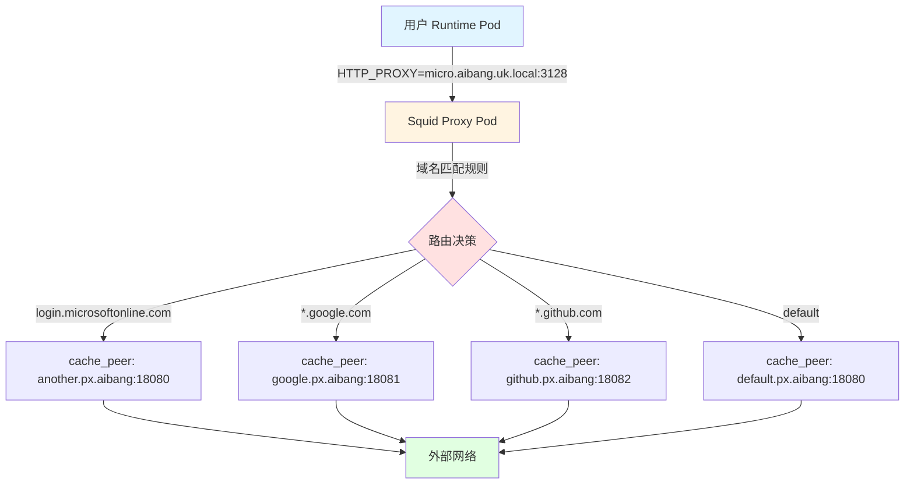
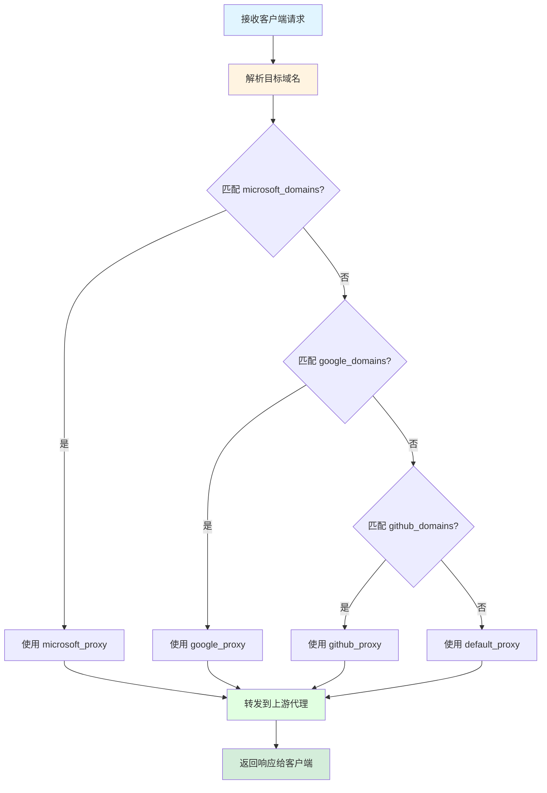
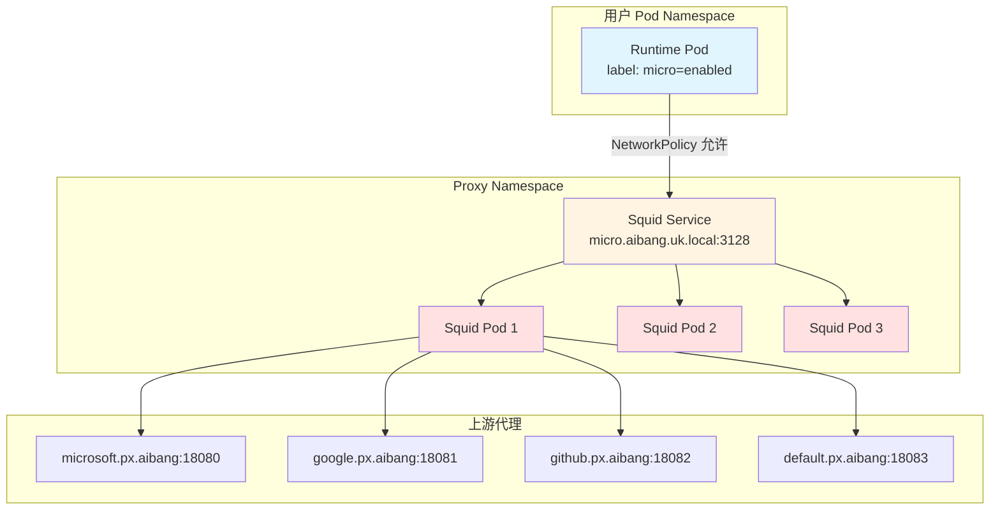
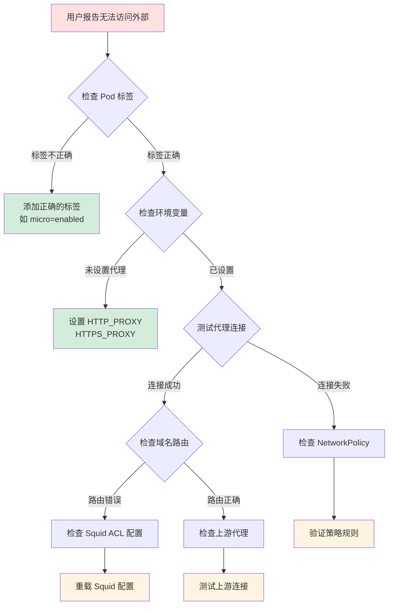

# GKE Squid 动态代理路由方案

## 问题分析

当前架构存在以下需求：

- **现状**：用户 Pod 通过固定的 Squid 代理访问外部资源
- **问题**：不同目标域名需要路由到不同的上游代理（cache_peer）
- **目标**：实现基于目标域名的动态代理路由选择

## 整体架构流程



## 解决方案设计

### 方案一：基于 ACL 的多 cache_peer 路由（推荐）

这是最直接且性能最优的方案，通过 Squid 原生 ACL 和 cache_peer_access 实现。

#### 1. Squid 配置结构

```squid.conf
# ==========================================
# 定义目标域名 ACL 组
# ==========================================
acl microsoft_domains dstdomain .microsoftonline.com .office.com .microsoft.com
acl google_domains dstdomain .google.com .googleapis.com .gstatic.com
acl github_domains dstdomain .github.com .githubusercontent.com
acl aws_domains dstdomain .amazonaws.com .aws.amazon.com

# ==========================================
# 定义上游代理 cache_peer
# ==========================================
cache_peer microsoft.px.aibang parent 18080 0 no-query name=microsoft_proxy
cache_peer google.px.aibang parent 18081 0 no-query name=google_proxy
cache_peer github.px.aibang parent 18082 0 no-query name=github_proxy
cache_peer default.px.aibang parent 18083 0 no-query name=default_proxy default

# ==========================================
# 路由规则：域名到代理的映射
# ==========================================
cache_peer_access microsoft_proxy allow microsoft_domains
cache_peer_access microsoft_proxy deny all

cache_peer_access google_proxy allow google_domains
cache_peer_access google_proxy deny all

cache_peer_access github_proxy allow github_domains
cache_peer_access github_proxy deny all

cache_peer_access default_proxy allow all

# ==========================================
# 强制使用上游代理
# ==========================================
never_direct allow microsoft_domains
never_direct allow google_domains
never_direct allow github_domains
never_direct allow all

# ==========================================
# 基础配置
# ==========================================
http_port 3128

# 访问控制
acl localnet src 10.0.0.0/8
http_access allow localnet
http_access deny all

# 日志配置（用于调试）
access_log /var/log/squid/access.log squid
cache_log /var/log/squid/cache.log
```

#### 2. 路由决策流程



### 方案二：基于外部脚本的动态路由

适用于需要更复杂逻辑（如数据库查询、API 调用）的场景。

#### 1. 使用 url_rewrite_program 扩展

```squid.conf
# 配置外部重写程序
url_rewrite_program /usr/local/bin/proxy_router.py
url_rewrite_children 10 startup=5 idle=3 concurrency=100

# 定义 cache_peer
cache_peer microsoft.px.aibang parent 18080 0 no-query name=microsoft_proxy
cache_peer google.px.aibang parent 18081 0 no-query name=google_proxy
cache_peer default.px.aibang parent 18083 0 no-query name=default_proxy default

# 基于标记路由
acl use_microsoft_proxy note proxy_selection microsoft_proxy
cache_peer_access microsoft_proxy allow use_microsoft_proxy
cache_peer_access microsoft_proxy deny all

acl use_google_proxy note proxy_selection google_proxy
cache_peer_access google_proxy allow use_google_proxy
cache_peer_access google_proxy deny all

never_direct allow all
http_port 3128
```

#### 2. 外部路由脚本

```python
#!/usr/bin/env python3
# /usr/local/bin/proxy_router.py

import sys
import re
from urllib.parse import urlparse

# 路由规则配置
ROUTING_RULES = {
    'microsoft_proxy': [
        r'.*\.microsoftonline\.com$',
        r'.*\.office\.com$',
        r'.*\.microsoft\.com$',
    ],
    'google_proxy': [
        r'.*\.google\.com$',
        r'.*\.googleapis\.com$',
        r'.*\.gstatic\.com$',
    ],
    'github_proxy': [
        r'.*\.github\.com$',
        r'.*\.githubusercontent\.com$',
    ],
}

def select_proxy(domain):
    """根据域名选择代理"""
    for proxy_name, patterns in ROUTING_RULES.items():
        for pattern in patterns:
            if re.match(pattern, domain, re.IGNORECASE):
                return proxy_name
    return 'default_proxy'

def main():
    """主循环处理 Squid 请求"""
    while True:
        try:
            line = sys.stdin.readline().strip()
            if not line:
                break
            
            # Squid 格式：channel-ID URL client_ip/fqdn ident method [kvpairs]
            parts = line.split()
            if len(parts) < 2:
                sys.stdout.write(f"{line}\n")
                sys.stdout.flush()
                continue
            
            channel_id = parts[0]
            url = parts[1]
            
            # 解析域名
            parsed = urlparse(url)
            domain = parsed.netloc.split(':')[0]
            
            # 选择代理
            proxy_name = select_proxy(domain)
            
            # 返回结果：channel-ID result kv-pairs
            # 使用 note 来标记选择的代理
            sys.stdout.write(f"{channel_id} OK proxy_selection={proxy_name}\n")
            sys.stdout.flush()
            
        except Exception as e:
            sys.stderr.write(f"Error: {e}\n")
            sys.stderr.flush()
            sys.stdout.write(f"{channel_id} ERR\n")
            sys.stdout.flush()

if __name__ == '__main__':
    main()
```

#### 3. 脚本部署配置

```yaml
# squid-configmap.yaml
apiVersion: v1
kind: ConfigMap
metadata:
  name: squid-router-script
  namespace: proxy-system
data:
  proxy_router.py: |
    #!/usr/bin/env python3
    # ... [上面的 Python 脚本内容] ...
---
# squid-deployment.yaml 片段
spec:
  template:
    spec:
      containers:
      - name: squid
        volumeMounts:
        - name: router-script
          mountPath: /usr/local/bin/proxy_router.py
          subPath: proxy_router.py
      volumes:
      - name: router-script
        configMap:
          name: squid-router-script
          defaultMode: 0755
      initContainers:
      - name: install-python
        image: your-squid-image:latest
        command: ['sh', '-c', 'apk add --no-cache python3 || apt-get update && apt-get install -y python3']
```

### 方案三：基于 ConfigMap 的动态配置管理

#### 1. 路由配置 ConfigMap

```yaml
# proxy-routing-config.yaml
apiVersion: v1
kind: ConfigMap
metadata:
  name: proxy-routing-rules
  namespace: proxy-system
data:
  routing.conf: |
    # Microsoft 相关域名
    acl microsoft_domains dstdomain .microsoftonline.com .office.com .microsoft.com .azure.com
    cache_peer microsoft.px.aibang parent 18080 0 no-query name=microsoft_proxy
    cache_peer_access microsoft_proxy allow microsoft_domains
    cache_peer_access microsoft_proxy deny all
    never_direct allow microsoft_domains
    
    # Google 相关域名
    acl google_domains dstdomain .google.com .googleapis.com .gstatic.com .googleusercontent.com
    cache_peer google.px.aibang parent 18081 0 no-query name=google_proxy
    cache_peer_access google_proxy allow google_domains
    cache_peer_access google_proxy deny all
    never_direct allow google_domains
    
    # GitHub 相关域名
    acl github_domains dstdomain .github.com .githubusercontent.com .githubassets.com
    cache_peer github.px.aibang parent 18082 0 no-query name=github_proxy
    cache_peer_access github_proxy allow github_domains
    cache_peer_access github_proxy deny all
    never_direct allow github_domains
    
    # 默认路由
    cache_peer default.px.aibang parent 18083 0 no-query name=default_proxy default
    cache_peer_access default_proxy allow all
    never_direct allow all
```

#### 2. Squid 主配置模板

```squid.conf
# squid.conf (主配置文件)
http_port 3128

# 导入动态路由配置
include /etc/squid/routing.conf

# 网络 ACL
acl localnet src 10.0.0.0/8
acl localnet src 172.16.0.0/12
acl localnet src 192.168.0.0/16

# SSL 端口
acl SSL_ports port 443
acl Safe_ports port 80
acl Safe_ports port 443
acl CONNECT method CONNECT

# 访问控制
http_access deny !Safe_ports
http_access deny CONNECT !SSL_ports
http_access allow localnet
http_access deny all

# 日志
access_log /var/log/squid/access.log squid
cache_log /var/log/squid/cache.log
logfile_rotate 7

# 缓存设置
cache_dir ufs /var/spool/squid 1000 16 256
coredump_dir /var/spool/squid
refresh_pattern ^ftp: 1440 20% 10080
refresh_pattern ^gopher: 1440 0% 1440
refresh_pattern -i (/cgi-bin/|\?) 0 0% 0
refresh_pattern . 0 20% 4320
```

#### 3. Deployment 配置

```yaml
# squid-deployment.yaml
apiVersion: apps/v1
kind: Deployment
metadata:
  name: squid-proxy-micro
  namespace: proxy-system
  labels:
    app: squid-proxy
    profile: micro
spec:
  replicas: 3
  selector:
    matchLabels:
      app: squid-proxy
      profile: micro
  template:
    metadata:
      labels:
        app: squid-proxy
        profile: micro
    spec:
      containers:
      - name: squid
        image: sameersbn/squid:3.5.27-2
        ports:
        - containerPort: 3128
          name: proxy
        volumeMounts:
        - name: squid-config
          mountPath: /etc/squid/squid.conf
          subPath: squid.conf
        - name: routing-config
          mountPath: /etc/squid/routing.conf
          subPath: routing.conf
        - name: cache
          mountPath: /var/spool/squid
        - name: logs
          mountPath: /var/log/squid
        resources:
          requests:
            memory: "256Mi"
            cpu: "100m"
          limits:
            memory: "512Mi"
            cpu: "500m"
        livenessProbe:
          tcpSocket:
            port: 3128
          initialDelaySeconds: 30
          periodSeconds: 10
        readinessProbe:
          tcpSocket:
            port: 3128
          initialDelaySeconds: 5
          periodSeconds: 5
      volumes:
      - name: squid-config
        configMap:
          name: squid-base-config
      - name: routing-config
        configMap:
          name: proxy-routing-rules
      - name: cache
        emptyDir: {}
      - name: logs
        emptyDir: {}
```

## Kubernetes 网络策略配置

### 完整的网络策略流程



### NetworkPolicy 配置

```yaml
# network-policy.yaml
---
# 1. 允许带标签的用户 Pod 访问 Squid 代理
apiVersion: networking.k8s.io/v1
kind: NetworkPolicy
metadata:
  name: allow-to-squid-micro-proxy
  namespace: user-workloads
spec:
  podSelector:
    matchLabels:
      micro: enabled
  policyTypes:
  - Egress
  egress:
  # 允许访问 Squid 代理服务
  - to:
    - namespaceSelector:
        matchLabels:
          name: proxy-system
      podSelector:
        matchLabels:
          app: squid-proxy
          profile: micro
    ports:
    - protocol: TCP
      port: 3128
  # 允许 DNS 查询
  - to:
    - namespaceSelector:
        matchLabels:
          name: kube-system
      podSelector:
        matchLabels:
          k8s-app: kube-dns
    ports:
    - protocol: UDP
      port: 53

---
# 2. Squid Pod 的入站规则
apiVersion: networking.k8s.io/v1
kind: NetworkPolicy
metadata:
  name: squid-proxy-micro-ingress
  namespace: proxy-system
spec:
  podSelector:
    matchLabels:
      app: squid-proxy
      profile: micro
  policyTypes:
  - Ingress
  ingress:
  # 只允许带标签的用户 Pod 访问
  - from:
    - namespaceSelector: {}
      podSelector:
        matchLabels:
          micro: enabled
    ports:
    - protocol: TCP
      port: 3128

---
# 3. Squid Pod 的出站规则
apiVersion: networking.k8s.io/v1
kind: NetworkPolicy
metadata:
  name: squid-proxy-micro-egress
  namespace: proxy-system
spec:
  podSelector:
    matchLabels:
      app: squid-proxy
      profile: micro
  policyTypes:
  - Egress
  egress:
  # 允许访问所有上游代理
  - to:
    - namespaceSelector: {}
    ports:
    - protocol: TCP
      port: 18080
    - protocol: TCP
      port: 18081
    - protocol: TCP
      port: 18082
    - protocol: TCP
      port: 18083
  # 允许 DNS 查询
  - to:
    - namespaceSelector:
        matchLabels:
          name: kube-system
      podSelector:
        matchLabels:
          k8s-app: kube-dns
    ports:
    - protocol: UDP
      port: 53
```

## 用户 Pod 配置示例

### 添加代理标签和环境变量

```yaml
# user-runtime-pod.yaml
apiVersion: v1
kind: Pod
metadata:
  name: user-runtime-app
  namespace: user-workloads
  labels:
    app: user-app
    micro: enabled  # 关键标签，启用 Microsoft 代理访问
spec:
  containers:
  - name: app
    image: your-app:latest
    env:
    # 配置代理环境变量
    - name: HTTP_PROXY
      value: "http://micro.aibang.uk.local:3128"
    - name: HTTPS_PROXY
      value: "http://micro.aibang.uk.local:3128"
    - name: NO_PROXY
      value: "localhost,127.0.0.1,.svc,.cluster.local"
    ports:
    - containerPort: 8080
```

## 服务发现配置

### Squid 代理服务

```yaml
# squid-service.yaml
apiVersion: v1
kind: Service
metadata:
  name: micro-aibang-uk-local
  namespace: proxy-system
  labels:
    app: squid-proxy
    profile: micro
spec:
  type: ClusterIP
  selector:
    app: squid-proxy
    profile: micro
  ports:
  - port: 3128
    targetPort: 3128
    protocol: TCP
    name: proxy
  sessionAffinity: ClientIP
  sessionAffinityConfig:
    clientIP:
      timeoutSeconds: 10800
```

## 配置管理最佳实践

### 1. 使用 Helm Chart 管理

```yaml
# values.yaml
profiles:
  micro:
    enabled: true
    service:
      name: micro-aibang-uk-local
      port: 3128
    routing:
      rules:
        - domains:
            - .microsoftonline.com
            - .office.com
            - .microsoft.com
          cache_peer:
            host: microsoft.px.aibang
            port: 18080
        - domains:
            - .azure.com
            - .windows.net
          cache_peer:
            host: microsoft.px.aibang
            port: 18080
      default:
        cache_peer:
          host: default.px.aibang
          port: 18083

  google:
    enabled: true
    service:
      name: google-aibang-uk-local
      port: 3128
    routing:
      rules:
        - domains:
            - .google.com
            - .googleapis.com
          cache_peer:
            host: google.px.aibang
            port: 18081
```

### 2. 配置热更新脚本

```bash
#!/bin/bash
# update-routing-config.sh

NAMESPACE="proxy-system"
CONFIGMAP="proxy-routing-rules"
DEPLOYMENT="squid-proxy-micro"

echo "更新路由配置..."
kubectl apply -f proxy-routing-config.yaml

echo "等待 ConfigMap 更新..."
sleep 2

echo "重载 Squid 配置..."
kubectl exec -n ${NAMESPACE} deployment/${DEPLOYMENT} -- squid -k reconfigure

echo "验证配置..."
kubectl exec -n ${NAMESPACE} deployment/${DEPLOYMENT} -- squid -k check

echo "完成!"
```

## 监控和日志方案

### 1. Prometheus 监控指标

```yaml
# servicemonitor.yaml
apiVersion: monitoring.coreos.com/v1
kind: ServiceMonitor
metadata:
  name: squid-proxy-metrics
  namespace: proxy-system
spec:
  selector:
    matchLabels:
      app: squid-proxy
  endpoints:
  - port: metrics
    interval: 30s
    path: /metrics
```

### 2. 日志收集配置

```yaml
# fluentd-configmap.yaml
apiVersion: v1
kind: ConfigMap
metadata:
  name: fluentd-squid-config
  namespace: logging
data:
  squid.conf: |
    <source>
      @type tail
      path /var/log/squid/access.log
      pos_file /var/log/fluentd/squid-access.log.pos
      tag squid.access
      <parse>
        @type regexp
        expression /^(?<timestamp>[^ ]*) +(?<duration>[^ ]*) (?<client_ip>[^ ]*) (?<result_code>[^\/]*)\/(?<status_code>[^ ]*) (?<bytes>[^ ]*) (?<method>[^ ]*) (?<url>[^ ]*) (?<user>[^ ]*) (?<hierarchy>[^\/]*)\/(?<peer>[^ ]*) (?<content_type>.*)$/
        time_format %s.%L
      </parse>
    </source>
    
    <filter squid.access>
      @type record_transformer
      <record>
        namespace "#{ENV['NAMESPACE']}"
        pod_name "#{ENV['POD_NAME']}"
        profile "#{ENV['PROFILE']}"
      </record>
    </filter>
    
    <match squid.access>
      @type elasticsearch
      host elasticsearch.logging.svc.cluster.local
      port 9200
      index_name squid-proxy
      type_name access
    </match>
```

## 故障排查指南

### 常见问题排查流程



### 排查命令集合

```bash
# 1. 检查 Pod 标签
kubectl get pod <pod-name> -n <namespace> --show-labels

# 2. 检查代理服务是否可达
kubectl exec -it <user-pod> -n <namespace> -- curl -v -x http://micro.aibang.uk.local:3128 http://www.microsoft.com

# 3. 查看 Squid 访问日志
kubectl logs -n proxy-system deployment/squid-proxy-micro -f

# 4. 检查 Squid 配置语法
kubectl exec -n proxy-system deployment/squid-proxy-micro -- squid -k parse

# 5. 查看当前活动连接
kubectl exec -n proxy-system deployment/squid-proxy-micro -- squidclient mgr:info

# 6. 测试特定域名路由
kubectl exec -n proxy-system deployment/squid-proxy-micro -- \
  squidclient -h localhost -p 3128 http://login.microsoftonline.com

# 7. 检查 NetworkPolicy
kubectl describe networkpolicy -n user-workloads allow-to-squid-micro-proxy
kubectl describe networkpolicy -n proxy-system squid-proxy-micro-ingress

# 8. 验证 DNS 解析
kubectl exec -it <user-pod> -n <namespace> -- nslookup micro.aibang.uk.local

# 9. 测试上游代理连接
kubectl exec -n proxy-system deployment/squid-proxy-micro -- \
  curl -v -x http://microsoft.px.aibang:18080 http://www.microsoft.com
```

## 性能优化建议

### 1. Squid 缓存优化

```squid.conf
# 增加缓存目录和大小
cache_dir ufs /var/spool/squid 10000 16 256

# 设置内存缓存
cache_mem 256 MB
maximum_object_size_in_memory 512 KB

# 优化刷新模式
refresh_pattern -i \.(jpg|jpeg|png|gif|svg|ico)$ 10080 90% 43200 override-expire override-lastmod
refresh_pattern -i \.(css|js)$ 1440 40% 40320
refresh_pattern -i \.(html|htm)$ 1440 40% 40320

# 增加文件描述符
max_filedescriptors 65536
```

### 2. HPA 自动扩缩容

```yaml
# hpa.yaml
apiVersion: autoscaling/v2
kind: HorizontalPodAutoscaler
metadata:
  name: squid-proxy-micro-hpa
  namespace: proxy-system
spec:
  scaleTargetRef:
    apiVersion: apps/v1
    kind: Deployment
    name: squid-proxy-micro
  minReplicas: 3
  maxReplicas: 10
  metrics:
  - type: Resource
    resource:
      name: cpu
      target:
        type: Utilization
        averageUtilization: 70
  - type: Resource
    resource:
      name: memory
      target:
        type: Utilization
        averageUtilization: 80
  behavior:
    scaleDown:
      stabilizationWindowSeconds: 300
      policies:
      - type: Percent
        value: 50
        periodSeconds: 60
    scaleUp:
      stabilizationWindowSeconds: 0
      policies:
      - type: Percent
        value: 100
        periodSeconds: 30
      - type: Pods
        value: 2
        periodSeconds: 30
      selectPolicy: Max
```

## 注意事项

### 安全建议

1. **最小权限原则**：只给需要的 Pod 添加访问标签
2. **审计日志**：启用完整的访问日志记录
3. **定期审查**：定期检查 NetworkPolicy 和路由规则
4. **密钥管理**：如果上游代理需要认证，使用 Secret 管理凭据

### 配置管理

1. **版本控制**：所有配置文件纳入 Git 管理
2. **配置验证**：部署前使用 `squid -k parse` 验证语法
3. **灰度发布**：使用 Canary 部署测试新配置
4. **回滚方案**：保留上一版本的 ConfigMap

### 性能考虑

1. **资源预留**：为 Squid Pod 预留足够的 CPU 和内存
2. **连接池**：配置合理的 cache_peer 连接数
3. **缓存策略**：根据实际访问模式调整 refresh_pattern
4. **监控告警**：设置延迟和错误率告警阈值

---

**文档版本**: v1.0  
**最后更新**: 2026-01-02  
**维护者**: Platform Team