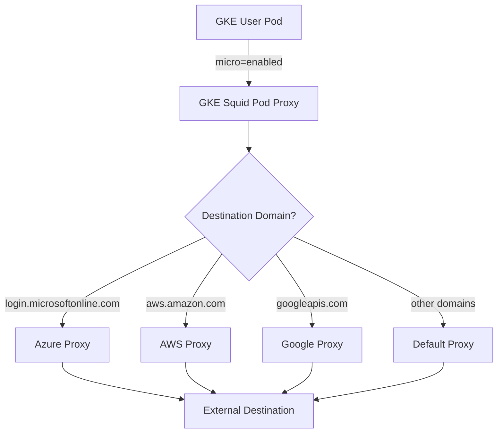
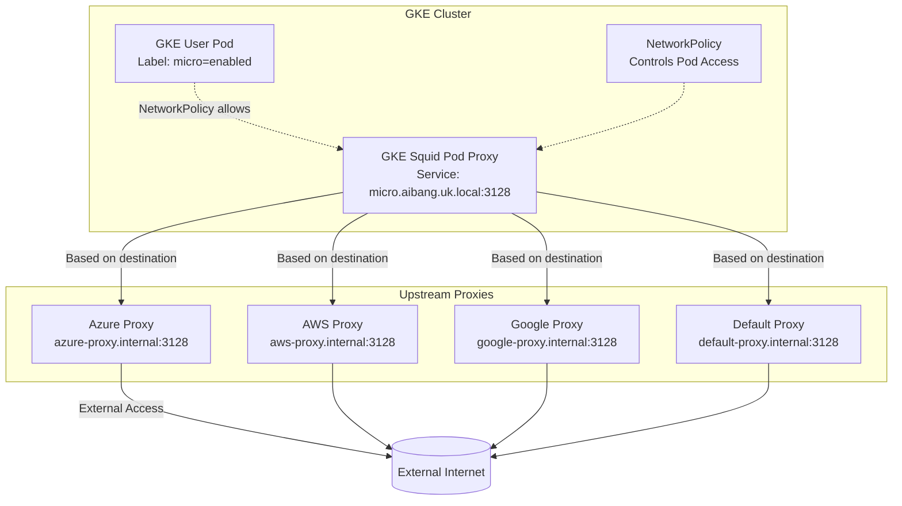

# Dynamic Squid Egress Multi-Proxy Solution: Domain-Based Routing

## Overview

This document outlines a solution for implementing dynamic proxy routing in a GKE environment where user Pods require external connectivity through a Squid proxy. The solution enables domain-based routing where the GKE Squid Pod Proxy determines the next-hop proxy address based on the destination domain, providing flexible egress control for different external services.

## Problem Statement

- GKE Pods cannot access external addresses by default
- Users need to route external traffic through a proxy
- Need to route different destination domains to different upstream proxies
- Current static configuration doesn't scale for multiple destination types
- Need to control access via NetworkPolicy with Pod labeling

## Architecture

### High-Level Flow



### Detailed Architecture



## Implementation Approach

### 1. Pod Labeling and NetworkPolicy

#### Pod Labeling Strategy
- Assign specific labels to user Pods that require external access (e.g., `micro=enabled`)
- This label will be used by NetworkPolicy to control access to the Squid proxy service
- Labels can be applied during Pod creation or updated dynamically based on user configuration

#### Example User Pod with Label
```yaml
apiVersion: v1
kind: Pod
metadata:
  name: user-application-pod
  namespace: user-namespace
  labels:
    app: user-app
    micro: enabled  # Enables access to external services via proxy
spec:
  containers:
  - name: app-container
    image: user-app:latest
    env:
    - name: HTTP_PROXY
      value: "http://micro.aibang.uk.local:3128"
    - name: HTTPS_PROXY
      value: "http://micro.aibang.uk.local:3128"
    - name: NO_PROXY
      value: "localhost,127.0.0.1,.local,.internal,kubernetes.default.svc.cluster.local"
```

#### NetworkPolicy Configuration
The NetworkPolicy restricts egress traffic to only allow communication with the Squid proxy service for labeled Pods:

```yaml
apiVersion: networking.k8s.io/v1
kind: NetworkPolicy
metadata:
  name: egress-squid-proxy
  namespace: user-namespace
spec:
  podSelector:
    matchLabels:
      micro: enabled  # Only pods with this label can access the proxy
  policyTypes:
  - Egress
  egress:
  - to:
    - podSelector:
        matchLabels:
          app: squid-proxy  # Target only Squid proxy pods
    ports:
    - protocol: TCP
      port: 3128  # Squid proxy port
---
# Additional NetworkPolicy to block all other egress
apiVersion: networking.k8s.io/v1
kind: NetworkPolicy
metadata:
  name: deny-all-egress
  namespace: user-namespace
spec:
  podSelector:
    matchLabels:
      app: user-app  # Apply to user application pods
  policyTypes:
  - Egress
  egress: []  # No egress traffic allowed except what's explicitly permitted above
```

#### Service Configuration
The Squid proxy service should be configured with appropriate labels to be targeted by the NetworkPolicy:

```yaml
apiVersion: v1
kind: Service
metadata:
  name: squid-proxy-service
  namespace: proxy-namespace
  labels:
    app: squid-proxy
spec:
  selector:
    app: squid-proxy
  ports:
    - protocol: TCP
      port: 3128
      targetPort: 3128
  type: ClusterIP
---
apiVersion: apps/v1
kind: Deployment
metadata:
  name: squid-proxy-deployment
  namespace: proxy-namespace
  labels:
    app: squid-proxy
spec:
  replicas: 2
  selector:
    matchLabels:
      app: squid-proxy
  template:
    metadata:
      labels:
        app: squid-proxy
    spec:
      containers:
      - name: squid
        image: sameersbn/squid:latest
        ports:
        - containerPort: 3128
        volumeMounts:
        - name: squid-config
          mountPath: /etc/squid/squid.conf
          subPath: squid.conf
      volumes:
      - name: squid-config
        configMap:
          name: squid-config
```

### 2. Dynamic Squid Configuration

The Squid configuration will route requests to different upstream proxies based on destination domains:

```squid.conf
# Listen on port 3128
http_port 3128

# Define ACLs for different destination domains
acl microsoft_domains dstdomain .microsoftonline.com .office.com
acl azure_domains dstdomain .azure.com
acl aws_domains dstdomain .amazonaws.com .aws.amazon.com
acl google_domains dstdomain .googleapis.com .google.com
acl github_domains dstdomain .github.com .githubusercontent.com

# Define cache peers for different upstream proxies
cache_peer azure-proxy.internal:3128 parent 80 1 no-query name=azure-peer
cache_peer aws-proxy.internal:3128 parent 80 1 no-query name=aws-peer
cache_peer google-proxy.internal:3128 parent 80 1 no-query name=google-peer
cache_peer microsoft-proxy.internal:3128 parent 80 1 no-query name=microsoft-peer
cache_peer default-proxy.internal:3128 parent 80 1 no-query name=default-peer

# Route requests to appropriate peers based on destination domain
cache_peer_access microsoft-peer allow microsoft_domains
cache_peer_access microsoft-peer allow azure_domains
cache_peer_access aws-peer allow aws_domains
cache_peer_access google-peer allow google_domains
cache_peer_access default-peer allow github_domains

# Block all other requests from going directly to peers
cache_peer_access microsoft-peer deny all
cache_peer_access aws-peer deny all
cache_peer_access google-peer deny all
cache_peer_access default-peer deny all

# Allow local network access
acl localnet src 10.0.0.0/8 172.16.0.0/12 192.168.0.0/16
http_access allow localnet

# Allow requests to configured domains
http_access allow microsoft_domains
http_access allow azure_domains
http_access allow aws_domains
http_access allow google_domains
http_access allow github_domains

# Deny all other requests
http_access deny all

# Never go directly to destination for configured domains
never_direct allow microsoft_domains
never_direct allow azure_domains
never_direct allow aws_domains
never_direct allow google_domains
never_direct allow github_domains
```

### 3. Configuration Management

#### Dynamic Configuration Generation
- Create a configuration management system that generates Squid configs based on user requirements
- Map destination domains to appropriate upstream proxy endpoints
- Update Squid configuration dynamically when user requirements change
- Implement a controller that watches for changes in user configurations and updates Squid accordingly

#### Example Configuration Mapping
```yaml
# User configuration example
user_egress_config:
  user_id: "user-123"
  labels:
    - "micro=enabled"
  allowed_domains:
    - "login.microsoftonline.com"
    - "management.azure.com"
    - "api.github.com"
  proxy_mappings:
    microsoft_domains:
      - ".microsoftonline.com"
      - ".office.com"
      upstream_proxy: "microsoft-proxy.internal:3128"
    azure_domains:
      - ".azure.com"
      - ".windows.net"
      upstream_proxy: "azure-proxy.internal:3128"
    default_domains:
      - ".github.com"
      upstream_proxy: "default-proxy.internal:3128"
```

#### Configuration Controller Implementation
A Kubernetes controller can be implemented to manage the Squid configuration:

```go
// Pseudo-code for configuration controller
type ConfigController struct {
    kubeClient kubernetes.Interface
    configMapName string
    namespace string
}

func (c *ConfigController) ReconcileUserConfig(userConfig UserEgressConfig) error {
    // Generate Squid configuration based on user requirements
    squidConfig := c.generateSquidConfig(userConfig)

    // Update ConfigMap with new configuration
    configMap := &corev1.ConfigMap{
        ObjectMeta: metav1.ObjectMeta{
            Name:      c.configMapName,
            Namespace: c.namespace,
        },
        Data: map[string]string{
            "squid.conf": squidConfig,
        },
    }

    // Apply the configuration to the Squid deployment
    return c.updateSquidDeployment(configMap)
}

func (c *ConfigController) generateSquidConfig(userConfig UserEgressConfig) string {
    var config strings.Builder

    // Add basic configuration
    config.WriteString("http_port 3128\n\n")

    // Generate ACLs for each domain group
    for domainGroup, domains := range userConfig.ProxyMappings {
        aclName := strings.ReplaceAll(domainGroup, "_domains", "")
        config.WriteString(fmt.Sprintf("acl %s dstdomain", aclName))
        for _, domain := range domains {
            config.WriteString(fmt.Sprintf(" %s", domain))
        }
        config.WriteString("\n")
    }
    config.WriteString("\n")

    // Generate cache peers for upstream proxies
    for domainGroup, mapping := range userConfig.ProxyMappings {
        peerName := strings.ReplaceAll(domainGroup, "_domains", "") + "-peer"
        config.WriteString(fmt.Sprintf("cache_peer %s parent 80 1 no-query name=%s\n",
            mapping.UpstreamProxy, peerName))
    }
    config.WriteString("\n")

    // Generate cache peer access rules
    for domainGroup, mapping := range userConfig.ProxyMappings {
        peerName := strings.ReplaceAll(domainGroup, "_domains", "") + "-peer"
        aclName := strings.ReplaceAll(domainGroup, "_domains", "")
        config.WriteString(fmt.Sprintf("cache_peer_access %s allow %s\n", peerName, aclName))
    }
    config.WriteString("\n")

    // Add access controls
    config.WriteString("acl localnet src 10.0.0.0/8 172.16.0.0/12 192.168.0.0/16\n")
    config.WriteString("http_access allow localnet\n")

    // Allow access to configured domains
    for domainGroup := range userConfig.ProxyMappings {
        aclName := strings.ReplaceAll(domainGroup, "_domains", "")
        config.WriteString(fmt.Sprintf("http_access allow %s\n", aclName))
    }

    config.WriteString("http_access deny all\n")

    // Never go directly for configured domains
    for domainGroup := range userConfig.ProxyMappings {
        aclName := strings.ReplaceAll(domainGroup, "_domains", "")
        config.WriteString(fmt.Sprintf("never_direct allow %s\n", aclName))
    }

    return config.String()
}
```

## Configuration Examples

### Complete Squid Configuration Example

Here's a complete example of a dynamically generated Squid configuration for a user requiring access to Microsoft and AWS services:

```squid.conf
# Generated Squid configuration for user with micro=enabled label
# Service: micro.aibang.uk.local:3128

# Listen on port 3128
http_port 3128

# Define ACLs for different destination domains
acl microsoft_domains dstdomain .microsoftonline.com .office.com .azure.com
acl aws_domains dstdomain .amazonaws.com .aws.amazon.com .amazon.com
acl github_domains dstdomain .github.com .githubusercontent.com

# Define cache peers for different upstream proxies
cache_peer ms-proxy.internal:3128 parent 80 1 no-query name=ms-peer
cache_peer aws-proxy.internal:3128 parent 80 1 no-query name=aws-peer
cache_peer github-proxy.internal:3128 parent 80 1 no-query name=github-peer

# Route requests to appropriate peers based on destination domain
cache_peer_access ms-peer allow microsoft_domains
cache_peer_access aws-peer allow aws_domains
cache_peer_access github-peer allow github_domains

# Block all other requests from going directly to peers
cache_peer_access ms-peer deny all
cache_peer_access aws-peer deny all
cache_peer_access github-peer deny all

# Allow local network access
acl localnet src 10.0.0.0/8 172.16.0.0/12 192.168.0.0/16
http_access allow localnet

# Allow requests to configured domains
http_access allow microsoft_domains
http_access allow aws_domains
http_access allow github_domains

# Deny all other requests
http_access deny all

# Never go directly to destination for configured domains
never_direct allow microsoft_domains
never_direct allow aws_domains
never_direct allow github_domains

# Logging configuration
access_log /var/log/squid/access.log
cache_log /var/log/squid/cache.log

## Implementation Steps

### Step 1: Deploy Squid Proxy Service
1. Deploy Squid proxy pods with appropriate labels
2. Create a service pointing to the Squid pods
3. Configure the service with the FQDN (e.g., `micro.aibang.uk.local:3128`)

### Step 2: Configure Upstream Proxies
1. Deploy upstream proxy services for different providers
2. Ensure upstream proxies have external connectivity
3. Configure authentication and security for upstream connections

### Step 3: Implement Configuration Management
1. Create a configuration management system
2. Generate Squid configs based on user domain requirements
3. Apply configuration changes to Squid pods

### Step 4: Apply NetworkPolicy
1. Apply NetworkPolicy to allow only labeled pods to access the Squid service
2. Test connectivity from labeled and unlabeled pods

### Step 5: User Onboarding
1. Assign appropriate labels to user pods during deployment
2. Configure user applications to use the Squid proxy endpoint
3. Validate external connectivity for allowed domains

## Benefits

### For Users
- **Simplified Configuration**: Users only need to configure their applications to use the proxy endpoint
- **Automatic Routing**: Domain-based routing happens transparently
- **Granular Control**: Access to different external services can be controlled independently

### For Platform
- **Scalability**: Easy to add new upstream proxy types
- **Security**: Centralized control over external access
- **Flexibility**: Can route different domains to different upstream proxies
- **Auditability**: All requests go through the Squid proxy for logging and monitoring

## Security Considerations

1. **Domain Validation**: Validate all destination domains to prevent DNS rebinding attacks
2. **Access Control**: Use NetworkPolicy to restrict which pods can access the proxy
3. **Authentication**: Implement authentication between Squid and upstream proxies if needed
4. **Monitoring**: Log all proxy requests for security monitoring
5. **Rate Limiting**: Implement rate limiting to prevent abuse

## Monitoring and Observability

1. **Squid Logs**: Monitor access and cache logs for traffic patterns
2. **Metrics**: Collect metrics on request routing and upstream proxy performance
3. **Alerts**: Set up alerts for failed requests or unusual traffic patterns
4. **Tracing**: Implement request tracing to understand routing decisions

## Conclusion

This solution provides a flexible, scalable approach to multi-proxy egress routing in a GKE environment. By leveraging Squid's ACL capabilities and Kubernetes NetworkPolicy, we can route requests to different upstream proxies based on destination domains while maintaining security and access control. The architecture allows for easy expansion to support additional proxy types and provides centralized control over external connectivity.