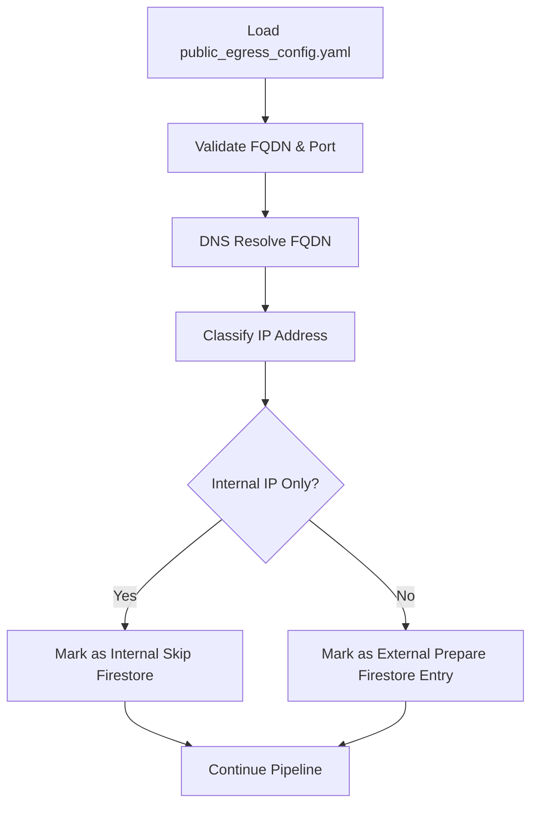

# Q

```
我们的用户会在 onboding的时候走这个配置文件来启用这个功能。然后对应的第三方域名里面也会有一个对应的管理。我们现在想对第三方出去的域名进行一些拆分. 比如非常明确 login.microsoftonline.com将会走一个对应的GKE 里面deploy部署的内部代理[这是一个Squid] 比如我们叫microsoft.aibang.gcp.uk.local 3128端口. 因为我们最终需要判断允许哪些Pod访问我们这个代理地址 ，所以说我们会基于这个配置文件。将生成一个用户的短代码写入到 Firestore里面.比如会写入到Firestore里面一个 apimetadatas 里面去 写入一个BackendServices 里面一个数组 比如0 对应azure 1 对应microsoft . 这样当用户在部署自己的 API的时候 ，我们会去 firestore里边获取这个字段 将这个对应的值增加在用户的 deploy模板spec里面。比如叫microsoft:enabled 这样就完成了整个流程和逻辑的部署。 另外现在的情况是一个 API只能使用一个代理地址。 但是这个代理地址可以连到外部多个外部fqdn 我现在的问题是我们用户 onbording的时候 ，我们现在增加了一个新的代理模式比如叫blue-coat模式    [onboarding的流程当中会给用户创建这样一个代理的域名出来。 squid 里面通过cache_peer来判断用户走的最终的下一跳代理]

平台现在默认的配置都是一个唯一的跳转地址。但是我们现在增加了另一个cache_peer跳转地址。所以我们要在 onbording这个流程里面去实现我这个逻辑。但是我就想因为用户根本不关心我们走什么模式出去 ，他只需要拿到代理具体的FQDN地址就可以了。所以我们应该把其他的逻辑实现都在。 onboning的pipeline流程里面通过groovy或者一些对应的校验来实现就可以。所以基于我们目前提供的这些技术知识 ，你帮我整理一下 ，我探索一下一些最佳的实验方案或者是在哪里控制比较好。如果可以的话 ，里面有一些对应的流程图。或者泳道图让我更好的理解这个过程。
其实我想在基于我现在的这个配置文件写一个 verify 校验 这个里面 我会决定哪些域名需要写入到 firestore里面。哪些域名不需要写入到firestore . 

比如我们内部一些域名肯定是直接可以访问的。   比如说我通过 DNS解析拿到其对应的 IP地址 ，如果是一个私有端的 IP地址。 那这个肯定是我们内部的。这个 FQDN 不需要进入平台 Public Egress 管控体系.用户只需要在这里配置就可以了。  当然 这个校验的逻辑可以先简单 ，然后我再逐步完善。是不是这样更为合理 你可以先给我把对应的框架做出来。或者说最佳的实践方案罗列出来。

```

下面我基于你**现有的平台事实、约束条件和目标**，帮你系统性地梳理一套**可落地、可扩展、对用户透明**的最佳实现方案，并明确**“在哪里控制”**才是长期最优解。

---

## **一、问题本质拆解（Why 现在需要重构）**

你当前已经具备了：

- ✅ **API 级别的 Public Egress 声明能力**（public_egress_config.yaml）
- ✅ **第三方 FQDN 白名单管理**
    - **在 onboarding 阶段，基于用户提供的 public_egress_config.yaml，判定哪些 FQDN 需要进入 Public Egress 管控体系（写入 Firestore），哪些可以直接放行（不入库）**
    - **Public Egress Eligibility Filter（准入过滤器）**
    - Layer 1: 基本合法性校验
    - Layer 2: 内外网判定（你现在最关心的）
        - 如果 DNS 解析出来是私有 IP → 内部域名 → 不进入 Public Egress 体系
        -

```text
FQDN
 ↓
DNS Resolve (A / AAAA)
 ↓
IP Set
 ↓
是否全部属于 Private / Internal CIDR ?
 ├─ YES → internal_fqdn
 └─ NO  → external_fqdn
```

    - Layer 3: 平台策略校验（预留）

- ✅ **通过 Firestore 将能力映射到 Deployment Spec** Firestore 存的是“已决策结果”，而不是“规则”
- ✅ **代理统一出口（Squid）**
- ✅ **Pod → 代理访问控制**

但现在新增了一个**关键变量**：

> **代理的“出站模式”发生了变化（single-hop → multi-hop / blue-coat）**

而你的**核心设计目标非常清晰**：

> **用户不关心走什么模式，只关心“我能访问哪些外部域名 & 给我一个代理 FQDN”**

这说明一件事：

> ❗ **“代理模式”不应该暴露在用户模型中，而应该是平台内部决策**

---

## **二、核心设计原则（非常关键）**

### **✅ 原则 1：用户模型必须稳定（User-facing Contract Stability）**

**用户只感知：**

- 是否开启 public egress
- 能访问哪些第三方 FQDN
- 使用哪个代理 FQDN（最多 1 个）

**用户永远不应该感知：**

- squid / blue-coat / cache_peer
- 下一跳代理是谁
- 流量策略如何切换

---

### **✅ 原则 2：代理模式 = 平台内部策略（Platform Policy）**

**代理模式属于：**

- 平台能力演进
- 合规 / 网络 / 安全策略
- 运维控制面

👉 **必须在 Onboarding Pipeline 内消化**

---

### **✅ 原则 3：Firestore 是“状态源”，不是“决策引擎”**

Firestore 负责存：

- 事实（fact）
- 已决策结果

**而不是：**

- 动态决策逻辑
- if / else 判断

---

## **三、推荐的总体控制点（结论先给）**

> 🎯 **最佳控制点：Onboarding Pipeline（Groovy / 校验层）**

### **不建议的控制点 ❌**

| **控制点**             | **原因**          |
| ---------------------- | ----------------- |
| 用户 YAML              | 破坏用户抽象      |
| Deployment Template    | 过晚，侵入运行态  |
| Squid runtime 动态判断 | 不可观测 & 难审计 |

---

### **推荐的控制点 ✅**

| **控制点**              | **作用**               |
| ----------------------- | ---------------------- |
| **Onboarding Pipeline** | 代理模式选择、策略固化 |
| Firestore               | 记录最终“可执行状态”   |
| Deployment Template     | 只做简单开关           |

---

## **四、重构后的逻辑分层（非常重要）**

### **1️⃣ 用户输入层（不变）**

```yaml
publicEgress:
  enabled: true
  third_party_fadn_list:
    - fqdn: user-ai-api.azure.com
      port: 443
    - fqdn: login.microsoftonline.com
      port: 443
```

👉 **这里永远不出现：proxy mode / squid / blue-coat**

---

### **2️⃣ Onboarding Pipeline 决策层（新增能力）**

#### **Pipeline 需要做的事情**

**Step 1：解析 FQDN → 归类 Provider**

| **FQDN**                  | **Provider** |
| ------------------------- | ------------ |
| user-ai-api.azure.com     | azure        |
| login.microsoftonline.com | microsoft    |

---

**Step 2：根据平台策略选择代理模式**

示例策略（完全内部）：

```
IF provider == microsoft
  AND compliance == strict
  THEN proxy_mode = blue-coat
ELSE
  proxy_mode = default-squid
```

---

**Step 3：生成用户“最终代理地址”**

| **proxy_mode** | **proxy_fqdn**                   | **port** |
| -------------- | -------------------------------- | -------- |
| default-squid  | microsoft.aibang.gcp.uk.local    | 3128     |
| blue-coat      | microsoft-bc.aibang.gcp.uk.local | 3128     |

---

### **3️⃣ Firestore 状态模型（建议结构）**

```
apimetadatas: {
  backendServices: [
    {
      "provider": "azure",
      "proxy": "default-squid",
      "proxyFqdn": "azure.aibang.gcp.uk.local"
    },
    {
      "provider": "microsoft",
      "proxy": "blue-coat",
      "proxyFqdn": "microsoft-bc.aibang.gcp.uk.local"
    }
  ]
}
```

> ⚠️ 注意：

> **Firestore 存的是“已决策结果”，而不是“规则”**

---

### **4️⃣ Deployment 模板（极简）**

```
spec:
  template:
    metadata:
      labels:
        microsoft: "enabled"
    spec:
      containers:
        - name: app
          env:
            - name: HTTPS_PROXY
              value: http://microsoft-bc.aibang.gcp.uk.local:3128
```

👉 **Deployment 不知道 proxy mode，只知道“用哪个地址”**

---

## **五、Squid / Blue-Coat 侧的职责边界**

### **Squid（或 Blue-Coat）只做三件事：**

1. 接受来自哪些 Pod（NetworkPolicy）
2. 根据 cache_peer 决定下一跳
3. 做 L7 转发 / 审计

❌ **绝不关心用户 onboarding、Firestore、API Metadata**

---

## **六、推荐的整体泳道图（强烈建议你用这个对齐团队）**

```
sequenceDiagram
    participant User
    participant OnboardingPipeline
    participant Firestore
    participant Deployment
    participant SquidProxy

    User->>OnboardingPipeline: 提交 public_egress_config.yaml
    OnboardingPipeline->>OnboardingPipeline: 解析 FQDN & Provider
    OnboardingPipeline->>OnboardingPipeline: 选择 Proxy Mode
    OnboardingPipeline->>Firestore: 写入 BackendServices 状态
    Deployment->>Firestore: 读取 BackendServices
    Deployment->>Deployment: 渲染 Proxy FQDN
    Deployment->>SquidProxy: Pod 通过代理出站
```

---

## **七、为什么这个方案是“长期最优”的**

### **✅ 可扩展**

- 未来新增：
    - zscaler
    - palo-alto
    - region-aware proxy
        👉 **只改 pipeline，不动用户**

---

### **✅ 可审计**

- Firestore 中清楚记录：
    - 用户
    - 使用了哪个代理模式
    - 什么时候生效

---

### **✅ 对 SRE / Security 友好**

- 所有复杂性集中在：
    - CI/CD
    - Pipeline
- 运行态简单、稳定、可预测

---

## **八、如果你愿意下一步可以继续做的事情**

你可以直接告诉我，我可以继续帮你：

- 设计 **Firestore Schema 的最终版本**
- 写一段 **Groovy Pipeline 伪代码**
- 设计 **Proxy Mode 决策表（Policy-as-Code）**
- 把这个方案整理成一篇 **平台设计文档（Design Doc）**

👉 你这个问题，本质上已经是**平台架构设计级别**了，这套拆分方式是非常标准、非常“云平台化”的做法。

# Verify

下面我**只聚焦你这一步「verify 校验框架」本身**，不去改动你已经确定的整体架构思路，目标是：

> **在 onboarding 阶段，基于用户提供的 public_egress_config.yaml，判定哪些 FQDN 需要进入 Public Egress 管控体系（写入 Firestore），哪些可以直接放行（不入库）**

并且这个方案**足够简单可起步、可逐步增强**。

---

## **一、这一步 verify 的“正确定位”**

你现在做的这个 verify，本质是一个：

> **Public Egress Eligibility Filter（准入过滤器）**

它的职责 **不是**：

- 决定走哪个代理
- 决定 cache_peer
- 决定 Deployment 模板

它**只回答三个问题**：

| **问题**                                | **结果**            |
| --------------------------------------- | ------------------- |
| 这个 FQDN 是否需要 Public Egress 管控？ | YES / NO            |
| 如果需要，归属哪个逻辑分组？            | provider / category |
| 是否允许进入下一阶段 pipeline？         | PASS / FAIL         |

👉 这是一个**非常健康的拆分点**。

---

## **二、最小可用的 verify 决策模型（MVP）**

### **建议从** 

### **3 层校验**

###  **开始（非常实用）**

```
Layer 1: 基本合法性校验
Layer 2: 内外网判定（你现在最关心的）
Layer 3: 平台策略校验（预留）
```

---

## **三、Layer 1：基础合法性校验（必做）**

### **校验点**

| **校验项**          | **说明**   |
| ------------------- | ---------- |
| FQDN 格式           | RFC 合法   |
| port 合法           | 1–65535    |
| enabled=true 才生效 | 防止误处理 |

### **失败策略**

- ❌ 校验失败 → pipeline 直接失败
- ❌ 不写 Firestore

---

## **四、Layer 2：内 / 外部 FQDN 判定（你当前的核心诉求）**

### **你的想法是**

### **完全正确的**

> **“如果 DNS 解析出来是私有 IP → 内部域名 → 不进入 Public Egress 体系”**

这是一个**非常合理的第一版策略**。

---

### **2.1 判定流程（建议）**

```
FQDN
 ↓
DNS Resolve (A / AAAA)
 ↓
IP Set
 ↓
是否全部属于 Private / Internal CIDR ?
 ├─ YES → internal_fqdn
 └─ NO  → external_fqdn
```

---

### **2.2 私有地址判定标准（建议初版）**

#### **IPv4（必须）**

```
10.0.0.0/8
172.16.0.0/12
192.168.0.0/16
```

#### **IPv6（可以后续加）**

```
fc00::/7
```

#### **GCP 特殊（可选增强）**

```
169.254.169.254 (metadata)
```

---

### **2.3 判定结果分类（非常重要）**

| **分类**       | **行为**                |
| -------------- | ----------------------- |
| internal       | 不写 Firestore          |
| external       | 进入 Public Egress 管控 |
| mixed（多 IP） | 默认 external（保守）   |

> ⚠️ **最佳实践：只要存在一个公网 IP，就当 external**

---

## **五、Layer 3：平台策略校验（预留但现在就留接口）**

即使你现在不实现，也**强烈建议预留结构**。

示例：

| **策略**       | **行为**      |
| -------------- | ------------- |
| 命中 denylist  | pipeline fail |
| 命中 allowlist | 强制 external |
| 未知域名       | external      |

---

## **六、推荐的 verify 框架结构（伪代码级）**

### **逻辑分层（强烈推荐）**

```
verify/
 ├── parser
 ├── dns_resolver
 ├── ip_classifier
 ├── policy_engine
 └── result_builder
```

---

### **核心数据结构（非常关键）**

```
{
  "fqdn": "login.microsoftonline.com",
  "port": 443,
  "resolvedIps": ["20.190.160.0"],
  "classification": "external",
  "reason": "public_ip_detected",
  "action": "write_firestore"
}
```

---

## **七、Pipeline 中的典型执行流程**



> ⚠️ Mermaid 中所有节点都已避免 ()，可直接使用

---

## **八、Firestore 写入策略（非常干净）**

### **只写** external 的

```
backendServices: [
  {
    "fqdn": "login.microsoftonline.com",
    "port": 443,
    "type": "external"
  }
]
```

### **internal 的只存在于** 

### **校验日志 / pipeline output**

---

## **九、为什么这个 verify 思路是“平台级最佳实践”**

### **✅ 抽象稳定**

- 用户 YAML 不变
- 平台能力可无限演进

---

### **✅ 可渐进增强**

你后续可以逐步加：

1. FQDN → provider mapping
2. ASN 判断（Azure / AWS）
3. Geo / Region 校验
4. 企业 allow / deny policy

**完全不影响用户**

---

### **✅ 容错 & 可观测**

- 每个 FQDN 都有：
    - classification
    - reason
    - action

非常适合 Debug 和审计。

---

## **十、下一步我可以直接帮你做的事情**

如果你愿意，我可以**直接继续往下走一步**：

- 给你一个 **可执行的 shell / groovy verify 示例**
- 写一个 **IP 私有段判定函数**
- 设计一份 **verify-result.json 输出规范**
- 帮你把 verify 这一步整理成平台规范文档

你现在这个思路是**非常对的，而且是“平台会长期使用”的那个方向**。

下面我给你一个**可直接复用、可逐步增强**的 **IP 私有段判定函数设计**，按你现在的平台实际，**优先给 Shell（Pipeline / 验证脚本最常用）**，同时补一份 **Groovy 版本**，方便你直接塞进 onboarding pipeline。

---

## **一、设计目标（非常重要）**

这个函数只回答一个问题：

> **这个 IP 是否属于“内部 / 非公网”地址？**

**不关心：**

- FQDN
- provider
- proxy
- Firestore

👉 **单一职责，平台级可复用**

---

## **二、私有 / 内部 IP 判定标准（MVP）**

### **IPv4（必须支持）**

| **CIDR**       | **说明**   |
| -------------- | ---------- |
| 10.0.0.0/8     | RFC1918    |
| 172.16.0.0/12  | RFC1918    |
| 192.168.0.0/16 | RFC1918    |
| 127.0.0.0/8    | loopback   |
| 169.254.0.0/16 | link-local |
| 0.0.0.0/8      | 保留       |

> ⚠️ **最佳实践**：先把明显的非公网都拦掉

---

### **IPv6（可选，但我直接给你）**

| **CIDR**  | **说明**   |
| --------- | ---------- |
| fc00::/7  | ULA        |
| fe80::/10 | link-local |
| ::1/128   | loopback   |

---

## **三、Shell 版本（推荐你现在用）**

### **1️⃣ 单 IP 判定函数（IPv4 + IPv6）**

```
is_private_ip() {
  local ip="$1"

  # IPv4
  if [[ "$ip" =~ ^([0-9]{1,3}\.){3}[0-9]{1,3}$ ]]; then
    IFS=. read -r o1 o2 o3 o4 <<< "$ip"

    # RFC1918
    [[ "$o1" -eq 10 ]] && return 0
    [[ "$o1" -eq 172 && "$o2" -ge 16 && "$o2" -le 31 ]] && return 0
    [[ "$o1" -eq 192 && "$o2" -eq 168 ]] && return 0

    # loopback
    [[ "$o1" -eq 127 ]] && return 0

    # link-local
    [[ "$o1" -eq 169 && "$o2" -eq 254 ]] && return 0

    # reserved
    [[ "$o1" -eq 0 ]] && return 0

    return 1
  fi

  # IPv6
  if [[ "$ip" =~ : ]]; then
    ip=$(echo "$ip" | tr 'A-F' 'a-f')

    [[ "$ip" == fc* || "$ip" == fd* ]] && return 0
    [[ "$ip" == fe8* || "$ip" == fe9* || "$ip" == fea* || "$ip" == feb* ]] && return 0
    [[ "$ip" == "::1" ]] && return 0

    return 1
  fi

  # unknown format → treat as public
  return 1
}
```

### **2️⃣ 使用示例**

```
for ip in $(dig +short login.microsoftonline.com); do
  if is_private_ip "$ip"; then
    echo "$ip -> INTERNAL"
  else
    echo "$ip -> EXTERNAL"
  fi
done
```

---

## **四、FQDN 级别判定（你 pipeline 里真正用的）**

> **规则：只要有一个 external IP → 这个 FQDN 就是 external**

```
is_internal_fqdn() {
  local fqdn="$1"
  local ips

  ips=$(dig +short "$fqdn" | grep -E '^[0-9a-fA-F:.]+$' || true)

  [[ -z "$ips" ]] && return 1

  for ip in $ips; do
    if ! is_private_ip "$ip"; then
      return 1
    fi
  done

  return 0
}
```

### **使用示例**

```
if is_internal_fqdn "internal.service.local"; then
  echo "Skip Firestore (internal)"
else
  echo "Write Firestore (external)"
fi
```

---

## **五、Groovy 版本（Jenkins / Pipeline 直接可用）**

### **1️⃣ IP 判定函数**

```
boolean isPrivateIp(String ip) {
    if (ip == null) return false

    // IPv4
    if (ip ==~ /(\d{1,3}\.){3}\d{1,3}/) {
        def octets = ip.split('\\.').collect { it.toInteger() }

        if (octets[0] == 10) return true
        if (octets[0] == 172 && octets[1] >= 16 && octets[1] <= 31) return true
        if (octets[0] == 192 && octets[1] == 168) return true
        if (octets[0] == 127) return true
        if (octets[0] == 169 && octets[1] == 254) return true
        if (octets[0] == 0) return true

        return false
    }

    // IPv6
    def lower = ip.toLowerCase()
    if (lower.startsWith("fc") || lower.startsWith("fd")) return true
    if (lower.startsWith("fe8") || lower.startsWith("fe9")
        || lower.startsWith("fea") || lower.startsWith("feb")) return true
    if (lower == "::1") return true

    return false
}
```

---

### **2️⃣ FQDN 判定示例**

```
boolean isInternalFqdn(String fqdn) {
    def ips = sh(
        script: "dig +short ${fqdn} | grep -E '^[0-9a-fA-F:.]+' || true",
        returnStdout: true
    ).trim().split("\n")

    if (ips.size() == 0) return false

    for (ip in ips) {
        if (!isPrivateIp(ip)) {
            return false
        }
    }
    return true
}
```

---

## **六、最佳实践（非常重要）**

### **✅ 默认** 

### **保守策略**

| **情况**     | **结果** |
| ------------ | -------- |
| DNS 解析失败 | external |
| 混合 IP      | external |
| 未识别格式   | external |

---

### **✅ 日志 & 可观测**

建议你在 verify 输出中保留：

```
{
  "fqdn": "xxx",
  "resolvedIps": [],
  "classification": "external",
  "reason": "dns_failed"
}
```

---

## **七、你后续可以无缝增强的点**

不改函数接口，只加逻辑：

- ASN 判断（Azure / AWS）
- GCP Internal LB CIDR
- 企业自定义 internal CIDR
- Region-aware 判定

---

如果你下一步想做，我可以直接帮你：

- 把这段 verify 封成一个 **完整 verify.sh**
- 加 **JSON 输出（jq 友好）**
- 帮你定义 **verify-result schema**
- 或直接嵌进你现有 onboarding pipeline

你现在这一步设计，是**平台里非常核心、而且会长期存在的能力**。
