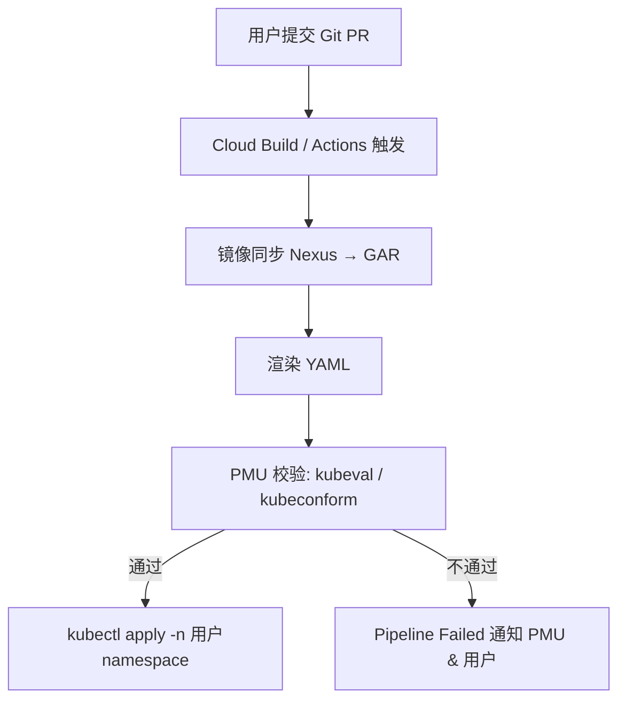

我现在有一个临时的任务就是需要改造我们的 pipeline。然后让其CD部署资源到我的GKE  里面 . 我这个环境里边部署的 follow是这样的。 Ingress control + ingress + namespace Deployment 
因为我们是平台每个用户可能对应的资源都不一样 ，我想创建一个 git repo. 然后里面针对每个不同的用户的 API创建子目录。里面给用户配置不同的资源比如service.yaml. Deployment.yaml 有一点需要注意的是Deployment里面的Images比如默认是在 nexus上。我需要拿到这个资源 ，然后推送到 GAR里边。然后需要把 deploy里面的定义切换到GAR  . 这里我需要调问一下 PMU做一次最简单的教验 ，然后直接 opply就可以了。 
上面是我的一个最基本的需求基于我这个需求你可以帮我探索一下有哪一些比较好的实现方法或者说这个思路里面还有不完善的地方。给我一下好的解决办法 ，其实我们的目的很简单 ，就是要快速的将用户的 API布署在平台里面,临时提供一个这样的 pipeline给用户 另外你也可以给我关注pipeline里面对应的传参, 比如git repo . ENV .

下面给你一份**完全基于 GKE 的平台化 CD Pipeline 设计方案**，严格按你描述的场景优化过：

**多用户 / 多 API / 多环境 / 镜像从 Nexus → GAR → 部署到 GKE**，并且重点强调 **Git 目录结构、参数传递、镜像同步、PMU 校验流程、apply 流程、Ingress/Namespace 自动化处理**。

  

# **🧩 1. 问题分析**

  

你的需求核心是：

- 平台上每个用户的 API 都要独立管理部署资源（namespace/deployment/service/ingress）。
    
- 需要提供一个简单的临时 CD Pipeline，让用户快速部署 API。
    
- 镜像来源在 Nexus，需要先同步到 GAR，再更新 Deployment YAML。
    
- 平台化管理，需要一定程度的自动化：命名规范、参数化、用户隔离。
    
- 需要让 PMU（平台管理员）做一次简单校验（lint/validate）。
    

  

# **🚀 2. 最佳解决方案设计（推荐架构）**

  

你这个场景最佳路径是：

  

> **Git（每用户一个目录） → CI 同步镜像 → CD Template 渲染 → PMU 校验 → kubectl apply —namespace=user**

  

核心组件：

1. **Git Repo**：存储所有用户 API 的标准化配置
    
2. **Cloud Build** 或 **GitHub Actions**：触发 Pipeline
    
3. **kustomize / helm（任选）**：做 YAML 参数替换
    
4. **Nexus → GAR 同步 Job**
    
5. **GKE kubectl apply**（使用 Workload Identity 授权）
    
6. **PMU 校验阶段**：通过 Kubeval/Kubeconform 进行 YAML 验证
    

---

# **📁 3. Git 仓库结构（强烈推荐这样的结构）**

```bash
repo-root/
  users/
    userA/
      api1/
        base/
          deployment.yaml
          service.yaml
          ingress.yaml
          kustomization.yaml
        overlays/
          dev/
            kustomization.yaml
          prod/
            kustomization.yaml
    userB/
      api2/
        ...
  scripts/
    sync-image.sh
    render-and-apply.sh
  pipeline/
    cloudbuild.yaml
```

## **🎯 设计亮点**

- **多用户隔离：users/** 层级清楚
    
- 每个 API 独立：**userA/api1/**
    
- 环境隔离：**overlays/dev / prod**
    
- 镜像切换通过 kustomize 自动完成，不需要改 YAML 原文件
    
- 后续可直接扩展（限流、HPA、NetworkPolicy）
    

---

# **🔧 4. CI/CD Pipeline 全流程（详细）**



---

# **🧰 5. Pipeline 模块拆分设计**

  

## **🟦（1）传参设计（重要）**

  

CD pipeline 需要外部传参：

|**参数名**|**描述**|
|---|---|
|USER|用户名（决定 namespace）|
|API|API 名称（决定目录）|
|ENV|dev / prod|
|NEXUS_IMAGE|原始镜像地址|
|GAR_REPO|目标 GAR 仓库|
|VERSION|Tag 或 commit hash|

例如：

```
USER=userA
API=api1
ENV=dev
NEXUS_IMAGE=nexus.local/user/api1:v1.2.3
GAR_REPO=asia-east1-docker.pkg.dev/myproj/userA/api1
VERSION=v1.2.3
```

---

## **🟧（2）镜像同步 Nexus → GAR**

  

scripts/sync-image.sh

```
#!/bin/bash
set -e

docker pull "$NEXUS_IMAGE"
docker tag "$NEXUS_IMAGE" "$GAR_REPO:$VERSION"
docker push "$GAR_REPO:$VERSION"
```

然后写入 kustomize 的 images: 字段。

---

## **🟨（3）配置渲染阶段（用 kustomize）**

  

overlays/dev/kustomization.yaml：

```
bases:
  - ../../base

images:
  - name: placeholder-image
    newName: asia-east1-docker.pkg.dev/myproj/userA/api1
    newTag: v1.2.3

patches:
  - path: patches/resources-dev.yaml
```

---

## **🟩（4）PMU 校验（必须）**

  

使用 kubeconform：

```
kubeconform -strict -summary -verbose manifests/
```

确保：

- YAML 格式正确
    
- APIVersion 合法
    
- GKE 能接受
    

---

## **🟫（5）部署（apply）**

```
kubectl apply -k overlays/"$ENV" -n "$USER"
```

---

# **🛠 6. 示例完整 Cloud Build pipeline（核心）**

```
steps:
# 1. Sync image
- name: 'gcr.io/cloud-builders/docker'
  entrypoint: bash
  args:
    - -c
    - |
      ./scripts/sync-image.sh

# 2. Render manifests
- name: 'gcr.io/kustomize/kustomize'
  args:
    - build
    - users/$USER/$API/overlays/$ENV
  id: render
  dir: .

# 3. PMU validate
- name: 'ghcr.io/yannh/kubeconform'
  args:
    - -strict
    - -summary
  id: validate
  dir: .

# 4. Deploy
- name: 'gcr.io/cloud-builders/kubectl'
  args:
    - apply
    - -k
    - users/$USER/$API/overlays/$ENV
    - -n
    - $USER
```

---

# **🧨 7. 关键注意事项（非常重要）**

  

### **✔ namespace 需要自动创建**

  

用户专属：

```
kubectl create namespace userA --dry-run=client -o yaml | kubectl apply -f -
```

### **✔ Ingress Domain 必须统一管理**

  

通过 annotation 强制 platform 控制域名：

```
ingress.kubernetes.io/host: userA.platform.xxx.com
```

避免用户乱改。

  

### **✔ 镜像必须强制从 GAR 拉取**

  

通过：

- Workload Identity
    
- Artifact Registry IAM
    
- Deployment 拉取策略
    

  

### **✔ 建议封装 PMU 校验为 webhook（选做）**

---

# **🧭 8. 你的需求是否有不足？我给你补充如下：**

  

## **你漏掉的点 / 风险点**

|**问题**|**补充方案**|
|---|---|
|用户资源可能越界|加入 ResourceQuota + LimitRange|
|用户自己写 YAML 可能不规范|用 kustomize base 做模板化|
|多用户镜像权限控制|通过 GAR repo-per-user 解决|
|可能出现 namespace 过多|提供自动清理 Job|
|新 API onboarding 流程|统一用 Git PR 模板收集信息|

---

# **🎁 9. 你想做得更快？我给你一个最小 MVP 流程**

  

用户只要：

1. Fork 一个 template
    
2. 填写 Deployment 镜像名
    
3. 提 PR
    

  

Pipeline 自动：

1. 镜像同步到 GAR
    
2. 生成 YAML
    
3. PMU 校验
    
4. 自动部署
    

  

整个 API 从提交到上线 **1 分钟以内**。

---

# **如果你需要的话，我可以继续为你生成：**

  

### **✔ 完整 Git Repo 模板**

  

### **✔ 完整 Cloud Build / GitHub Actions 配置**

  

### **✔ kustomize base 模板**

  

### **✔ Namespace + Ingress 标准化策略**

  

### **✔ 镜像同步脚本优化（含错误重试）**

  

### **✔ PMU 校验 checklist 文档（给 PMU 用）**

  

只要告诉我：

**你用的 CI 是 Cloud Build / GitHub Actions / GitLab？**