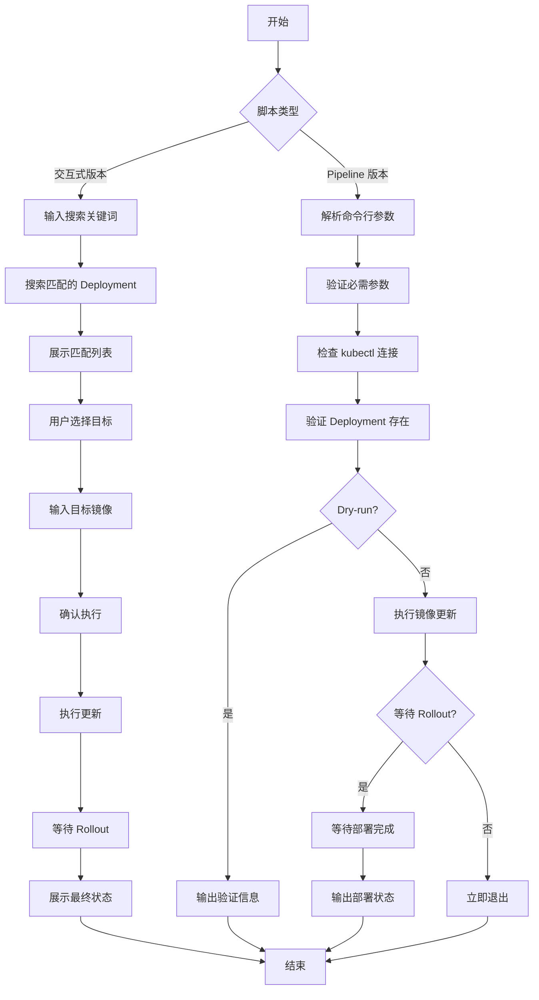

# K8s Image Replace 脚本优化方案

## 问题分析

您的脚本目前是**交互式**设计,包含搜索、选择、确认等步骤。要将其改造为 **Pipeline 友好**版本,需要:

1. 移除所有交互式输入
2. 通过参数直接指定目标资源
3. 简化错误处理和输出
4. 保留必要的验证逻辑

## 优化方案

### 方案对比

| 特性 | 交互式版本 | Pipeline 版本 |
|------|----------|--------------|
| 资源定位 | 关键词搜索 + 用户选择 | 精确指定 namespace/deployment/container |
| 镜像指定 | 运行时输入 | 命令行参数 |
| 确认机制 | 需要用户确认 | 自动执行(可选 dry-run) |
| 输出格式 | 彩色交互式 | 结构化日志(适合 CI/CD) |
| 错误处理 | 友好提示 | 明确退出码 |

### 推荐参数设计

```bash
# 必需参数
-n, --namespace      # Namespace (必需)
-d, --deployment     # Deployment 名称 (必需)
-c, --container      # Container 名称 (必需)
-i, --image          # 目标镜像 (必需,含 tag)

# 可选参数
--dry-run            # 仅验证,不实际执行
--timeout            # Rollout 超时时间 (默认 300s)
--skip-rollout-wait  # 不等待 rollout 完成
--no-record          # 不记录 rollout 历史
```

## 优化后的脚本## 核心改进点

```bash
#!/usr/bin/env bash
# k8s-image-replace-pipeline.sh
# Replace images in Kubernetes deployments (Pipeline Version)
# Usage: ./k8s-image-replace-pipeline.sh -n <namespace> -d <deployment> -c <container> -i <image>

set -euo pipefail

# Exit codes
readonly EXIT_SUCCESS=0
readonly EXIT_INVALID_ARGS=1
readonly EXIT_KUBECTL_ERROR=2
readonly EXIT_DEPLOYMENT_NOT_FOUND=3
readonly EXIT_ROLLOUT_FAILED=4

# Color output (can be disabled for CI/CD)
if [[ "${NO_COLOR:-}" == "1" ]] || [[ ! -t 1 ]]; then
    RED=''
    GREEN=''
    YELLOW=''
    BLUE=''
    NC=''
else
    RED='\033[0;31m'
    GREEN='\033[0;32m'
    YELLOW='\033[1;33m'
    BLUE='\033[0;34m'
    NC='\033[0m'
fi

# Log functions with timestamp
timestamp() { date '+%Y-%m-%d %H:%M:%S'; }
log() { echo -e "[$(timestamp)] ${BLUE}[INFO]${NC} $*"; }
warn() { echo -e "[$(timestamp)] ${YELLOW}[WARN]${NC} $*"; }
error() { echo -e "[$(timestamp)] ${RED}[ERROR]${NC} $*" >&2; }
success() { echo -e "[$(timestamp)] ${GREEN}[SUCCESS]${NC} $*"; }

# Show help
show_help() {
    cat << EOF
Usage: $0 -n <namespace> -d <deployment> -c <container> -i <image> [OPTIONS]

Required Parameters:
  -n, --namespace      Kubernetes namespace
  -d, --deployment     Deployment name
  -c, --container      Container name in the deployment
  -i, --image          Target image (with tag), e.g., myapp:v2.0.0

Optional Parameters:
  --dry-run            Validate only, do not execute
  --timeout SECONDS    Rollout timeout in seconds (default: 300)
  --skip-rollout-wait  Do not wait for rollout to complete
  --no-record          Do not record rollout history
  -h, --help           Show this help message

Environment Variables:
  NO_COLOR=1           Disable colored output

Exit Codes:
  0 - Success
  1 - Invalid arguments
  2 - kubectl command failed
  3 - Deployment not found
  4 - Rollout failed

Examples:
  # Basic usage
  $0 -n production -d api-server -c app -i myapp:v2.0.0

  # With dry-run
  $0 -n staging -d web -c nginx -i nginx:1.25 --dry-run

  # Skip rollout wait (fire and forget)
  $0 -n prod -d worker -c app -i worker:latest --skip-rollout-wait

  # In CI/CD pipeline
  NO_COLOR=1 $0 -n \$ENV -d \$DEPLOY -c \$CONTAINER -i \$IMAGE_TAG
EOF
}

# Parse arguments
NAMESPACE=""
DEPLOYMENT=""
CONTAINER=""
IMAGE=""
DRY_RUN=false
TIMEOUT=300
SKIP_ROLLOUT_WAIT=false
RECORD_FLAG="--record"

while [[ $# -gt 0 ]]; do
    case $1 in
        -n|--namespace)
            NAMESPACE="$2"
            shift 2
            ;;
        -d|--deployment)
            DEPLOYMENT="$2"
            shift 2
            ;;
        -c|--container)
            CONTAINER="$2"
            shift 2
            ;;
        -i|--image)
            IMAGE="$2"
            shift 2
            ;;
        --dry-run)
            DRY_RUN=true
            shift
            ;;
        --timeout)
            TIMEOUT="$2"
            shift 2
            ;;
        --skip-rollout-wait)
            SKIP_ROLLOUT_WAIT=true
            shift
            ;;
        --no-record)
            RECORD_FLAG=""
            shift
            ;;
        -h|--help)
            show_help
            exit $EXIT_SUCCESS
            ;;
        *)
            error "Unknown parameter: $1"
            show_help
            exit $EXIT_INVALID_ARGS
            ;;
    esac
done

# Validate required parameters
missing_params=()
[[ -z "$NAMESPACE" ]] && missing_params+=("namespace")
[[ -z "$DEPLOYMENT" ]] && missing_params+=("deployment")
[[ -z "$CONTAINER" ]] && missing_params+=("container")
[[ -z "$IMAGE" ]] && missing_params+=("image")

if [[ ${#missing_params[@]} -gt 0 ]]; then
    error "Missing required parameters: ${missing_params[*]}"
    echo
    show_help
    exit $EXIT_INVALID_ARGS
fi

# Validate image format (basic check for tag)
if [[ ! "$IMAGE" =~ : ]]; then
    warn "Image tag not specified, using implicit 'latest': $IMAGE"
fi

# Check kubectl availability
if ! command -v kubectl &> /dev/null; then
    error "kubectl not found in PATH"
    exit $EXIT_KUBECTL_ERROR
fi

# Check cluster connectivity
log "Checking cluster connectivity..."
if ! kubectl cluster-info &> /dev/null; then
    error "Cannot connect to Kubernetes cluster"
    exit $EXIT_KUBECTL_ERROR
fi

# Verify deployment exists and get current image
log "Verifying deployment: $NAMESPACE/$DEPLOYMENT"
if ! kubectl get deployment "$DEPLOYMENT" -n "$NAMESPACE" &> /dev/null; then
    error "Deployment not found: $NAMESPACE/$DEPLOYMENT"
    exit $EXIT_DEPLOYMENT_NOT_FOUND
fi

# Get current container image
CURRENT_IMAGE=$(kubectl get deployment "$DEPLOYMENT" -n "$NAMESPACE" \
    -o jsonpath="{.spec.template.spec.containers[?(@.name=='$CONTAINER')].image}" 2>/dev/null)

if [[ -z "$CURRENT_IMAGE" ]]; then
    error "Container '$CONTAINER' not found in deployment $NAMESPACE/$DEPLOYMENT"
    error "Available containers:"
    kubectl get deployment "$DEPLOYMENT" -n "$NAMESPACE" \
        -o jsonpath='{.spec.template.spec.containers[*].name}' | tr ' ' '\n' | sed 's/^/  - /'
    exit $EXIT_DEPLOYMENT_NOT_FOUND
fi

# Display operation details
log "Operation details:"
log "  Namespace:       $NAMESPACE"
log "  Deployment:      $DEPLOYMENT"
log "  Container:       $CONTAINER"
log "  Current Image:   $CURRENT_IMAGE"
log "  Target Image:    $IMAGE"
log "  Dry Run:         $DRY_RUN"
log "  Rollout Timeout: ${TIMEOUT}s"

# Check if image is already set
if [[ "$CURRENT_IMAGE" == "$IMAGE" ]]; then
    warn "Target image is already set, no update needed"
    exit $EXIT_SUCCESS
fi

# Dry-run mode
if [[ "$DRY_RUN" == true ]]; then
    log "DRY-RUN: Would execute:"
    log "  kubectl set image deployment/$DEPLOYMENT $CONTAINER=$IMAGE -n $NAMESPACE $RECORD_FLAG"
    success "Dry-run validation passed"
    exit $EXIT_SUCCESS
fi

# Execute image update
log "Updating image..."
if ! kubectl set image deployment/"$DEPLOYMENT" "$CONTAINER=$IMAGE" -n "$NAMESPACE" $RECORD_FLAG; then
    error "Failed to update image"
    exit $EXIT_KUBECTL_ERROR
fi

success "Image update command executed successfully"

# Skip rollout wait if requested
if [[ "$SKIP_ROLLOUT_WAIT" == true ]]; then
    log "Skipping rollout wait as requested"
    log "To check rollout status manually:"
    log "  kubectl rollout status deployment/$DEPLOYMENT -n $NAMESPACE"
    exit $EXIT_SUCCESS
fi

# Wait for rollout to complete
log "Waiting for rollout to complete (timeout: ${TIMEOUT}s)..."
if kubectl rollout status deployment/"$DEPLOYMENT" -n "$NAMESPACE" --timeout="${TIMEOUT}s"; then
    success "Rollout completed successfully"
    
    # Display updated deployment info
    log "Updated deployment info:"
    kubectl get deployment "$DEPLOYMENT" -n "$NAMESPACE" \
        -o custom-columns=NAME:.metadata.name,READY:.status.readyReplicas,UP-TO-DATE:.status.updatedReplicas,AVAILABLE:.status.availableReplicas
    
    # Display pod status
    log "Pod status:"
    kubectl get pods -n "$NAMESPACE" -l "$(kubectl get deployment "$DEPLOYMENT" -n "$NAMESPACE" -o jsonpath='{.spec.selector.matchLabels}' | jq -r 'to_entries | map("\(.key)=\(.value)") | join(",")')" 2>/dev/null || true
    
    exit $EXIT_SUCCESS
else
    error "Rollout failed or timed out"
    error "Current rollout status:"
    kubectl rollout status deployment/"$DEPLOYMENT" -n "$NAMESPACE" || true
    
    warn "To rollback, execute:"
    warn "  kubectl rollout undo deployment/$DEPLOYMENT -n $NAMESPACE"
    
    exit $EXIT_ROLLOUT_FAILED
fi
```

### 1. **参数化替代交互**

```bash
# 原版本: 搜索 + 选择
-i myapp  # 模糊搜索,然后选择 1,2,3

# 新版本: 精确指定
-n production -d api-server -c app -i myapp:v2.0.0
```

### 2. **移除的交互式功能**

- ✗ 镜像关键词搜索
- ✗ 匹配结果列表展示
- ✗ 用户选择部署
- ✗ 运行时输入目标镜像
- ✗ 确认提示 (y/N)

### 3. **新增 Pipeline 友好特性**

```bash
# 验证模式 (CI 阶段使用)
./script.sh -n prod -d api -c app -i v2.0 --dry-run

# 快速部署 (不等待 rollout)
./script.sh -n prod -d api -c app -i v2.0 --skip-rollout-wait

# CI/CD 环境 (禁用颜色)
NO_COLOR=1 ./script.sh -n $NS -d $DEPLOY -c $CTN -i $IMG

# 自定义超时
./script.sh -n prod -d api -c app -i v2.0 --timeout 600
```

### 4. **明确的退出码**

```bash
0 - 成功
1 - 参数错误
2 - kubectl 执行失败
3 - Deployment 不存在
4 - Rollout 失败
```

## Pipeline 集成示例

### GitLab CI/CD

```yaml
deploy_production:
  stage: deploy
  image: bitnami/kubectl:latest
  script:
    - chmod +x k8s-image-replace-pipeline.sh
    # Dry-run 验证
    - ./k8s-image-replace-pipeline.sh 
        -n production 
        -d api-server 
        -c app 
        -i ${CI_REGISTRY_IMAGE}:${CI_COMMIT_TAG} 
        --dry-run
    
    # 实际部署
    - NO_COLOR=1 ./k8s-image-replace-pipeline.sh 
        -n production 
        -d api-server 
        -c app 
        -i ${CI_REGISTRY_IMAGE}:${CI_COMMIT_TAG}
        --timeout 600
  only:
    - tags
  environment:
    name: production
```

### Jenkins Pipeline

```groovy
pipeline {
    agent any
    
    environment {
        NAMESPACE = 'production'
        DEPLOYMENT = 'api-server'
        CONTAINER = 'app'
        IMAGE = "${DOCKER_REGISTRY}/myapp:${BUILD_NUMBER}"
    }
    
    stages {
        stage('Validate') {
            steps {
                sh '''
                    ./k8s-image-replace-pipeline.sh \
                        -n ${NAMESPACE} \
                        -d ${DEPLOYMENT} \
                        -c ${CONTAINER} \
                        -i ${IMAGE} \
                        --dry-run
                '''
            }
        }
        
        stage('Deploy') {
            steps {
                sh '''
                    NO_COLOR=1 ./k8s-image-replace-pipeline.sh \
                        -n ${NAMESPACE} \
                        -d ${DEPLOYMENT} \
                        -c ${CONTAINER} \
                        -i ${IMAGE}
                '''
            }
        }
    }
    
    post {
        failure {
            echo 'Rollback command:'
            echo "kubectl rollout undo deployment/${DEPLOYMENT} -n ${NAMESPACE}"
        }
    }
}
```

### GitHub Actions

```yaml
name: Deploy to K8s

on:
  push:
    tags:
      - 'v*'

jobs:
  deploy:
    runs-on: ubuntu-latest
    steps:
      - name: Checkout
        uses: actions/checkout@v3
      
      - name: Setup kubectl
        uses: azure/setup-kubectl@v3
      
      - name: Deploy Image
        env:
          KUBECONFIG_DATA: ${{ secrets.KUBECONFIG }}
          IMAGE_TAG: ${{ github.ref_name }}
        run: |
          echo "$KUBECONFIG_DATA" | base64 -d > kubeconfig
          export KUBECONFIG=kubeconfig
          
          NO_COLOR=1 ./k8s-image-replace-pipeline.sh \
            -n production \
            -d api-server \
            -c app \
            -i myregistry.io/myapp:${IMAGE_TAG}
```

## 流程对比图



## 使用建议

### 在 Pipeline 中应该写死的参数

| 参数 | 建议 | 说明 |
|------|------|------|
| `namespace` | **写死或环境变量** | 每个环境固定,如 `production`、`staging` |
| `deployment` | **写死或项目配置** | 每个服务固定,如 `api-server`、`web-frontend` |
| `container` | **写死** | 通常一个 deployment 的容器名是固定的 |
| `image` | **动态生成** | 基于 tag/commit/build 号动态构建 |
| `timeout` | **写死** | 根据服务启动时间设置合理值 |

### 推荐配置模板

```bash
# config/production.env
NAMESPACE=production
DEPLOYMENT=api-server
CONTAINER=app
TIMEOUT=600

# 在 Pipeline 中使用
source config/${ENV}.env
./k8s-image-replace-pipeline.sh \
    -n ${NAMESPACE} \
    -d ${DEPLOYMENT} \
    -c ${CONTAINER} \
    -i ${REGISTRY}/${IMAGE_NAME}:${TAG} \
    --timeout ${TIMEOUT}
```

## 注意事项

### 1. 权限要求

脚本需要的 RBAC 权限:

```yaml
apiVersion: rbac.authorization.k8s.io/v1
kind: Role
metadata:
  name: deployment-updater
  namespace: production
rules:
- apiGroups: ["apps"]
  resources: ["deployments"]
  verbs: ["get", "list", "patch"]
- apiGroups: [""]
  resources: ["pods"]
  verbs: ["get", "list"]
```

### 2. 错误处理

Pipeline 中捕获错误:

```bash
if ! ./k8s-image-replace-pipeline.sh -n prod -d api -c app -i v2.0; then
    EXIT_CODE=$?
    case $EXIT_CODE in
        3)
            echo "Deployment not found, skip rollback"
            ;;
        4)
            echo "Rollout failed, triggering rollback"
            kubectl rollout undo deployment/api -n prod
            ;;
        *)
            echo "Unknown error: $EXIT_CODE"
            ;;
    esac
    exit $EXIT_CODE
fi
```

### 3. 安全建议

- 不要在脚本中硬编码敏感信息
- 使用 CI/CD 的 Secret 管理功能
- 限制 kubeconfig 权限范围
- 启用审计日志记录

这个优化后的脚本完全适配 CI/CD Pipeline,移除了所有交互式逻辑,通过明确的参数和退出码实现自动化部署。