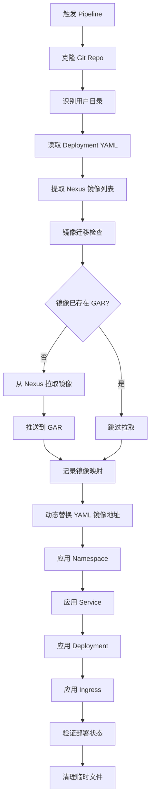
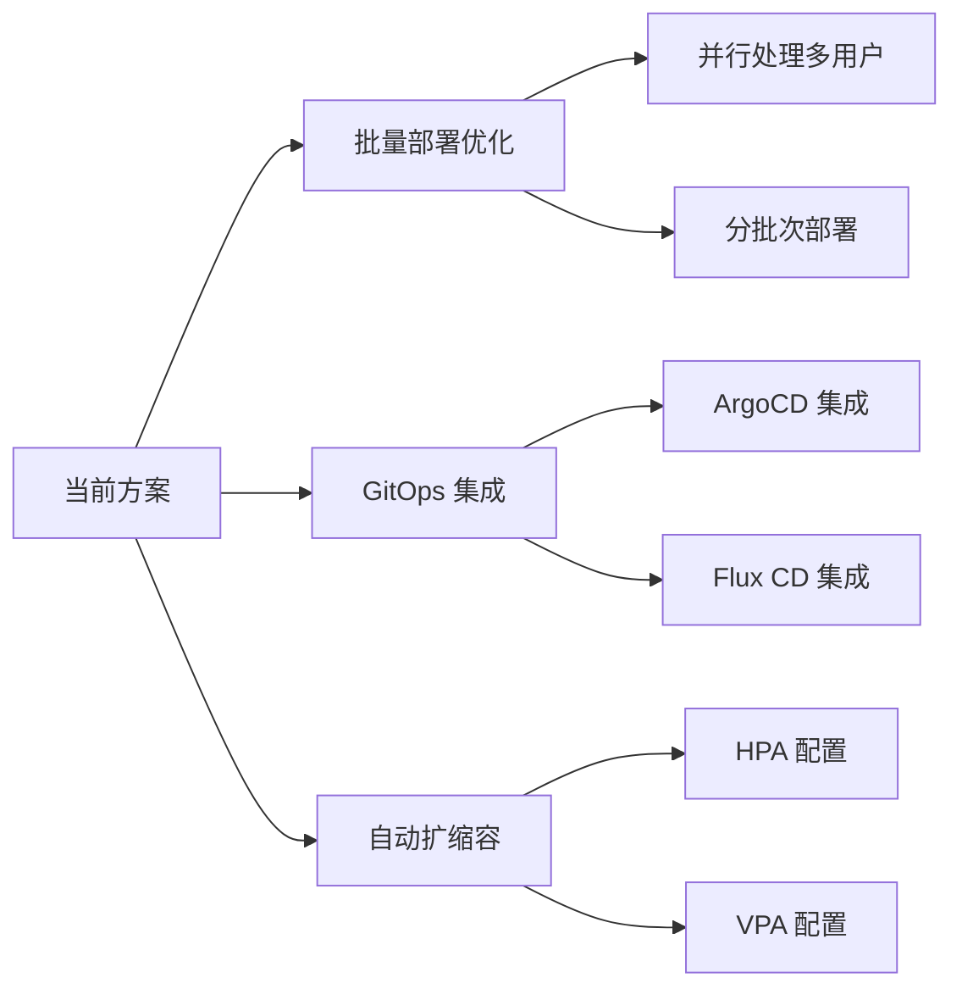

# Pipeline 改造方案分析

## 问题分析

您需要构建一个 CD Pipeline 来实现：

1. 从 Git Repo 获取用户特定的 K8S 资源配置
2. 将 Deployment 中引用的 Nexus 镜像迁移到 GAR
3. 动态替换镜像地址后部署到 GKE
4. 仅使用 `kubectl apply` 命令完成部署

## 核心挑战识别

### 当前方案的关键问题

1. **镜像迁移时机**：何时触发 Nexus → GAR 的镜像同步
2. **配置动态修改**：如何在不修改源 YAML 的情况下替换镜像地址
3. **环境隔离**：不同环境（dev/staging/prod）的配置管理
4. **幂等性保证**：重复部署时避免重复推送镜像

## 推荐实现方案

### 方案架构流程



### Git Repo 目录结构

```bash
platform-deployments/
├── users/
│   ├── user-api-001/
│   │   ├── config.env                 # 用户特定配置
│   │   ├── namespace.yaml
│   │   ├── service.yaml
│   │   ├── deployment.yaml
│   │   └── ingress.yaml
│   ├── user-api-002/
│   │   ├── config.env
│   │   ├── namespace.yaml
│   │   ├── service.yaml
│   │   ├── deployment.yaml
│   │   └── ingress.yaml
├── scripts/
│   ├── migrate-images.sh             # 镜像迁移脚本
│   ├── replace-images.sh             # 镜像地址替换脚本
│   └── deploy.sh                     # 主部署脚本
└── README.md
```

### 用户配置示例

**config.env**

```bash
# 用户标识
USER_ID=user-api-001
NAMESPACE=user-api-001

# 镜像配置
NEXUS_REGISTRY=nexus.example.com
GAR_PROJECT=my-gcp-project
GAR_REGION=asia-east1
GAR_REPO=platform-apis

# 环境配置
ENVIRONMENT=production
REPLICAS=3
RESOURCE_LIMITS_CPU=500m
RESOURCE_LIMITS_MEMORY=512Mi
```

**deployment.yaml（原始配置）**

```yaml
apiVersion: apps/v1
kind: Deployment
metadata:
  name: user-api-001
  namespace: user-api-001
spec:
  replicas: 3
  selector:
    matchLabels:
      app: user-api-001
  template:
    metadata:
      labels:
        app: user-api-001
    spec:
      containers:
      - name: api
        image: nexus.example.com/user-api-001:v1.0.0
        ports:
        - containerPort: 8080
        resources:
          limits:
            cpu: "500m"
            memory: "512Mi"
```

## 核心脚本实现

### 1. 镜像迁移脚本

**scripts/migrate-images.sh**

```bash
#!/bin/bash
set -e

# 参数
NEXUS_IMAGE=$1
GAR_IMAGE=$2
FORCE_PUSH=${3:-false}

# 颜色输出
GREEN='\033[0;32m'
YELLOW='\033[1;33m'
RED='\033[0;31m'
NC='\033[0m'

echo -e "${YELLOW}[镜像迁移] 开始处理: ${NEXUS_IMAGE}${NC}"

# 检查 GAR 镜像是否已存在
if gcloud artifacts docker images describe "${GAR_IMAGE}" &>/dev/null; then
    if [ "${FORCE_PUSH}" = "false" ]; then
        echo -e "${GREEN}[镜像迁移] 镜像已存在，跳过: ${GAR_IMAGE}${NC}"
        return 0
    else
        echo -e "${YELLOW}[镜像迁移] 强制推送模式，覆盖现有镜像${NC}"
    fi
fi

# 拉取 Nexus 镜像
echo -e "${YELLOW}[镜像迁移] 从 Nexus 拉取镜像...${NC}"
if ! docker pull "${NEXUS_IMAGE}"; then
    echo -e "${RED}[镜像迁移] 拉取失败: ${NEXUS_IMAGE}${NC}"
    exit 1
fi

# 标记镜像
echo -e "${YELLOW}[镜像迁移] 标记镜像为 GAR 地址...${NC}"
docker tag "${NEXUS_IMAGE}" "${GAR_IMAGE}"

# 推送到 GAR
echo -e "${YELLOW}[镜像迁移] 推送到 GAR...${NC}"
if ! docker push "${GAR_IMAGE}"; then
    echo -e "${RED}[镜像迁移] 推送失败: ${GAR_IMAGE}${NC}"
    exit 1
fi

# 清理本地镜像（可选）
docker rmi "${NEXUS_IMAGE}" "${GAR_IMAGE}" &>/dev/null || true

echo -e "${GREEN}[镜像迁移] 完成: ${NEXUS_IMAGE} -> ${GAR_IMAGE}${NC}"
```

### 2. YAML 镜像替换脚本

**scripts/replace-images.sh**

```bash
#!/bin/bash
set -e

YAML_FILE=$1
NEXUS_REGISTRY=$2
GAR_REGISTRY=$3
OUTPUT_FILE=$4

if [ ! -f "${YAML_FILE}" ]; then
    echo "错误: YAML 文件不存在: ${YAML_FILE}"
    exit 1
fi

# 使用 sed 替换镜像地址
sed "s|${NEXUS_REGISTRY}|${GAR_REGISTRY}|g" "${YAML_FILE}" > "${OUTPUT_FILE}"

echo "镜像地址已替换: ${YAML_FILE} -> ${OUTPUT_FILE}"
```

### 3. 主部署脚本

**scripts/deploy.sh**

```bash
#!/bin/bash
set -e

# 参数解析
USER_DIR=$1
ENVIRONMENT=${2:-production}
DRY_RUN=${3:-false}

# 验证参数
if [ -z "${USER_DIR}" ]; then
    echo "错误: 必须指定用户目录"
    echo "用法: $0 <user-directory> [environment] [dry-run]"
    exit 1
fi

# 加载用户配置
if [ ! -f "${USER_DIR}/config.env" ]; then
    echo "错误: 配置文件不存在: ${USER_DIR}/config.env"
    exit 1
fi

source "${USER_DIR}/config.env"

# 设置 GAR 完整地址
GAR_REGISTRY="${GAR_REGION}-docker.pkg.dev/${GAR_PROJECT}/${GAR_REPO}"

echo "=========================================="
echo "部署配置信息"
echo "=========================================="
echo "用户ID: ${USER_ID}"
echo "命名空间: ${NAMESPACE}"
echo "环境: ${ENVIRONMENT}"
echo "Nexus 地址: ${NEXUS_REGISTRY}"
echo "GAR 地址: ${GAR_REGISTRY}"
echo "=========================================="

# 创建临时目录
TEMP_DIR=$(mktemp -d)
trap "rm -rf ${TEMP_DIR}" EXIT

# 1. 提取并迁移镜像
echo "[步骤 1/5] 提取 Deployment 中的镜像..."
IMAGES=$(grep -oP "image:\s*\K${NEXUS_REGISTRY}/[^\s]+" "${USER_DIR}/deployment.yaml" || true)

if [ -z "${IMAGES}" ]; then
    echo "警告: 未找到需要迁移的镜像"
else
    echo "找到镜像列表:"
    echo "${IMAGES}"
    
    echo "[步骤 2/5] 开始镜像迁移..."
    for NEXUS_IMAGE in ${IMAGES}; do
        # 提取镜像名和标签
        IMAGE_NAME_TAG=$(echo "${NEXUS_IMAGE}" | sed "s|${NEXUS_REGISTRY}/||")
        GAR_IMAGE="${GAR_REGISTRY}/${IMAGE_NAME_TAG}"
        
        # 执行迁移
        bash scripts/migrate-images.sh "${NEXUS_IMAGE}" "${GAR_IMAGE}" false
    done
fi

# 2. 替换 YAML 中的镜像地址
echo "[步骤 3/5] 替换配置文件中的镜像地址..."
for yaml_file in namespace.yaml service.yaml deployment.yaml ingress.yaml; do
    if [ -f "${USER_DIR}/${yaml_file}" ]; then
        bash scripts/replace-images.sh \
            "${USER_DIR}/${yaml_file}" \
            "${NEXUS_REGISTRY}" \
            "${GAR_REGISTRY}" \
            "${TEMP_DIR}/${yaml_file}"
    fi
done

# 3. 应用资源到 GKE
echo "[步骤 4/5] 部署资源到 GKE..."

if [ "${DRY_RUN}" = "true" ]; then
    echo ">>> DRY RUN 模式，仅显示配置内容 <<<"
    for yaml_file in namespace.yaml service.yaml deployment.yaml ingress.yaml; do
        if [ -f "${TEMP_DIR}/${yaml_file}" ]; then
            echo "========== ${yaml_file} =========="
            cat "${TEMP_DIR}/${yaml_file}"
        fi
    done
else
    # 按顺序应用资源
    for yaml_file in namespace.yaml service.yaml deployment.yaml ingress.yaml; do
        if [ -f "${TEMP_DIR}/${yaml_file}" ]; then
            echo "应用: ${yaml_file}"
            kubectl apply -f "${TEMP_DIR}/${yaml_file}"
        fi
    done
    
    # 4. 验证部署
    echo "[步骤 5/5] 验证部署状态..."
    echo "等待 Deployment 就绪..."
    kubectl rollout status deployment/${USER_ID} -n ${NAMESPACE} --timeout=5m
    
    echo "=========================================="
    echo "部署成功！"
    echo "=========================================="
    kubectl get pods -n ${NAMESPACE}
fi
```

## Pipeline 配置示例

### GitLab CI/CD

**.gitlab-ci.yml**

```yaml
stages:
  - validate
  - deploy

variables:
  GCP_PROJECT: "my-gcp-project"
  GKE_CLUSTER: "platform-cluster"
  GKE_ZONE: "asia-east1-a"
  GAR_REGION: "asia-east1"

before_script:
  # 认证 GCP
  - echo ${GCP_SERVICE_KEY} | base64 -d > ${HOME}/gcp-key.json
  - gcloud auth activate-service-account --key-file ${HOME}/gcp-key.json
  - gcloud config set project ${GCP_PROJECT}
  
  # 配置 kubectl
  - gcloud container clusters get-credentials ${GKE_CLUSTER} --zone ${GKE_ZONE}
  
  # 配置 Docker 认证 GAR
  - gcloud auth configure-docker ${GAR_REGION}-docker.pkg.dev

validate:
  stage: validate
  script:
    - echo "验证 YAML 文件格式..."
    - |
      for user_dir in users/*/; do
        for yaml_file in ${user_dir}*.yaml; do
          kubectl apply --dry-run=client -f ${yaml_file}
        done
      done
  only:
    - merge_requests

deploy:
  stage: deploy
  script:
    - |
      # 识别变更的用户目录
      CHANGED_USERS=$(git diff --name-only ${CI_COMMIT_BEFORE_SHA} ${CI_COMMIT_SHA} | grep '^users/' | cut -d'/' -f2 | sort -u)
      
      if [ -z "${CHANGED_USERS}" ]; then
        echo "没有用户配置变更，跳过部署"
        exit 0
      fi
      
      for user in ${CHANGED_USERS}; do
        echo "部署用户: ${user}"
        bash scripts/deploy.sh "users/${user}" ${CI_ENVIRONMENT_NAME}
      done
  only:
    - main
  environment:
    name: production
```

### GitHub Actions

**.github/workflows/deploy.yml**

```yaml
name: Deploy to GKE

on:
  push:
    branches:
      - main
    paths:
      - 'users/**'

env:
  GCP_PROJECT: my-gcp-project
  GKE_CLUSTER: platform-cluster
  GKE_ZONE: asia-east1-a
  GAR_REGION: asia-east1

jobs:
  deploy:
    runs-on: ubuntu-latest
    
    steps:
    - name: Checkout code
      uses: actions/checkout@v3
      with:
        fetch-depth: 2
    
    - name: Authenticate to Google Cloud
      uses: google-github-actions/auth@v1
      with:
        credentials_json: ${{ secrets.GCP_SERVICE_KEY }}
    
    - name: Set up Cloud SDK
      uses: google-github-actions/setup-gcloud@v1
    
    - name: Configure Docker for GAR
      run: |
        gcloud auth configure-docker ${GAR_REGION}-docker.pkg.dev
    
    - name: Get GKE credentials
      run: |
        gcloud container clusters get-credentials ${GKE_CLUSTER} --zone ${GKE_ZONE}
    
    - name: Detect changed users
      id: changed-users
      run: |
        CHANGED=$(git diff --name-only HEAD^ HEAD | grep '^users/' | cut -d'/' -f2 | sort -u | tr '\n' ' ')
        echo "users=${CHANGED}" >> $GITHUB_OUTPUT
    
    - name: Deploy changed users
      if: steps.changed-users.outputs.users != ''
      run: |
        for user in ${{ steps.changed-users.outputs.users }}; do
          echo "Deploying user: ${user}"
          bash scripts/deploy.sh "users/${user}" production
        done
```

## Pipeline 关键参数说明

|参数名|类型|描述|示例|
|---|---|---|---|
|`GIT_REPO`|String|Git 仓库地址|`https://github.com/org/platform-deployments.git`|
|`USER_ID`|String|用户标识符|`user-api-001`|
|`ENVIRONMENT`|String|部署环境|`dev` / `staging` / `production`|
|`NEXUS_REGISTRY`|String|Nexus 镜像仓库地址|`nexus.example.com`|
|`GAR_PROJECT`|String|GCP 项目 ID|`my-gcp-project`|
|`GAR_REGION`|String|GAR 区域|`asia-east1`|
|`GAR_REPO`|String|GAR 仓库名称|`platform-apis`|
|`GKE_CLUSTER`|String|GKE 集群名称|`platform-cluster`|
|`GKE_ZONE`|String|GKE 集群区域|`asia-east1-a`|
|`FORCE_IMAGE_PUSH`|Boolean|强制推送镜像（覆盖）|`false`|
|`DRY_RUN`|Boolean|演练模式（不实际部署）|`false`|

## 方案优化建议

### 1. 镜像缓存优化

```bash
# 在 Pipeline 中添加镜像清单缓存
IMAGE_MANIFEST_FILE=".image-manifest.json"

# 记录已迁移的镜像
record_migrated_image() {
    local nexus_img=$1
    local gar_img=$2
    echo "{\"nexus\": \"${nexus_img}\", \"gar\": \"${gar_img}\", \"timestamp\": \"$(date -u +%Y-%m-%dT%H:%M:%SZ)\"}" \
        >> ${IMAGE_MANIFEST_FILE}
}

# 检查镜像是否已迁移
check_image_migrated() {
    local nexus_img=$1
    grep -q "\"nexus\": \"${nexus_img}\"" ${IMAGE_MANIFEST_FILE} 2>/dev/null
}
```

### 2. 配置模板化

使用环境变量替换，减少重复配置：

**deployment.yaml.template**

```yaml
apiVersion: apps/v1
kind: Deployment
metadata:
  name: ${USER_ID}
  namespace: ${NAMESPACE}
spec:
  replicas: ${REPLICAS}
  selector:
    matchLabels:
      app: ${USER_ID}
  template:
    metadata:
      labels:
        app: ${USER_ID}
        environment: ${ENVIRONMENT}
    spec:
      containers:
      - name: api
        image: ${IMAGE_URL}
        ports:
        - containerPort: 8080
        resources:
          limits:
            cpu: ${RESOURCE_LIMITS_CPU}
            memory: ${RESOURCE_LIMITS_MEMORY}
        env:
        - name: ENVIRONMENT
          value: ${ENVIRONMENT}
```

**渲染模板脚本**

```bash
#!/bin/bash
# render-template.sh

TEMPLATE_FILE=$1
OUTPUT_FILE=$2
CONFIG_FILE=$3

# 加载配置
source "${CONFIG_FILE}"

# 使用 envsubst 渲染模板
envsubst < "${TEMPLATE_FILE}" > "${OUTPUT_FILE}"
```

### 3. 健康检查增强

```bash
# 在 deploy.sh 中添加更详细的健康检查
validate_deployment() {
    local namespace=$1
    local deployment=$2
    
    echo "验证部署健康状态..."
    
    # 等待 Pods 就绪
    kubectl wait --for=condition=ready pod \
        -l app=${deployment} \
        -n ${namespace} \
        --timeout=300s
    
    # 检查 Pod 状态
    FAILED_PODS=$(kubectl get pods -n ${namespace} -l app=${deployment} \
        --field-selector=status.phase!=Running \
        --no-headers | wc -l)
    
    if [ ${FAILED_PODS} -gt 0 ]; then
        echo "错误: 有 ${FAILED_PODS} 个 Pod 未正常运行"
        kubectl get pods -n ${namespace} -l app=${deployment}
        return 1
    fi
    
    echo "部署验证通过"
    return 0
}
```

### 4. 回滚机制

```bash
# rollback.sh
#!/bin/bash
set -e

NAMESPACE=$1
DEPLOYMENT=$2

echo "开始回滚 Deployment: ${DEPLOYMENT}"

# 回滚到上一个版本
kubectl rollout undo deployment/${DEPLOYMENT} -n ${NAMESPACE}

# 等待回滚完成
kubectl rollout status deployment/${DEPLOYMENT} -n ${NAMESPACE}

echo "回滚完成"
kubectl get pods -n ${NAMESPACE} -l app=${DEPLOYMENT}
```

## 安全与权限考虑

### 1. Service Account 最小权限

```yaml
# pipeline-sa.yaml
apiVersion: v1
kind: ServiceAccount
metadata:
  name: pipeline-deployer
  namespace: default

---
apiVersion: rbac.authorization.k8s.io/v1
kind: ClusterRole
metadata:
  name: pipeline-deployer-role
rules:
- apiGroups: [""]
  resources: ["namespaces", "services"]
  verbs: ["get", "list", "create", "update", "patch"]
- apiGroups: ["apps"]
  resources: ["deployments"]
  verbs: ["get", "list", "create", "update", "patch", "delete"]
- apiGroups: ["networking.k8s.io"]
  resources: ["ingresses"]
  verbs: ["get", "list", "create", "update", "patch"]

---
apiVersion: rbac.authorization.k8s.io/v1
kind: ClusterRoleBinding
metadata:
  name: pipeline-deployer-binding
subjects:
- kind: ServiceAccount
  name: pipeline-deployer
  namespace: default
roleRef:
  kind: ClusterRole
  name: pipeline-deployer-role
  apiGroup: rbac.authorization.k8s.io
```

### 2. Secret 管理

```bash
# 使用 GCP Secret Manager 存储敏感信息
gcloud secrets create nexus-credentials \
    --data-file=./nexus-creds.json

# 在 Pipeline 中获取 Secret
NEXUS_USER=$(gcloud secrets versions access latest --secret="nexus-username")
NEXUS_PASS=$(gcloud secrets versions access latest --secret="nexus-password")

# Docker 登录 Nexus
echo "${NEXUS_PASS}" | docker login ${NEXUS_REGISTRY} -u ${NEXUS_USER} --password-stdin
```

## 注意事项与最佳实践

### 重要提醒

1. **镜像标签管理**
    
    - 建议使用明确的版本标签（如 `v1.0.0`）而非 `latest`
    - 在 config.env 中明确指定镜像版本
2. **资源配额**
    
    - 为每个 Namespace 设置 ResourceQuota 防止资源滥用
    - 在 Deployment 中始终设置 resources.limits
3. **网络策略**
    
    - 考虑添加 NetworkPolicy 隔离不同用户的流量
    - 限制 Pod 间的通信范围
4. **日志与监控**
    
    - 集成 GCP Cloud Logging 收集应用日志
    - 配置 Prometheus/Grafana 监控资源使用
5. **CI/CD 优化**
    
    - 使用 Pipeline 缓存减少重复镜像拉取
    - 实现增量部署只更新变更的用户资源

### 扩展性考虑

当用户规模增长时的优化方向：



---

这个方案充分利用了纯 `kubectl` 命令的能力，通过脚本化实现了镜像迁移和配置动态替换的需求。您可以根据实际情况调整参数和流程细节。