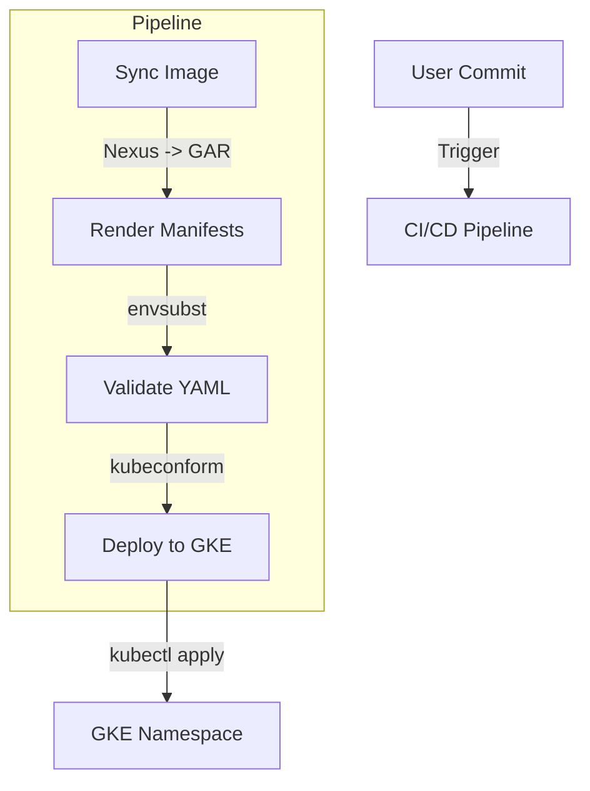

# CD Pipeline Demo Walkthrough (Refactored)

I have refactored the CD Pipeline demo to remove Kustomize and use simple `envsubst` templating with `kubectl apply`.

## 📊 Process Flow



## 📂 Directory Structure

The structure is now simpler:

```bash
.
├── users/                  # User configurations
│   └── userA/
│       └── api1/
│           └── templates/  # Parameterized K8s manifests
├── scripts/                # Utility scripts
│   ├── sync-image.sh       # Syncs images from Nexus to GAR
│   └── render-and-apply.sh # Renders templates and applies to GKE
├── pipeline/               # CI/CD Pipeline configuration
│   └── cloudbuild.yaml     # Google Cloud Build config
├── PMU_Checklist.md        # Checklist for Platform Management Unit
└── Namespace_Ingress_Policy.md # Policy documentation
```

## 🚀 How to Use

### 1. Review the Templates
- Check `users/userA/api1/templates/deployment.yaml`. You will see variables like `${IMAGE_NAME}`, `${REPLICAS}`, etc.

### 2. Pipeline Logic (`pipeline/cloudbuild.yaml`)
The pipeline performs 2 main steps:
1.  **Sync Image**: Pulls from Nexus -> Tags -> Pushes to GAR.
2.  **Render & Deploy**: 
    - Sets environment variables (e.g., `IMAGE_NAME`, `REPLICAS`).
    - Runs `scripts/render-and-apply.sh`.
    - The script uses `envsubst` to replace variables in `templates/*.yaml`.
    - The script runs `kubeconform` to validate the rendered YAML.
    - The script runs `kubectl apply` to deploy to `userA` namespace.

### 3. Scripts
- `scripts/sync-image.sh`: Handles the Docker pull/tag/push logic.
- `scripts/render-and-apply.sh`: Handles variable substitution and deployment.

### 4. Documentation
- `PMU_Checklist.md`: Updated to reflect the new templating approach.
- `Namespace_Ingress_Policy.md`: Policy documentation.

## ✅ Next Steps
- You can try running `scripts/render-and-apply.sh` locally (make sure to export the required env vars first) to see the generated YAML.
- Adjust `pipeline/cloudbuild.yaml` with your actual Project ID, Cluster Name, and Zone.
