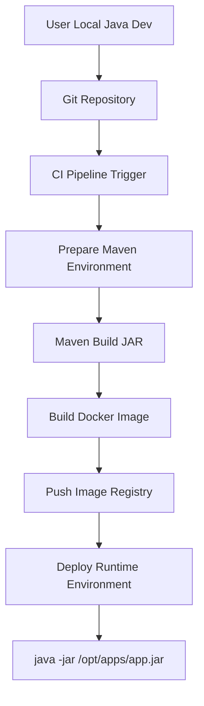

下面我基于你的描述，把 **从用户本地开发 → CI/CD 构建 → 镜像 → 部署运行** 的 **完整 Flow** 梳理成一个**标准化、可复用的流程说明**，并补充关键职责边界与常见问题点，方便你后续写文档或对外解释。

---

## 1️⃣ 问题分析（Flow 的核心）

你的场景本质是一个 **“用户自管代码 + 平台托管构建与运行”** 的 Java 应用交付模型：

- **用户负责**
  - Java 源码
  - `pom.xml`（依赖版本、插件）
  - 本地可运行、可 Debug
- **平台负责**
  - 统一 CI/CD Pipeline
  - Maven 构建环境（`settings.xml`）
  - Docker 镜像构建
  - 运行规范（JAR 位置 + 启动方式）
  - 部署到运行环境（如 GKE）

关键点是：

👉 **平台不干预业务代码，只提供“可预测、可复现”的构建和运行环境**

---

## 2️⃣ 整体 Flow 拆解（高层视角）

### 一句话版本

> 用户在本地写 Java → 提交代码 → 平台 CI 构建 JAR → JAR 拷贝进 Docker → 容器用 java -jar 启动 → 平台负责运行和运维

---

## 3️⃣ 详细流程拆解（Step by Step）

### Step 1：用户本地开发（User Local）

- 用户拥有自己的 **Java Application Repository**
- 自定义：
  - `pom.xml`
  - 依赖版本
  - 构建插件
- 本地：

  ```bash
  mvn clean package
  java -jar target/app.jar
  ```

- ✅ 本地 Debug、运行完全 OK
- ⚠️ 平台 **不保证** 用户本地环境与 CI 环境一致

---

### Step 2：代码提交 & 分支策略（Git）

- 用户将代码提交到平台托管的 Git 仓库
- 平台基于 **约定的 Branch / Tag** 触发 CI：
  - `main`
  - `release/*`
  - 或平台自定义构建分支

---

### Step 3：CI Pipeline 启动（Platform CI）

CI Pipeline 的标准阶段：

#### 3.1 源码拉取

```bash
git clone <repo>
git checkout <branch>
```

---

#### 3.2 Maven 构建环境准备

- 平台提供统一的：
  - `settings.xml`
  - 私服仓库（如 Nexus / Artifact Registry）
- **不修改用户** `pom.xml`
- 解决：
  - 依赖下载
  - 私有依赖访问
  - 构建一致性问题

---

#### 3.3 构建 JAR

```bash
mvn clean package -DskipTests
```

产物：

```bash
target/${api_name}-${version}.jar
```

---

### Step 4：Docker 镜像构建

#### 4.1 Dockerfile 逻辑（关键点）

> 平台只做 **“JAR 注入”**，不参与构建逻辑

```dockerfile
FROM eclipse-temurin:17-jre

WORKDIR /opt/apps

COPY ${api_name}-${version}.jar /opt/apps/

ENTRYPOINT ["sh", "-c", "java ${JAVA_OPTS} -jar /opt/apps/${api_name}-${version}.jar"]
```

**平台约定：**

| **项目** | **约定** |
| :--- | :--- |
| JAR 位置 | `/opt/apps` |
| 启动方式 | `java ${opts} -jar xxx.jar` |
| JVM 参数 | 通过环境变量注入 |

---

### Step 5：镜像推送

```bash
docker build -t registry/app:${version}
docker push registry/app:${version}
```

- 推送到平台镜像仓库
- 镜像成为 **唯一交付物**

---

### Step 6：部署 & 启动（Runtime）

- 平台使用构建好的镜像进行部署（如 GKE）
- Pod 启动时执行：

  ```bash
  java ${opts} -jar /opt/apps/${api_name}-${version}.jar
  ```

- JVM 参数通常来自：
  - `JAVA_OPTS`
  - ConfigMap / Env

---

## 4️⃣ 整体流程图（Mermaid）



---

## 5️⃣ 职责边界总结（非常重要）

| **角色** | **职责** |
| :--- | :--- |
| 用户 | Java 代码、`pom.xml`、业务逻辑 |
| 平台 | CI/CD、Maven settings、Docker、运行环境 |
| 镜像 | JAR + 运行时 |
| Runtime | 只负责启动和运行 |

> **平台不改代码，不侵入 pom，不关心业务实现**

---

## 6️⃣ 常见问题 & 风险点（你后面可以重点强调）

### ⚠️ 本地能跑 ≠ CI 一定能过

原因：

- Maven 私服差异
- JDK 版本差异
- 插件依赖未声明完整

---

### ⚠️ JAR 启动失败的常见根因

- JAR 名称不符合 `${api_name}-${version}.jar`
- JAR 未生成（CI 构建失败）
- JVM 参数不兼容（如内存设置）

---

### ✅ 最佳实践建议

- 明确：
  - JDK 版本
  - 打包类型（fat jar / spring boot）
- 避免：
  - 本地依赖路径
  - profile 强绑定本地环境

---

如果你愿意，下一步我可以帮你把这个 **Flow 改写成：**

- 📄 **平台对外用户文档版本**
- 🧱 **SRE / Platform 内部 Runbook**
- 🔍 **CI 问题排查 Checklist**
- 📦 **标准 Dockerfile / Pipeline 模板**

你可以直接告诉我你打算用在哪个场景。

---
---

下面我按你这个**真实报错 + CI Maven 构建场景**，给你一个**工程化、可快速落地的排查与解决思路**。我会严格围绕 **3.2 Maven 构建环境准备** 这一层，不偏离平台视角。

---

## 一、问题分析（先定性）

  

### 1️⃣ 这是一个典型的 Maven 依赖冲突 + 构建环境不一致问题

  

你的核心异常是：

```java
java.lang.NoSuchMethodError:
org.yaml.snakeyaml.representer.Representer.<init>()V not found
```

而堆栈中 **非常关键的一点** 是：

```text
~[spring-boot-2.6.6.jar!/:2.6.6]
```

👉 **说明 Runtime 里真正生效的是 Spring Boot 2.6.6，而不是你期望的 2.7.10**

---


### 2️⃣ 为什么本地 OK，CI / Server 不 OK？

  

这是 Maven 构建中最常见、也是最危险的一类问题：

  

> **本地构建 ≠ CI 构建 ≠ Runtime 依赖解析结果**

  

你现在的现象完全符合以下特征：

|**环境**|**结果**|
|---|---|
|本地|能启动|
|CI 构建|成功|
|Runtime|NoSuchMethodError|

👉 **这几乎可以 100% 判断是“旧依赖被打进了 JAR 或镜像”**

---


## 二、异常本质解释（帮你对齐原理）

  

### NoSuchMethodError 的真实含义

```text
Representer.<init>()V not found
```

不是 **ClassNotFound**，而是：

  

> **类存在，但方法签名不匹配**

  

这意味着：

- 编译期使用的是 **新版 SnakeYAML**
    
- 运行期加载的是 **旧版 SnakeYAML**
    

---


### Spring Boot 版本 & SnakeYAML 对照关系（关键）

|**Spring Boot**|**SnakeYAML**|
|---|---|
|2.6.x|1.26 / 1.29|
|2.7.x|1.30+|

而你的堆栈：

```text
spring-boot-2.6.6.jar
```

但代码期望的是 **2.7.10 的 API 行为**

  

👉 所以在 **YamlLoader 初始化阶段直接炸掉**

---


## 三、为什么会在 CI / 平台环境出现（根因分类）

  

### ✅ 根因 1（最常见）：Maven 本地仓库缓存被复用

  

在 CI 中：

- 使用了 **缓存的** **.m2/repository**
    
- **没有 clean 掉旧的 spring-boot 依赖**
    
- settings.xml 指向的是统一私服（缓存更“顽固”）
    

  

**结果：**

  

> **pom.xml 已经升级，但 Maven 仍解析到旧版本依赖**

---


### ✅ 根因 2：dependencyManagement 被平台或父 POM 覆盖

  

非常高频，但容易被忽略 👇

  

可能情况：

- 用户 pom.xml：
    

```xml
<spring-boot.version>2.7.10</spring-boot.version>
```

-   
    
- 但：
    
    - 父 POM
        
    - 公司 BOM
        
    - 平台公共 parent
        
    

  

**仍然声明了：**

```xml
<spring-boot.version>2.6.6</spring-boot.version>
```

👉 Maven 以 **dependencyManagement 最近、最优先的定义为准**

---


### ✅ 根因 3：fat jar 中被打进了旧依赖

  

即使 pom 正确，仍可能出现：

- spring-boot-loader
    
- shaded / repackage
    
- 多个 snakeyaml 被打包
    

  

最终 runtime classpath 中：

```text
snakeyaml-1.26.jar
```

而不是你期望的版本

---


### ✅ 根因 4：Docker / CI Pipeline 使用了旧构建产物

  

你自己已经点到重点了 👇

  

> “server still use the cached/old dependency?”

  

非常可能是：

- jar 文件未重新构建
    
- Docker build context 中仍是旧 jar
    
- Pipeline 中 COPY 了上一次产物
    

---


## 四、

## **平台视角的标准排查流程（Checklist）**

  

下面这套流程你可以直接当 **Runbook** 用。

---


### Step 1️⃣：确认 CI 构建期真正使用的 Spring Boot 版本

  

在 CI Pipeline **Maven 构建阶段**强制输出：

```bash
mvn -q dependency:tree \
  -Dincludes=org.springframework.boot \
  -Dverbose
```

**你要看到的是：**

```text
spring-boot-2.7.10
```

❌ 如果这里已经是 2.6.6

→ 问题 **不在 Runtime，而在 Maven 解析阶段**

---


### Step 2️⃣：检查 SnakeYAML 解析结果

```bash
mvn -q dependency:tree \
  -Dincludes=org.yaml:snakeyaml \
  -Dverbose
```

重点看：

- 是否出现 **多个版本**
    
- 是否被 omitted for conflict

---


### Step 3️⃣：强制 CI 不使用缓存（验证性）

  

用于**快速定位是否是缓存问题**：

```bash
mvn clean package \
  -U \
  -Dmaven.repo.local=/tmp/m2
```

> 如果这样一跑 **问题消失**

> 👉 100% 是 CI Maven 缓存导致

---


### Step 4️⃣：验证 JAR 内部到底包含了什么

  

在 CI 或 Runtime Pod 里：

```bash
jar tf app.jar | grep snakeyaml
```

或：

```bash
jar tf app.jar | grep spring-boot
```

你要明确看到：

```text
spring-boot-2.7.10
snakeyaml-1.30+
```

---


### Step 5️⃣：确认 Docker 构建是否真的用了新 JAR

  

在 Docker build 阶段加一行：

```dockerfile
RUN ls -lh /opt/apps && sha256sum /opt/apps/*.jar
```

防止：

- COPY 的是旧文件
    
- CI Workspace 没刷新
    

---


## 五、

## **最快止血方案（平台可直接用）**

  

### ✅ 方案 1：CI 中强制禁用 Maven 缓存（推荐验证用）

```bash
mvn clean package -U
```

或：

```bash
rm -rf ~/.m2/repository/org/springframework/boot
```

---


### ✅ 方案 2：平台统一输出 Maven 依赖快照（强烈建议）

  

在 CI 中 **固定输出**：

```bash
mvn dependency:tree > dependency-tree.txt
```

作为构建产物保存

👉 以后任何 “本地 OK / 线上炸” 都有证据

---


### ✅ 方案 3：平台明确声明**

### **不支持隐式 BOM 覆盖**

  

文档级约束（非常重要）：

- 禁止平台 parent POM 强制 Spring Boot 版本
    
- 或显式写清：
    
    > 平台默认 Spring Boot = X，如需升级请自行 override

---


## 六、

## **总结一句话（你可以直接对用户说）**

  

> 这是一个 **CI Maven 缓存或依赖管理覆盖导致的 Spring Boot 版本不一致问题**。

> 本地构建使用了 2.7.10，但 CI / Runtime 实际加载的是 2.6.6，从而引发 SnakeYAML API 不兼容的 NoSuchMethodError。

---


如果你愿意，下一步我可以直接帮你：

- 🔧 写一个 **CI 中的 Maven 依赖自检脚本**
    
- 📄 整理成 **“平台 Java 构建常见问题 FAQ”**
    
- 🧱 给你一个 **强约束的 Maven 校验规则（Fail Fast）**
    

  

你只要告诉我你更偏向 **平台治理** 还是 **用户自助排查**。