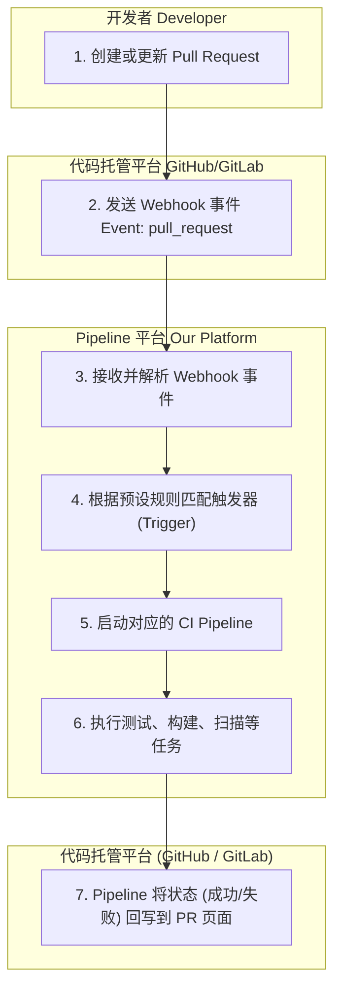

# 在 Pull Request (PR) 创建时自动触发 CI 测试

我们理解您希望在每次创建或更新 Pull Request (PR) 时自动运行 CI (持续集成) 测试，以确保代码在合并到主分支前符合质量标准。这是一个非常普遍且重要的需求，我们的 Pipeline 平台完全支持此功能。

本文档将详细解释该功能的实现原理、配置步骤以及相关的权限说明。

---

## 1. 需求解读：PR 触发的 CI 测试

您的核心诉求是：

> “每当为代码仓库创建或更新 Pull Request 时，系统能自动执行预设的 CI Pipeline (例如：编译、单元测试、代码扫描等)，并将结果反馈到 PR 页面。”

这是一种典型的 **GitOps CI 触发场景**，目的是在代码审查阶段尽早发现问题，保障代码质量。

---

## 2. 实现原理：Webhook 驱动的自动化流程

CI/CD 系统 (包括我们的平台) 通常通过与代码托管平台 (如 GitHub, GitLab) 的 Webhook 集成来实现自动化触发。

其标准工作流程如下：



**流程说明:**
1.  **触发**：您在 GitHub 或 GitLab 等平台上提交代码并创建 PR。
2.  **通知**：代码平台立即向我们 Pipeline 系统预先配置的 Webhook 地址发送一个包含 PR 信息的事件通知。
3.  **执行**：我们的平台接收到通知后，会根据您配置的触发规则 (例如：目标分支是 `main` 或 `develop` 的 PR)，启动对应的 CI Pipeline。
4.  **反馈**：Pipeline 执行完毕后，会将最终状态（如 `Success` 或 `Failure`）报告给代码平台，并直接显示在您的 PR 页面上，便于 Code Review。

---

## 3. 如何在我们的平台进行配置

要在您的服务代码仓库中启用此功能，您需要完成以下两个核心配置：**创建 Pipeline** 和 **设置触发器**。

### **步骤一：定义您的 CI Pipeline**

首先，您需要有一个用于执行 CI 测试的 Pipeline。这通常是一个 YAML 文件，定义了测试的各个步骤。

**示例 `ci-pipeline.yaml`:**
这是一个简单的示例，用于执行 Maven 单元测试。您可以根据项目的技术栈（如 Node.js, Python, Go）进行修改。

```yaml
# ci-pipeline.yaml
# 定义一个用于 PR 代码质量检查的 Pipeline

steps:
  # 第一步：检出代码 (平台通常会自动处理)
  # - name: 'gcr.io/cloud-builders/git'
  #   args: ['checkout', '$COMMIT_SHA']

  # 第二步：执行单元测试
  - name: 'gcr.io/cloud-builders/mvn' # 使用 Maven 镜像
    args: ['test']                  # 执行 test 命令
    id: 'Run Unit Tests'

  # 第三步（可选）：执行代码风格检查
  - name: 'gcr.io/cloud-builders/npm' # 假设使用 npm 进行 lint
    args: ['install', '&&', 'npm', 'run', 'lint']
    id: 'Code Linting'

# 您可以根据需要添加更多步骤，如编译、打包、安全扫描等
```

### **步骤二：创建触发器 (Trigger)**

触发器用于连接您的代码仓库和 Pipeline。

1.  **进入 Pipeline 管理界面**：登录我们的平台，找到 "Triggers" (触发器) 管理模块。
2.  **新建触发器**：点击 "Create Trigger"。
3.  **填写触发器配置**：
    *   **名称 (Name)**：为您的触发器命名，例如 `pr-ci-test-trigger`。
    *   **事件 (Event)**：选择 **`Pull request`**。这是实现您需求的关键。
    *   **源 (Source)**：
        *   **仓库 (Repository)**：选择您需要启用此功能的服务代码仓库。如果仓库未显示，您可能需要先进行授权 (见第 4 节)。
        *   **目标分支 (Base branch)**：指定 PR 的目标分支，例如 `main`, `master`, `develop`。只有向这些分支发起的 PR 才会触发 Pipeline。
    *   **Pipeline 配置 (Configuration)**：
        *   **类型 (Type)**：选择 "Pipeline YAML" 或类似的选项。
        *   **路径 (Location)**：指定您在代码仓库中的 Pipeline YAML 文件路径 (例如：`/ci-pipeline.yaml`)。

4.  **保存触发器**：点击 "Create" 或 "Save"。

完成以上步骤后，您的自动化 CI 流程就已生效。现在，每当有新的代码提交到该仓库的 PR 时，CI Pipeline 将被自动触发。

---

## 4. 权限申请与说明

为了让我们的 Pipeline 平台能够访问您的代码仓库并执行构建，需要以下两种授权：

| 权限类型 | 描述 | 如何操作 |
| :--- | :--- | :--- |
| **代码仓库访问权限** | 允许我们的平台：<br> 1. 接收来自您代码仓库的 Webhook 事件。<br> 2. 将 Pipeline 执行状态回写到 PR 页面。 | 通常在平台的 "Source Repositories" 或 "Connections" 页面操作。您需要授权我们的平台访问您的 GitHub/GitLab 组织或个人账户。这一般是通过安装一个平台提供的 **GitHub App** 或通过 **OAuth** 授权来完成。 |
| **Pipeline 执行权限** | 确保 Pipeline 在运行时有权限执行其定义的任务，例如拉取镜像、写入存储桶等。 | 我们的平台会为每次 Pipeline 执行分配一个服务账号 (Service Account)。您需要确保该服务账号拥有必要的 IAM 角色，例如 `roles/cloudbuild.builds.editor` (Cloud Build 构建编辑者) 或其他项目所需的特定角色。请查阅我们的权限文档或联系技术支持获取详细的角色列表。 |

如果您在配置过程中遇到任何权限问题，请随时联系我们的技术支持团队。
