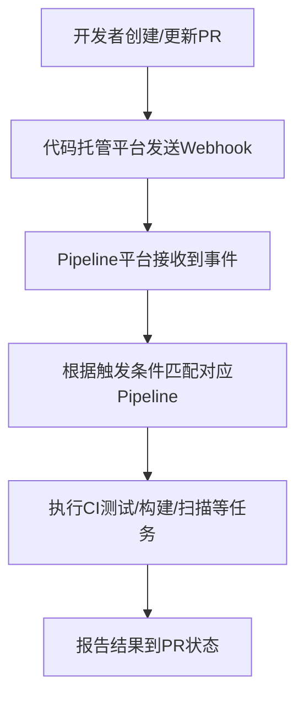

这个问题其实是很多做 **CI/CD 平台接入** 的用户都会问的场景。我们可以分成两部分来理解：

---

## **一、用户的需求分析**

  

用户提到的核心诉求是：

  

> “每当创建 Pull Request（PR） 时，自动运行 CI 测试。”

  

换句话说，用户想要的就是 **在 PR 触发时执行自动化 Pipeline（CI 测试）**。

这是一种 **典型的 GitOps CI 触发场景**，一般在以下几种事件下执行：

|**触发事件**|**示例说明**|
|---|---|
|**Push 到某个分支**|用户推送代码到 main 或 develop 分支时触发 Pipeline|
|**创建或更新 Pull Request**|用户在提交 PR 时触发 CI 测试，用于验证代码是否能通过构建和测试|
|**Merge 事件**|当 PR 被合并时触发后续的构建或部署任务|

所以，用户的问题其实是：

  

> “你们的 Pipeline 系统是否支持在 PR 创建或更新时自动触发执行？如果支持，应该使用哪种 Pipeline 类型？如何申请权限在他们的代码仓库里触发？”

---

## **二、常规情况下 Pipeline 的触发逻辑**

  

在常见的 CI/CD 平台中（如 **GitHub Actions、GitLab CI、Cloud Build、Jenkins、Tekton 等**），实现“PR 触发 CI”的方式都是类似的，逻辑如下：



---

### **🔹 一般实现方式（以GCP/Cloud Build为例）**

1. **在代码仓库（如 GitHub）配置触发器（Trigger）**
    
    - 类型选择：Pull Request
        
    - 条件：branch pattern 或 target branch
        
    - 操作：PR 创建或更新时触发 Cloud Build Pipeline
        
    
2. **定义 Cloud Build YAML**
    

```
steps:
- name: 'gcr.io/cloud-builders/mvn'
  args: ['test']
```

2. 这就是一个简单的 CI 测试 Pipeline。
    
3. **授予权限**
    
    - 触发器需要访问代码仓库权限（通常是通过 GitHub App 或 GitLab OAuth）
        
    - Cloud Build 服务账号需要能执行构建（roles/cloudbuild.builds.editor）
        
    

---

### **🔹 如果用户使用你们平台（内部自建 Pipeline）**

  

你们可以这样解释或实现：

|**模块**|**说明**|
|---|---|
|**Webhook 接收器**|当 PR 创建/更新时，Git 平台会发送事件到你们平台的 webhook endpoint|
|**Pipeline 触发逻辑**|解析 webhook payload（比如 GitHub 的 pull_request 事件），判断触发条件|
|**Pipeline 执行**|根据用户配置的 pipeline 名称（如 ci-test），启动对应的 Pipeline job|
|**权限控制**|用户需要在平台中授权代码仓库访问（OAuth Token / App Integration）|

---

## **三、总结与建议**

|**目标**|**内容**|
|---|---|
|用户想做什么|当 PR 被创建或更新时，自动运行 CI 测试 Pipeline|
|你们需要提供的能力|一个支持 **PR Webhook 触发** 的 Pipeline 类型（或触发器配置）|
|关键点|1️⃣ 支持 Git 平台 webhook 事件解析；2️⃣ Pipeline 定义能被动态触发；3️⃣ 用户能配置触发条件与权限；|
|对应文档说明|建议在文档中补充 “支持的触发事件类型（Push/PR/Merge）” 及 “如何配置 Git 仓库触发器”|

---

如果你愿意，我可以帮你画一个更贴近你们 **AIBANG Pipeline 平台结构** 的流程图，比如：

  

> 用户在 GitHub 提交 PR → GitHub Webhook → 你们的 Pipeline 接收服务 → 启动对应的 CI Job → 回写状态到 GitHub。

  

是否希望我帮你补这一段？