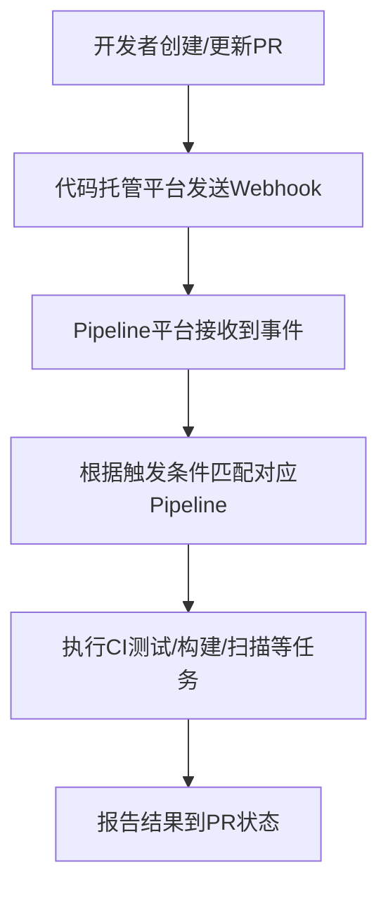

这个问题其实是很多做 **CI/CD 平台接入** 的用户都会问的场景。我们可以分成两部分来理解：

---

## **一、用户的需求分析**

  

用户提到的核心诉求是：

  

> “每当创建 Pull Request（PR） 时，自动运行 CI 测试。”

  

换句话说，用户想要的就是 **在 PR 触发时执行自动化 Pipeline（CI 测试）**。

这是一种 **典型的 GitOps CI 触发场景**，一般在以下几种事件下执行：

|**触发事件**|**示例说明**|
|---|---|
|**Push 到某个分支**|用户推送代码到 main 或 develop 分支时触发 Pipeline|
|**创建或更新 Pull Request**|用户在提交 PR 时触发 CI 测试，用于验证代码是否能通过构建和测试|
|**Merge 事件**|当 PR 被合并时触发后续的构建或部署任务|

所以，用户的问题其实是：

  

> “你们的 Pipeline 系统是否支持在 PR 创建或更新时自动触发执行？如果支持，应该使用哪种 Pipeline 类型？如何申请权限在他们的代码仓库里触发？”

---

## **二、常规情况下 Pipeline 的触发逻辑**

  

在常见的 CI/CD 平台中（如 **GitHub Actions、GitLab CI、Cloud Build、Jenkins、Tekton 等**），实现“PR 触发 CI”的方式都是类似的，逻辑如下：



---

### **🔹 一般实现方式（以GCP/Cloud Build为例）**

1. **在代码仓库（如 GitHub）配置触发器（Trigger）**
    
    - 类型选择：Pull Request
        
    - 条件：branch pattern 或 target branch
        
    - 操作：PR 创建或更新时触发 Cloud Build Pipeline
        
    
2. **定义 Cloud Build YAML**
    

```
steps:
- name: 'gcr.io/cloud-builders/mvn'
  args: ['test']
```

2. 这就是一个简单的 CI 测试 Pipeline。
    
3. **授予权限**
    
    - 触发器需要访问代码仓库权限（通常是通过 GitHub App 或 GitLab OAuth）
        
    - Cloud Build 服务账号需要能执行构建（roles/cloudbuild.builds.editor）
        
    

---

### **🔹 如果用户使用你们平台（内部自建 Pipeline）**

  

你们可以这样解释或实现：

|**模块**|**说明**|
|---|---|
|**Webhook 接收器**|当 PR 创建/更新时，Git 平台会发送事件到你们平台的 webhook endpoint|
|**Pipeline 触发逻辑**|解析 webhook payload（比如 GitHub 的 pull_request 事件），判断触发条件|
|**Pipeline 执行**|根据用户配置的 pipeline 名称（如 ci-test），启动对应的 Pipeline job|
|**权限控制**|用户需要在平台中授权代码仓库访问（OAuth Token / App Integration）|

---

## **三、总结与建议**

|**目标**|**内容**|
|---|---|
|用户想做什么|当 PR 被创建或更新时，自动运行 CI 测试 Pipeline|
|你们需要提供的能力|一个支持 **PR Webhook 触发** 的 Pipeline 类型（或触发器配置）|
|关键点|1️⃣ 支持 Git 平台 webhook 事件解析；2️⃣ Pipeline 定义能被动态触发；3️⃣ 用户能配置触发条件与权限；|
|对应文档说明|建议在文档中补充 “支持的触发事件类型（Push/PR/Merge）” 及 “如何配置 Git 仓库触发器”|

---

如果你愿意，我可以帮你画一个更贴近你们 **AIBANG Pipeline 平台结构** 的流程图，比如：

  

> 用户在 GitHub 提交 PR → GitHub Webhook → 你们的 Pipeline 接收服务 → 启动对应的 CI Job → 回写状态到 GitHub。

  

是否希望我帮你补这一段？

非常好，这个补充信息非常关键。
结合你这句话可以明确：

用户希望在 GitHub 上的 PR 被合并到 master 分支时，自动触发你们平台上的 Pipeline 执行 CI 任务。

也就是说触发点不是 PR 创建阶段，而是 PR merge 阶段（合并后）。
这个场景属于 Post-merge CI Trigger，在业界中非常常见，用于做 集成验证 / 部署前验证。

⸻

一、需求核心

目标	描述
触发时机	当 GitHub 上的 PR 被合并到 master 分支
触发动作	自动触发你们平台的 Pipeline 执行 CI 测试或构建任务
触发方式	通过 GitHub Webhook（或 GitHub Actions 调用你们的 API）
执行目标	运行 CI 流程：编译 / 单元测试 / 镜像构建 / 安全扫描等
回写结果（可选）	将 Pipeline 执行结果同步到 GitHub（例如 PR 状态或 commit status）


⸻

二、常规流程逻辑（标准实践）

下面是标准的 CI 触发流程（以 GitHub → 你们的 Pipeline 为例）：

graph TD
    A[开发者 Merge PR 到 Master] --> B[GitHub 触发 push 事件]
    B --> C[GitHub Webhook 调用 Pipeline 接入服务]
    C --> D[解析事件信息 (repo, branch, commit)]
    D --> E[启动对应的 Pipeline 执行 CI 任务]
    E --> F[CI 执行: 构建 / 测试 / 扫描]
    F --> G[上报结果 (Dashboard 或 GitHub 状态)]


⸻

三、实现逻辑（你们平台的设计思路）

模块	功能描述	示例
Webhook 接收模块	用于接收来自 GitHub 的 push / pull_request 事件	POST /webhook/github
事件解析模块	解析 payload，识别事件类型和分支	检查 event=push 且 ref=refs/heads/master
触发规则匹配	根据事件和仓库匹配对应 Pipeline	例如 repo=A 且 branch=master → pipeline=ci-build
Pipeline 执行模块	调用内部 Pipeline Runner 执行任务	启动 CI 流程（可含测试、构建、镜像推送等步骤）
权限控制	需要用户授权以访问对应代码仓库	OAuth token 或 GitHub App
回写模块（可选）	CI 执行结果写回 GitHub 状态	POST /repos/:owner/:repo/statuses/:sha


⸻

四、示例触发条件（GitHub Webhook Payload）

GitHub 在 merge PR 后会发送 push 事件到 Webhook，payload 中包含：

{
  "ref": "refs/heads/master",
  "repository": {
    "name": "user-service",
    "full_name": "org/user-service"
  },
  "head_commit": {
    "id": "abc123",
    "message": "Merge pull request #45"
  }
}

你们平台的 webhook 接口可以通过判断：

if payload["ref"] == "refs/heads/master":
    trigger_pipeline(repo="org/user-service", branch="master")


⸻

五、你们 Pipeline 执行示意（CI 流程）

graph TD
    A[GitHub Merge PR] --> B[Webhook to CAEP Pipeline API]
    B --> C[Event Parser: 判断branch=master]
    C --> D[Trigger CI Pipeline (Build/Test/Scan)]
    D --> E[结果写入 Pipeline Dashboard]
    E --> F[可选：回写状态到 GitHub Commit]


⸻

六、实际落地建议
	1.	定义标准的触发事件
	•	支持 GitHub Webhook 类型：
	•	push（分支 push 或 merge）
	•	pull_request（可选）
	•	事件过滤：

if branch == "master" and event == "push":
    trigger_pipeline("ci-test")


	2.	提供 Pipeline 绑定机制
	•	用户可以在平台 UI 或配置文件中绑定：

repo: github.com/org/user-service
branch: master
pipeline: ci-build
trigger: on_push


	3.	权限授权
	•	用户需授权 GitHub 仓库访问权限（OAuth 或 GitHub App 安装）
	•	你们平台可使用 GitHub API 回写 CI 状态（成功/失败）
	4.	文档需明确说明
	•	哪种 pipeline 支持 GitHub 触发
	•	事件类型（Push / PR / Merge）
	•	如何配置触发器和申请权限

⸻

七、总结

维度	内容
用户想做的事	PR 合并到 master 时自动触发 CI
实现方式	GitHub → Webhook → 你们 Pipeline 平台
核心逻辑	事件识别 + Pipeline 触发 + 状态上报
你们需完善的部分	Webhook 入口、事件解析、Pipeline 绑定配置、权限说明文档


⸻

是否希望我帮你进一步写出一个示例结构，比如你们 CAEP 平台该如何定义这个触发器配置（YAML/JSON 格式），让用户能在配置文件里绑定 GitHub 仓库和触发条件？

好的 👍
下面是一个适合你们 CAEP 平台（GCP-based internal Pipeline） 的标准化触发配置示例结构。
目标是让用户在他们的服务仓库中，通过一个简单的 YAML 文件（例如 .caep-pipeline.yaml），声明 当 PR merge 到 master 时触发哪一个 Pipeline 来执行 CI 测试。

⸻

一、CAEP Pipeline Trigger 配置示例

文件名建议放在仓库根目录，例如：

# .caep-pipeline.yaml
apiVersion: caep.io/v1
kind: PipelineTrigger
metadata:
  name: user-service-ci
  repo: github.com/org/user-service
spec:
  trigger:
    type: github
    events:
      - push
    branches:
      - master
  pipeline:
    name: ci-build
    project: caep-api-platform
  permissions:
    githubApp: caep-ci-bot
    serviceAccount: caep-ci-runner@caep-prod.iam.gserviceaccount.com
  notifications:
    - type: email
      target: dev-team@company.com
    - type: slack
      channel: "#ci-alerts"


⸻

二、配置字段说明

字段	说明	示例
apiVersion	配置文件版本号	caep.io/v1
kind	配置资源类型	PipelineTrigger
metadata.name	Trigger 名称	user-service-ci
metadata.repo	对应的 GitHub 仓库地址	github.com/org/user-service
spec.trigger.type	触发来源类型	github
spec.trigger.events	监听事件类型	push, pull_request, merge
spec.trigger.branches	触发分支	master
spec.pipeline.name	要触发的 CAEP Pipeline 名称	ci-build
spec.pipeline.project	对应项目或 namespace	caep-api-platform
spec.permissions.githubApp	授权 GitHub 应用	caep-ci-bot
spec.permissions.serviceAccount	执行 Pipeline 的 GCP SA	caep-ci-runner@caep-prod.iam.gserviceaccount.com
spec.notifications	触发结果通知配置	email / slack 等


⸻

三、触发逻辑流程（内部工作机制）

graph TD
    A[GitHub: Merge PR to master] --> B[GitHub Webhook 触发事件 push]
    B --> C[CAEP Webhook 接收服务]
    C --> D[解析 repo/branch 匹配 .caep-pipeline.yaml]
    D --> E[启动对应 Pipeline: ci-build]
    E --> F[执行 CI 流程 (Build/Test/Scan)]
    F --> G[通知结果: 邮件/Slack 或回写 GitHub 状态]


⸻

四、示例 Pipeline 定义（ci-build）

这个 CI Pipeline 可以定义在你们 CAEP 平台中，例如：

# ci-build.yaml
apiVersion: caep.io/v1
kind: Pipeline
metadata:
  name: ci-build
spec:
  steps:
    - name: build
      image: gcr.io/cloud-builders/mvn
      args: ["clean", "package"]
    - name: test
      image: gcr.io/cloud-builders/mvn
      args: ["test"]
    - name: push-image
      image: gcr.io/cloud-builders/docker
      args: ["build", "-t", "gcr.io/caep-api/user-service:${COMMIT_SHA}", "."]
  artifacts:
    - name: build-logs
      path: /workspace/logs


⸻

五、权限申请和授权流程（你们平台侧）

步骤	动作	说明
1️⃣	用户在 GitHub 安装 caep-ci-bot App	用于 webhook 推送和状态写回
2️⃣	平台管理员在 CAEP 控制台创建 ci-build Pipeline	定义 CI 流程
3️⃣	用户在仓库添加 .caep-pipeline.yaml	绑定仓库和触发规则
4️⃣	系统检测到新 push（merge）事件后自动触发	调用 CAEP API 执行 Pipeline


⸻

六、最佳实践与建议
	1.	配置文件版本管理
.caep-pipeline.yaml 应纳入仓库版本控制，便于团队共享触发规则。
	2.	安全隔离
每个 Pipeline 执行都应使用独立的 GCP Service Account，防止跨项目权限泄露。
	3.	可扩展性
后续可以扩展更多事件：
	•	pull_request → 在 PR 创建时做预检测（pre-merge test）
	•	tag → 在发布版本时触发镜像构建或部署
	4.	结果回写
在 CI 结束后回写 GitHub commit status，例如：
	•	✅ CI Passed
	•	❌ CI Failed
这能让开发者直接在 GitHub 上看到构建结果。

⸻

七、完整工作流总结

阶段	动作
① 用户提交 PR 并合并到 master	GitHub 产生 push 事件
② GitHub Webhook → CAEP Webhook 接口	Webhook 事件推送到你们平台
③ CAEP Webhook 服务解析事件	读取 .caep-pipeline.yaml，匹配分支/事件
④ 启动 CI Pipeline	通过 CAEP Pipeline 执行构建、测试、镜像推送
⑤ 返回执行结果	结果展示在 CAEP 平台并可回写 GitHub 状态
⑥ 通知团队	通过邮件 / Slack 通知结果


⸻

是否希望我再帮你把这个 .caep-pipeline.yaml 示例扩展为一个 支持多环境（如 dev/staging/prod）的版本？
这样可以让用户在不同分支（如 develop / release / master）上触发不同的 Pipeline。