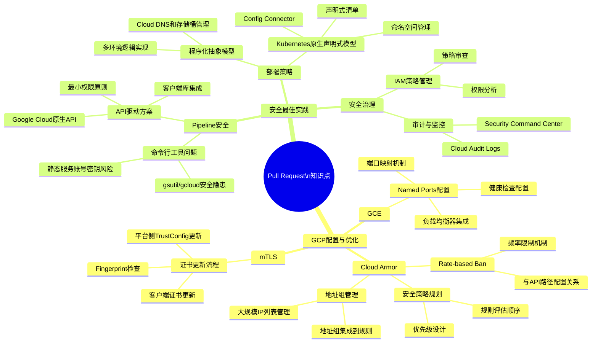

# Pull Request 知识点分析

Analyze my git logs from the last week. Categorize modified files by technical domain. Summarize the key knowledge points and present everything in a Markdown document with a Mermaid mindmap.

本文档基于最近的Pull Request和提交内容，分析并展示相关知识点。

## 最近提交内容分析

根据Git提交历史分析，最近的提交主要集中在以下几个领域：

1. **GCP相关配置与优化**
   - GCE Named Ports配置
   - Cloud Armor安全策略
   - mTLS证书更新流程
   - 安全Pipeline脚本改进

2. **安全最佳实践**
   - Pipeline+Script安全问题
   - Google Cloud API安全使用
   - 服务账号权限管理

## 知识点MindMap

## 主要知识领域详解

### 1. GCP配置与优化

#### GCE Named Ports
- **概念**: 在GCP中，Named Ports是一种将名称映射到端口号的机制，用于负载均衡器和实例组之间的通信。
- **应用场景**: 当Backend Service的Port与实际服务端口不同时，通过Named Ports实现正确路由。
- **配置要点**: 
  - Backend Service可以通过PortName引用MIG中定义的Named Port
  - Health Check可以独立配置端口，与Backend Service的Port无关

#### Cloud Armor安全策略
- **规则评估机制**: Cloud Armor采用短路机制，一旦规则匹配成功，即停止评估后续规则。
- **Rate-based Ban**: 当请求速率超过定义阈值时，阻止来源的所有后续请求。
- **地址组管理**: 用于管理大规模IP地址列表，克服单一规则IP地址数量限制。

#### mTLS配置
- **证书更新流程**: 客户端证书过期后，只要CA未变更，平台侧通常不需要操作。
- **TrustConfig管理**: 当Root或Intermediate CA变更时，需要更新平台侧TrustConfig。

### 2. 安全最佳实践

#### Pipeline安全改进
- **问题**: 使用gsutil/gcloud命令行工具存在权限过大、凭证管理风险。
- **解决方案**: 
  - 使用Google Cloud原生API/客户端库替代命令行工具
  - 细分Service Account权限，应用最小权限原则
  - 集中封装API访问，统一授权和审批流程

#### 部署策略
- **程序化抽象模型**: 通过代码管理GCP资源，实现多环境逻辑。
- **Kubernetes原生声明式模型**: 利用Config Connector以声明式方式管理GCP资源。

## 结论

通过分析最近的Pull Request和提交内容，可以看出工作重点主要集中在GCP平台的配置优化和安全最佳实践实施上。特别是在Cloud Armor安全策略、mTLS配置和Pipeline安全改进方面有深入的探索和实践。这些知识点构成了一个完整的云平台安全与优化体系，对于在GCP上为多用户提供服务具有重要指导意义。