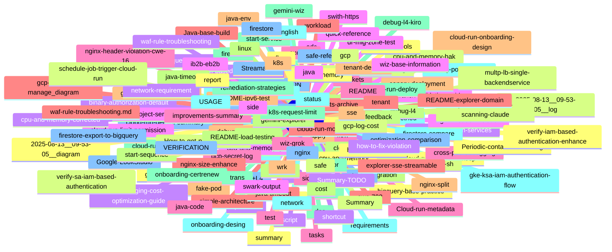

=== Git 提交记录知识点分析工具 ===
分析范围: 最近 20 次提交 或 1 month ago 以来的提交
分析时间: Sat Aug 23 10:30:24 CST 2025

📁 所有修改的文件（按目录结构）：
================================================
  cost/gcp-cost/audit-log.md
  cost/gcp-cost/buckets-archive.md
  cost/gcp-cost/buckets.md
  cost/gcp-cost/gcp-cost-gemini.md
  cost/gcp-cost/gcp-log-cost.md
  cost/gcp-cost/gcp-logging-audit-script.sh
  cost/gcp-cost/gcp-logging-cost-analysis.py
  cost/gcp-cost/gcp-logging-cost-optimization-guide.md
  cost/gcp-cost/gcp-logging-quick-setup.sh
  cost/gcp-cost/gcp-logging-terraform-module.tf
  cost/gcp-cost/README.md
  cost/gcp-cost/script.md
  cost/gcp-cost/terraform.tfvars.example
  cost/gcp-cost/workload.md
  dns/dns-peerning.md
  dns/dns-query-peering.md
  domain_report_google.com_20250811_123522.txt
  domain_report_google.com_20250811_183813.txt
  domain_report_www.baidu.com_20250811_123402.txt
  domain_report_www.baidu.com_20250811_183655.txt
  English/2025/feedback.md
  English/2025/status.md
  firestore/firestore-compare.md
  firestore/firestore-export-to-bigquery.md
  firestore/firestore.md
  firestore/tenant-design.md
  firestore/tenant.md
  flow/flow-nginx-enhance/all-flow.md
  flow/flow-nginx-enhance/canary-deployment.md
  flow/flow-nginx-enhance/multp-lb-single-backendservice.md
  flow/flow-nginx-enhance/simple-architecture.md
  flow/flow-nginx-enhance/Summary.md
  flow/flow-nginx-enhance/swith-https.md
  flow/multp-lb-single-backendservice.md
  gcp/bigquery/bigquery-base-practice.md
  aliyun.cloud-run/adc.md
  aliyun.cloud-run/binary-authorization-default.md
  aliyun.cloud-run/binary-authorization.md
  aliyun.cloud-run/cloud-run-automation/cloud-run-flow.md
  aliyun.cloud-run/cloud-run-automation/cloud-run-gemini-summary.md
  aliyun.cloud-run/cloud-run-automation/cloud-run-housekeep.sh
  aliyun.cloud-run/cloud-run-automation/cloud-run-monitor.md
  aliyun.cloud-run/cloud-run-automation/design.md
  aliyun.cloud-run/cloud-run-automation/requirements.md
  aliyun.cloud-run/cloud-run-automation/tasks.md
  aliyun.cloud-run/cloud-run-deploy.md
  aliyun.cloud-run/cloud-run-job-housekeep-sh.md
  aliyun.cloud-run/cloud-run-job-housekeep.md
  aliyun.cloud-run/cloud-run-job-housekeep.sh
  aliyun.cloud-run/cloud-run-job-with-services.md
  aliyun.cloud-run/cloud-run-limit-permission.md
  aliyun.cloud-run/Cloud-run-metadata.md
  aliyun.cloud-run/cloud-run-sa-active.md
  aliyun.cloud-run/cloud-run-sa.md
  aliyun.cloud-run/cmd.md
  aliyun.cloud-run/container-validation/app-entrypoint.sh
  aliyun.cloud-run/container-validation/build-with-validation.sh
  aliyun.cloud-run/container-validation/CONFIGURATION.md
  aliyun.cloud-run/container-validation/Dockerfile
  aliyun.cloud-run/container-validation/python-validator.py
  aliyun.cloud-run/container-validation/README.md
  aliyun.cloud-run/container-validation/startup-validator-v2.sh
  aliyun.cloud-run/container-validation/startup-validator-v3.sh
  aliyun.cloud-run/container-validation/startup-validator.sh
  aliyun.cloud-run/container-validation/validator.conf.example
  aliyun.cloud-run/container-validation/validator.json.example
  aliyun.cloud-run/execute.md
  aliyun.cloud-run/gcp-project-server-level-sa.md
  aliyun.cloud-run/network-requirement.md
  aliyun.cloud-run/onboarding/cloud-run-onboarding-design.md
  aliyun.cloud-run/onboarding/onboarding-certrenew.md
  aliyun.cloud-run/onboarding/onboarding-desing.md
  aliyun.cloud-run/schedule-job-trigger-cloud-run.md
  aliyun.cloud-run/verify/branch-validation-guide.md
  aliyun.cloud-run/verify/cloudbuild-branch-validation.yaml
  aliyun.cloud-run/verify/gitlab-ci-branch-validation.yml
  aliyun.cloud-run/verify/image-branch-validation.sh
  aliyun.cloud-run/verify/secure-cloud-run-deploy.sh
  gcp/git.sh
  gcp/How-to-get-project-number.md
  gcp/iam-based-authentication.md
  gcp/sa/gke-ksa-iam-authentication-flow.md
  gcp/sa/iam-based-authentication.md
  gcp/sa/verify-gke-ksa-iam-authentication.sh
  gcp/sa/verify-iam-based-authentication-enhance.md
  gcp/sa/verify-iam-based-authentication-enhance.sh
  gcp/sa/verify-sa-iam-based-authentication.md
  gcp/secret-manage/java-examples/gcp-secret-manager-flow.md
  gcp/secret-manage/java-examples/k8s/deployment.yaml
  gcp/secret-manage/java-examples/k8s/secret-setup.sh
  gcp/secret-manage/java-examples/k8s/service-account.yaml
  gcp/secret-manage/java-examples/pom.xml
  gcp/secret-manage/java-examples/README.md
  gcp/secret-manage/java-examples/setup-gcp.sh
  gcp/secret-manage/java-examples/src/main/java/config/AppProperties.java
  gcp/secret-manage/java-examples/src/main/java/config/SecretManagerConfig.java
  gcp/secret-manage/java-examples/src/main/java/model/SecretType.java
  gcp/secret-manage/java-examples/src/main/java/SecretManagerDemo.java
  gcp/secret-manage/java-examples/src/main/java/service/AuthenticationService.java
  gcp/secret-manage/java-examples/src/main/java/service/SecretManagerService.java
  gcp/secret-manage/java-examples/src/main/resources/application.yml
  gcp/secret-manage/java-examples/src/main/resources/sample-files/sample-keystore.jks
  gcp/secret-manage/java-examples/USAGE.md
  gcp/secret-manage/java-examples/VERIFICATION.md
  gcp/secret-manage/java-examples/verify-gcp-sa.sh
  gif/.!62134!d77.mp4
  gif/.!62135!d77.mp4
  gif/.!62136!d77.mp4
  gif/.!62137!d77.mp4
  gif/.!62138!d77.mp4
  gif/.!62139!d77.mp4
  gif/.!62140!d77.mp4
  gif/.!62141!d77.mp4
  gif/.!62142!d77.mp4
  gif/.!62143!d77.mp4
  gif/.!62144!d77.mp4
  gif/.!62145!d77.mp4
  gif/.!62146!d77.mp4
  gif/.!62147!d77.mp4
  gif/.!62148!d77.mp4
  gif/.!62149!d77.mp4
  gif/.!62150!d77.mp4
  gif/.!62151!d77.mp4
  gif/.!62152!d77.mp4
  gif/.!62153!d77.mp4
  gif/.!62154!d77.mp4
  gif/.!62155!d77.mp4
  gif/.!62156!d77.mp4
  gif/.!62157!d77.mp4
  gif/.!62158!d77.mp4
  gif/.!62159!d77.mp4
  gif/.!62160!d77.mp4
  gif/.!62161!d77.mp4
  gif/.!62162!d77.mp4
  gif/covert-mp4-git.sh
  gif/d77.mp4
  gif/vide-cut.sh
  git-ios.sh
  git.sh
  groovy/git.sh
  how-to-fix-violation/automation-scripts.md
  how-to-fix-violation/ci-cd-integration.md
  how-to-fix-violation/detection-tools.md
  how-to-fix-violation/quick-reference.md
  how-to-fix-violation/README.md
  how-to-fix-violation/remediation-strategies.md
  java-code/Java-base-build.md
  java-code/mvnw
  java-code/pom.xml
  java-code/src/main/java/com/example/healthcheck/controller/HealthController.java
  java-code/src/main/java/com/example/healthcheck/HealthCheckApplication.java
  java-code/src/main/java/com/example/healthcheck/model/HealthResponse.java
  java-code/src/main/java/com/example/healthcheck/service/HealthService.java
  java-code/target/classes/com/example/healthcheck/controller/HealthController.class
  java-code/target/classes/com/example/healthcheck/HealthCheckApplication.class
  java-code/target/classes/com/example/healthcheck/model/HealthResponse.class
  java-code/target/classes/com/example/healthcheck/service/HealthService.class
  java-code/target/health-check-api-1.1.0.jar
  java-code/target/health-check-api-1.1.0.jar.original
  java-code/target/maven-archiver/pom.properties
  java-code/target/maven-status/maven-compiler-plugin/compile/default-compile/createdFiles.lst
  java-code/target/maven-status/maven-compiler-plugin/compile/default-compile/inputFiles.lst
  java-code/target/maven-status/maven-compiler-plugin/testCompile/default-testCompile/createdFiles.lst
  java-code/target/maven-status/maven-compiler-plugin/testCompile/default-testCompile/inputFiles.lst
  java-timeout/Dockerfile
  java-timeout/java-timeout.md
  java-timeout/k8s/deployment.yaml
  java-timeout/k8s/service.yaml
  java-timeout/mvnw
  java-timeout/pom.xml
  java-timeout/README.md
  java-timeout/run.sh
  java-timeout/src/main/java/com/example/controller/TimeoutController.java
  java-timeout/src/main/java/com/example/TimeoutApplication.java
  java-timeout/src/main/resources/application.properties
  java-timeout/target/classes/application.properties
  java-timeout/target/classes/com/example/controller/TimeoutController.class
  java-timeout/target/classes/com/example/TimeoutApplication.class
  java-timeout/target/maven-archiver/pom.properties
  java-timeout/target/maven-status/maven-compiler-plugin/compile/default-compile/createdFiles.lst
  java-timeout/target/maven-status/maven-compiler-plugin/compile/default-compile/inputFiles.lst
  java-timeout/target/timeout-api-1.0.0.jar
  java-timeout/target/timeout-api-1.0.0.jar.original
  java/headpdump-hprof.md
  java/java-env.md
  k8s/appd-refresh-initContainer.md
  k8s/cross-pod-debugging.md
  k8s/debug-pod/cross-pod-debugging.md
  k8s/debug-pod/debug-pod-terminal.md
  k8s/debug-pod/fake-pod.md
  k8s/debug-pod/optimization-comparison.md
  k8s/debug-pod/README.md
  k8s/debug-pod/side-optimized.sh
  k8s/debug-pod/side.md
  k8s/debug-pod/sidecar.md
  k8s/debug-pod/test-script.sh
  k8s/git.sh
  k8s/hpa/cpu-and-memory-bak.md
  k8s/hpa/cpu-and-memory-corrected.html
  k8s/hpa/cpu-and-memory-corrected.md
  k8s/hpa/cpu-and-memory-github.md
  k8s/hpa/cpu-and-memory.md
  k8s/k8s-request-limit.md
  k8s/side.md
  k8s/sidecar.md
  linux/explorer-sse-streamable.md
  linux/git.sh
  linux/sse.md
  linux/Streamable.md
  monitor/monitor-memory.md
  network/domain_report_www.baidu.com_20250811_184037.txt
  network/domain_report_www.baidu.com_20250811_185626.txt
  network/domain_report_www.baidu.com_20250811_194327.txt
  network/domain_report_www.baidu.com_20250811_195341.txt
  network/domain_report_www.baidu.com_20250812_190758.txt
  network/explorer-domain-claude.sh
  network/explorer-domain-gemini.sh
  network/explorer-domain-grok.sh
  network/explorer-domain-kimi.sh
  network/explorer-domain-qwen.sh
  network/explorer-domain.sh
  network/ipv6-test.html
  network/protocal.md
  network/README-explorer-domain.md
  network/README-ipv6-test.md
  network/test-ipv6-local.sh
  network/testipv6.md
  network/wrk/advanced-load-test.sh
  network/wrk/config-based-test.sh
  network/wrk/load-test-config.yaml
  network/wrk/pressure-test-suite.sh
  network/wrk/README-load-testing.md
  network/wrk/test-results/test_20250814_114748/ab_results.txt
  network/wrk/test-results/test_20250814_114748/hey_results.txt
  network/wrk/test-results/test_20250814_114748/summary.md
  network/wrk/test-results/test_20250814_114748/wrk_results.txt
  network/wrk/wrk.md
  nginx/gce-nginx-l4-enhance/debug-flow.md
  nginx/gce-nginx-l4-enhance/debug-l4-kiro.md
  nginx/gce-nginx-l4-enhance/debug-l4.md
  nginx/gce-nginx-l4-enhance/gemini-explorer.md
  nginx/gce-nginx-l4-enhance/start-sequence.md
  nginx/gce-nginx-l4-enhance/start-service.md
  nginx/L7+L4.md
  nginx/nginx-header-violation.md
  nginx/nginx-size-enhance.md
  nginx/nginx-split.md
  nginx/nginx-todo.md
  Pasted image 20250621084213.png
  report/3.md
  report/5time-enhanced-optimized.html
  report/5time-enhanced.html
  report/5time.html
  report/5time.htmlbak
  report/api-calculator.html
  report/enhanced-timezone-clock.html
  report/gke-calculator-enhanced.html
  report/Google-LookStudio.md
  report/improvements-summary.md
  safe/auth.md
  safe/auths-method.md
  safe/basic_domain_report_www.baidu.com_20250812_193202.txt
  safe/basic_recon.sh
  safe/basic-domain-explorer.sh
  safe/cwe/cwe-798.md
  safe/cwe/nginx-header-violation-cwe-16.md
  safe/domain_intel.sh
  safe/explorer-domain-claude.sh
  safe/git.sh
  safe/how-to-fix-violation/automation-scripts.md
  safe/how-to-fix-violation/ci-cd-integration.md
  safe/how-to-fix-violation/detection-tools.md
  safe/how-to-fix-violation/quick-reference.md
  safe/how-to-fix-violation/README.md
  safe/how-to-fix-violation/remediation-strategies.md
  safe/ib2b-eb2b.md
  safe/kali.md
  safe/periodic-container-scanning-claude.md
  safe/Periodic-container-scanning.md
  safe/safe-reference.md
  safe/scan.md
  safe/wiz/apply.md
  safe/wiz/gemini-wiz.md
  safe/wiz/Summary-TODO.md
  safe/wiz/wiz-base-information.md
  safe/wiz/wiz-grok.md
  shortcut/trans.md
  sql/git.sh
  swark-output/2025-08-13__09-53-05__diagram.md
  swark-output/2025-08-13__09-53-05__log.md
  swark-output/gcp-secret-log.md
  swark-output/gcp-secret-manage_diagram.md
  test/dr-instance/dr-config.env
  test/dr-instance/dr-instance.sh
  test/dr-instance/dr-mig-zone-test.md
  test/dr-instance/gce-dr-validation.sh
  test/dr-instance/README.md
  test/dr-instance/run-dr-test.sh
  waf-rule-troubleshooting.md

📊 目录层级统计：
================================================
  71 gcp
  32 gif
  27 safe
  27 network
  20 k8s
  19 java-timeout
  18 java-code
  14 cost
  11 nginx
  10 report
   7 flow
   6 test
   6 how-to-fix-violation
   5 firestore
   4 swark-output
   4 linux
   2 java
   2 English
   2 dns
   1 waf-rule-troubleshooting.md
   1 sql
   1 shortcut
   1 Pasted image 20250621084213.png
   1 monitor
   1 groovy
   1 git.sh
   1 git-ios.sh
   1 domain_report_www.baidu.com_20250811_183655.txt
   1 domain_report_www.baidu.com_20250811_123402.txt
   1 domain_report_google.com_20250811_183813.txt
   1 domain_report_google.com_20250811_123522.txt

📋 文件类型统计：
================================================
 145 md
  46 sh
  30 mp4
  13 txt
  12 java
   8 html
   6 yaml
   6 lst
   6 class
   4 properties
   4 无扩展名
   3 xml
   3 example
   2 yml
   2 py
   2 original
   2 jar
   1 tf
   1 png
   1 jks
   1 htmlbak
   1 env

🔥 最活跃的文件 (按修改次数排序)：
================================================
   4 aliyun.cloud-run/binary-authorization.md
   3 safe/wiz/apply.md
   2 nginx/gce-nginx-l4-enhance/start-sequence.md
   2 gif/d77.mp4
   2 gif/.!62162!d77.mp4
   2 gif/.!62161!d77.mp4
   2 gif/.!62160!d77.mp4
   2 gif/.!62159!d77.mp4
   2 gif/.!62158!d77.mp4
   2 gif/.!62157!d77.mp4
   2 gif/.!62156!d77.mp4
   2 gif/.!62155!d77.mp4
   2 gif/.!62154!d77.mp4
   2 gif/.!62153!d77.mp4
   2 gif/.!62152!d77.mp4

📝 最近的提交记录（文件 + 提交信息）：
================================================
87e4429 This is for my macOS git push or pull at Fri Aug 22 18:41:22 CST 2025. Last changed file: safe/wiz/Summary-TODO.md
R087	safe/wiz/apply.md	safe/wiz/Summary-TODO.md
8433c54 This is for my macOS git push or pull at Fri Aug 22 17:28:02 CST 2025. Last changed file: flow/flow-nginx-enhance/swith-https.md
A	flow/flow-nginx-enhance/all-flow.md
M	flow/flow-nginx-enhance/swith-https.md
e62f6a9 This is for my macOS git push or pull at Fri Aug 22 17:12:10 CST 2025. Last changed file: nginx/nginx-split.md
A	flow/flow-nginx-enhance/Summary.md
A	flow/flow-nginx-enhance/canary-deployment.md
R093	flow/multp-lb-single-backendservice.md	flow/flow-nginx-enhance/multp-lb-single-backendservice.md
A	flow/flow-nginx-enhance/simple-architecture.md
A	flow/flow-nginx-enhance/swith-https.md
A	nginx/nginx-split.md
bc44064 This is for my macOS git push or pull at Fri Aug 22 14:42:18 CST 2025. Last changed file: safe/wiz/apply.md
M	safe/wiz/apply.md
951f2a2 This is for my macOS git push or pull at Fri Aug 22 14:32:03 CST 2025. Last changed file: safe/wiz/wiz-grok.md
A	flow/multp-lb-single-backendservice.md
A	aliyun.cloud-run/binary-authorization-default.md
M	safe/wiz/apply.md
A	safe/wiz/gemini-wiz.md
A	safe/wiz/wiz-base-information.md
A	safe/wiz/wiz-grok.md
522fb0d This is for my macOS git push or pull at Thu Aug 21 18:36:35 CST 2025. Last changed file: safe/wiz/apply.md
M	aliyun.cloud-run/binary-authorization.md
A	safe/wiz/apply.md
173820d Update binary-authorization.md
M	aliyun.cloud-run/binary-authorization.md
c440382 Update binary-authorization.md
M	aliyun.cloud-run/binary-authorization.md
9310bb2 This is for my Linux git push or pull at Wed Aug 20 11:44:31 UTC 2025. Last changed file: aliyun.cloud-run/binary-authorization.md
A	aliyun.cloud-run/binary-authorization.md

🏷️ 提交消息关键词分析：
================================================
  83 git
  79 for
  78 this
  78 push
  78 pull
  78 last
  78 file
  78 changed
  69 macos
  69 cst
  44 aug
  34 jul
  33 run
  33 cloud
  29 gcp
  24 mon
  20 update
  17 fri
  13 nginx
  13 and

🎯 知识点文件分析（基于文件名和路径）：
================================================
⚙️  配置文件: aliyun.cloud-run/verify/cloudbuild-branch-validation.yaml
⚙️  配置文件: aliyun.cloud-run/verify/gitlab-ci-branch-validation.yml
⚙️  配置文件: gcp/secret-manage/java-examples/k8s/deployment.yaml
⚙️  配置文件: gcp/secret-manage/java-examples/k8s/service-account.yaml
⚙️  配置文件: gcp/secret-manage/java-examples/src/main/resources/application.yml
⚙️  配置文件: java-timeout/k8s/deployment.yaml
⚙️  配置文件: java-timeout/k8s/service.yaml
⚙️  配置文件: network/wrk/load-test-config.yaml
📖 知识文档: cost/gcp-cost/audit-log.md
📖 知识文档: cost/gcp-cost/buckets-archive.md
📖 知识文档: cost/gcp-cost/buckets.md
📖 知识文档: cost/gcp-cost/gcp-cost-gemini.md
📖 知识文档: cost/gcp-cost/gcp-log-cost.md
🔧 脚本工具: cost/gcp-cost/gcp-logging-audit-script.sh
📄 其他文件: cost/gcp-cost/gcp-logging-cost-analysis.py
📖 知识文档: cost/gcp-cost/gcp-logging-cost-optimization-guide.md
🔧 脚本工具: cost/gcp-cost/gcp-logging-quick-setup.sh
📄 其他文件: cost/gcp-cost/gcp-logging-terraform-module.tf
📖 知识文档: cost/gcp-cost/README.md
📖 知识文档: cost/gcp-cost/script.md
📄 其他文件: cost/gcp-cost/terraform.tfvars.example
📖 知识文档: cost/gcp-cost/workload.md
📖 知识文档: dns/dns-peerning.md
📖 知识文档: dns/dns-query-peering.md
📄 其他文件: domain_report_google.com_20250811_123522.txt
📄 其他文件: domain_report_google.com_20250811_183813.txt
📄 其他文件: domain_report_www.baidu.com_20250811_123402.txt
📄 其他文件: domain_report_www.baidu.com_20250811_183655.txt
📖 知识文档: English/2025/feedback.md
📖 知识文档: English/2025/status.md
📖 知识文档: firestore/firestore-compare.md
📖 知识文档: firestore/firestore-export-to-bigquery.md
📖 知识文档: firestore/firestore.md
📖 知识文档: firestore/tenant-design.md
📖 知识文档: firestore/tenant.md
📖 知识文档: flow/flow-nginx-enhance/all-flow.md
📖 知识文档: flow/flow-nginx-enhance/canary-deployment.md
📖 知识文档: flow/flow-nginx-enhance/multp-lb-single-backendservice.md
📖 知识文档: flow/flow-nginx-enhance/simple-architecture.md
📖 知识文档: flow/flow-nginx-enhance/Summary.md
📖 知识文档: flow/flow-nginx-enhance/swith-https.md
📖 知识文档: flow/multp-lb-single-backendservice.md
📖 知识文档: gcp/bigquery/bigquery-base-practice.md
📖 知识文档: aliyun.cloud-run/adc.md
📖 知识文档: aliyun.cloud-run/binary-authorization-default.md
📖 知识文档: aliyun.cloud-run/binary-authorization.md
📖 知识文档: aliyun.cloud-run/cloud-run-automation/cloud-run-flow.md
📖 知识文档: aliyun.cloud-run/cloud-run-automation/cloud-run-gemini-summary.md
🔧 脚本工具: aliyun.cloud-run/cloud-run-automation/cloud-run-housekeep.sh
📖 知识文档: aliyun.cloud-run/cloud-run-automation/cloud-run-monitor.md
📖 知识文档: aliyun.cloud-run/cloud-run-automation/design.md
📖 知识文档: aliyun.cloud-run/cloud-run-automation/requirements.md
📖 知识文档: aliyun.cloud-run/cloud-run-automation/tasks.md
📖 知识文档: aliyun.cloud-run/cloud-run-deploy.md
📖 知识文档: aliyun.cloud-run/cloud-run-job-housekeep-sh.md
📖 知识文档: aliyun.cloud-run/cloud-run-job-housekeep.md
🔧 脚本工具: aliyun.cloud-run/cloud-run-job-housekeep.sh
📖 知识文档: aliyun.cloud-run/cloud-run-job-with-services.md
📖 知识文档: aliyun.cloud-run/cloud-run-limit-permission.md
📖 知识文档: aliyun.cloud-run/Cloud-run-metadata.md
📖 知识文档: aliyun.cloud-run/cloud-run-sa-active.md
📖 知识文档: aliyun.cloud-run/cloud-run-sa.md
📖 知识文档: aliyun.cloud-run/cmd.md
🔧 脚本工具: aliyun.cloud-run/container-validation/app-entrypoint.sh
🔧 脚本工具: aliyun.cloud-run/container-validation/build-with-validation.sh
📖 知识文档: aliyun.cloud-run/container-validation/CONFIGURATION.md
📄 其他文件: aliyun.cloud-run/container-validation/Dockerfile
📄 其他文件: aliyun.cloud-run/container-validation/python-validator.py
📖 知识文档: aliyun.cloud-run/container-validation/README.md
🔧 脚本工具: aliyun.cloud-run/container-validation/startup-validator-v2.sh
🔧 脚本工具: aliyun.cloud-run/container-validation/startup-validator-v3.sh
🔧 脚本工具: aliyun.cloud-run/container-validation/startup-validator.sh
📄 其他文件: aliyun.cloud-run/container-validation/validator.conf.example
📄 其他文件: aliyun.cloud-run/container-validation/validator.json.example
📖 知识文档: aliyun.cloud-run/execute.md
📖 知识文档: aliyun.cloud-run/gcp-project-server-level-sa.md
📖 知识文档: aliyun.cloud-run/network-requirement.md
📖 知识文档: aliyun.cloud-run/onboarding/cloud-run-onboarding-design.md
📖 知识文档: aliyun.cloud-run/onboarding/onboarding-certrenew.md
📖 知识文档: aliyun.cloud-run/onboarding/onboarding-desing.md
📖 知识文档: aliyun.cloud-run/schedule-job-trigger-cloud-run.md
📖 知识文档: aliyun.cloud-run/verify/branch-validation-guide.md
🔧 脚本工具: aliyun.cloud-run/verify/image-branch-validation.sh
🔧 脚本工具: aliyun.cloud-run/verify/secure-cloud-run-deploy.sh
🔧 脚本工具: gcp/git.sh
📖 知识文档: gcp/How-to-get-project-number.md
📖 知识文档: gcp/iam-based-authentication.md
📖 知识文档: gcp/sa/gke-ksa-iam-authentication-flow.md
📖 知识文档: gcp/sa/iam-based-authentication.md
🔧 脚本工具: gcp/sa/verify-gke-ksa-iam-authentication.sh
📖 知识文档: gcp/sa/verify-iam-based-authentication-enhance.md
🔧 脚本工具: gcp/sa/verify-iam-based-authentication-enhance.sh
📖 知识文档: gcp/sa/verify-sa-iam-based-authentication.md
📖 知识文档: gcp/secret-manage/java-examples/gcp-secret-manager-flow.md
🔧 脚本工具: gcp/secret-manage/java-examples/k8s/secret-setup.sh
📄 其他文件: gcp/secret-manage/java-examples/pom.xml
📖 知识文档: gcp/secret-manage/java-examples/README.md
🔧 脚本工具: gcp/secret-manage/java-examples/setup-gcp.sh
📄 其他文件: gcp/secret-manage/java-examples/src/main/java/config/AppProperties.java
📄 其他文件: gcp/secret-manage/java-examples/src/main/java/config/SecretManagerConfig.java
📄 其他文件: gcp/secret-manage/java-examples/src/main/java/model/SecretType.java
📄 其他文件: gcp/secret-manage/java-examples/src/main/java/SecretManagerDemo.java
📄 其他文件: gcp/secret-manage/java-examples/src/main/java/service/AuthenticationService.java
📄 其他文件: gcp/secret-manage/java-examples/src/main/java/service/SecretManagerService.java
📄 其他文件: gcp/secret-manage/java-examples/src/main/resources/sample-files/sample-keystore.jks
📖 知识文档: gcp/secret-manage/java-examples/USAGE.md
📖 知识文档: gcp/secret-manage/java-examples/VERIFICATION.md
🔧 脚本工具: gcp/secret-manage/java-examples/verify-gcp-sa.sh
📄 其他文件: gif/.!62134!d77.mp4
📄 其他文件: gif/.!62135!d77.mp4
📄 其他文件: gif/.!62136!d77.mp4
📄 其他文件: gif/.!62137!d77.mp4
📄 其他文件: gif/.!62138!d77.mp4
📄 其他文件: gif/.!62139!d77.mp4
📄 其他文件: gif/.!62140!d77.mp4
📄 其他文件: gif/.!62141!d77.mp4
📄 其他文件: gif/.!62142!d77.mp4
📄 其他文件: gif/.!62143!d77.mp4
📄 其他文件: gif/.!62144!d77.mp4
📄 其他文件: gif/.!62145!d77.mp4
📄 其他文件: gif/.!62146!d77.mp4
📄 其他文件: gif/.!62147!d77.mp4
📄 其他文件: gif/.!62148!d77.mp4
📄 其他文件: gif/.!62149!d77.mp4
📄 其他文件: gif/.!62150!d77.mp4
📄 其他文件: gif/.!62151!d77.mp4
📄 其他文件: gif/.!62152!d77.mp4
📄 其他文件: gif/.!62153!d77.mp4
📄 其他文件: gif/.!62154!d77.mp4
📄 其他文件: gif/.!62155!d77.mp4
📄 其他文件: gif/.!62156!d77.mp4
📄 其他文件: gif/.!62157!d77.mp4
📄 其他文件: gif/.!62158!d77.mp4
📄 其他文件: gif/.!62159!d77.mp4
📄 其他文件: gif/.!62160!d77.mp4
📄 其他文件: gif/.!62161!d77.mp4
📄 其他文件: gif/.!62162!d77.mp4
🔧 脚本工具: gif/covert-mp4-git.sh
📄 其他文件: gif/d77.mp4
🔧 脚本工具: gif/vide-cut.sh
🔧 脚本工具: git-ios.sh
🔧 脚本工具: git.sh
🔧 脚本工具: groovy/git.sh
📖 知识文档: how-to-fix-violation/automation-scripts.md
📖 知识文档: how-to-fix-violation/ci-cd-integration.md
📖 知识文档: how-to-fix-violation/detection-tools.md
📖 知识文档: how-to-fix-violation/quick-reference.md
📖 知识文档: how-to-fix-violation/README.md
📖 知识文档: how-to-fix-violation/remediation-strategies.md
📖 知识文档: java-code/Java-base-build.md
📄 其他文件: java-code/mvnw
📄 其他文件: java-code/pom.xml
📄 其他文件: java-code/src/main/java/com/example/healthcheck/controller/HealthController.java
📄 其他文件: java-code/src/main/java/com/example/healthcheck/HealthCheckApplication.java
📄 其他文件: java-code/src/main/java/com/example/healthcheck/model/HealthResponse.java
📄 其他文件: java-code/src/main/java/com/example/healthcheck/service/HealthService.java
📄 其他文件: java-code/target/classes/com/example/healthcheck/controller/HealthController.class
📄 其他文件: java-code/target/classes/com/example/healthcheck/HealthCheckApplication.class
📄 其他文件: java-code/target/classes/com/example/healthcheck/model/HealthResponse.class
📄 其他文件: java-code/target/classes/com/example/healthcheck/service/HealthService.class
📄 其他文件: java-code/target/health-check-api-1.1.0.jar
📄 其他文件: java-code/target/health-check-api-1.1.0.jar.original
📄 其他文件: java-code/target/maven-archiver/pom.properties
📄 其他文件: java-code/target/maven-status/maven-compiler-plugin/compile/default-compile/createdFiles.lst
📄 其他文件: java-code/target/maven-status/maven-compiler-plugin/compile/default-compile/inputFiles.lst
📄 其他文件: java-code/target/maven-status/maven-compiler-plugin/testCompile/default-testCompile/createdFiles.lst
📄 其他文件: java-code/target/maven-status/maven-compiler-plugin/testCompile/default-testCompile/inputFiles.lst
📄 其他文件: java-timeout/Dockerfile
📖 知识文档: java-timeout/java-timeout.md
📄 其他文件: java-timeout/mvnw
📄 其他文件: java-timeout/pom.xml
📖 知识文档: java-timeout/README.md
🔧 脚本工具: java-timeout/run.sh
📄 其他文件: java-timeout/src/main/java/com/example/controller/TimeoutController.java
📄 其他文件: java-timeout/src/main/java/com/example/TimeoutApplication.java
📄 其他文件: java-timeout/src/main/resources/application.properties
📄 其他文件: java-timeout/target/classes/application.properties
📄 其他文件: java-timeout/target/classes/com/example/controller/TimeoutController.class
📄 其他文件: java-timeout/target/classes/com/example/TimeoutApplication.class
📄 其他文件: java-timeout/target/maven-archiver/pom.properties
📄 其他文件: java-timeout/target/maven-status/maven-compiler-plugin/compile/default-compile/createdFiles.lst
📄 其他文件: java-timeout/target/maven-status/maven-compiler-plugin/compile/default-compile/inputFiles.lst
📄 其他文件: java-timeout/target/timeout-api-1.0.0.jar
📄 其他文件: java-timeout/target/timeout-api-1.0.0.jar.original
📖 知识文档: java/headpdump-hprof.md
📖 知识文档: java/java-env.md
📖 知识文档: k8s/appd-refresh-initContainer.md
📖 知识文档: k8s/cross-pod-debugging.md
📖 知识文档: k8s/debug-pod/cross-pod-debugging.md
📖 知识文档: k8s/debug-pod/debug-pod-terminal.md
📖 知识文档: k8s/debug-pod/fake-pod.md
📖 知识文档: k8s/debug-pod/optimization-comparison.md
📖 知识文档: k8s/debug-pod/README.md
🔧 脚本工具: k8s/debug-pod/side-optimized.sh
📖 知识文档: k8s/debug-pod/side.md
📖 知识文档: k8s/debug-pod/sidecar.md
🔧 脚本工具: k8s/debug-pod/test-script.sh
🔧 脚本工具: k8s/git.sh
📖 知识文档: k8s/hpa/cpu-and-memory-bak.md
📄 其他文件: k8s/hpa/cpu-and-memory-corrected.html
📖 知识文档: k8s/hpa/cpu-and-memory-corrected.md
📖 知识文档: k8s/hpa/cpu-and-memory-github.md
📖 知识文档: k8s/hpa/cpu-and-memory.md
📖 知识文档: k8s/k8s-request-limit.md
📖 知识文档: k8s/side.md
📖 知识文档: k8s/sidecar.md
📖 知识文档: linux/explorer-sse-streamable.md
🔧 脚本工具: linux/git.sh
📖 知识文档: linux/sse.md
📖 知识文档: linux/Streamable.md
📖 知识文档: monitor/monitor-memory.md
📄 其他文件: network/domain_report_www.baidu.com_20250811_184037.txt
📄 其他文件: network/domain_report_www.baidu.com_20250811_185626.txt
📄 其他文件: network/domain_report_www.baidu.com_20250811_194327.txt
📄 其他文件: network/domain_report_www.baidu.com_20250811_195341.txt
📄 其他文件: network/domain_report_www.baidu.com_20250812_190758.txt
🔧 脚本工具: network/explorer-domain-claude.sh
🔧 脚本工具: network/explorer-domain-gemini.sh
🔧 脚本工具: network/explorer-domain-grok.sh
🔧 脚本工具: network/explorer-domain-kimi.sh
🔧 脚本工具: network/explorer-domain-qwen.sh
🔧 脚本工具: network/explorer-domain.sh
📄 其他文件: network/ipv6-test.html
📖 知识文档: network/protocal.md
📖 知识文档: network/README-explorer-domain.md
📖 知识文档: network/README-ipv6-test.md
🔧 脚本工具: network/test-ipv6-local.sh
📖 知识文档: network/testipv6.md
🔧 脚本工具: network/wrk/advanced-load-test.sh
🔧 脚本工具: network/wrk/config-based-test.sh
🔧 脚本工具: network/wrk/pressure-test-suite.sh
📖 知识文档: network/wrk/README-load-testing.md
📄 其他文件: network/wrk/test-results/test_20250814_114748/ab_results.txt
📄 其他文件: network/wrk/test-results/test_20250814_114748/hey_results.txt
📖 知识文档: network/wrk/test-results/test_20250814_114748/summary.md
📄 其他文件: network/wrk/test-results/test_20250814_114748/wrk_results.txt
📖 知识文档: network/wrk/wrk.md
📖 知识文档: nginx/gce-nginx-l4-enhance/debug-flow.md
📖 知识文档: nginx/gce-nginx-l4-enhance/debug-l4-kiro.md
📖 知识文档: nginx/gce-nginx-l4-enhance/debug-l4.md
📖 知识文档: nginx/gce-nginx-l4-enhance/gemini-explorer.md
📖 知识文档: nginx/gce-nginx-l4-enhance/start-sequence.md
📖 知识文档: nginx/gce-nginx-l4-enhance/start-service.md
📖 知识文档: nginx/L7+L4.md
📖 知识文档: nginx/nginx-header-violation.md
📖 知识文档: nginx/nginx-size-enhance.md
📖 知识文档: nginx/nginx-split.md
📖 知识文档: nginx/nginx-todo.md
📄 其他文件: Pasted image 20250621084213.png
📖 知识文档: report/3.md
📄 其他文件: report/5time-enhanced-optimized.html
📄 其他文件: report/5time-enhanced.html
📄 其他文件: report/5time.html
📄 其他文件: report/5time.htmlbak
📄 其他文件: report/api-calculator.html
📄 其他文件: report/enhanced-timezone-clock.html
📄 其他文件: report/gke-calculator-enhanced.html
📖 知识文档: report/Google-LookStudio.md
📖 知识文档: report/improvements-summary.md
📖 知识文档: safe/auth.md
📖 知识文档: safe/auths-method.md
📄 其他文件: safe/basic_domain_report_www.baidu.com_20250812_193202.txt
🔧 脚本工具: safe/basic_recon.sh
🔧 脚本工具: safe/basic-domain-explorer.sh
📖 知识文档: safe/cwe/cwe-798.md
📖 知识文档: safe/cwe/nginx-header-violation-cwe-16.md
🔧 脚本工具: safe/domain_intel.sh
🔧 脚本工具: safe/explorer-domain-claude.sh
🔧 脚本工具: safe/git.sh
📖 知识文档: safe/how-to-fix-violation/automation-scripts.md
📖 知识文档: safe/how-to-fix-violation/ci-cd-integration.md
📖 知识文档: safe/how-to-fix-violation/detection-tools.md
📖 知识文档: safe/how-to-fix-violation/quick-reference.md
📖 知识文档: safe/how-to-fix-violation/README.md
📖 知识文档: safe/how-to-fix-violation/remediation-strategies.md
📖 知识文档: safe/ib2b-eb2b.md
📖 知识文档: safe/kali.md
📖 知识文档: safe/periodic-container-scanning-claude.md
📖 知识文档: safe/Periodic-container-scanning.md
📖 知识文档: safe/safe-reference.md
📖 知识文档: safe/scan.md
📖 知识文档: safe/wiz/apply.md
📖 知识文档: safe/wiz/gemini-wiz.md
📖 知识文档: safe/wiz/Summary-TODO.md
📖 知识文档: safe/wiz/wiz-base-information.md
📖 知识文档: safe/wiz/wiz-grok.md
📖 知识文档: shortcut/trans.md
🔧 脚本工具: sql/git.sh
📖 知识文档: swark-output/2025-08-13__09-53-05__diagram.md
📖 知识文档: swark-output/2025-08-13__09-53-05__log.md
📖 知识文档: swark-output/gcp-secret-log.md
📖 知识文档: swark-output/gcp-secret-manage_diagram.md
📄 其他文件: test/dr-instance/dr-config.env
🔧 脚本工具: test/dr-instance/dr-instance.sh
📖 知识文档: test/dr-instance/dr-mig-zone-test.md
🔧 脚本工具: test/dr-instance/gce-dr-validation.sh
📖 知识文档: test/dr-instance/README.md
🔧 脚本工具: test/dr-instance/run-dr-test.sh
📖 知识文档: waf-rule-troubleshooting.md

🌳 目录结构知识点分布：
================================================
    ├── audit-log.md
    ├── buckets-archive.md
    ├── buckets.md
    ├── gcp-cost-gemini.md
    ├── gcp-log-cost.md
    ├── gcp-logging-audit-script.sh
    ├── gcp-logging-cost-analysis.py
    ├── gcp-logging-cost-optimization-guide.md
    ├── gcp-logging-quick-setup.sh
    ├── gcp-logging-terraform-module.tf
    ├── README.md
    ├── script.md
    ├── terraform.tfvars.example
    ├── workload.md
  ├── dns-peerning.md
  ├── dns-query-peering.md
├── domain_report_google.com_20250811_123522.txt
├── domain_report_google.com_20250811_183813.txt
├── domain_report_www.baidu.com_20250811_123402.txt
├── domain_report_www.baidu.com_20250811_183655.txt
    ├── feedback.md
    ├── status.md
  ├── firestore-compare.md
  ├── firestore-export-to-bigquery.md
  ├── firestore.md
  ├── tenant-design.md
  ├── tenant.md
    ├── all-flow.md
    ├── canary-deployment.md
    ├── multp-lb-single-backendservice.md
    ├── simple-architecture.md
    ├── Summary.md
    ├── swith-https.md
  ├── multp-lb-single-backendservice.md
    ├── bigquery-base-practice.md
    ├── adc.md
    ├── binary-authorization-default.md
    ├── binary-authorization.md
      ├── cloud-run-flow.md
      ├── cloud-run-gemini-summary.md
      ├── cloud-run-housekeep.sh
      ├── cloud-run-monitor.md
      ├── design.md
      ├── requirements.md
      ├── tasks.md
    ├── cloud-run-deploy.md
    ├── cloud-run-job-housekeep-sh.md
    ├── cloud-run-job-housekeep.md
    ├── cloud-run-job-housekeep.sh
    ├── cloud-run-job-with-services.md

📈 工作重点分析（基于实际目录结构）：
================================================
  71 个文件 - gcp 相关
  32 个文件 - gif 相关
  27 个文件 - safe 相关
  27 个文件 - network 相关
  20 个文件 - k8s 相关
  19 个文件 - java-timeout 相关
  18 个文件 - java-code 相关
  14 个文件 - cost 相关
  11 个文件 - nginx 相关
  10 个文件 - report 相关
  7 个文件 - flow 相关
  6 个文件 - test 相关
  6 个文件 - how-to-fix-violation 相关
  5 个文件 - firestore 相关
  4 个文件 - swark-output 相关
  4 个文件 - linux 相关
  2 个文件 - java 相关
  2 个文件 - English 相关
  2 个文件 - dns 相关
  1 个文件 - waf-rule-troubleshooting.md 相关
  1 个文件 - sql 相关
  1 个文件 - shortcut 相关
  1 个文件 - Pasted image 20250621084213.png 相关
  1 个文件 - monitor 相关
  1 个文件 - groovy 相关
  1 个文件 - git.sh 相关
  1 个文件 - git-ios.sh 相关
  1 个文件 - domain_report_www.baidu.com_20250811_183655.txt 相关
  1 个文件 - domain_report_www.baidu.com_20250811_123402.txt 相关
  1 个文件 - domain_report_google.com_20250811_183813.txt 相关
  1 个文件 - domain_report_google.com_20250811_123522.txt 相关

🎨 动态生成MindMap结构：
================================================
基于你的实际目录结构生成：

💡 智能建议：
================================================
基于分析结果的建议：
1. 你最活跃的工作领域是: gcp
2. 你创建/修改了 145 个知识文档
3. 你开发了 46 个脚本工具

使用方法：
  /Users/lex/git/knowledge/git_detail_stats.sh [提交数量] [时间范围]
  例如: /Users/lex/git/knowledge/git_detail_stats.sh 50 '2 weeks ago'
  例如: /Users/lex/git/knowledge/git_detail_stats.sh 30 '1 month ago'
