# PSC Demo 流程图和架构说明

## 整体架构流程

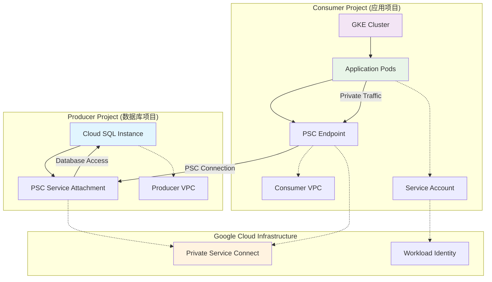

## 详细部署流程

### 阶段 1: 环境准备

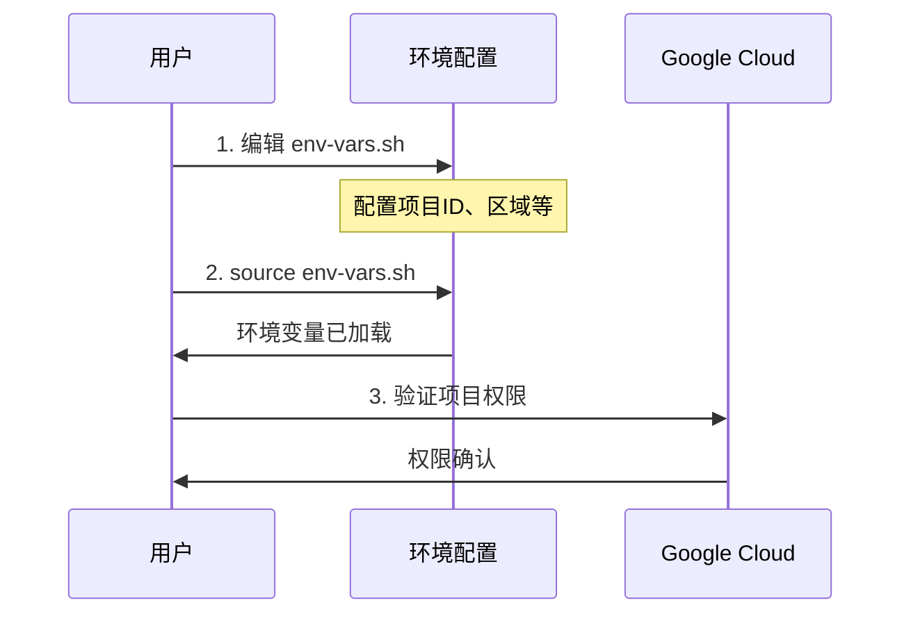

### 阶段 2: Producer 项目设置

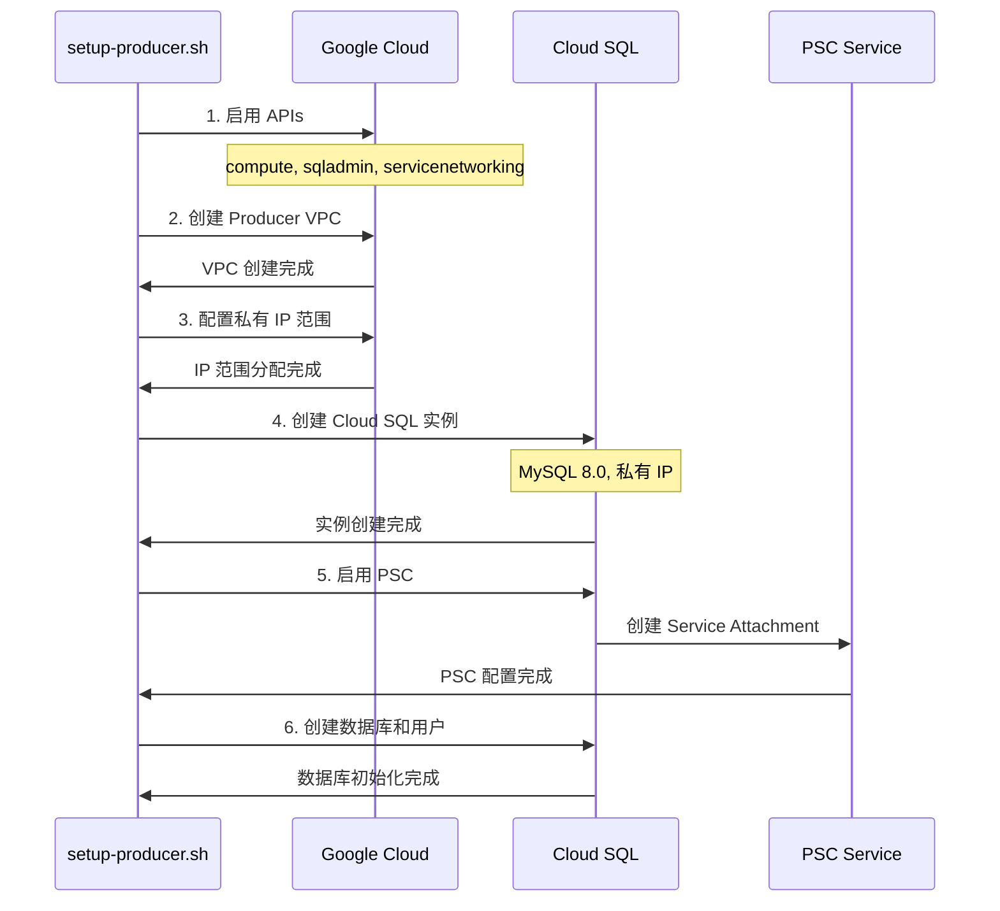

### 阶段 3: Consumer 项目设置

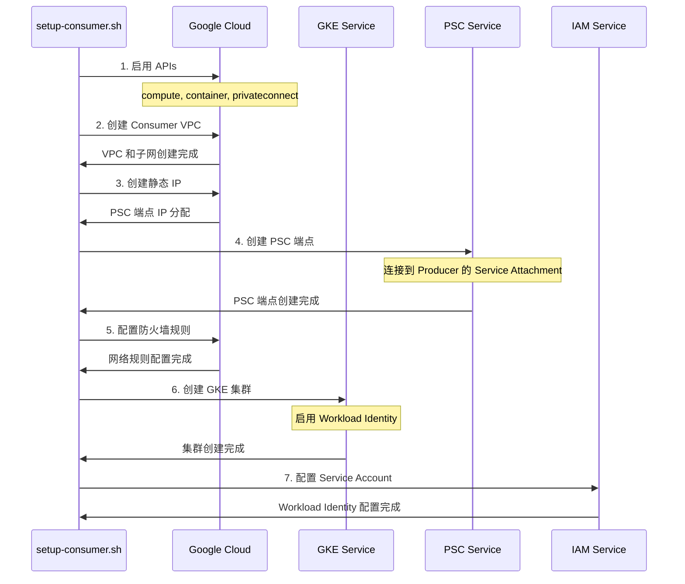

### 阶段 4: 应用部署

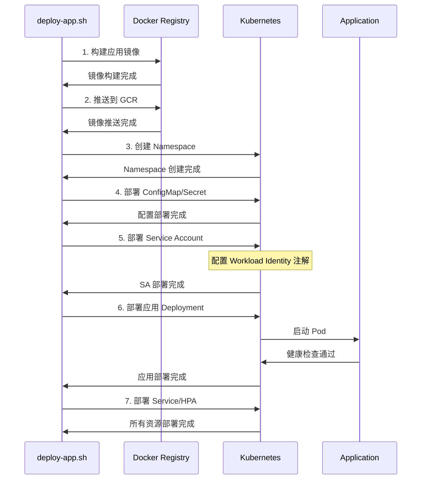

## 网络流量流程

### 应用启动流程

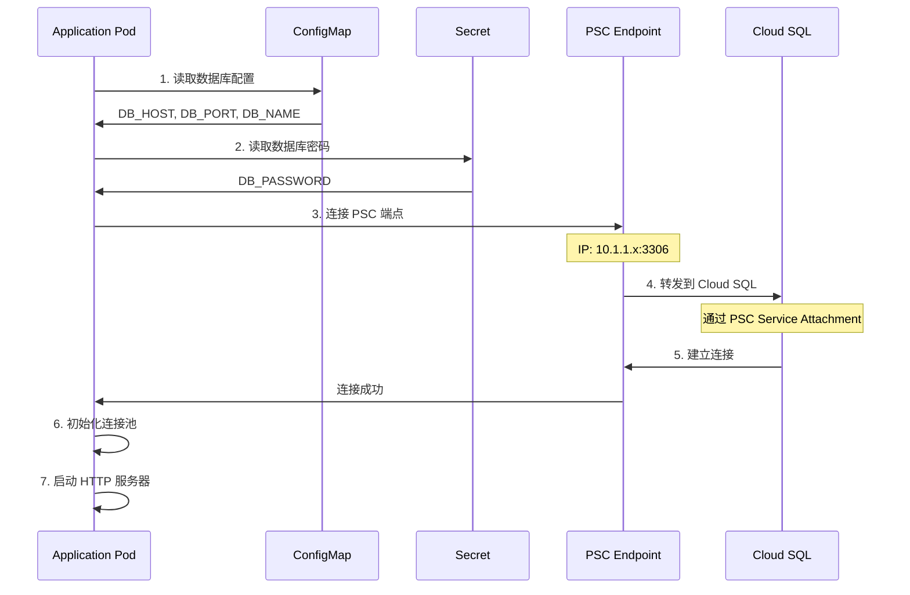

### API 请求流程

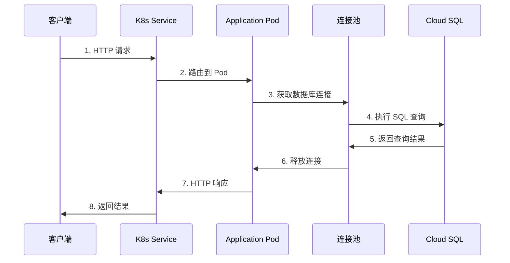

## 安全架构流程

### Workload Identity 认证流程

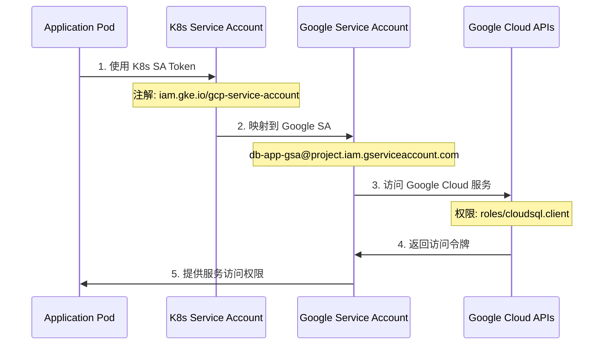

### 网络安全流程

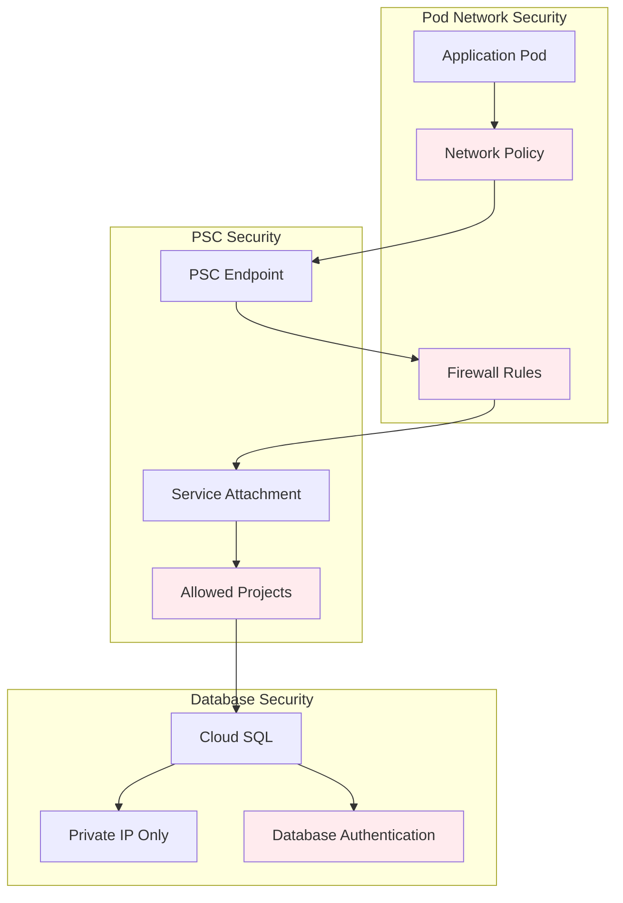

## 监控和健康检查流程

### 健康检查流程

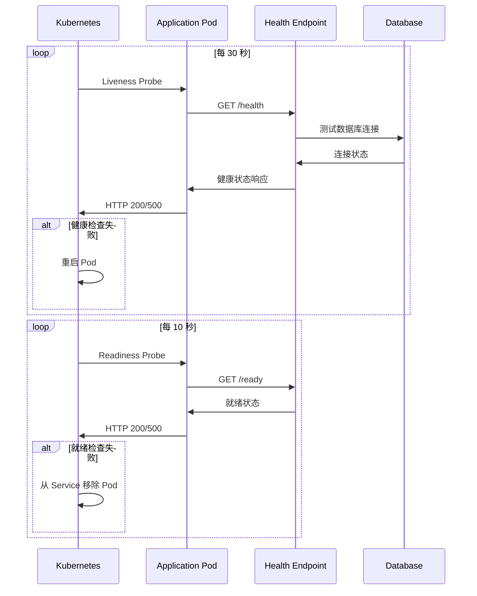

### 自动扩缩容流程

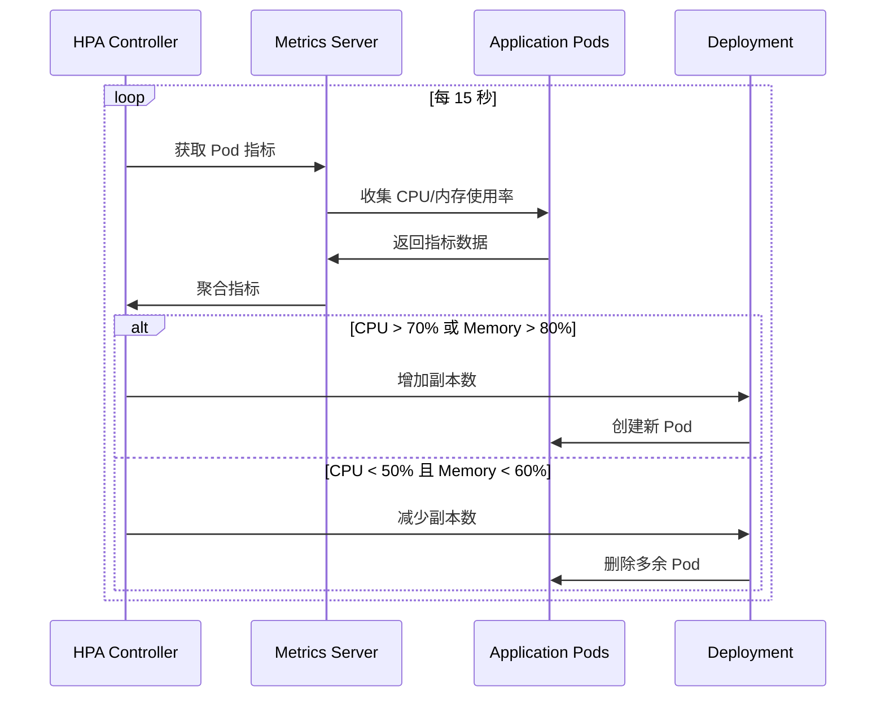

## 故障排除流程

### 连接问题诊断流程

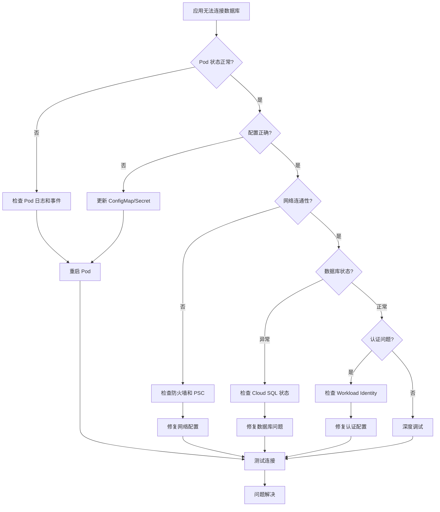

## 清理流程

### 资源清理顺序

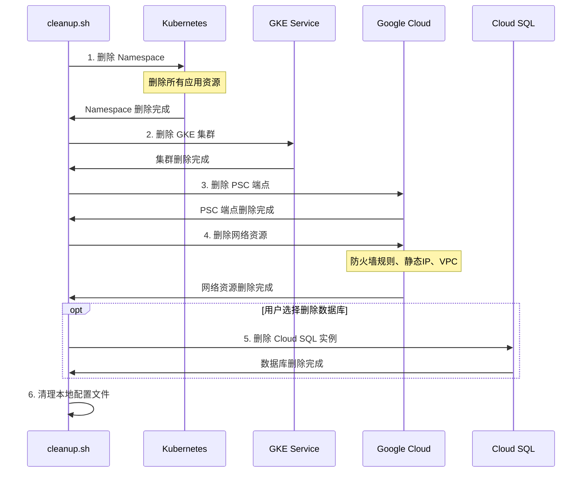

## 最佳实践流程

### 生产部署检查清单

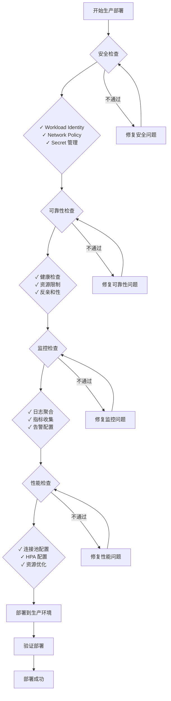

这个流程图详细展示了整个 PSC Demo 的各个阶段和组件之间的关系，帮助你更好地理解整个架构和部署过程。