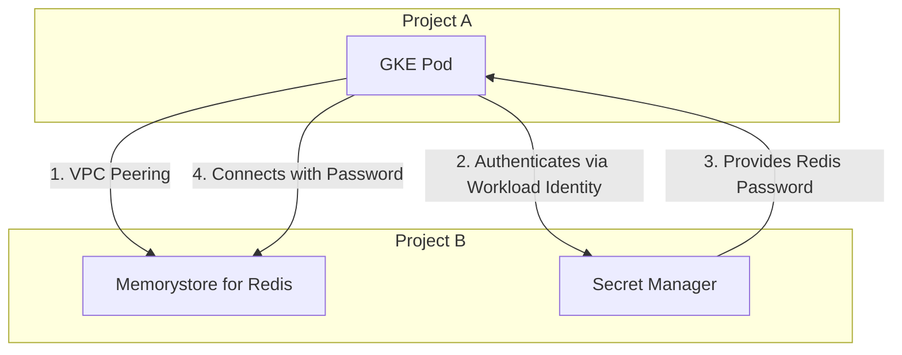
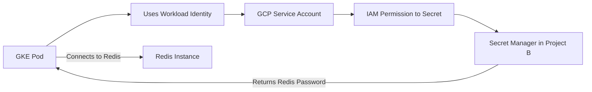

# How to Connect to Redis Across GCP Projects from GKE

## 1. Overview

When an application running in a Google Kubernetes Engine (GKE) cluster in one GCP project (Project A) needs to access a Memorystore for Redis instance in another project (Project B), a secure and efficient connection strategy is required. This document outlines the best practices for establishing such a connection, focusing on networking, authentication, and security.

## 2. Solution Summary

The recommended solution involves creating a private network link between the two projects and using a secure method for the GKE pod to retrieve the Redis password.



**The best practice combines three core GCP features:**

1.  **VPC Network Peering**: To establish a private, low-latency network connection between the VPCs of Project A and Project B.
2.  **Secret Manager**: To securely store and manage the Redis AUTH password.
3.  **Workload Identity**: To allow the GKE pod to securely authenticate with the Secret Manager API and retrieve the Redis password without using static credentials.

## 3. Network Connectivity Options

To allow the GKE pod to communicate with the Redis instance, their networks must be connected. Here are the primary methods:

### Method 1: VPC Network Peering (Recommended)

VPC Peering allows two VPC networks to connect internally using private IP addresses.

-   **Pros**: Simple to set up, low latency, and avoids public internet exposure.
-   **Cons**: IP address ranges (CIDRs) in the peered VPCs cannot overlap.

#### Implementation Steps:

1.  **Establish Peering Connection**: Create a peering configuration from each project to the other.

    ```bash
    # In Project A, create a peering connection to Project B
    gcloud compute networks peerings create peer-a-to-b \
        --project=project-a-id \
        --network=vpc-a \
        --peer-project=project-b-id \
        --peer-network=vpc-b \
        --auto-create-routes

    # In Project B, create a peering connection back to Project A
    gcloud compute networks peerings create peer-b-to-a \
        --project=project-b-id \
        --network=vpc-b \
        --peer-project=project-a-id \
        --peer-network=vpc-a \
        --auto-create-routes
    ```

2.  **Authorize Network for Redis**: Update the Redis instance in Project B to accept connections from Project A's VPC.

    ```bash
    gcloud redis instances update redis-instance-name \
        --project=project-b-id \
        --region=us-central1 \
        --authorized-network=projects/project-a-id/global/networks/vpc-a
    ```

### Method 2: Shared VPC

In a Shared VPC setup, one project (the "Host Project") shares its VPC with other projects ("Service Projects").

-   **Pros**: Centralized network management, seamless connectivity.
-   **Cons**: Requires organizational-level planning and is more complex to configure.

### Method 3: Private Service Connect

Private Service Connect provides a way to privately consume services across different VPCs without requiring VPC Peering.

-   **Pros**: Excellent network isolation, service consumer and producer networks remain completely separate.
-   **Cons**: More complex, requiring internal load balancers and service attachments.

## 4. Authentication: Simulating IAM with Secret Manager

**Important**: As of early 2025, Google Cloud Memorystore for Redis **does not have native support for IAM-based authentication**. Connection is typically handled via a password (AUTH command).

The best practice is to securely manage this password using IAM and Secret Manager.



#### Implementation Steps:

1.  **Store the Redis Password in Secret Manager**: In Project B, create a secret to hold the password.

    ```bash
    echo -n "your-strong-redis-password" | gcloud secrets create redis-auth-password \
        --project=project-b-id \
        --replication-policy=automatic \
        --data-file=-
    ```

2.  **Enable Workload Identity in GKE**:
    -   Create a Kubernetes Service Account (KSA) for your application.
    -   Create a GCP Service Account (GSA) in Project A.
    -   Bind the KSA and GSA to establish a Workload Identity relationship.

    ```bash
    # Create the KSA
    kubectl create serviceaccount redis-app-ksa

    # Create the GSA
    gcloud iam service-accounts create redis-app-gsa --project=project-a-id

    # Bind them for Workload Identity
    gcloud iam service-accounts add-iam-policy-binding \
        redis-app-gsa@project-a-id.iam.gserviceaccount.com \
        --role=roles/iam.workloadIdentityUser \
        --member="serviceAccount:project-a-id.svc.id.goog[default/redis-app-ksa]" \
        --project=project-a-id
    ```

3.  **Grant Secret Access**: Grant the GSA from Project A permission to access the secret in Project B.

    ```bash
    gcloud secrets add-iam-policy-binding redis-auth-password \
        --project=project-b-id \
        --member="serviceAccount:redis-app-gsa@project-a-id.iam.gserviceaccount.com" \
        --role="roles/secretmanager.secretAccessor"
    ```

4.  **Configure the GKE Pod**:
    -   Assign the Kubernetes Service Account (`redis-app-ksa`) to your pod.
    -   The application code running in the pod can now use the GCP client libraries, which will automatically authenticate as the `redis-app-gsa` service account and can fetch the secret.

    **Pod Specification:**
    ```yaml
    apiVersion: v1
    kind: Pod
    metadata:
      name: my-redis-client-pod
    spec:
      serviceAccountName: redis-app-ksa
      containers:
      - name: my-app
        image: my-app-image
        env:
        - name: REDIS_HOST
          value: "private-ip-of-redis-in-project-b"
        - name: REDIS_SECRET_PROJECT_ID
          value: "project-b-id"
        - name: REDIS_SECRET_NAME
          value: "redis-auth-password"
    ```

5.  **Application Code**: The application should use a GCP client library to fetch the secret and then use it to connect to Redis.

    **Example in Go:**
    ```go
    package main

    import (
    	"context"
    	"fmt"
    	"os"

    	secretmanager "cloud.google.com/go/secretmanager/apiv1"
    	"cloud.google.com/go/secretmanager/apiv1/secretmanagerpb"
    	"github.com/go-redis/redis/v8"
    )

    func getRedisPassword(ctx context.Context, projectID, secretName string) (string, error) {
    	client, err := secretmanager.NewClient(ctx)
    	if err != nil {
    		return "", fmt.Errorf("failed to create secretmanager client: %w", err)
    	}
    	defer client.Close()

    	secretPath := fmt.Sprintf("projects/%s/secrets/%s/versions/latest", projectID, secretName)
    	req := &secretmanagerpb.AccessSecretVersionRequest{Name: secretPath}

    	result, err := client.AccessSecretVersion(ctx, req)
    	if err != nil {
    		return "", fmt.Errorf("failed to access secret version: %w", err)
    	}

    	return string(result.Payload.Data), nil
    }

    func main() {
    	ctx := context.Background()

    	redisHost := os.Getenv("REDIS_HOST")
        secretProjectID := os.Getenv("REDIS_SECRET_PROJECT_ID")
        secretName := os.Getenv("REDIS_SECRET_NAME")


    	password, err := getRedisPassword(ctx, secretProjectID, secretName)
    	if err != nil {
    		panic(fmt.Sprintf("Could not retrieve Redis password: %v", err))
    	}

    	rdb := redis.NewClient(&redis.Options{
    		Addr:     fmt.Sprintf("%s:6379", redisHost),
    		Password: password,
    	})

    	pong, err := rdb.Ping(ctx).Result()
    	if err != nil {
            panic(fmt.Sprintf("Failed to connect to Redis: %v", err))
        }
    	fmt.Println("Successfully connected to Redis:", pong)
    }
    ```

## 5. Security Best Practices

-   **Principle of Least Privilege**: Only grant the `roles/secretmanager.secretAccessor` role. Do not grant broader permissions.
-   **Password Rotation**: Use Secret Manager's features to schedule regular rotation of the Redis password.
-   **Network Security**: Implement firewall rules to restrict traffic to the Redis instance, even within the peered VPC. Only allow traffic from the specific GKE pod IP range.
-   **Auditing**: Enable Cloud Audit Logs for both networking and Secret Manager access to monitor for any suspicious activity.
-   **Use `AUTH`**: Ensure your Redis instance is configured to require authentication.

## 6. Conclusion

For connecting a GKE pod to a Memorystore for Redis instance across GCP projects, the most secure, maintainable, and performant solution is the combination of **VPC Peering** for network connectivity and **Workload Identity + Secret Manager** for credential management. This approach avoids hardcoded credentials and provides a robust, IAM-controlled mechanism for authentication.
