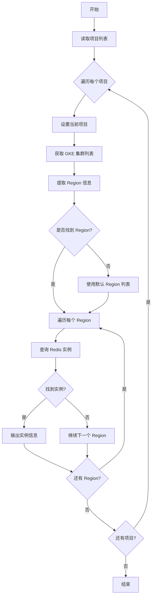

# GCP Redis 信息获取脚本

## 问题分析

您需要一个脚本来：

1. 循环多个 GCP 项目
2. 自动发现每个项目中的 Redis 实例所在的 region
3. 获取 Redis 实例的详细信息

关键点：Redis 实例查询需要指定 region，可以通过 GKE 集群列表快速获取项目使用的 region。

## 解决方案

### 方案一：通过 GKE 集群获取 Region

```bash
#!/bin/bash

# 项目列表
PROJECTS=("project-1" "project-2" "project-3")

# 颜色输出
RED='\033[0;31m'
GREEN='\033[0;32m'
YELLOW='\033[1;33m'
NC='\033[0m' # No Color

echo "========================================"
echo "GCP Redis 实例信息获取脚本"
echo "========================================"

# 循环处理每个项目
for PROJECT_ID in "${PROJECTS[@]}"; do
    echo -e "\n${GREEN}[项目]${NC} ${PROJECT_ID}"
    echo "----------------------------------------"
    
    # 设置当前项目
    gcloud config set project "${PROJECT_ID}" --quiet
    
    # 获取项目中所有 GKE 集群的 region
    REGIONS=$(gcloud container clusters list \
        --project "${PROJECT_ID}" \
        --format="value(location)" \
        2>/dev/null | sort -u)
    
    if [ -z "$REGIONS" ]; then
        echo -e "${YELLOW}⚠ 未找到 GKE 集群，尝试获取所有可用 region${NC}"
        # 如果没有 GKE 集群，使用默认的常用 regions
        REGIONS=$(gcloud compute regions list \
            --project "${PROJECT_ID}" \
            --format="value(name)" \
            2>/dev/null)
    fi
    
    # 标记是否找到 Redis 实例
    FOUND_REDIS=false
    
    # 在每个 region 中查找 Redis 实例
    for REGION in $REGIONS; do
        echo -e "\n  ${YELLOW}[Region]${NC} ${REGION}"
        
        # 获取 Redis 实例列表
        REDIS_INSTANCES=$(gcloud redis instances list \
            --region="${REGION}" \
            --project="${PROJECT_ID}" \
            --format="table(name,tier,memorySizeGb,host,port,currentLocationId,state)" \
            2>/dev/null)
        
        if [ $? -eq 0 ] && [ ! -z "$REDIS_INSTANCES" ]; then
            # 检查是否有实际的实例（不只是表头）
            INSTANCE_COUNT=$(echo "$REDIS_INSTANCES" | tail -n +2 | grep -v "^$" | wc -l)
            
            if [ $INSTANCE_COUNT -gt 0 ]; then
                echo -e "${GREEN}✓ 找到 ${INSTANCE_COUNT} 个 Redis 实例${NC}"
                echo "$REDIS_INSTANCES"
                FOUND_REDIS=true
            fi
        fi
    done
    
    if [ "$FOUND_REDIS" = false ]; then
        echo -e "\n  ${RED}✗ 该项目未找到 Redis 实例${NC}"
    fi
    
    echo "========================================"
done

echo -e "\n${GREEN}脚本执行完成${NC}"
```

### 方案二：优化版本（仅扫描有资源的 Region）

```bash
#!/bin/bash

# 项目列表
PROJECTS=("project-1" "project-2" "project-3")

# 输出格式控制
RED='\033[0;31m'
GREEN='\033[0;32m'
YELLOW='\033[1;33m'
BLUE='\033[0;34m'
NC='\033[0m'

# 日志函数
log_info() {
    echo -e "${BLUE}[INFO]${NC} $1"
}

log_success() {
    echo -e "${GREEN}[SUCCESS]${NC} $1"
}

log_warning() {
    echo -e "${YELLOW}[WARNING]${NC} $1"
}

log_error() {
    echo -e "${RED}[ERROR]${NC} $1"
}

# 获取项目中活跃的 regions
get_active_regions() {
    local project_id=$1
    local regions=()
    
    # 从 GKE 集群获取 regions
    local gke_regions=$(gcloud container clusters list \
        --project "${project_id}" \
        --format="value(location)" \
        2>/dev/null | sort -u)
    
    # 从 Compute Engine 获取 regions
    local gce_regions=$(gcloud compute instances list \
        --project "${project_id}" \
        --format="value(zone)" \
        2>/dev/null | sed 's/-[a-z]$//' | sort -u)
    
    # 合并并去重
    echo "$gke_regions $gce_regions" | tr ' ' '\n' | sort -u | grep -v '^$'
}

# 获取 Redis 实例详细信息
get_redis_details() {
    local project_id=$1
    local region=$2
    local instance_name=$3
    
    log_info "获取实例 ${instance_name} 详细信息..."
    
    gcloud redis instances describe "${instance_name}" \
        --region="${region}" \
        --project="${project_id}" \
        --format="yaml" 2>/dev/null
}

# 主函数
main() {
    log_info "开始扫描 GCP Redis 实例"
    echo "========================================"
    
    for PROJECT_ID in "${PROJECTS[@]}"; do
        echo ""
        log_info "处理项目: ${PROJECT_ID}"
        echo "----------------------------------------"
        
        # 设置项目
        gcloud config set project "${PROJECT_ID}" --quiet 2>/dev/null
        
        if [ $? -ne 0 ]; then
            log_error "无法设置项目 ${PROJECT_ID}，请检查权限"
            continue
        fi
        
        # 获取活跃的 regions
        log_info "发现项目中使用的 regions..."
        ACTIVE_REGIONS=$(get_active_regions "${PROJECT_ID}")
        
        if [ -z "$ACTIVE_REGIONS" ]; then
            log_warning "未找到活跃的 regions，将扫描所有可用 regions"
            ACTIVE_REGIONS=$(gcloud compute regions list \
                --project "${PROJECT_ID}" \
                --format="value(name)" \
                2>/dev/null | head -n 5)  # 限制前5个常用 region
        fi
        
        FOUND_REDIS=false
        
        # 扫描每个 region
        for REGION in $ACTIVE_REGIONS; do
            log_info "扫描 Region: ${REGION}"
            
            # 获取 Redis 实例列表
            REDIS_LIST=$(gcloud redis instances list \
                --region="${REGION}" \
                --project="${PROJECT_ID}" \
                --format="value(name)" \
                2>/dev/null)
            
            if [ ! -z "$REDIS_LIST" ]; then
                log_success "在 ${REGION} 找到 Redis 实例"
                
                # 显示实例列表
                gcloud redis instances list \
                    --region="${REGION}" \
                    --project="${PROJECT_ID}" \
                    --format="table(name,tier,memorySizeGb,host,port,state,createTime)"
                
                FOUND_REDIS=true
                
                # 可选：获取每个实例的详细信息
                # for instance in $REDIS_LIST; do
                #     echo ""
                #     get_redis_details "${PROJECT_ID}" "${REGION}" "${instance}"
                # done
            fi
        done
        
        if [ "$FOUND_REDIS" = false ]; then
            log_warning "项目 ${PROJECT_ID} 中未找到 Redis 实例"
        fi
        
        echo "========================================"
    done
    
    log_success "扫描完成"
}

# 执行主函数
main
```

## 执行流程图



## 使用方法

### 1. 保存脚本

```bash
# 保存为 get-redis-info.sh
chmod +x get-redis-info.sh
```

### 2. 修改项目列表

```bash
# 编辑脚本中的项目数组
PROJECTS=("your-project-1" "your-project-2" "your-project-3")
```

### 3. 执行脚本

```bash
./get-redis-info.sh
```

### 4. 导出到文件

```bash
./get-redis-info.sh > redis-report.txt
```

## 注意事项

### 权限要求

确保您的 GCP 账号具有以下权限：

```yaml
必需角色:
  - roles/redis.viewer           # 查看 Redis 实例
  - roles/container.viewer       # 查看 GKE 集群
  - roles/compute.viewer         # 查看计算资源（可选）
```

### 认证检查

```bash
# 检查当前认证状态
gcloud auth list

# 如需重新认证
gcloud auth login

# 检查项目访问权限
gcloud projects list
```

### 性能优化建议

1. **限制 Region 范围**：如果知道主要使用的 regions，可以硬编码
    
    ```bash
    COMMON_REGIONS=("us-central1" "us-east1" "asia-east1")
    ```
    
2. **并行执行**：对于大量项目，可使用 GNU Parallel
    
    ```bash
    parallel -j 4 ./get-redis-info.sh ::: "${PROJECTS[@]}"
    ```
    
3. **缓存 Region 信息**：将 region 信息缓存到文件
    

### 错误处理

脚本已包含以下错误处理：

- ✓ API 调用失败处理
- ✓ 空结果检查
- ✓ 权限不足提示
- ✓ 项目不存在检测

## 输出示例

```
========================================
GCP Redis 实例信息获取脚本
========================================

[项目] project-1
----------------------------------------

  [Region] us-central1
✓ 找到 2 个 Redis 实例
NAME                TIER        MEMORY_SIZE_GB  HOST           PORT  LOCATION        STATE
redis-prod-001      STANDARD    5               10.0.0.5       6379  us-central1-a   READY
redis-cache-001     BASIC       1               10.0.0.6       6379  us-central1-b   READY

========================================

脚本执行完成
```

这个脚本会自动发现项目中使用的 regions，避免扫描所有不必要的区域，大大提高执行效率。