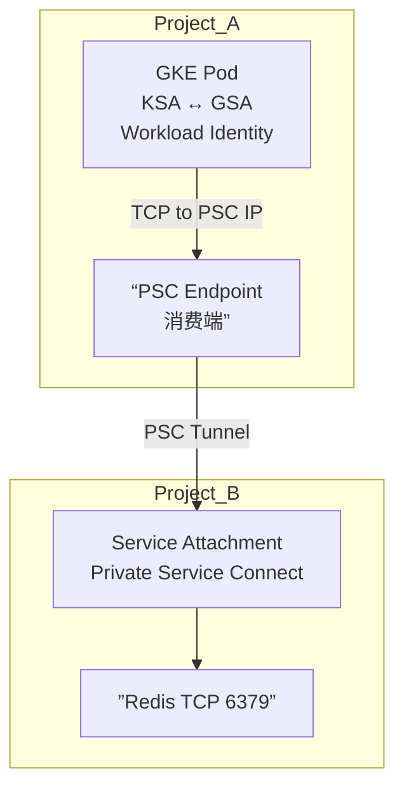
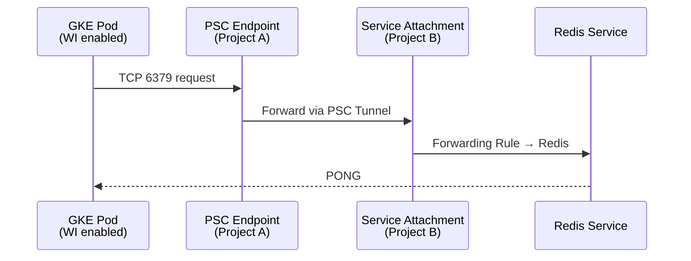

下面以标准 Markdown 源码格式 为你完整说明 GKE（Project A）访问跨 Project B 的 Redis（不管是 GCE Redis、Redis Enterprise、或自建 Redis） 的可行方案，包含 网络连通方式、鉴权机制、能否通过 IAM 实现、以及推荐架构。

1. 问题分析

你的场景是：

- Project A：运行 GKE Pod
- Project B：部署 Redis（GCE VM、自建、或 Redis Enterprise）
- GKE Pod 需要跨项目访问 Redis
- 你特别关注 IAM-based authentication 是否可行

Redis 本身不支持 IAM Auth（Redis 是 TCP 协议 + password + ACL，不支持 Google IAM）。

但 GCP 网络层与代理层 可以让你间接地通过 IAM 控制访问。

2. 可行的跨项目访问方式总览

|                                                      |            |                       |                                                       |                        |
| ---------------------------------------------------- | ---------- | --------------------- | ----------------------------------------------------- | ---------------------- |
| 方式                                                 | 网络层     | 访问控制              | 是否支持 IAM 鉴权                                     | 推荐度                 |
| VPC Peering                                          | L3 内网    | FW rules              | ❌ 不支持                                             | ⭐⭐⭐                 |
| Shared VPC                                           | L3 内网    | IAM + FW rules        | ⚠️ 限制性（只控制网络访问，不是 Redis 鉴权）          | ⭐⭐⭐⭐⭐（推荐）     |
| VPC Network Connectivity Center                      | L3 内网    | FW rules              | ❌ 不支持                                             | ⭐⭐                   |
| Private Service Connect (PSC)                        | L4/L7 代理 | IAM + per-service IAM | ⚠️ 部分支持（控制访问 PSC Endpoint，而非 Redis 鉴权） | ⭐⭐⭐⭐⭐（强烈推荐） |
| 通过 API Gateway / Cloud Run / VM 代理层做 IAM Proxy | L7         | IAM fully             | ✔️ 完整支持                                           | ⭐⭐⭐（需要额外组件） |

结论提前说：

✅ Redis 本身不支持 IAM 鉴权

但你可以利用：

1）PSC + IAM → 控制访问 Redis 的入口

2）代理层实现 → IAM-based Authentication

3. 每种方式的详细说明

方案 1：Shared VPC（推荐、最简单）

场景

如果两个项目相信程度较高、你可以让 Project B 作为 Host Project，Project A 作为 Service Project。

特点

- Pod 拥有 Host Project 的子网 IP
- Redis VM 在同一个 VPC 内
- 直接三层通信（VPC 内网）

鉴权（访问控制）

- 通过 VPC FW Rules
- IAM 仅用于管理权限（谁能创建资源）
- Redis 鉴权还是经典 ACL / password

是否支持 IAM Authentication

❌ 无法做到 Redis 层 IAM Auth

架构图

graph TD

A[GKE Pod (Project A)] -->|VPC 内网| B[Redis VM (Project B)]

方案 2：VPC Peering（经典跨项目互通）

特点

- 简单、直连
- 无需额外组件
- 不支持重复网段
- 不支持跨区域

IAM Authentication

❌ 不支持。IAM 无法控制 TCP 层访问。

方案 3：Private Service Connect（强烈推荐）

PSC 是什么？

让 Project A 通过一个 私有 IP Endpoint 访问 Project B 的服务（L4 TCP）。

Redis（TCP）完全可以被 PSC 暴露出来。

特点

- 隔离更好（无需 full VPC Peering）
- Project A 不会看到 Redis 的真实 IP
- Project B 可以限制 哪些项目、哪些 VPC、哪些服务账号可访问 PSC endpoint

IAM Authentication？

⚠️ 部分支持：

- IAM 不会进入 Redis
- IAM 可限制谁 可以连接 PSC Endpoint
- 例如：  
     只允许 project-A.svc.id.goog[gke-pod-sa] 的服务账号访问 PSC Endpoint

架构图

graph TD

A[GKE Pod (Project A)] -->|Private Service Connect| E[PSC Endpoint]

E --> B[Redis (Project B)]

适用

- 想强隔离
- 不想打开整个 VPC
- 想通过 IAM 控制“谁可以访问入口”

4. 方案 4：IAM Proxy / Identity-Aware Proxy（完整支持 IAM Auth）

Redis 不支持 IAM，但你可以使用一个代理层：

思路

GKE Pod → 访问代理层（可以是 Cloud Run / VM / Envoy） → 代理层通过 Redis Password/ACL 访问 Redis

优点

- 代理层可以基于 IAM 验证调用者，例如：

- Cloud Run Cloud IAM
- IAP（Identity-Aware Proxy）
- Envoy + JWT 验证

-
- Redis 完全不暴露（可只允许代理访问）

缺点

- 多一个代理服务
- 延迟略高
- 架构稍复杂

架构图

graph TD

A[GKE Pod (Project A)] -->|IAM Auth| P[IAM Proxy (Cloud Run/VM)]

P -->|Password/Auth| B[Redis (Project B)]

5. IAM-based Authentication 可行性总结

✳ Redis 原生：

❌ 不支持 IAM

✳ 网络/访问信任层（PSC / Shared VPC）：

⚠️ 可以用 IAM 限制访问入口，但不是 Redis 鉴权

✳ 代理层：

✔️ 完全实现 IAM-based Auth（推荐）

6. 实操步骤（以 PSC + IAM 控制 最佳实践为例）

以下例子假设：

- Project A（GKE）
- Project B（Redis）
- Redis 在 GCE VM，IP：10.20.0.5:6379

Step 1：Project B 暴露 Redis 为 PSC 服务

gcloud compute service-attachments create redis-psc \

--region=asia-east1 \

--producer-forwarding-rule=redis-forward-rule \

--connection-preference=ACCEPT_AUTOMATIC \

--nat-subnets=redis-nat-subnet \

--project=project-b

Step 2：允许 Project A 的服务账号访问

gcloud compute service-attachments add-iam-policy-binding redis-psc \

--region=asia-east1 \

--member="serviceAccount:pod-sa@project-a.iam.gserviceaccount.com" \

--role="roles/compute.networkUser" \

--project=project-b

Step 3：Project A 创建 PSC Endpoint

gcloud compute forwarding-rules create redis-psc-endpoint \

--network=default \

--region=asia-east1 \

--address=10.10.0.50 \

--ports=6379 \

--target-service-attachment=projects/project-b/regions/asia-east1/serviceAttachments/redis-psc \

--project=project-a

Step 4：GKE Pod 使用私网地址访问

redis-cli -h 10.10.0.50 -p 6379

7. 注意事项（最佳实践）

- Redis ACL/password 仍需配置（IAM 无法替代）
- GKE Pod 的 服务账号需要 Workload Identity 绑定
- 检查双方 VPC 的 防火墙规则 是否允许 TCP 6379
- PSC 更适合“只暴露一个服务”，不暴露整个网络
- 如果需要 强制 IAM → 使用代理层模式

8. 推荐方案给你的 API 平台背景

基于你团队的 API 平台架构（Nginx → Kong → Runtime）以及多项目、强隔离的需求：

⭐ 最佳方案模型

GKE → PSC Endpoint → Redis（Project B）

- 不需要共享 VPC
- 不暴露 Redis 的真实 IP
- 可以基于 IAM 控制调用方
- 配合 Redis ACL 进一步加强安全性

如果你需要 强鉴权（要求完全 IAM-based）：

→ 加一个 Cloud Run Proxy / Envoy Proxy

并在代理中使用 Redis ACL 用户访问 Redis。

如果你愿意，我可以：

- 帮你画出跨项目完整架构图
- 帮你写出 Terraform 版本
- 帮你写出 Workload Identity + PSC 的完整 YAML（适用于 GKE）

告诉我你希望进一步深入哪个部分？
下面给你一个 完整、可直接使用的 Workload Identity + PSC（Private Service Connect）实现方案，用于：

- Project A 的 GKE Pod（使用 Workload Identity）
- 访问 Project B 的 Redis（通过 PSC Endpoint 暴露）

提供 架构说明、配置步骤、YAML 配置、Mermaid 流程图、注意事项。

1. 问题分析

你希望实现：

- GKE Pod 使用 Workload Identity（GSA + KSA）
- 跨项目访问 Redis
- 访问路径通过 PSC（Private Service Connect）
- 希望最终能用 IAM 控制访问权限

⚠️ 重点澄清：

- PSC 可以使用 IAM 控制谁可以创建/使用 PSC endpoint
- Workload Identity 让 Pod 能绑定一个 GSA
- GSA 的 IAM 权限 可以用于访问 PSC endpoint（Service Attachment）

Redis 不支持 IAM，但 PSC endpoint 是支持 IAM 控制访问的

👉 即：你可以用 Workload Identity + IAM 控制谁能访问 PSC

而 PSC 再转发到 Redis。

2. 架构方案（完整）

3. 解决方案步骤（完整端到端）

3.1 Project B：暴露 Redis 为 PSC Service Attachment

假设 Redis 运行在 Project B 的 VM 或 Redis Enterprise

私有服务需要一个 Forwarding Rule + Service Attachment 

（1）创建 Forwarding Rule 指向 Redis

gcloud compute forwarding-rules create redis-fr \

--project=PROJECT_B \

--load-balancing-scheme=INTERNAL \

--network=default \

--subnet=default \

--address=10.10.0.10 \

--ports=6379 \

--target-instance=redis-vm

（2）创建 Service Attachment

gcloud compute service-attachments create redis-sa \

--project=PROJECT_B \

--region=asia-east1 \

--producer-forwarding-rule=redis-fr \

--connection-preference=ACCEPT_MANUAL \

--nat-subnets=default \

--enable-proxy-protocol

（3）设置 IAM（允许 Project A 的 GSA 访问）

gcloud compute service-attachments add-iam-policy-binding redis-sa \

--project=PROJECT_B \

--region=asia-east1 \

--role=roles/compute.serviceAttachments.use \

--member=serviceAccount:redis-client-gsa@PROJECT_A.iam.gserviceaccount.com

3.2 Project A：创建 Workload Identity（KSA ↔ GSA）

（1）创建 GSA

gcloud iam service-accounts create redis-client-gsa \

--project=PROJECT_A

（2）绑定 IAM（允许消费 PSC Service Attachment）

gcloud projects add-iam-policy-binding PROJECT_A \

--member=serviceAccount:redis-client-gsa@PROJECT_A.iam.gserviceaccount.com \

--role=roles/compute.networkUser

⚠️ 必需：使用 PSC Endpoint 必须拥有 Network User 权限

3.3 Project A：KSA 映射 Workload Identity

kubectl create serviceaccount redis-client-ksa

gcloud iam service-accounts add-iam-policy-binding \

redis-client-gsa@PROJECT_A.iam.gserviceaccount.com \

--role roles/iam.workloadIdentityUser \

--member "serviceAccount:PROJECT_A.svc.id.goog[default/redis-client-ksa]"

3.4 Project A：创建 PSC Endpoint（消费 Redis）

gcloud compute forwarding-rules create redis-psc-endpoint \

--project=PROJECT_A \

--region=asia-east1 \

--network=default \

--subnet=default \

--address=10.20.0.20 \

--ports=6379 \

--target-service-attachment=projects/PROJECT_B/regions/asia-east1/serviceAttachments/redis-sa

获得 PSC Endpoint 的 Private IP：10.20.0.20

4. Pod 示例（使用 Workload Identity + 访问 PSC Endpoint）

apiVersion: v1

kind: Pod

metadata:

name: redis-client

namespace: default

annotations:

iam.gke.io/gcp-service-account: "redis-client-gsa@PROJECT_A.iam.gserviceaccount.com"

spec:

serviceAccountName: redis-client-ksa

containers:

- name: redis-cli

image: redis:7

command: ["sleep", "3600"]

Pod 内访问 Redis：

redis-cli -h 10.20.0.20 -p 6379 ping

5. 流程图（请求链路）

6. 注意事项 & 最佳实践

✔ IAM 控制的是 “能否使用 PSC Endpoint”，不是 Redis Auth

但这是目前 唯一能将 Redis 访问纳入 IAM 控制路径 的方式。

✔ Redis 仍需 password/ACL

建议：

requirepass <your-secure-password>

✔ 不能跨-region

PSC Service Attachment 必须在同 region。

✔ 建议建立专门 Subnet 给 PSC Endpoint

减少 IP 污染。

✔ Pod 层推荐使用 Connection Pool（Jedis / Lettuce 参数调优）

避免大量连接建立。

7. 最终结论

你要的 Workload Identity + IAM + PSC 访问跨项目 Redis 完全可实现：

- Workload Identity → 控制谁代表 GSA
- IAM on PSC → 控制哪些 Pod/GSA 可以访问 Redis
- Redis → 继续使用密码 + ACL

这是目前 Google Cloud 上实现 “IAM 控制 Redis 访问” 的最佳方案。

如果你希望，我可以继续为你生成：

✅ 一键 Terraform 模板

✅ 完整 GKE Deployment + Redis Client 示例

✅ 双项目 VPC、PSC 自动化部署脚本

告诉我你需要哪一种。
