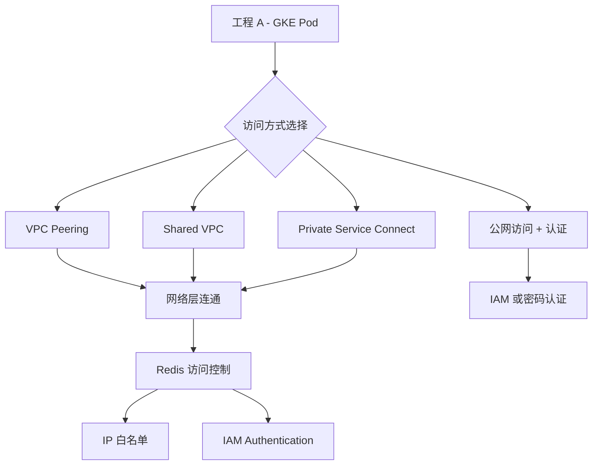
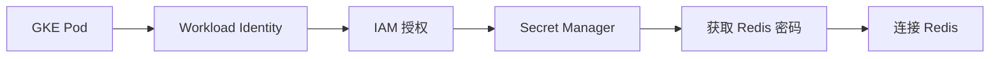
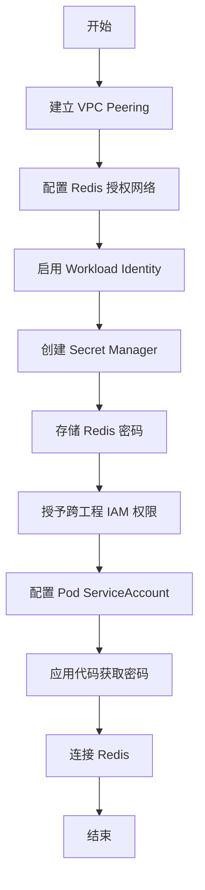

# GKE 跨工程访问 Redis 的实现方案

## 问题分析

在 GCP 中，工程 A 的 GKE Pod 需要访问工程 B 的 Redis 实例。这涉及到跨项目网络连接、身份验证和授权的问题。

## 解决方案概览



## 主要实现方式

### 方式 1：VPC Network Peering

**适用场景**：两个工程都有独立 VPC，需要建立网络连接

**步骤**：

1. **建立 VPC Peering**

```bash
# 在工程 A 创建 peering 到工程 B
gcloud compute networks peerings create peer-a-to-b \
    --network=vpc-a \
    --peer-project=project-b-id \
    --peer-network=vpc-b \
    --auto-create-routes

# 在工程 B 创建 peering 到工程 A
gcloud compute networks peerings create peer-b-to-a \
    --network=vpc-b \
    --peer-project=project-a-id \
    --peer-network=vpc-a \
    --auto-create-routes
```

1. **配置 Redis 授权网络**

```bash
# 在工程 B 更新 Redis 实例，允许工程 A 的 VPC
gcloud redis instances update redis-instance \
    --region=us-central1 \
    --authorized-network=projects/project-a-id/global/networks/vpc-a \
    --project=project-b-id
```

1. **Pod 访问配置**

```yaml
apiVersion: v1
kind: ConfigMap
metadata:
  name: redis-config
data:
  REDIS_HOST: "10.x.x.x"  # 工程 B Redis 的内网 IP
  REDIS_PORT: "6379"
```

**优点**：

- 低延迟，内网直连
- 无需额外认证层

**缺点**：

- 需要两边配置
- IP 地址空间不能重叠

-----

### 方式 2：Shared VPC

**适用场景**：工程 B 是 Host Project，工程 A 是 Service Project

**步骤**：

1. **启用 Shared VPC**

```bash
# 在工程 B 启用为 Host Project
gcloud compute shared-vpc enable project-b-id

# 关联工程 A 为 Service Project
gcloud compute shared-vpc associated-projects add project-a-id \
    --host-project=project-b-id
```

1. **授予工程 A 子网使用权限**

```bash
# 授予工程 A 的 GKE 服务账号访问子网的权限
gcloud projects add-iam-policy-binding project-b-id \
    --member="serviceAccount:service-PROJECT_NUMBER@container-engine-robot.iam.gserviceaccount.com" \
    --role="roles/compute.networkUser"
```

1. **GKE 集群使用 Shared VPC**

```bash
gcloud container clusters create cluster-a \
    --network=projects/project-b-id/global/networks/shared-vpc \
    --subnetwork=projects/project-b-id/regions/us-central1/subnetworks/subnet-a \
    --enable-ip-alias \
    --project=project-a-id
```

**优点**：

- 统一网络管理
- 天然连通，无需 Peering

**缺点**：

- 需要组织级别的规划
- 配置相对复杂

-----

### 方式 3：Private Service Connect

**适用场景**：更灵活的跨工程私有连接

**步骤**：

1. **在工程 B 创建 Service Attachment**

```bash
# 假设 Redis 前面有内部负载均衡器
gcloud compute service-attachments create redis-psc \
    --region=us-central1 \
    --producer-forwarding-rule=redis-ilb-forwarding-rule \
    --connection-preference=ACCEPT_AUTOMATIC \
    --nat-subnets=psc-nat-subnet \
    --project=project-b-id
```

1. **在工程 A 创建 Endpoint**

```bash
gcloud compute addresses create redis-psc-endpoint \
    --region=us-central1 \
    --subnet=subnet-a \
    --project=project-a-id

gcloud compute forwarding-rules create redis-psc-endpoint \
    --region=us-central1 \
    --network=vpc-a \
    --address=redis-psc-endpoint \
    --target-service-attachment=projects/project-b-id/regions/us-central1/serviceAttachments/redis-psc \
    --project=project-a-id
```

**优点**：

- 网络隔离性好
- 不需要 VPC Peering

**缺点**：

- 配置复杂
- 需要额外的网络组件

-----

## IAM-based Authentication 实现

### Memorystore for Redis 的 IAM 支持现状

**重要说明**：截至 2025 年初，Google Cloud Memorystore for Redis **不直接支持** IAM-based authentication。

Redis 本身的认证机制：

- AUTH 命令 + 密码
- ACL（Access Control Lists）

### 可行的 IAM 集成方案

#### 方案 A：通过 IAM + Secret Manager



**实现步骤**：

1. **启用 Workload Identity**

```bash
# 创建 Kubernetes Service Account
kubectl create serviceaccount redis-client -n default

# 创建 GCP Service Account
gcloud iam service-accounts create redis-client-sa \
    --project=project-a-id

# 绑定 Workload Identity
gcloud iam service-accounts add-iam-policy-binding \
    redis-client-sa@project-a-id.iam.gserviceaccount.com \
    --role=roles/iam.workloadIdentityUser \
    --member="serviceAccount:project-a-id.svc.id.goog[default/redis-client]" \
    --project=project-a-id
```

1. **存储 Redis 密码到 Secret Manager**

```bash
# 在工程 B 创建 Secret
echo -n "your-redis-password" | gcloud secrets create redis-password \
    --data-file=- \
    --replication-policy=automatic \
    --project=project-b-id

# 授予工程 A 的 Service Account 访问权限
gcloud secrets add-iam-policy-binding redis-password \
    --member="serviceAccount:redis-client-sa@project-a-id.iam.gserviceaccount.com" \
    --role="roles/secretmanager.secretAccessor" \
    --project=project-b-id
```

1. **Pod 配置**

```yaml
apiVersion: v1
kind: Pod
metadata:
  name: redis-client
  namespace: default
spec:
  serviceAccountName: redis-client
  containers:
  - name: app
    image: your-app-image
    env:
    - name: REDIS_HOST
      value: "10.x.x.x"
    - name: REDIS_PORT
      value: "6379"
    - name: GCP_PROJECT_ID
      value: "project-b-id"
    - name: SECRET_NAME
      value: "redis-password"
```

1. **应用代码示例（Go）**

```go
package main

import (
    "context"
    "fmt"
    
    secretmanager "cloud.google.com/go/secretmanager/apiv1"
    "cloud.google.com/go/secretmanager/apiv1/secretmanagerpb"
    "github.com/go-redis/redis/v8"
)

func getRedisPassword(ctx context.Context, projectID, secretName string) (string, error) {
    client, err := secretmanager.NewClient(ctx)
    if err != nil {
        return "", err
    }
    defer client.Close()

    name := fmt.Sprintf("projects/%s/secrets/%s/versions/latest", projectID, secretName)
    result, err := client.AccessSecretVersion(ctx, &secretmanagerpb.AccessSecretVersionRequest{
        Name: name,
    })
    if err != nil {
        return "", err
    }

    return string(result.Payload.Data), nil
}

func main() {
    ctx := context.Background()
    
    // 通过 IAM 获取密码
    password, err := getRedisPassword(ctx, "project-b-id", "redis-password")
    if err != nil {
        panic(err)
    }

    // 连接 Redis
    rdb := redis.NewClient(&redis.Options{
        Addr:     "10.x.x.x:6379",
        Password: password,
        DB:       0,
    })

    pong, err := rdb.Ping(ctx).Result()
    fmt.Println(pong, err)
}
```

#### 方案 B：使用 IAP (Identity-Aware Proxy) + Sidecar

如果 Redis 需要通过 TCP 代理访问：

```yaml
apiVersion: v1
kind: Pod
metadata:
  name: redis-client-with-proxy
spec:
  serviceAccountName: redis-client
  containers:
  - name: app
    image: your-app-image
    env:
    - name: REDIS_HOST
      value: "127.0.0.1"
    - name: REDIS_PORT
      value: "6379"
  
  - name: cloud-sql-proxy
    image: gcr.io/cloud-sql-connectors/cloud-sql-proxy:latest
    command:
    - "/cloud-sql-proxy"
    - "--port=6379"
    - "project-b-id:region:redis-instance"
```

**注意**：此方案仅适用于 Cloud SQL，Redis 不支持 Cloud SQL Proxy。

-----

## 推荐方案对比

|方案                          |网络连通性|IAM 集成|复杂度  |安全性  |推荐场景             |
|----------------------------|-----|------|-----|-----|-----------------|
|VPC Peering + Secret Manager|⭐⭐⭐⭐⭐|⭐⭐⭐⭐  |⭐⭐⭐  |⭐⭐⭐⭐ |**最推荐** - 平衡性能和安全|
|Shared VPC + Secret Manager |⭐⭐⭐⭐⭐|⭐⭐⭐⭐  |⭐⭐⭐⭐ |⭐⭐⭐⭐⭐|适合大型组织统一管理       |
|Private Service Connect     |⭐⭐⭐⭐ |⭐⭐⭐   |⭐⭐⭐⭐⭐|⭐⭐⭐⭐⭐|需要强隔离的场景         |

-----

## 完整实现流程（推荐方案）



-----

## 注意事项

### 安全建议

1. **最小权限原则**：仅授予必要的 IAM 角色
1. **密码轮换**：定期更新 Redis AUTH 密码
1. **网络隔离**：使用防火墙规则限制访问来源
1. **审计日志**：启用 Cloud Audit Logs 追踪访问

### 网络配置检查

```bash
# 检查 VPC Peering 状态
gcloud compute networks peerings list --network=vpc-a --project=project-a-id

# 检查 Redis 实例网络配置
gcloud redis instances describe redis-instance \
    --region=us-central1 \
    --project=project-b-id \
    --format="get(authorizedNetwork)"

# 测试网络连通性（从 GKE Pod 内）
kubectl run -it --rm debug --image=redis:alpine --restart=Never -- \
    redis-cli -h 10.x.x.x -a your-password ping
```

### 常见问题排查

1. **连接超时**

- 检查防火墙规则
- 验证 VPC Peering 状态
- 确认 Redis 授权网络配置

1. **认证失败**

- 验证 Secret Manager 权限
- 检查 Workload Identity 绑定
- 确认 Redis AUTH 密码正确

1. **DNS 解析问题**

- 使用 IP 地址而非域名
- 配置 Cloud DNS 私有区域（如需要）

-----

## 总结

**IAM-based Authentication 的现状**：

- Memorystore for Redis **不支持原生 IAM 认证**
- 可通过 **Workload Identity + Secret Manager** 实现 IAM 控制的密码管理
- 网络层推荐使用 **VPC Peering** 实现跨工程连通

**最佳实践组合**：

```
VPC Peering（网络） + Workload Identity（身份） + Secret Manager（密码管理）
```

这种方案既保证了网络性能，又通过 IAM 实现了细粒度的访问控制。​​​​​​​​​​​​​​​​