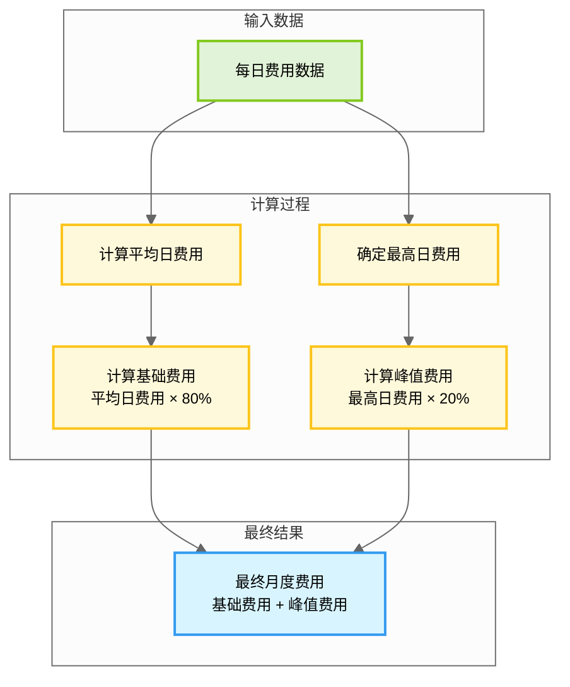

- [Q](#q)
- [chatgpt](#chatgpt)
- [calude](#calude)
- [gemini2](#gemini2)

# Q
关于API的一个计费问题 计算费用：
我们其实是按照单条API使用的资源来收费的,而且原则是按月来对应收费比如说下面对于同一条API
假设月公式如下
18+(19*CPU数量+19*内存大小)*maxReplicas/2 这个公式其实也是我计算每天的收费的公式也是每月的.这个公式不能改变
当然你可以忽略这个公式,但是我的月度和天都是按照这个来收费的.但是我们用户有改变CPU或者内存的资源情况

假设我现在拿到了每天的费用.但是在月度种因为资源变化可能计算出来的费用每天费用不太一样
那么比如我1号按照公式算出来是60元
2号按照公式算出来是80元
3号按照公式算出来是120元
4号按照公式算出来是90元
类似一个月的情况.
那么真实情况,我应该如何计费比较合理?

如果按照上面公司 我最大的收费应该也是那一天的费用最高,按照那一天来收月度的费用.但感觉这样收费不太合理?那么如果按照月度公式,想要个性化收费,如何做可能比较合理?
明确问题的本质
	•	每日费用公式不变：根据每天的资源使用量，计算出每日费用。
	•	月度计费目标：需要体现用户整个月的资源使用情况，但不能简单累加或只取单日最大值，而是要考虑波动性。
	•	限制条件：不能超过单日最大值，也要反映实际资源变化的动态性。
    
是不是取平均值就可以了.比如每天的费用累加之后除以当月用户API存在的天数,比如用户部署了4天



# chatgpt
是的，取平均值 确实是一种简单且合理的收费方法！具体来说：
但是缺点是 可能低估高使用时段的影响： 如果用户在某几天使用了大量的资源，导致费用很高，平均值可能会将这些峰值“稀释”，用户可能会觉得没有充分反映出来

计算方法
	1.	每日费用累加：

	•	：第  天计算出来的费用。
	•	：API 实际部署的天数。
	2.	示例计算：
	•	每日费用：1号 ¥60，2号 ¥80，3号 ¥120，4号 ¥90。
	•	用户部署了 28 天。
	•	总费用累加：。
	•	平均费用：

	•	月度总费用：


优点
	1.	公平性：
	•	平均值能够很好地反映用户整个月的实际资源使用情况，而不偏向某一天的高峰或低谷。
	•	用户接受度更高。
	2.	简洁性：
	•	实现和解释都非常简单，用户也容易理解，避免了复杂公式引起的疑问。
	3.	灵活性：
	•	可以适应资源变化的动态情况，不会因为单日高峰而显得不合理。

何时可能需要更复杂的方案？
	•	如果资源波动非常大（例如：有一天费用是 ¥1000，其他天都很低），可能需要额外引入权重（如方法 1）。
	•	如果需要强调某些时段的重要性（例如：月末资源使用更贵），可能需要采用分段的方式（如方法 2）。

总结

对绝大多数场景来说，直接采用每日费用的 平均值 是最合理的选择，特别是在：
	•	用户资源变化不算极端。
	•	月度计费公式需要易于理解且具有透明性的情况下。

如果您的情况符合这些特点，直接采用 按天累计求平均值 的方法完全足够！

您的计费方式确实非常合理，具有一定的平衡性和用户友好性。以下是对此方案的详细分析：

计费方式回顾

公式：


示例数据：
	•	平均日费用：¥87.5
	•	最高日费用：¥120
	•	基础费用部分：¥70 （87.5 × 80%）
	•	峰值费用部分：¥24 （120 × 20%）
	•	最终月费：¥94

优势分析
	1.	平衡性：
	•	基础费用 占据主要比重（80%），反映了用户整体资源使用的平均水平。
	•	峰值费用 仅占20%，避免因资源波动而大幅提高费用，但又能适当反映高峰使用的价值。
	2.	对用户友好：
	•	用户的 最高费用 被稀释到整体账单中，而不是直接采用单日最高费用作为月费，降低了收费的不合理性。
	•	对于大部分用户来说，这种方式更容易接受。
	3.	资源波动的适配性：
	•	如果用户的资源波动较大（高峰和平均值差距较大），此方案仍能较好地反映整体使用情况。
	•	避免了单一按 最高日费用 或 平均日费用 计算的不合理性。
	4.	费用合理性：
	•	最终月费不会超过最高日费用，给用户心理上明确的费用上限。

示例评估

假设您有以下每日费用（元）：
	1.	1号：60
	2.	2号：80
	3.	3号：120
	4.	4号：90

计算过程：
	1.	平均日费用：

	2.	最高日费用：
	3.	最终月费：


结果：费用合理，且既考虑了平均值，又反映了峰值的影响。

适用场景
	1.	资源波动适中：
	•	如果用户的资源波动不算极端（例如一天是120元，其余天是50元），此方法更显公平。
	2.	提升用户体验：
	•	对费用敏感的用户来说，这种方式可以避免单次高峰导致的账单偏高，同时反映一定的峰值成本。
	3.	长期用户稳定收费：
	•	如果用户每月资源需求变化大，但长时间使用保持较高峰值，则可以用此方法进行长期收费。

改进建议
	1.	调整权重：
	•	如果需要鼓励用户减少高峰资源使用，可以降低峰值费用的权重，比如调整为10% 或 15%。
	2.	加入最低费用保障：
	•	为避免因资源过少使用导致过低收费，可以设置一个 最低月费（如不低于¥50）。

结论

此方案兼顾公平性、透明性和用户友好性，是非常合理的计费方式，适用于大部分场景。
在示例中，最终月费  比平均值  略高，但比直接按最高值收费  合理得多，有助于提升用户体验，同时反映了峰值的影响。


账单汇总：
1. 平均日费用：¥91.32
2. 最高日费用：¥119.98
3. 基础费用部分（平均值的80%）：¥73.06
4. 峰值费用部分（最高值的20%）：¥24.0

账单汇总：
1. 平均日费用：¥91.32
2. 最高日费用：¥119.98
3. 基础费用部分（平均值的80%）：¥73.06
4. 峰值费用部分（最高值的20%）：¥24.0

最终月度费用：¥97.05


# calude 

根据你的需求，我建议采用以下计费方案：


```python
from typing import List, Dict
import statistics
from datetime import datetime

class OptimalBillingCalculator:
    def __init__(self, base_fee: float = 18):
        self.base_fee = base_fee
        
    def calculate_daily_cost(self, cpu: float, memory: float, max_replicas: int) -> float:
        """计算单日费用"""
        return self.base_fee + (19 * cpu + 19 * memory) * max_replicas / 2
        
    def calculate_monthly_bill(self, daily_costs: List[float]) -> Dict[str, float]:
        """计算月度账单
        使用加权平均方案，考虑以下因素：
        1. 基础费用保底
        2. 资源使用的平均情况
        3. 峰值使用的影响
        """
        if not daily_costs:
            return {"final_cost": 0, "details": {}}
            
        # 计算基础统计数据
        avg_cost = statistics.mean(daily_costs)
        max_cost = max(daily_costs)
        
        # 计算最终费用
        # 1. 取平均值的80%作为基础费用
        base_charge = avg_cost * 0.8
        
        # 2. 加入峰值影响，取最高日费用的20%
        peak_charge = max_cost * 0.2
        
        # 3. 最终费用
        final_cost = base_charge + peak_charge
        
        # 确保最终费用不超过最高日费用
        final_cost = min(final_cost, max_cost)
        
        return {
            "final_cost": round(final_cost, 2),
            "details": {
                "平均日费用": round(avg_cost, 2),
                "最高日费用": round(max_cost, 2),
                "基础费用部分": round(base_charge, 2),
                "峰值费用部分": round(peak_charge, 2)
            }
        }
    
    def generate_bill_explanation(self, daily_costs: List[float]) -> str:
        """生成账单说明"""
        bill = self.calculate_monthly_bill(daily_costs)
        
        explanation = [
            "月度账单明细：",
            f"1. 服务使用天数：{len(daily_costs)}天",
            f"2. 平均日费用：¥{bill['details']['平均日费用']}",
            f"3. 最高日费用：¥{bill['details']['最高日费用']}",
            f"4. 基础费用部分（平均值的80%）：¥{bill['details']['基础费用部分']}",
            f"5. 峰值费用部分（最高值的20%）：¥{bill['details']['峰值费用部分']}",
            f"\n最终月度费用：¥{bill['final_cost']}"
        ]
        
        return "\n".join(explanation)

# 使用示例
calculator = OptimalBillingCalculator()
daily_costs = [60, 80, 120, 90]

print("账单示例：")
print(calculator.generate_bill_explanation(daily_costs))

```

我设计了一个综合的计费方案，主要特点是：

1. 计费公式：
   - 基础费用：取平均日费用的80%
   - 峰值费用：取最高日费用的20%
   - 最终月费 = 基础费用 + 峰值费用

2. 方案优势：
   - 平衡了平均使用和峰值使用的影响
   - 对用户友好，避免了单纯使用最高日费用的不合理性
   - 考虑了资源波动的实际情况
   - 保证最终费用不会超过最高日费用

3. 具体到你的示例：
   - 平均日费用：87.5元
   - 最高日费用：120元
   - 基础费用部分：70元（87.5 × 80%）
   - 峰值费用部分：24元（120 × 20%）
   - 最终月费：94元

4. 方案特点：
   - 合理：反映了整体使用情况
   - 公平：考虑了峰值使用但不过分惩罚
   - 透明：计算方式简单明了，易于向用户解释
   - 灵活：可以根据实际情况调整百分比


好的，我来帮你把这个计费方案转换成明确的公式。


月度计费公式如下：

```bash
最终月费 = min(基础费用部分 + 峰值费用部分, 最高日费用)

其中：
基础费用部分 = 平均日费用 × 80%
峰值费用部分 = 最高日费用 × 20%
平均日费用 = (所有日费用之和) ÷ 使用天数
```

用数学符号表示：
```
设：
D = [d₁, d₂, ..., dₙ] 为每日费用数组
avg(D) = (∑d_i) ÷ n 为平均日费用
max(D) 为最高日费用

则：
最终月费 = min(avg(D) × 0.8 + max(D) × 0.2, max(D))
```

代入你的示例数据：
```
D = [60, 80, 120, 90]
avg(D) = (60 + 80 + 120 + 90) ÷ 4 = 87.5
max(D) = 120

基础费用部分 = 87.5 × 0.8 = 70
峰值费用部分 = 120 × 0.2 = 24
最终月费 = 70 + 24 = 94
```

这个公式的特点是：
1. 综合考虑了平均使用和峰值使用
2. 保证最终费用不超过最高日费用
3. 计算简单直观，容易实现

```bash
python p.py
每日费用明细：
第 1天: ¥88.21
第 2天: ¥103.70
第 3天: ¥78.23
第 4天: ¥113.24
第 5天: ¥84.61
第 6天: ¥103.00
第 7天: ¥75.91
第 8天: ¥74.71
第 9天: ¥108.75
第10天: ¥89.90
第11天: ¥84.95
第12天: ¥103.67
第13天: ¥117.79
第14天: ¥78.57
第15天: ¥102.24
第16天: ¥91.16
第17天: ¥103.88
第18天: ¥119.98
第19天: ¥72.38
第20天: ¥105.16
第21天: ¥88.11
第22天: ¥102.54
第23天: ¥112.31
第24天: ¥68.90
第25天: ¥72.76
第26天: ¥84.71
第27天: ¥63.51
第28天: ¥80.97
第29天: ¥84.99
第30天: ¥67.45
第31天: ¥104.61

账单汇总：
1. 平均日费用：¥91.32
2. 最高日费用：¥119.98
3. 基础费用部分（平均值的80%）：¥73.06
4. 峰值费用部分（最高值的20%）：¥24.0

最终月度费用：¥97.05

费用构成分析：
基础费用占比：75.3%
峰值费用占比：24.7%
```


计算固定值的情况。
如果用户每天的费用都是120元（固定值），那么按照我们之前设计的计费公式来算：

平均日费用：120元（因为每天都是120元）
最高日费用：120元（同样是120元）
基础费用部分：120 × 80% = 96元
峰值费用部分：120 × 20% = 24元
最终月费：96 + 24 = 120元

这说明在费用固定的情况下，我们的计费方案最终得出的月费其实就等于每日固定费用。这是合理的，因为：

当每天使用量相同时，不存在波动
平均值等于最高值
最终月费应该反映这种稳定的使用模式

所以对于固定使用量的用户来说，他们的月费就是日费用值，这也是最公平的收费方式


# gemini2

你的想法是合理的，取平均值是一种比较常用的、也相对公平的方式来解决这种每日费用波动的情况。 让我们更详细地探讨一下这个方法以及其他的可能性，并分析它们的优缺点。

**核心问题：如何从每日波动的费用中计算出合理的月度费用。**

**你提出的方案：平均值法**

* **计算方法：** 将当月每一天的费用加总，然后除以当月用户 API 实际存在（或活跃）的天数。
* **公式：** 月度费用 = (每日费用<sub>1</sub> + 每日费用<sub>2</sub> + ... + 每日费用<sub>n</sub>) / n
   * 其中 n 为当月用户 API 实际存在的天数。

**平均值法的优点：**

* **简单易懂：** 计算方法非常直观，用户容易理解。
* **相对公平：**  能够反映整个月的平均资源使用情况，避免了只根据峰值日收费带来的不公平感。
* **考虑了API的存在时间：**  你提出的方案考虑了API实际运行的天数，这比直接除以当月总天数更准确，尤其对于非长期运行的API。

**平均值法的潜在缺点：**

* **可能低估高使用时段的影响：** 如果用户在某几天使用了大量的资源，导致费用很高，平均值可能会将这些峰值“稀释”，用户可能会觉得没有充分反映出来。

**其他可能的计费方案和分析：**

1. **加权平均值：**
   * **计算方法：**  可以根据每天的资源使用量或其他指标赋予不同的权重，然后计算加权平均值。但这会增加复杂性，需要确定合理的权重分配方式。
   * **适用场景：** 如果你希望更精细地反映不同使用强度的影响。

2. **分段计费/阶梯计费：**
   * **计算方法：**  设定不同的费用阶梯，根据当月的平均资源使用水平（例如，平均CPU、平均内存）落入哪个阶梯来确定月度费用。
   * **优点：**  可以鼓励用户更稳定地使用资源。
   * **缺点：**  需要定义清晰的阶梯划分标准，可能对用户来说不如平均值直观。

3. **峰值计费 + 折扣：**
   * **计算方法：**  仍然以单日最高费用作为月度计费的基础，但可以提供一些折扣，以缓解只按峰值收费带来的不公平感。
   * **优点：**  简单粗暴，容易理解。
   * **缺点：**  用户体验可能仍然不好，尤其当峰值只是偶尔出现时。

4. **组合方案：**
   * **计算方法：**  结合平均值和峰值。例如，月度费用可以是“平均值”加上“超出平均值一定比例的部分”。
   * **优点：**  试图平衡平均使用和峰值使用的影响。
   * **缺点：**  计算逻辑更复杂。

**如何选择合适的方案？**

选择哪种方案取决于你的业务目标、用户群体以及你希望如何平衡公平性和收益。  以下是一些考虑因素：

* **用户敏感度：** 你的用户对价格波动是否敏感？如果敏感，平均值法可能更受欢迎。
* **资源使用模式：** 用户的资源使用模式是比较稳定还是波动很大？如果波动很大，仅仅使用平均值可能不足以反映成本。
* **计费透明度：** 你希望计费方式有多透明易懂？平均值法在这方面有优势。
* **业务目标：** 你希望鼓励用户更稳定地使用资源，还是更关注峰值能力？

**针对你的情况的建议：**

你提出的**平均值法 (每日费用累加后除以API存在天数)** 是一个非常合理的选择，因为它：

* **避免了只按最高日收费的不合理性。**
* **考虑了API的实际使用天数，更加精确。**
* **相对简单易懂。**

**为了进一步完善你的计费方案，可以考虑以下几点：**

* **明确“API存在的天数”的定义：** 是指API实例一直部署着，还是指API有实际请求发生的日子？需要清晰定义并告知用户。
* **提供费用明细：**  让用户可以查看每天的费用，以及最终月度费用的计算过程，增加透明度。
* **考虑提供一些预警机制：** 当用户的每日费用异常升高时，可以及时通知用户，帮助他们了解资源使用情况。
* **收集用户反馈：**  在推出新的计费方案后，积极收集用户反馈，并根据反馈进行优化。

**总结：**

你的想法“取平均值”是一个很好的起点。在你的场景下，将每日费用累加后除以 API 实际存在的天数，是一个既合理又相对容易理解的计费方式。  你可以根据你的具体业务情况和用户反馈，考虑是否需要引入更复杂的计费方案。 保持计费的透明度和公平性至关重要。


这是一个考虑周全且相对合理的计费方式，它成功地平衡了平均使用和峰值使用的影响，并且对用户也比较友好。 让我们详细评估一下这个方案的优势和潜在的不足：

**计费方案评估： 基础费用（80%平均）+ 峰值费用（20%最高）**

**优点：**

* **显著地平衡了平均和峰值的影响：** 这是这个方案最核心的优势。通过引入平均日费用和最高日费用两个因素，避免了极端情况下的不合理收费。
* **对用户更友好，提升接受度：**  相比于直接按照最高日收费，这种方式更容易被用户接受，因为它考虑了大部分时间的平均使用情况。用户会觉得更加公平，不会因为偶尔的高峰使用而被收取过高的月费。
* **更好地反映资源使用的动态性：**  既考虑了日常的平均资源消耗，也考虑了突发的高峰需求，更能贴近用户实际的资源使用模式。
* **保证最终费用不会超过最高日费用：** 这是一个关键的约束条件，确保了费用不会出现意外的飙升，给用户一个心理上的保障。 你的计算示例也清晰地展示了这一点 (94元 < 120元)。
* **计算相对简单易懂：**  虽然比纯粹的平均值多了一个步骤，但公式仍然清晰明了，用户可以通过简单的计算进行核对。
* **激励用户优化资源使用：**  虽然峰值费用只占20%，但仍然能提醒用户关注高峰时段的资源消耗，鼓励他们进行优化，避免不必要的资源浪费。

**潜在的不足和需要考虑的点：**

* **80%和20%的比例可能需要验证：**  虽然这个比例看起来比较平衡，但它可能是一个经验值。  最佳的比例可能需要通过对用户数据进行分析来确定。例如，可以分析用户资源使用波动的幅度，来调整这个比例，以达到更精准的计费。
* **如何定义“日”：**  需要明确“日”的定义，是自然日（00:00-23:59）还是按照特定的时间段划分？这需要清晰地告知用户，避免歧义。
* **对于资源使用非常稳定的用户可能略有增加：**  对于那些资源使用几乎没有波动的用户，这种计费方式可能会比纯粹的平均值略高。但这通常是可以接受的，因为他们也能享受到系统处理峰值的能力。
* **需要记录每日费用：**  这种计费方式需要系统能够准确记录并存储每天的费用，以便计算平均值和最高值。

**进一步优化建议：**

* **数据驱动的比例调整：**  在收集足够的用户计费数据后，可以分析不同用户的资源使用波动情况，考虑是否需要针对不同类型的用户调整基础费用和峰值费用的比例。例如，对于资源波动非常大的用户，可以适当提高峰值费用的比例，而对于资源稳定的用户，可以适当降低。
* **提供费用分析工具：**  为用户提供一个费用分析的工具，让他们可以查看每天的费用，以及最终月费的计算过程，帮助他们理解费用构成。
* **异常峰值处理：**  可以考虑针对极端的、偶发的峰值情况提供一些特殊处理机制，例如设定一个峰值天数的上限，或者对于超过一定阈值的峰值进行单独审核。但这会增加复杂性，需要谨慎考虑。
* **A/B 测试：**  如果条件允许，可以尝试对一部分用户使用新的计费方式，另一部分用户使用旧的计费方式，进行A/B测试，观察用户反馈和计费效果，从而验证新方案的有效性。

**总结：**

你提出的“基础费用（80%平均）+ 峰值费用（20%最高）”的计费方式是一个非常值得推荐的方案。 它在公平性、合理性和对资源使用动态性的反映方面都做得不错。 相比于简单的平均值或只取最高值，它更能兼顾不同用户的需求和资源使用模式。

关键在于持续监控和优化，根据用户反馈和数据分析，不断完善计费模型，使其更加贴合实际情况。  确保计费规则的透明度和清晰度，对于提升用户体验至关重要。
