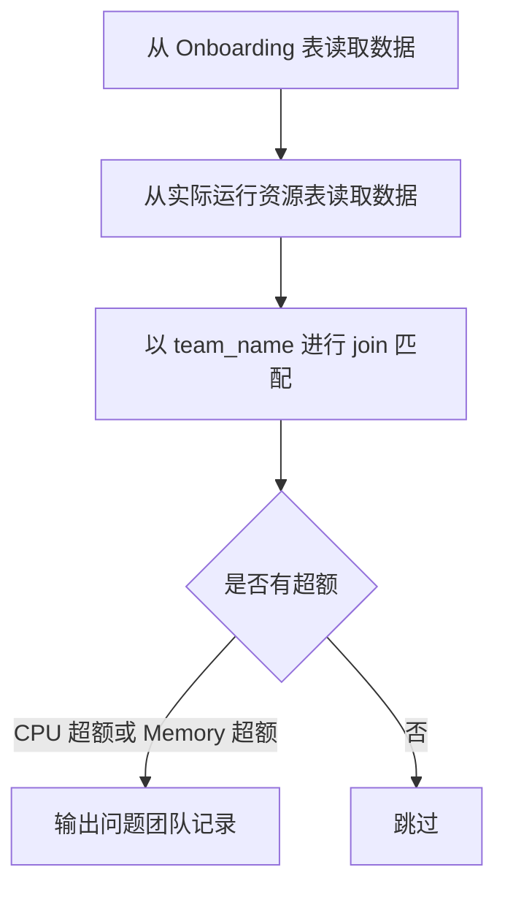

为了实现你要的逻辑，我们的目标是对比两张表（A 表为实际使用情况，B 表为 Onboarding 提交情况），对每一个团队的 count-cpu 和 count-memory 进行比较，只输出超出 任意一项资源 的团队记录。

🧠 分析目标：

表结构（示例）：

- 表 A（实际运行情况）：project.dataset.actual_resources

- team_name
- count_cpu
- count_memory

-
- 表 B（Onboarding 期望）：project.dataset.onboarding_resources

- team_name
- count_cpu
- count_memory

-

✅ SQL 核查逻辑：

我们只想输出有问题的数据，也就是：

当 onboarding.count_cpu > actual.count_cpu

或者 onboarding.count_memory > actual.count_memory

✅ 推荐 SQL 示例：
```sql
SELECT
o.team_name,
o.count_cpu AS onboarding_cpu,
a.count_cpu AS actual_cpu,
o.count_memory AS onboarding_memory,
a.count_memory AS actual_memory
FROM
`project.dataset.onboarding_resources` o
JOIN
`project.dataset.actual_resources` a
ON
o.team_name = a.team_name
WHERE
o.count_cpu > a.count_cpu
OR o.count_memory > a.count_memory
```
📋 说明：

|                |                              |
| -------------- | ---------------------------- |
| 字段           | 含义                         |
| o.count_cpu    | onboarding 所上报的 CPU 数量 |
| a.count_cpu    | 实际运行中该团队使用的 CPU   |
| o.count_memory | onboarding 所上报的内存数量  |
| a.count_memory | 实际运行中该团队使用的内存   |
| WHERE 条件     | 判断是否有任意一项超出       |

✅ 加强版（防止有团队只出现在一张表）

为了避免只出现在某一张表的数据被忽略（如 onboarding 有但实际运行没有），可以改用 FULL OUTER JOIN 或 LEFT JOIN 并处理 NULL 值：
```sql
SELECT

o.team_name,

o.count_cpu AS onboarding_cpu,

a.count_cpu AS actual_cpu,

o.count_memory AS onboarding_memory,

a.count_memory AS actual_memory

FROM

`project.dataset.onboarding_resources` o

LEFT JOIN

`project.dataset.actual_resources` a

ON

o.team_name = a.team_name

WHERE

a.team_name IS NULL  -- 实际运行中没有这支团队

OR o.count_cpu > IFNULL(a.count_cpu, 0)

OR o.count_memory > IFNULL(a.count_memory, 0)
```


✅ Mermaid 流程图（逻辑流程）


总结建议：

|                |                                                                                     |
| -------------- | ----------------------------------------------------------------------------------- |
| 检查点         | 建议                                                                                |
| Join 类型      | 如果确保每个 team 在 A/B 都有，可用 inner join，否则建议用 left join 并做 null 判断 |
| NULL 安全性    | IFNULL(actual.count_cpu, 0) 以防止实际表缺失                                        |
| 可读性与审计性 | 输出时带上两个表的值（onboarding vs actual）以利于分析                              |
| 可视化分析准备 | 建议将该 SQL 查询结果导入 Looker Studio                                             |

需要我协助你做成 Looker Studio 的数据源或者在 GCP 中封装成 View/Job 也可以继续告诉我。

非常好的问题，以下是围绕 是否建立 View、效率优化、以及 Python 查询接口设计 的详细分析和建议，全部以你在 GCP BigQuery 上的使用背景为前提进行。

✅ 是否建立 View 表？是否能提升效率？

📌 先说结论：

创建 View 本身不会提升 SQL 性能，但可以让查询更易维护、复用、避免重复复杂逻辑。

🔍 细节说明：

|              |                                                                                                                    |
| ------------ | ------------------------------------------------------------------------------------------------------------------ |
| 类型         | 说明                                                                                                               |
| View         | 是一个逻辑视图，本质是一个“预定义 SQL 查询语句的别名”                                                              |
| 性能影响     | BigQuery 会将 View 的 SQL 在执行时“内联（Inline）”，不缓存中间结果，所以性能与直接写原 SQL 类似                    |
| 适合的场景   | 当你有一段复杂的 Join/过滤/计算逻辑会被多次复用，可以放在 View 中作为基础表                                        |
| 不适合的场景 | 如果你希望缓存中间结果提升性能，应考虑 物化视图（Materialized View） 或定期生成表（使用 Scheduled Query 导入新表） |

✅ View 示例（核查 Onboarding 与实际使用差异）

可以创建如下 View，供后续 Python 查询使用：
```sql
CREATE OR REPLACE VIEW `project.dataset.v_team_resource_comparison` AS

SELECT

o.team_name,

o.api_name,

o.count_cpu AS onboarding_cpu,

a.count_cpu AS actual_cpu,

o.count_memory AS onboarding_memory,

a.count_memory AS actual_memory,

-- 差值方便后续可视化分析

(o.count_cpu - IFNULL(a.count_cpu, 0)) AS cpu_diff,

(o.count_memory - IFNULL(a.count_memory, 0)) AS memory_diff

FROM

`project.dataset.onboarding_resources` o

LEFT JOIN

`project.dataset.actual_resources` a

ON

o.team_name = a.team_name

AND o.api_name = a.api_name
```
✅ Python 查询接口设计（根据 team_name / api_name 查询）

你可以通过 google-cloud-bigquery Python 客户端对 View 执行参数化查询。

📦 示例代码
```python
from google.cloud import bigquery

def query_team_resources(team_name, api_name=None):

client = bigquery.Client()

query = """

SELECT

team_name,

api_name,

onboarding_cpu,

actual_cpu,

onboarding_memory,

actual_memory,

cpu_diff,

memory_diff

FROM

`project.dataset.v_team_resource_comparison`

WHERE

team_name = @team_name

"""

if api_name:

query += " AND api_name = @api_name"

job_config = bigquery.QueryJobConfig(

query_parameters=[

bigquery.ScalarQueryParameter("team_name", "STRING", team_name)

] + ([bigquery.ScalarQueryParameter("api_name", "STRING", api_name)] if api_name else [])

)

query_job = client.query(query, job_config=job_config)

results = query_job.result()

for row in results:

print(f"Team: {row.team_name}, API: {row.api_name}, CPU: {row.onboarding_cpu}/{row.actual_cpu}, Memory: {row.onboarding_memory}/{row.actual_memory}")
```
✅ 小结建议表格

|                          |                                              |
| ------------------------ | -------------------------------------------- |
| 建议事项                 | 推荐方式                                     |
| 多次复用查询逻辑         | ✅ 创建 View (v_team_resource_comparison)    |
| 提升性能（缓存中间结果） | ✅ 使用 Materialized View 或 Scheduled Table |
| Python 查询接口          | ✅ 使用参数化 SQL 查询，防止 SQL 注入        |
| 查询维度                 | 支持 team_name，可选支持 api_name            |

如果你希望我进一步帮你写出 Materialized View / Scheduled Query 实现，也可以告诉我你希望多久更新一次，以及字段结构。是否还需要导出 CSV 或串接 Looker Studio 可视化也都能一并处理
