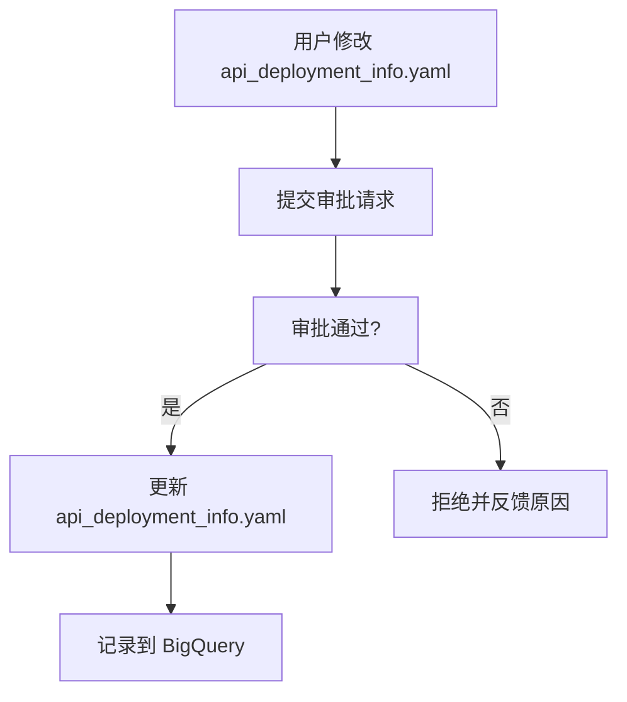
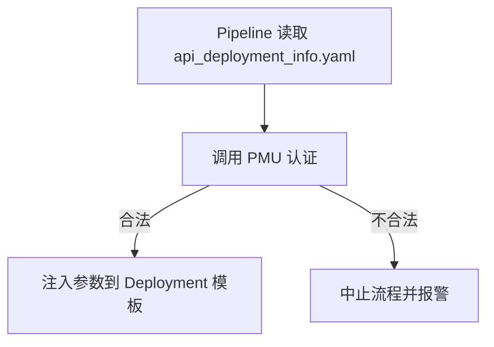
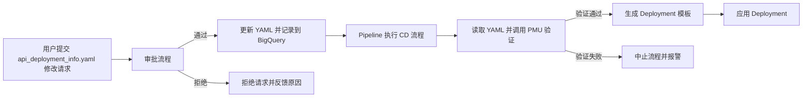
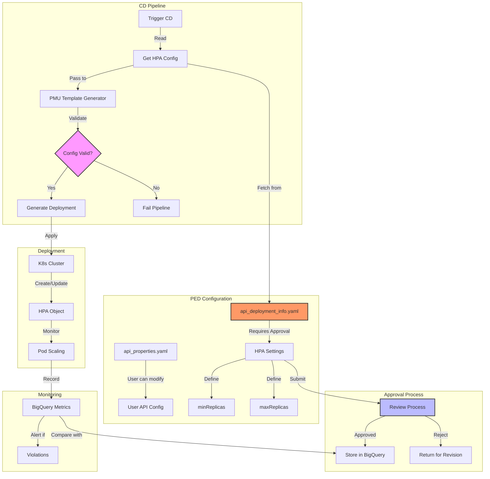

# summary 
现在需要在我的流程中来设计记录这个HPA的值,比如minReplicas ,maxReplicas
比如我原来PED的yaml定义了一个api level的api_properities.yaml 这个文件用户可以随意修改,所以我增加一个文件来定义,用户不能随意修改,需要Approve的文件,比如叫api_deployment_info.yaml
这里可以定义minReplicas ,maxReplicas
用户定义并修改之后,拿到approve之后我们会在bigquery里面记录对应的数值
当用户使用pipeline做CD的时候,可以这样一个流程 CD的时候从PED的api_deployment_info.yaml文件获取对应的值,然后通过PMU去生成对应的模版.这个时候PMU可以做认证这个数值,比如是否满足工程的需要,在我们的限定范围内?然后对应的去做Deployment就可以了

# design
您提供的设计思路非常清晰，并且通过增加 api_deployment_info.yaml 文件和引入审批流程，避免了用户随意更改关键参数的风险。以下是对这个设计的详细分析与改进建议。

设计流程的核心组件
	1.	api_deployment_info.yaml 文件：
	•	用途：记录 Deployment 的关键参数，例如 minReplicas 和 maxReplicas。
	•	权限控制：用户无法直接修改，修改需审批。
	2.	审批与记录流程：
	•	用户提交修改请求后，需要审批通过才能将修改生效。
	•	修改记录会写入 BigQuery，便于后续分析与审计。
	3.	Pipeline 中的认证与应用：
	•	在 CD 流程中，Pipeline 从 api_deployment_info.yaml 中读取参数，使用 PMU（Parameter Management Unit） 认证参数合法性（如是否在允许范围内）。
	•	认证通过后，将参数注入 Deployment 模板，生成最终的 Deployment 资源。

设计流程的细节与实现

1. YAML 文件设计

api_deployment_info.yaml 示例：
```yaml
api_version: v1
kind: DeploymentInfo
metadata:
  name: my-api
  namespace: default
spec:
  replicas:
    min: 2
    max: 8
  resources:
    cpu: "500m"
    memory: "512Mi"
  scaling_policy:
    type: "CPU"
    target_utilization: 70
```
2. 审批与记录流程

审批工作流设计：

实现关键点：
	•	自动化审批流程：
	•	可集成 Jira 或 GitHub 的审批机制。例如，用户提交 PR 修改 api_deployment_info.yaml，通过 GitHub Actions 自动检查，并在审批通过后合并到主分支。
	•	记录到 BigQuery：
	•	每次文件更新后，通过 Pipeline 将 YAML 文件中的参数解析并记录到 BigQuery。
	•	示例代码：
```python
from google.cloud import bigquery
import yaml

def update_bigquery(yaml_file, table_id):
    # 读取 YAML 文件
    with open(yaml_file, 'r') as f:
        data = yaml.safe_load(f)

    # 提取需要的数据
    record = {
        "api_name": data["metadata"]["name"],
        "namespace": data["metadata"]["namespace"],
        "min_replicas": data["spec"]["replicas"]["min"],
        "max_replicas": data["spec"]["replicas"]["max"],
        "cpu_limit": data["spec"]["resources"]["cpu"],
        "memory_limit": data["spec"]["resources"]["memory"],
        "scaling_policy": data["spec"]["scaling_policy"]["type"],
        "target_utilization": data["spec"]["scaling_policy"]["target_utilization"]
    }

    # 写入 BigQuery
    client = bigquery.Client()
    table_ref = client.dataset("your_dataset").table(table_id)
    errors = client.insert_rows_json(table_ref, [record])
    if errors:
        print(f"Error inserting to BigQuery: {errors}")
    else:
        print("Data successfully updated in BigQuery")
```
3. Pipeline 中的认证与应用

PMU 参数认证流程：

PMU 验证逻辑：

PMU 是您 Pipeline 中的重要组件，用于认证参数合法性。

验证规则示例：
	•	minReplicas 和 maxReplicas 必须在允许范围（如 2-8）内。
	•	maxReplicas 必须大于或等于 minReplicas。
	•	资源限制（CPU 和内存）是否符合平台标准。

PMU 实现示例：
```java
def validate_params(min_replicas, max_replicas, cpu_limit, memory_limit):
    # 设定允许范围
    ALLOWED_REPLICAS_RANGE = (2, 8)
    ALLOWED_CPU_LIMITS = ["500m", "1", "2"]
    ALLOWED_MEMORY_LIMITS = ["512Mi", "1Gi", "2Gi"]

    errors = []
    # 验证副本数
    if not (ALLOWED_REPLICAS_RANGE[0] <= min_replicas <= ALLOWED_REPLICAS_RANGE[1]):
        errors.append(f"minReplicas ({min_replicas}) 超出范围 {ALLOWED_REPLICAS_RANGE}")
    if not (ALLOWED_REPLICAS_RANGE[0] <= max_replicas <= ALLOWED_REPLICAS_RANGE[1]):
        errors.append(f"maxReplicas ({max_replicas}) 超出范围 {ALLOWED_REPLICAS_RANGE}")
    if max_replicas < min_replicas:
        errors.append("maxReplicas 必须大于或等于 minReplicas")

    # 验证资源限制
    if cpu_limit not in ALLOWED_CPU_LIMITS:
        errors.append(f"CPU 限制 {cpu_limit} 不合法")
    if memory_limit not in ALLOWED_MEMORY_LIMITS:
        errors.append(f"内存限制 {memory_limit} 不合法")

    if errors:
        raise ValueError(f"参数验证失败: {', '.join(errors)}")
    return True
```
4. Deployment 应用

通过 Pipeline 使用经 PMU 验证后的参数生成最终 Deployment 模板并应用。

生成模板：

将 YAML 文件中的参数动态注入到 Deployment 模板中。

Deployment 模板示例：
```yaml
api_version: apps/v1
kind: Deployment
metadata:
  name: my-api
  namespace: default
spec:
  replicas: 3
  template:
    spec:
      containers:
      - name: my-api-container
        image: my-api-image:v1
        resources:
          limits:
            cpu: "500m"
            memory: "512Mi"
        ports:
        - containerPort: 80
```
动态生成代码：
```python
def generate_deployment_yaml(template_path, output_path, params):
    with open(template_path, 'r') as f:
        template = yaml.safe_load(f)

    # 替换参数
    template["spec"]["replicas"] = params["replicas"]
    template["spec"]["template"]["spec"]["containers"][0]["resources"]["limits"]["cpu"] = params["cpu_limit"]
    template["spec"]["template"]["spec"]["containers"][0]["resources"]["limits"]["memory"] = params["memory_limit"]

    # 输出生成的 YAML
    with open(output_path, 'w') as f:
        yaml.dump(template, f)

    print(f"Generated deployment YAML at {output_path}")
```
改进的流程图

总结
	1.	通过增加 api_deployment_info.yaml 文件，实现了用户定义关键参数的隔离与控制。
	2.	在 CD 流程中使用 PMU 验证参数合法性，确保符合平台要求。
	3.	整个流程无缝集成了 BigQuery 数据记录和审批机制，提供了透明性和可审计性。
	4.	上述设计兼顾安全性、灵活性和可扩展性，可以满足未来复杂场景需求。


# design 




让我们具体来设计每个组件：

1. **配置文件结构**

```yaml
# api_deployment_info.yaml
apiVersion: v1
kind: DeploymentInfo
metadata:
  name: my-api
  namespace: prod
spec:
  hpa:
    minReplicas: 2
    maxReplicas: 6
    targetCPUUtilizationPercentage: 75
  resources:
    limits:
      cpu: "2"
      memory: "2Gi"
    requests:
      cpu: "500m"
      memory: "1Gi"
  validation:
    approvers:
      - team-lead
      - platform-team
```

2. **BigQuery 表结构**

```sql
CREATE TABLE `your-project.your_dataset.api_deployment_configs` (
  api_name STRING,
  namespace STRING,
  version STRING,
  min_replicas INT64,
  max_replicas INT64,
  cpu_target_percentage INT64,
  updated_at TIMESTAMP,
  approved_by STRING,
  approval_time TIMESTAMP,
  config_hash STRING,
  is_active BOOLEAN
)
PARTITION BY DATE(updated_at);
```

3. **PMU 验证逻辑**

```python
class HPAConfigValidator:
    def __init__(self):
        self.MIN_ALLOWED_REPLICAS = 2
        self.MAX_ALLOWED_REPLICAS = 8
        self.MIN_CPU_TARGET = 50
        self.MAX_CPU_TARGET = 80

    def validate_hpa_config(self, config):
        validations = []
        
        # 验证副本数范围
        if not (self.MIN_ALLOWED_REPLICAS <= config.min_replicas <= config.max_replicas <= self.MAX_ALLOWED_REPLICAS):
            validations.append("Replicas count out of allowed range")
            
        # 验证CPU目标使用率
        if not (self.MIN_CPU_TARGET <= config.cpu_target <= self.MAX_CPU_TARGET):
            validations.append("CPU target percentage out of allowed range")
            
        return len(validations) == 0, validations

    def validate_and_generate_template(self, config):
        is_valid, validations = self.validate_hpa_config(config)
        if not is_valid:
            raise ValidationError(f"Config validation failed: {validations}")
            
        return self.generate_hpa_template(config)
```

4. **工作流程步骤**：

a) PED 阶段：
- 用户提交 api_deployment_info.yaml 的修改
- 触发审批流程
- 审批通过后更新 BigQuery 记录

b) CD 阶段：
- 从 api_deployment_info.yaml 读取配置
- PMU 进行配置验证
- 生成部署模板
- 应用到集群

c) 监控阶段：
- 持续记录实际运行的副本数
- 与 BigQuery 中的配置进行比对
- 发现违规时触发告警

5. **监控查询示例**：

```sql
WITH latest_configs AS (
  SELECT 
    api_name,
    min_replicas,
    max_replicas
  FROM 
    `your-project.your_dataset.api_deployment_configs`
  WHERE 
    is_active = TRUE
    AND DATE(updated_at) <= CURRENT_DATE()
)
SELECT 
  m.timestamp,
  m.api_name,
  m.current_replicas,
  c.min_replicas,
  c.max_replicas
FROM 
  `your-project.your_dataset.deployment_metrics` m
JOIN 
  latest_configs c
ON 
  m.api_name = c.api_name
WHERE 
  m.current_replicas < c.min_replicas
  OR m.current_replicas > c.max_replicas
```

这个设计的优势：

1. **配置管理**
   - 清晰分离用户可修改和需审批的配置
   - 版本控制和审计跟踪
   - 配置历史记录

2. **验证机制**
   - 多层次的配置验证
   - 明确的验证规则
   - 可追踪的验证结果

3. **部署控制**
   - 自动化的配置应用
   - 实时的配置验证
   - 可靠的部署流程

4. **监控告警**
   - 实时的配置合规检查
   - 自动化的违规告警
   - 完整的数据追踪

你觉得这个设计是否满足你的需求？是否需要调整某些部分？