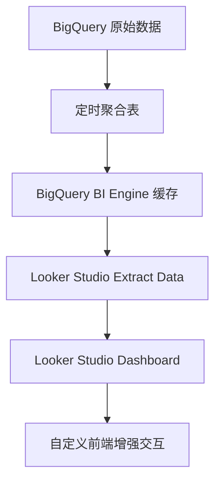
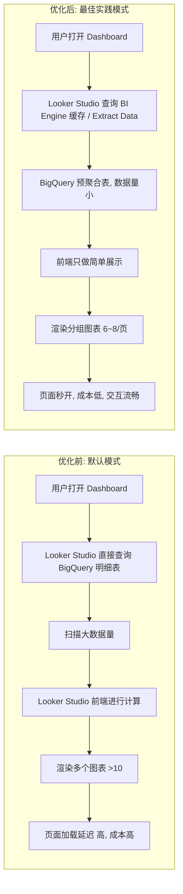

现在在 **Looker Studio (原 Data Studio)** 里，默认都是直接把 **BigQuery 当作数据源**，其实这会导致几个问题：

- **性能问题**：每次打开报表时都要去跑一次 SQL，数据量大时延迟明显。
    
- **前端交互限制**：Looker Studio 本身的可视化组件有限，复杂的交互效果（动态筛选、多层钻取）比较难做。
    
- **成本问题**：频繁查询 BigQuery，成本会增加。
    

  

如果你希望页面显示效果更好、前端交互更丝滑，可以从几个方向优化：

---

### **1. 数据源层优化（BigQuery → 缓存/汇总层）**

- **预聚合表**
    
    在 BigQuery 里提前跑 ETL，把数据汇总成宽表（比如每日维度的汇总、预计算的指标）。Looker Studio 只查小表，加载快很多。
    

```
CREATE OR REPLACE TABLE project.dataset.daily_summary AS
SELECT
  DATE(timestamp) AS date,
  user_id,
  COUNT(*) AS total_requests,
  SUM(response_time_ms) AS total_latency
FROM project.dataset.raw_logs
GROUP BY date, user_id;
```

-   
    
- **BI Engine 缓存**
    
    开启 BigQuery **BI Engine**，它能把常用查询的结果缓存到内存里，大幅降低 Looker Studio 页面加载延迟。
    
- **使用 BigQuery Scheduled Queries**
    
    把复杂计算定时落地成物化表，而不是实时计算。
    

---

### **2. Looker Studio 层优化**

- **字段计算前移**
    
    能在 BigQuery 里算的字段，不要在 Looker Studio 的 “Calculated Field” 里算。前端公式越少，渲染越快。
    
- **减少图表数量**
    
    一个页面里不要堆太多图表，每次都要发查询。拆分成多个 Tab 页会更快。
    
- **使用 Data Extracts**
    
    Looker Studio 提供 “Extract Data” 功能，可以把数据定期拉到缓存，避免每次都查 BigQuery。
    

---

### **3. 前端体验增强**

  

如果你觉得 Looker Studio 的前端交互还是太弱，可以考虑：

- **嵌入 Looker Studio + 自定义前端**
    
    你可以用一个 React/Vue 前端，把 Looker Studio 报表作为 iframe 嵌入，然后用前端逻辑加交互控件（例如多级筛选、联动过滤）。
    
- **Looker Studio Connector + 自建前端**
    
    通过 Looker Studio 的 Data Connector 或 BigQuery API，把数据拿到前端，再用 D3.js / Apache ECharts / Recharts 做更高级的可视化。
    
- **与 Dataform / dbt + Looker 结合**
    
    如果你的团队更专业，可以考虑用 dbt 或 Dataform 做数据建模，再接入 Looker (非 Looker Studio)，Looker 的交互和 Dashboard 能力比 Looker Studio 强很多。
    

---

### **4. 推荐的优化架构流程**



---

### **总结**

- **快速提升** → BigQuery 聚合表 + BI Engine + Extract Data。
    
- **体验提升** → 减少前端计算、减少图表数量。
    
- **高阶玩法** → 嵌入 Looker Studio 到自定义前端，或者直接用 ECharts/React Dashboard。
    

---

要不要我帮你整理一份 **“Looker Studio Dashboard 优化清单”**（像一个 checklist），你就能逐项对照优化？


好的 👍 我帮你整理了一份 **Looker Studio Dashboard 优化清单**，你可以直接拷贝到你的团队文档里使用。

---

## **📋 Looker Studio Dashboard 优化清单**

  

### **1. 数据层优化（BigQuery）**

- **使用预聚合表**
    
    - 把明细表加工成日/周/月的汇总表。
        
    - 避免每次在 Looker Studio 动态计算复杂聚合。
        
    
- **定时物化查询 (Scheduled Queries)**
    
    - 把复杂 SQL 预计算成物化表。
        
    - 避免重复计算，减少查询开销。
        
    
- **启用 BigQuery BI Engine**
    
    - 提升查询速度（内存加速），特别适合常用报表。
        
    
- **减少扫描数据量**
    
    - 选择需要的字段，不要 SELECT *。
        
    - 利用分区表 + 集群表优化查询。
        
    

---

### **2. Looker Studio 配置优化**

- **减少图表数量**
    
    - 每个页面不超过 6~8 个图表。
        
    - 复杂报表分成多个 Tab 页。
        
    
- **字段计算前移**
    
    - 尽量在 BigQuery SQL 中完成计算。
        
    - 避免在 Looker Studio 的 Calculated Fields 里做大规模计算。
        
    
- **使用 Extract Data 缓存**
    
    - 对静态或更新频率低的数据源，使用 Extract Data。
        
    - 提高加载速度，减少 BigQuery 查询成本。
        
    
- **优化筛选器**
    
    - 避免使用全局 Filter，改用图表级 Filter。
        
    - 筛选字段应是 BigQuery 表的索引字段（分区列/集群列）。
        
    

---

### **3. 前端体验优化**

- **简化交互逻辑**
    
    - 避免过多的嵌套筛选器。
        
    - 筛选器尽量用下拉选择（Dropdown）而不是搜索框。
        
    
- **合并相似图表**
    
    - 多个指标可以放到一个图表里（多序列折线/柱状图）。
        
    - 减少图表总数，提高渲染速度。
        
    
- **分组展示**
    
    - 使用 Tab 控件、切换按钮，让页面更清晰。
        
    

---

### **4. 高阶优化（可选）**

- **自定义前端**
    
    - 用 React/Vue 搭建前端，把 Looker Studio 报表作为 iframe 嵌入。
        
    - 在前端实现更复杂的筛选和联动效果。
        
    
- **使用 D3.js / Apache ECharts / Recharts**
    
    - 对于高级交互图表，直接通过 BigQuery API 拉数据，自建可视化。
        
    
- **结合 Dataform/dbt + Looker (非 Looker Studio)**
    
    - 做更专业的数据建模 + 权限管理。
        
    - 适合团队规模大、数据分析需求复杂的情况。
        
    

---

### **✅ 最佳实践流程**

```
graph TD;
    A[BigQuery 原始表] --> B[预聚合/物化表]
    B --> C[BigQuery BI Engine 缓存]
    C --> D[Looker Studio Extract Data]
    D --> E[优化过的 Dashboard]
    E --> F[嵌入到自定义前端(React/Vue/ECharts)]
```

---

要不要我帮你基于这个 **清单**，输出一个 **对比表格**（优化前 vs 优化后效果），方便你在团队分享时展示效果？


好的 👍 我帮你整理了一份 **优化前 vs 优化后对比表**，这样你在团队内部分享时更直观。

---

## **📊 Looker Studio Dashboard 优化对比表**

|**优化维度**|**优化前（默认方式）**|**优化后（最佳实践）**|
|---|---|---|
|**数据源**|直接查询 BigQuery 明细表，数据量大，查询慢|使用预聚合表、物化表，减少扫描数据量|
|**计算逻辑**|大量计算放在 Looker Studio Calculated Fields，前端渲染慢|把计算前移到 BigQuery SQL，Looker Studio 只做展示|
|**查询性能**|每次打开报表都全量查询 BigQuery|启用 BigQuery BI Engine 缓存，响应加快数倍|
|**成本**|重复查询导致 BigQuery 扫描费用高|预聚合 + Extract Data 缓存，显著降低查询成本|
|**图表数量**|单页过多图表 (>10)，加载慢，交互卡顿|每页 6~8 个图表，Tab 分组展示，交互流畅|
|**筛选器**|使用全局 Filter，查询范围大，慢|使用图表级 Filter，并绑定分区/索引列，查询快|
|**前端体验**|默认 Looker Studio 控件，交互有限|自定义前端嵌入（React/Vue），支持更多交互与动画|
|**数据更新**|实时查 BigQuery，延迟取决于查询|定时调度物化表 + Extract Data，保证快速刷新|
|**可扩展性**|难以满足复杂交互或多租户场景|可扩展到 D3.js/ECharts/Looker（非 Studio）做更复杂展示|

---

### **📝 小结**

- **基础优化** → 预聚合表 + BI Engine + Extract Data（提升性能 & 降低成本）
    
- **前端优化** → 拆分页面 + 减少图表 + 图表级筛选器（提升交互体验）
    
- **高阶优化** → 嵌入自定义前端 + 使用 D3.js/ECharts（满足复杂需求）
    

---

要不要我再帮你画一个 **“优化效果对比流程图”**，展示从用户点开 Dashboard 到最终渲染的优化前后差异？


好的 👍 我帮你画一个 **优化效果对比流程图**，清晰展示用户打开 Looker Studio Dashboard 时 **优化前 vs 优化后** 的差异。

---

### **⚡ Dashboard 加载流程对比**



---

### **📝 总结对比**

- **优化前**：大表扫描 + 前端计算 + 图表过多 → 加载慢、卡顿、费用高。
    
- **优化后**：预聚合 + 缓存 + 图表拆分 → 秒开体验、交互顺畅、费用降低。
    

---

要不要我再帮你整理一份 **团队实施优化的分阶段路线图**（比如：短期 Quick Win、中期优化、长期演进），这样你在推动落地时会更有条理？