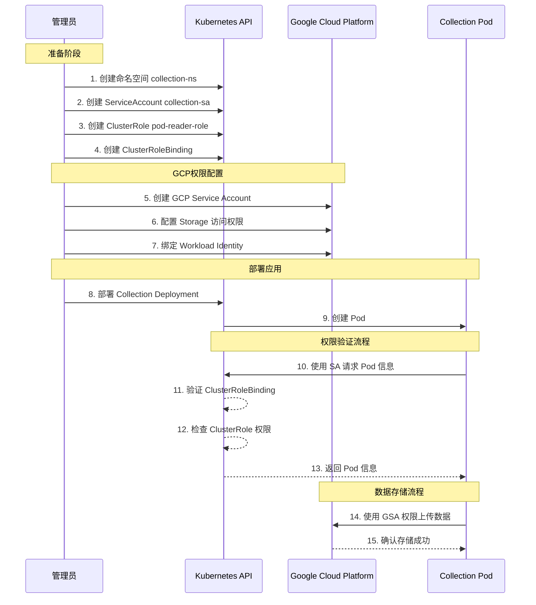
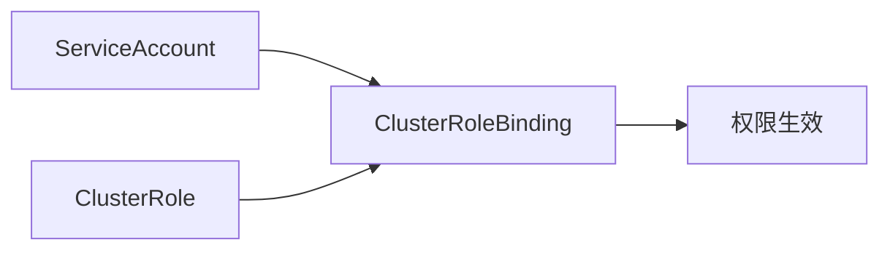

# Summary 
This document describes the architecture design of the project.

我有这样一个需求:
 GKE环境里面默认禁止了所有访问.但是我想要在某个namespace里面部署一个比如叫collection的Deployment其是用Python开发的
 比如叫app.py 下面是这个app.py的内容大概需求
1. 导入所需的库和模块。
2. 设置日志记录器,以便跟踪执行过程中的日志信息。
3. 定义一个函数 `time_format`,用于格式化时间戳。
4. 定义一个函数 `api_name_filter`,根据 Kubernetes Pod 的名称,提取出相关的 API 名称、版本信息等。
5. 定义一个主要函数 `create_request_to_push`,用于从 Kubernetes 集群获取所有 Pod 的信息,过滤出需要的数据,并将结构化的数据以 JSON 格式上传到 Google Cloud Storage 存储桶中。
6. 定义一个函数 `create_job`,用于启动一个调度器,每 15 分钟执行一次 `create_request_to_push` 函数。
7. 在脚本的主入口点,调用 `create_job` 函数,启动调度器。 

我的核心关注在这里
根据 Kubernetes Pod 的名称,提取出相关的 API 名称、版本信息等
那么我需要这样的cluster role 怎么给这个Role赋权对应的GKE SA 
- ClusterRole : 定义了可以对哪些资源执行哪些操作的权限规则集合
- ClusterRoleBinding : 将 ClusterRole 中定义的权限赋予特定的用户、组或 ServiceAccount
GKE SA绑定的GCE SA 需要对应的权限 
我现在关心这些Role和SA的权限等 
等等这些Role的配置信息
帮我规划这些信息, 我就想这个Python的Pod能去收集整个环境的一些对应的信息.还要确保我的这个Cluster Role 不要影响原来的逻辑 这个Role就是单独给这个APP用的
我来帮你规划权限和配置信息。

用序列图来展示整个权限配置和应用部署的流程：


流程说明：
1. **准备阶段**：创建必要的 Kubernetes 资源
2. **GCP配置阶段**：设置云存储访问权限
3. **部署阶段**：部署应用并启动 Pod
4. **运行时权限验证**：展示 Pod 如何使用配置的权限
5. **数据处理**：展示数据收集和存储流程

这个序列图清晰地展示了各个组件之间的交互关系和权限流转过程。需要更详细的说明吗？

1. 首先创建专用的 ServiceAccount：

```yaml:/Users/lex/git/knowledge/k8s/collection-sa.yaml
apiVersion: v1
kind: ServiceAccount
metadata:
  name: collection-sa
  namespace: collection-ns
```

2. 创建最小权限的 ClusterRole：

```yaml:/Users/lex/git/knowledge/k8s/collection-role.yaml
apiVersion: rbac.authorization.k8s.io/v1
kind: ClusterRole
metadata:
  name: pod-reader-role
rules:
- apiGroups: [""]
  resources: ["pods"]
  verbs: ["get", "list", "watch"]
- apiGroups: ["apps"]
  resources: ["deployments"]
  verbs: ["get", "list", "watch"]
```

3. 创建 ClusterRoleBinding：

```yaml:/Users/lex/git/knowledge/k8s/collection-rolebinding.yaml
apiVersion: rbac.authorization.k8s.io/v1
kind: ClusterRoleBinding
metadata:
  name: collection-pod-reader
subjects:
- kind: ServiceAccount
  name: collection-sa
  namespace: collection-ns
roleRef:
  kind: ClusterRole
  name: pod-reader-role
  apiGroup: rbac.authorization.k8s.io
```

4. 创建 Deployment 配置：

```yaml:/Users/lex/git/knowledge/k8s/collection-deployment.yaml
apiVersion: apps/v1
kind: Deployment
metadata:
  name: collection
  namespace: collection-ns
spec:
  replicas: 1
  selector:
    matchLabels:
      app: collection
  template:
    metadata:
      labels:
        app: collection
    spec:
      serviceAccountName: collection-sa
      containers:
      - name: collection
        image: your-python-app-image
        resources:
          requests:
            memory: "64Mi"
            cpu: "100m"
          limits:
            memory: "128Mi"
            cpu: "200m"
```

5. 配置 GCP IAM 权限：

```bash
# 创建 GCP Service Account
gcloud iam service-accounts create collection-gsa \
    --display-name="Collection App GSA"

# 授予 Storage 权限
gcloud projects add-iam-policy-binding YOUR_PROJECT_ID \
    --member="serviceAccount:collection-gsa@YOUR_PROJECT_ID.iam.gserviceaccount.com" \
    --role="roles/storage.objectCreator"

# 绑定 GKE ServiceAccount 和 GCP ServiceAccount
gcloud iam service-accounts add-iam-policy-binding \
    collection-gsa@YOUR_PROJECT_ID.iam.gserviceaccount.com \
    --role roles/iam.workloadIdentityUser \
    --member "serviceAccount:YOUR_PROJECT_ID.svc.id.goog[collection-ns/collection-sa]"
```

权限说明：
1. Kubernetes 权限：
   - 只能读取 pods 和 deployments 信息
   - 范围限制在只读操作（get、list、watch）
   - 通过专用的 ServiceAccount 隔离权限

2. GCP 权限：
   - 只有创建存储对象的权限
   - 使用工作负载身份实现最小权限原则

使用步骤：
1. 创建命名空间：
```bash
kubectl create namespace collection-ns
```

2. 应用配置：
```bash
kubectl apply -f collection-sa.yaml
kubectl apply -f collection-role.yaml
kubectl apply -f collection-rolebinding.yaml
kubectl apply -f collection-deployment.yaml
```

这样配置的好处是：
1. 权限最小化：只给必要的读取权限
2. 范围隔离：专用的 ServiceAccount 和命名空间
3. 安全性：不影响其他服务的权限配置
4. 可维护性：配置文件分离，便于管理


让我来解释 ClusterRole 和 ClusterRoleBinding 之间的关系：
- [role-binding.md](../k8s/role.md)
## ClusterRole 与 ClusterRoleBinding 的关系

### 1. 基本概念
- **ClusterRole**: 定义了可以对哪些资源执行哪些操作的权限规则集合
- **ClusterRoleBinding**: 将 ClusterRole 中定义的权限赋予特定的用户、组或 ServiceAccount

### 2. 工作原理


### 3. 具体关系
1. **权限定义**
   - ClusterRole 定义权限规则
   - 例如：允许读取所有 Pod 信息
   ```yaml
   rules:
   - apiGroups: [""]
     resources: ["pods"]
     verbs: ["get", "list", "watch"]
   ```

2. **权限绑定**
   - ClusterRoleBinding 将权限与使用者关联
   - 指定谁（subjects）可以使用这些权限
   - 指向具体的 ClusterRole（roleRef）

### 4. 实际应用举例
以收集程序为例：
1. ClusterRole `pod-reader-role` 定义了读取 Pod 的权限
2. ClusterRoleBinding `collection-pod-reader` 将这些权限赋予 `collection-sa` 这个 ServiceAccount
3. 最终使得运行在 `collection-sa` 下的 Pod 可以读取集群中的 Pod 信息

这种分离设计的好处是：
1. 权限复用：同一个 ClusterRole 可以被多个 ClusterRoleBinding 引用
2. 职责分离：权限定义和权限分配分开管理
3. 更好的可维护性：修改权限只需要改 ClusterRole，所有使用该角色的绑定都会自动更新

需要更具体的示例吗？


# Architecture
The architecture of the project is shown in the following diagram: