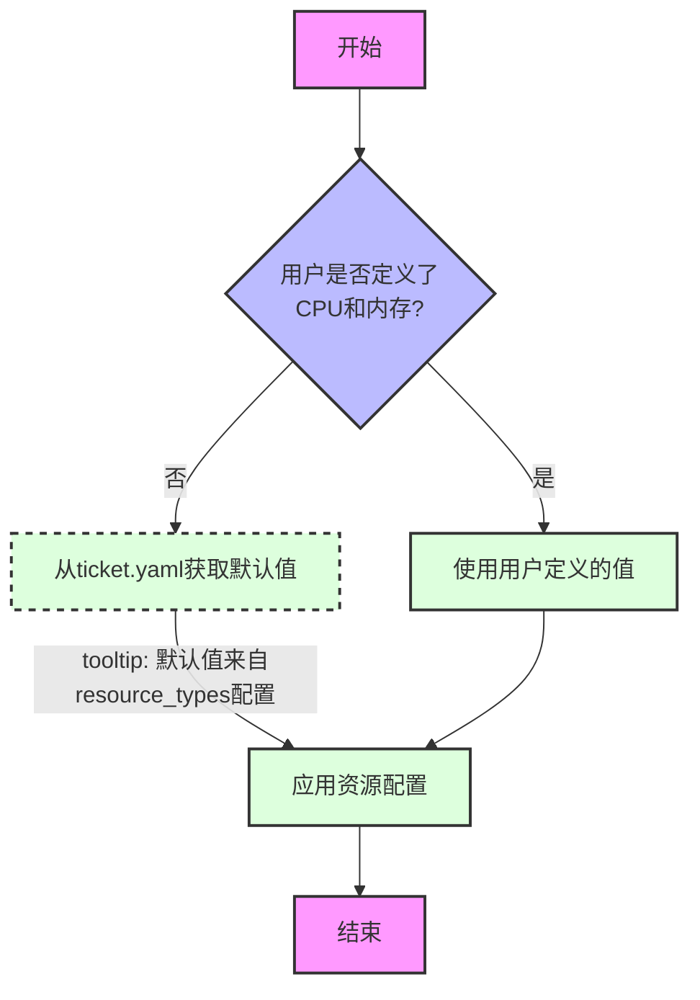

1024 + 512 = 1536

为你的 `ticket.yaml` 文件增加内存和 CPU 的定义，有几种方式，选择哪种取决于你未来对这些信息的细致程度和扩展性要求。以下提供几种建议，从简单到复杂：

**优点：**

*   简单易懂，直接明了。
*   易于阅读和编写。

**缺点：**

*   不够灵活，如果需要更精细的控制（例如，CPU 的型号，内存的类型），则无法满足。
*   解析时可能需要额外的处理来提取数值和单位。

**方案二：结构化表示型 (推荐用于稍微复杂的需求)**

使用字典来表示 `cpu` 和 `memory`，可以更清晰地表达单位。

```yaml
ticket_info:
  region_uk:
    AIBNAGDM-1000:
      apis_quota: 1
      cpu:
        cores: 2
      memory:
        size: 4
        unit: GB
    AIBNAGDM-1002:
      apis_quota: 4
      cpu:
        cores: 4
      memory:
        size: 8
        unit: GB
```

或者如下
      cpu:
        value: 1000
        unit: m
      memory:
        value: 3072
        unit: Mi


**优点：**

*   更结构化，明确了单位。
*   方便程序解析和处理。
*   为未来扩展提供了可能性（例如，可以添加 CPU 的架构等信息）。


**一些额外的建议：**

*   **统一单位：**  在整个 YAML 文件中保持单位的一致性，例如都使用 "GB" 或 "GiB" 表示内存大小。
*   **添加注释：**  如果某些字段的含义不明确，可以添加注释进行解释。
*   **考虑实际使用场景：**  根据你的实际使用场景和未来可能的扩展需求来选择最合适的方案。
*   

有一个问题需要获取历史数据来补充进去?
历史数据的获取关于HPA的使用,用那个值比较合适.就是用实际获取的就行了

2.0 if User (define cpu && memory value) then use it, else use default value from ticket.yaml


#  ob value 
我有这样一个问题,我想通过Jira的Tickets来收集一些用户Jira里面记录的CPU和内存的信息,然后我有对应的pipeline来收集这个Key对应的Value.然后对应回填到我的一个Yaml文件里面.
可能的值如下. 我需要权衡让用户方便填写这个值,还要我方便统计
我们提供的一般都是CPU单位是个数,其实也就是1000m = 1个
内存比如是512Mi = 0.5G 1024=1 G这样.
或者如下
```yaml
      cpu:
        value: 1000
        unit: m
      memory:
        value: 3072
        unit: Mi
```
我现在有这样2个自定义的Key 一个是executive Summary 
一个是L1/L2 Control
那么帮我评估用那个更好一些,还有就是如何定义这个value
比如值为
cpu:1000m|memeory:3072Mi

## Claude
让我帮你分析这个通过 Jira Tickets 收集资源配置信息的需求。

### 核心需求分析

1. **数据收集**
   - 从 Jira Tickets 中收集 CPU 和内存配置信息
   - 需要用户在 Ticket 中填写这些信息
   - 需要确保数据格式统一且易于解析

2. **数据格式设计**
   建议采用以下两种方案之一：

   方案一：简单字符串格式
   ```plaintext
   cpu:1000m,memory:3072Mi
   ```

   方案二：结构化格式
   ```yaml
   resources:
     cpu: 1000m
     memory: 3072Mi
   ```

3. **Jira 字段设计**
   - 可以使用自定义字段
   - 建议使用单独的字段，而不是混在描述中
   - 可以添加字段验证规则

4. **Pipeline 处理流程**
   ```mermaid
   graph LR
   A[Jira Ticket] --> B[读取字段值]
   B --> C[解析数据]
   C --> D[生成YAML]
   D --> E[更新配置文件]
   ```

### 建议实施方案

1. **在 Jira 中创建自定义字段**
   - 字段名：`Resource Requirements`
   - 字段类型：文本字段或结构化字段
   - 添加字段说明和示例

2. **定义标准格式**
   - 使用固定的单位（CPU: m, 内存: Mi）
   - 提供清晰的填写指南
   - 设置数据验证规则

3. **自动化处理**
   - 编写 Pipeline 脚本定期检查 Tickets
   - 解析字段内容并验证格式
   - 生成或更新 YAML 配置文件

需要我详细说明某个具体部分吗？

## chatgtp 
为了在 Jira Tickets 中收集 CPU 和内存的信息，并方便用户填写与后续统计，建议从以下几个角度评估和定义字段值：

1. 字段选择：Executive Summary vs. L1/L2 Control
	•	Executive Summary
	•	优点：通常是更高层级的总结字段，用户更容易注意到。如果只有少量字段需要填写，使用 Executive Summary 是合适的。
	•	缺点：它可能不是专门为这种格式化数据设计的，容易让信息显得零散或不够明确。
	•	L1/L2 Control
	•	优点：专注于特定用途，可以单独创建清晰的数据块。例如专门收集资源配额数据。更适合让用户输入结构化的内容（如 CPU 和内存）。
	•	缺点：需要清晰的指引，否则可能对用户不够直观。

建议：使用 L1/L2 Control，因为它适合作为专门的字段来定义结构化输入内容（如 CPU 和内存），减少信息冗余。

2. 数据格式定义

建议的格式应该既能让用户方便填写，又易于后续 Pipeline 解析和统计。考虑以下选项：

方案 1：紧凑键值对格式

示例：

cpu:1000m|memory:3072Mi

	•	优点：
	•	用户填写方便，仅需按提示填入值。
	•	解析简单，| 分隔符适合用正则表达式提取字段。
	•	缺点：
	•	对于不熟悉格式的用户，可能需要额外说明。

方案 2：嵌套 YAML 样式

示例：
```yaml
resources:
  cpu:
    value: 1000
    unit: m
  memory:
    value: 3072
    unit: Mi
```

	•	优点：
	•	结构化且清晰，方便后续扩展其他字段。
	•	更容易适配 YAML 文件内容填充。
	•	缺点：
	•	用户填写成本略高，不够直观，需要参考示例。

方案 3：简化键值对格式（推荐）

示例：

cpu:1000,memory:3072

	•	优点：
	•	用户只需填写数字，单位可以在代码解析时自动补充。
	•	既简洁又直观，减少用户填写错误的可能性。
	•	缺点：
	•	不支持动态单位（但多数情况下 CPU 和内存单位是固定的，问题不大）。

3. 推荐方案

结合用户填写便利性和 Pipeline 的可解析性，推荐以下设计：
	1.	使用 L1/L2 Control 字段，专门收集结构化资源数据，避免混乱。
	2.	定义格式：cpu:1000,memory:3072
	•	用户填写指引：
	•	CPU 填写为毫核数值，例如 1000（表示 1 个核）。
	•	内存填写为 MiB，例如 3072（表示 3GB）。
	•	在 Pipeline 处理时，自动补充单位 m 和 Mi。

4. 示例 Pipeline YAML 模版

假设用户在 Jira Ticket 填写如下值：

cpu:1000,memory:3072

Pipeline 填充后的 YAML 文件示例如下：
```yaml
resources:
  limits:
    cpu: 1000m
    memory: 3072Mi
  requests:
    cpu: 500m
    memory: 1024Mi
```
	注意：这里 limits 和 requests 可根据需求分别设置，cpu 和 memory 的值来自 Jira 字段自动填充，单位由 Pipeline 补充。

5. 统计和解析建议
	1.	正则表达式解析格式：
对于推荐的键值对格式 cpu:1000,memory:3072，可用以下正则提取：

cpu:(\d+),memory:(\d+)


	2.	统计输出示例（Markdown 表格格式）：
| Ticket ID   | CPU (m) | Memory (Mi) |
| ----------- | ------- | ----------- |
| Ticket ID   | CPU (m) | Memory (Mi) |
| TICKET-1234 | 1000    | 3072        |
| TICKET-5678 | 2000    | 4096        |

这种表格形式便于展示和汇总，适合在后续分析中使用。

你觉得这种格式是否满足需求？或者是否有其他具体的需求点需要调整？

## gemini
你提出的问题核心是如何在 Jira Ticket 中收集 CPU 和内存信息，并将其方便地转化为 YAML 文件格式。你需要权衡用户填写的便利性和你后续数据处理的便捷性。

让我们来分析你提出的两种方案，并探讨更优的方案和具体实施建议。

**方案一 (用户输入的字符串格式):**

```
cpu:1000m|memory:3072Mi
```

**优点:**

* **简洁:**  所有信息集中在一个字段，用户可能觉得填写更快速。

**缺点:**

* **不易解析:**  你的 pipeline 需要解析这个字符串，分割 `|`，再分割 `:`，比较繁琐，容易出错。
* **用户容易出错:**  用户容易写错 key (比如 `memeory`)，单位 (比如 `M` 而不是 `Mi`)，格式也容易出错 (缺少 `:` 或 `|`)。
* **Jira 字段类型不匹配:** 你可能需要使用文本字段来存储这个字符串，Jira 无法对其中的 CPU 和内存值进行类型检查和校验，数据质量难以保证。
* **扩展性差:** 如果未来需要添加更多资源类型 (比如 GPU, 磁盘等)，这个字符串会变得更复杂，解析和维护难度增加。

**方案二 (结构化的字段):**

```yaml
      cpu:
        value: 1000
        unit: m
      memory:
        value: 3072
        unit: Mi
```

**优点:**

* **结构化清晰:** 数据结构清晰，易于理解和维护。
* **易于解析:** 你的 pipeline 可以直接解析这个结构，不需要复杂的字符串处理。
* **数据质量高:** 可以使用 Jira 的不同字段类型来分别收集 `value` 和 `unit`，可以利用 Jira 的字段属性 (例如，数字字段限制输入数字，下拉列表选择单位) 来提高数据质量，减少用户错误。
* **扩展性好:**  未来添加新的资源类型，只需要添加新的 key-value 对，结构保持一致，扩展性好。
* **用户体验可能更好 (如果字段设计合理):**  虽然字段数量看起来多了，但如果字段标签和说明清晰，配合 Jira 的字段类型 (例如下拉选择单位)，用户填写可能更不容易出错，更清晰明确。

**评估结论:**

**方案二 (结构化的字段) 明显优于方案一。** 虽然方案一看起来简洁，但实际上牺牲了数据质量、解析效率和扩展性，长期来看会增加维护成本和出错风险。方案二更符合数据收集和处理的最佳实践，也更易于维护和扩展。

**具体实施建议 (基于方案二):**

**1. Jira 自定义字段设计:**

你需要为 "Executive Summary" 和 "L1/L2 Control" 这两个自定义 Key 分别创建结构化的字段。建议使用以下 Jira 自定义字段类型：

* **Executive Summary - CPU Value:**  类型: **数字字段 (Number Field)** (允许整数或小数，根据你的需求选择)  标签: `Executive Summary - CPU Value`  描述/帮助文本:  `请输入 Executive Summary 所需的 CPU 数量 (单位: m)`
* **Executive Summary - CPU Unit:** 类型: **选择列表 (Select List)** 或 **单选按钮 (Radio Buttons)**  标签: `Executive Summary - CPU Unit`  选项: `m`, `cores`  默认值: `m`  描述/帮助文本: `请选择 Executive Summary 所需 CPU 的单位`
* **Executive Summary - Memory Value:** 类型: **数字字段 (Number Field)** (允许整数或小数，根据你的需求选择)  标签: `Executive Summary - Memory Value`  描述/帮助文本: `请输入 Executive Summary 所需的内存大小 (单位: Mi)`
* **Executive Summary - Memory Unit:** 类型: **选择列表 (Select List)** 或 **单选按钮 (Radio Buttons)**  标签: `Executive Summary - Memory Unit`  选项: `Mi`, `Gi`, `G` (根据你的实际使用单位添加) 默认值: `Mi` 描述/帮助文本: `请选择 Executive Summary 所需内存的单位`

对于 "L1/L2 Control" 也重复上述步骤，创建类似的字段，只需要将标签中的 "Executive Summary" 替换为 "L1/L2 Control"。

**字段命名建议:**

使用清晰且一致的字段命名，例如 `<Key> - <Resource Type> <Property>`， 这样更容易识别字段所属的 Key 和资源类型。

**字段描述/帮助文本:**

为每个字段添加清晰的描述或帮助文本，指导用户正确填写，并说明单位的含义，例如 `1000m = 1个CPU核`, `1024Mi = 1G`。

**字段的必填性:**

根据你的需求，设置字段的必填性。如果 CPU 和内存信息是必不可少的，建议将 Value 字段设置为必填。

**2. Pipeline 数据处理:**

你的 pipeline 需要从 Jira API 中获取 Ticket 信息，并解析这些结构化的字段。

* **Jira API 获取数据:** 使用 Jira API (例如 REST API 或 Python 的 `jira` 库) 获取 Jira Ticket 的 JSON 数据。
* **解析字段:**  根据你定义的字段名称，从 JSON 数据中提取对应的值。例如，对于 "Executive Summary - CPU Value"，你可以通过字段 ID 或字段名来获取其值。
* **构建 YAML 结构:**  将提取到的值构建成 YAML 文件所需的结构。

**Python 代码示例 (简化版，仅供参考):**

```python
import yaml
from jira import Jira

# ... Jira 连接配置 ...
jira_options = {'server': 'your_jira_server'}
jira = Jira(options=jira_options, basic_auth=('your_username', 'your_password'))

issue_key = 'YOUR-JIRA-TICKET-KEY'
issue = jira.issue(issue_key)

# 假设你的自定义字段 ID 是 'customfield_xxxx' (你需要查找实际的 ID)
# 或者你可以使用字段名称 (取决于你如何配置 Jira)
executive_cpu_value = issue.fields.customfield_executive_cpu_value  # 假设字段名是这个
executive_cpu_unit = issue.fields.customfield_executive_cpu_unit
executive_memory_value = issue.fields.customfield_executive_memory_value
executive_memory_unit = issue.fields.customfield_executive_memory_unit

l1l2_cpu_value = issue.fields.customfield_l1l2_cpu_value
l1l2_cpu_unit = issue.fields.customfield_l1l2_cpu_unit
l1l2_memory_value = issue.fields.customfield_l1l2_memory_value
l1l2_memory_unit = issue.fields.customfield_l1l2_memory_unit


yaml_data = {
    'executive_summary': {
        'cpu': {
            'value': executive_cpu_value,
            'unit': executive_cpu_unit
        },
        'memory': {
            'value': executive_memory_value,
            'unit': executive_memory_unit
        }
    },
    'l1l2_control': {
        'cpu': {
            'value': l1l2_cpu_value,
            'unit': l1l2_cpu_unit
        },
        'memory': {
            'value': l1l2_memory_value,
            'unit': l1l2_memory_unit
        }
    }
}

# 将 YAML 数据写入文件
with open('output.yaml', 'w') as outfile:
    yaml.dump(yaml_data, outfile, indent=2)

print("YAML 文件已生成: output.yaml")
```

**3. 用户培训和文档:**

为用户提供清晰的文档和培训，告知他们如何在 Jira Ticket 中填写 CPU 和内存信息，并解释单位的含义。

**总结:**

采用结构化的 Jira 自定义字段方案，配合清晰的字段设计、描述和 pipeline 处理，能够更好地收集和处理 Jira Ticket 中的 CPU 和内存信息，既保证了数据质量，又方便了后续的自动化流程。虽然看起来字段数量多了，但从长远来看， это是更可维护、更可靠的方案。