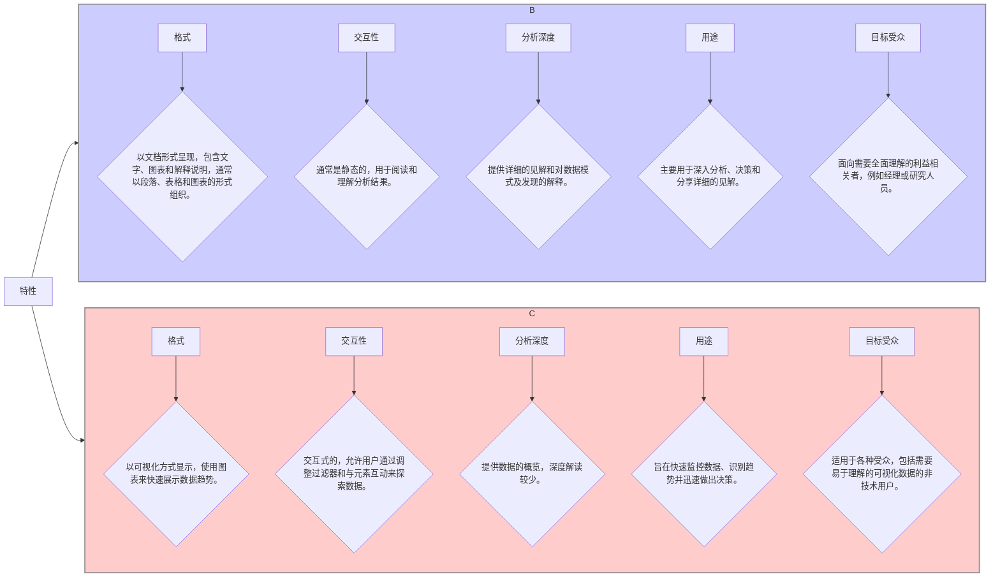

| Feature | Reports | Dashboards |
| ---- | ---- | ---- |
| Format | Documents with text, visuals, explanations, often in paragraphs, tables, and charts. | Visual displays with graphs and charts that show data trends at a glance. |
| Interactivity | Usually static, meant for reading and understanding the analysis. | Interactive, allowing users to explore data by adjusting filters and interacting with elements. |
| Depth of Analysis | Offer detailed insights and explanations behind data patterns and findings. | Provide a high-level overview of data, with less in-depth commentary. |
| Purpose | Primarily used for in-depth analysis, decision-making, and sharing detailed insights. | Aimed at quick data monitoring, identifying trends, and making swift decisions. |
| Target Audience | Targeted at stakeholders who need a comprehensive understanding, like managers or researchers. | Suited for various audiences, including non-technical users who need easy-to-understand visuals. | 

| 特性 | 报告 | 仪表盘 |
| ---- | ---- | ---- |
| 格式 | 带有文本、可视化元素、解释说明的文档，常以段落、表格和图表形式呈现。 | 通过图形和图表进行可视化展示，能让人一眼看清数据趋势。 |
| 交互性 | 通常是静态的，旨在供人阅读并理解分析内容。 | 具有交互性，允许用户通过调整筛选条件以及与各元素互动来探索数据。 |
| 分析深度 | 能提供数据模式及研究结果背后详细的见解和解释。 | 提供数据的高层次概览，深度评论较少。 |
| 目的 | 主要用于深入分析、决策以及分享详细见解。 | 旨在进行快速的数据监测、识别趋势并迅速做出决策。 |
| 目标受众 | 针对那些需要全面理解相关内容的利益相关者，如管理人员或研究人员。 | 适用于各类受众，包括需要易于理解的可视化内容的非技术用户。 |

# Google Looker Studio 
给我一些对应的使用技巧 因为我感觉页面上去调整的时候比较生涩 
但是在操作的过程中，我发现下面一些使用技巧，比如Ctrl或Shift键操作： 我想要一个更加详细的操作文档，你能不能帮我整理并输出？ 比如表格大小的调整，按住shift键可以做微小的方向调整 等等

好的，没问题！ 很高兴能为您整理一份更详细的 Google Looker Studio 使用技巧文档，特别是针对您提到的页面调整生涩感的问题。  我会重点突出键盘快捷键和鼠标操作技巧，帮助您更流畅地使用 Looker Studio。

以下是我为您整理的 **Google Looker Studio 操作技巧详解文档**，希望能帮助您提升操作效率：

**Google Looker Studio 操作技巧详解文档**

**核心目标：提升页面调整流畅度，掌握高效操作技巧**

**一、 页面导航与选择技巧**

* **1. 页面缩放：**
    * **鼠标滚轮 + Ctrl 键 (Windows) / Cmd 键 (Mac):**  快速放大或缩小页面视图，方便查看整体布局或细节内容。
    * **页面底部缩放比例下拉菜单:**  精确选择缩放比例，例如 50%、100%、200% 等。

* **2. 页面平移 (移动视图)：**
    * **按住空格键 + 拖动鼠标:**  临时切换为抓手工具，方便在页面上自由平移视图，无需滚动条。
    * **鼠标滚轮 (垂直滚动):**  上下滚动页面。
    * **Shift + 鼠标滚轮 (水平滚动):**  左右滚动页面。

* **3. 对象选择：**
    * **单击对象:**  选中单个对象 (图表、控件、文本等)。
    * **Shift + 单击对象:**  追加选择多个对象，可以同时选中多个对象进行批量操作。
    * **拖动鼠标框选:**  框选区域内的所有对象都会被选中。
    * **Ctrl + 单击已选中对象 (Windows) / Cmd + 单击已选中对象 (Mac):**  取消选择单个已选中的对象。
    * **右键单击空白处 -> "选择" -> "全部":**  选中页面上的所有对象。
    * **右键单击对象 -> "选择" -> "同类型对象":**  选中所有与当前对象类型相同的对象 (例如所有表格、所有图表等)。
    * **图层面板 (查看 -> 图层):**  在图层面板中直接选择对象，尤其适用于对象重叠的情况。

**二、 对象移动与调整技巧**

* **1. 精确移动对象：**
    * **选中对象后，使用方向键 (↑↓←→):**  每次按方向键，对象会移动一个像素单位，实现微调。
    * **选中对象后，按住 Shift + 方向键 (↑↓←→):**  每次按方向键，对象会移动 10 个像素单位，快速移动。
    * **使用 "位置" 属性 (右侧属性面板):**  在 "样式" 或 "数据" 选项卡中，可以精确设置对象的 X、Y 坐标，实现像素级定位。

* **2. 调整对象大小：**
    * **拖动对象边框或角上的调整手柄:**  自由调整对象的宽度和高度。
    * **按住 Shift + 拖动对象角上的调整手柄:**  **等比例** 调整对象的宽度和高度，保持宽高比不变形。
    * **按住 Alt (Windows) / Option (Mac) + 拖动对象角上的调整手柄:**  以对象的 **中心点** 为基准，向外或向内等比例调整大小。
    * **按住 Ctrl (Windows) / Cmd (Mac) + 拖动对象角上的调整手柄:**  以对象的 **对角** 为基准，向外或向内等比例调整大小。
    * **使用 "宽度" 和 "高度" 属性 (右侧属性面板):**  在 "样式" 或 "数据" 选项卡中，可以精确设置对象的宽度和高度数值。

* **3. 对象对齐与分布：**
    * **选中多个对象后，使用工具栏中的对齐工具:**  工具栏中提供多种对齐方式 (左对齐、居中对齐、右对齐、顶对齐、垂直居中对齐、底对齐)。
    * **选中多个对象后，使用工具栏中的分布工具:**  工具栏中提供水平分布和垂直分布工具，使对象之间均匀分布。
    * **智能参考线:**  在拖动对象时，Looker Studio 会自动显示智能参考线，帮助您与其他对象或页面边缘对齐。

* **4. 对象分组与取消分组：**
    * **选中多个对象后，右键单击 -> "分组":**  将多个对象组合成一个组，方便整体移动、调整大小和应用样式。
    * **选中分组对象后，右键单击 -> "取消分组":**  将分组对象拆分回单独的对象。
    * **快捷键:**  `Ctrl + G` (分组), `Ctrl + Shift + G` (取消分组) (Windows) 或 `Cmd + G`, `Cmd + Shift + G` (Mac)。

* **5. 对象层级调整：**
    * **右键单击对象 -> "顺序" -> "置于顶层" / "置于底层" / "上移一层" / "下移一层":**  调整对象的显示层级，决定对象的前后遮挡关系。
    * **图层面板 (查看 -> 图层):**  在图层面板中直接拖动对象，调整其层级顺序。

**三、 数据操作与交互技巧**

* **1. 筛选器操作：**
    * **使用控件 (下拉菜单、列表、滑块、日期范围等):**  快速筛选报表数据，实现交互式分析。
    * **图表内筛选 (右键单击图表数据点 -> "包含" 或 "排除"):**  直接在图表上筛选数据，方便快速聚焦特定数据。
    * **报表级筛选器:**  在 "报表设置" 中添加报表级筛选器，应用于整个报表的所有数据。
    * **页面级筛选器:**  在 "页面设置" 中添加页面级筛选器，应用于当前页面的所有数据。

* **2. 数据排序：**
    * **表格排序:**  点击表格列标题，即可按照该列数据进行升序或降序排序。
    * **图表排序 (在图表属性中设置):**  在图表的 "数据" 选项卡中，可以设置图表的排序维度和排序方式。

* **3. 数据钻取 (下钻):**
    * **配置图表的 "钻取维度":**  用户可以点击图表上的数据点，下钻到更细粒度的数据维度。
    * **使用 "关联报表" 或 "链接":**  将图表或控件链接到其他报表或网页，实现数据跳转和深入分析。

* **4. 日期范围控制：**
    * **使用日期范围控件:**  方便用户自定义选择日期范围，动态查看不同时间段的数据。
    * **预设日期范围 (在日期范围控件属性中设置):**  提供常用的日期范围选项 (例如 "今天"、"昨天"、"过去 7 天"、"本月" 等)。
    * **比较日期范围:**  在日期范围控件属性中启用 "比较日期范围" 功能，可以同时查看两个不同时间段的数据并进行对比分析。

**四、 高级技巧与效率提升**

* **1. 使用模板：**  充分利用 Looker Studio 提供的模板或自定义创建模板，快速搭建报表框架，节省重复设计时间。
* **2. 使用主题：**  应用主题可以快速统一报表的设计风格，保持视觉一致性。
* **3. 数据混合 (Data Blending)：**  将来自不同数据源的数据混合在一起，创建更丰富、更全面的报表。
* **4. 计算字段：**  使用计算字段创建新的指标或维度，满足更复杂的数据分析需求。
* **5. 版本历史记录：**  Looker Studio 会自动保存报表的版本历史记录，方便您回溯到之前的版本，避免误操作造成数据丢失。
* **6. 共享与协作：**  方便地与他人共享报表，并设置不同的访问权限，实现团队协作。
* **7. 快捷键熟练运用:**  除了上面提到的，还可以学习更多快捷键，例如：
    * `Ctrl + C` (复制), `Ctrl + V` (粘贴), `Ctrl + X` (剪切)
    * `Delete` (删除)
    * `Ctrl + Z` (撤销), `Ctrl + Y` (重做)
    * `Ctrl + S` (保存)
    * `Ctrl + D` (复制对象)
    * `Ctrl + A` (全选)
    * ... (更多快捷键可以在 Looker Studio 的帮助文档中查找)

**五、 总结与建议**

* **熟能生巧：**  操作技巧的掌握需要不断练习和实践，多尝试不同的操作方式，逐步熟悉 Looker Studio 的操作逻辑。
* **善用快捷键：**  快捷键是提高效率的关键，花时间学习并记忆常用的快捷键，可以显著提升操作速度。
* **参考官方文档与社区资源：**  Google Looker Studio 官方文档和社区论坛提供了丰富的学习资源和技巧分享，遇到问题或想学习更深入的功能时，可以查阅这些资源。
* **保持页面整洁：**  合理组织报表页面布局，避免元素堆叠，使用分组、对齐等工具，保持页面的清晰和专业。
* **不断探索新功能：**  Looker Studio 持续更新和增加新功能，保持学习的热情，关注新功能，可以发现更多提升报表效果和效率的方法。

希望这份详细的操作技巧文档能够帮助您更好地掌握 Google Looker Studio，提升页面调整的流畅度，制作出更专业、更高效的数据报表！  如果您在使用过程中还有其他问题，欢迎随时提出，我会尽力为您解答。

 以下为 Google Looker Studio（原 Data Studio）的详细操作技巧整理，涵盖快捷键、页面调整、数据处理等高频使用场景，助你提升操作流畅度：

---

### **一、基础布局与元素调整**
1. **元素微调**
   - **Shift + 拖动**：调整图表/表格大小时按住 `Shift` 可进行微小增量调整（适合精细对齐）。
   - **Ctrl/Cmd + 拖动**：调整元素大小时保持宽高比例不变（避免图表变形）。
   - **方向键**：选中元素后，用方向键进行像素级位置微移。

2. **多选与批量操作**
   - **Shift + 单击**：连续选择多个相邻元素。
   - **Ctrl/Cmd + 单击**：跨区域选择多个非连续元素。
   - **批量调整属性**：多选元素后，右侧面板可统一修改字体、颜色、对齐方式等。

3. **对齐与分布**
   - **右键菜单 > 对齐**：快速对齐多个元素（左/右/居中/顶部/底部）。
   - **右键菜单 > 分布**：等距分布多个元素（水平/垂直）。

---

### **二、数据字段与图表操作**
1. **快速添加字段**
   - **双击图表区域**：直接输入字段名称或公式，自动添加到图表。
   - **拖拽字段**：从右侧数据面板拖拽字段到图表或筛选器。

2. **复制图表样式**
   - **Ctrl/Cmd + C/V**：复制图表后粘贴，保留数据源和样式，仅修改数据字段。

3. **数据排序与筛选**
   - **点击表头**：快速对表格数据进行升序/降序排序。
   - **右键添加筛选器**：在图表上右键选择「添加筛选器控件」，实现动态数据过滤。

---

### **三、页面与报告级技巧**
1. **页面导航**
   - **Ctrl/Cmd + 鼠标滚轮**：快速缩放画布视图。
   - **空格键 + 拖动**：按住空格键临时切换为「抓手工具」，快速平移画布。

2. **跨页元素复用**
   - **复制到其他页面**：选中元素后按 `Ctrl/Cmd + C`，切换页面后按 `Ctrl/Cmd + V`，保留样式和配置。

3. **交互功能**
   - **添加日期范围控件**：在工具栏选择「日期范围控件」，拖动到页面并与图表关联。
   - **设置图表联动**：右键图表选择「交互」>「交叉筛选」，实现点击图表自动过滤其他组件。

---

### **四、样式优化技巧**
1. **统一字体与颜色**
   - **格式面板 > 主题**：预定义颜色和字体主题，一键应用全局样式。
   - **格式刷功能**：调整一个元素样式后，右键选择「复制样式」，粘贴到其他元素。

2. **透明与图层管理**
   - **调整透明度**：在右侧样式面板中设置元素背景/边框透明度。
   - **右键 > 顺序**：调整元素层级（置顶/置底）。

---

### **五、高级技巧**
1. **公式与计算字段**
   - 在数据面板中点击「创建字段」，使用 `CONCAT()`, `CASE WHEN` 等函数生成衍生指标。

2. **参数化控制**
   - 创建「参数」并绑定到筛选器，实现动态控制计算字段或图表阈值。

3. **混合数据源**
   - 在图表设置中选择「混合数据」，关联多个数据源的公共字段进行联合分析。

---

### **六、文档导出与协作**
1. **分享权限**
   - 点击右上角「分享」按钮，设置「查看/编辑」权限，支持链接或邮件邀请。

2. **导出为PDF**
   - 菜单栏选择「文件 > 下载 > PDF」，保留当前页面布局。

---

### **附：官方资源推荐**
1. [Looker Studio 帮助中心](https://support.google.com/looker-studio/)
2. [公式函数列表](https://support.google.com/looker-studio/answer/6299685)
3. [社区模板库](https://lookerstudio.google.com/gallery)

掌握以上技巧后，建议通过实际项目练习巩固。遇到复杂需求时，善用「探索社区」查找案例或提问交流。

以下是一些 Google Looker Studio（以前称为 Google Data Studio）的使用技巧，帮助你提高操作的效率，特别是对于页面调整、表格大小和其他元素的微调：

1. 元素微调
	•	按住 Shift 键：在调整图表、表格或其他元素的位置时，按住 Shift 键可以让你进行微小的调整（以1像素为单位）。
	•	按住 Ctrl 键 (Windows) 或 Cmd 键 (Mac)：同时按住 Ctrl 键，可以让你进行更精细的旋转或缩放元素。
	•	使用键盘方向键：选择元素后，使用键盘上的方向键（上、下、左、右）可以按像素移动元素。

2. 元素对齐与分布
	•	对齐工具：选择多个元素后，使用顶部的对齐工具（左对齐、居中、右对齐、上对齐、垂直居中、下对齐）可以让你精确对齐元素。
	•	分布工具：在多个元素选中时，使用“均匀分布”工具，可以让元素在画布上均匀分布，避免手动对齐。

3. 表格大小与内容调整
	•	调整表格列宽：选择表格后，点击并拖动列的边框可以调整列宽。为了进行精确调整，可以按住 Shift 键进行微调。
	•	调整行高：类似地，选择表格的行并拖动其边框，可以调整行高。按住 Shift 键使调整更精细。
	•	合并单元格：在表格中选中多个单元格，右键点击并选择合并，可以将多个单元格合并成一个。

4. 图表与元素的复制
	•	复制和粘贴元素：选择一个元素，按 Ctrl+C (Windows) 或 Cmd+C (Mac) 复制，再按 Ctrl+V (Windows) 或 Cmd+V (Mac) 粘贴到新的位置。你还可以使用 Ctrl+D (Windows) 或 Cmd+D (Mac) 快捷键进行快速复制。
	•	按住 Alt 键拖动：按住 Alt 键并拖动元素，可以快速复制元素并放置到新位置。

5. 图表的数据调整
	•	快速修改数据源：在编辑器中，可以点击“资源” -> “管理数据源”，快速修改图表的数据源，或为多个图表切换数据源。
	•	条件格式化：使用条件格式化规则来改变单元格的颜色，根据数据值的不同进行可视化提示。例如，设置特定范围内的数字显示为红色。

6. 图层管理
	•	图层堆叠：使用右键点击元素，选择“发送到前面”或“发送到后面”，来控制图层的叠放顺序。
	•	锁定元素：为了避免误操作，你可以锁定不需要编辑的元素。在右键菜单中选择“锁定”，这样它们就不会被意外选择和移动。

7. 页面和布局
	•	调整页面大小：点击页面设置，选择“页面设置”来修改报表的宽度和高度。可以自定义页面尺寸或者选择常见的尺寸模板（如 A4，16:9 等）。
	•	固定页眉和页脚：在页面设置中，可以选择将页眉或页脚固定，保证它们在滚动时始终可见。

8. 交互元素
	•	选择控件：使用筛选器、日期范围控件、或下拉菜单控件，可以让用户在报表中进行交互，动态查看不同的数据显示。
	•	设置数据控制：在控件设置中，可以配置过滤数据的方式，例如按字段筛选或通过控件选择日期范围。

9. 多重选择
	•	批量选择元素：按住 Shift 键，点击多个元素来批量选择它们。选择后，可以一起调整位置、大小或应用相同的格式。
	•	选择相同类型的元素：通过右键菜单，可以选择相同类型的元素（例如，选择所有文本框，选择所有图表等）。

10. 格式和主题
	•	使用主题和样式：在报表的“主题和样式”菜单中，可以设置全局的字体、颜色和图表样式。这会影响整个报告中的所有元素，保持一致性。
	•	自定义颜色：在图表的设置中，你可以选择自定义颜色，或者使用公司品牌色进行调整，使得报表更加符合公司的视觉风格。

11. 报告共享与导出
	•	共享报告：完成报告后，可以通过“共享”按钮将其公开或与特定人员共享。可以设置查看权限，也可以允许用户进行评论。
	•	导出为PDF：在报告完成后，可以将其导出为PDF文件，便于打印或发送给其他人。

这些技巧可以帮助你更高效地使用 Google Looker Studio，尤其是在设计和调整报表时，使得页面更灵活、交互性更强。
