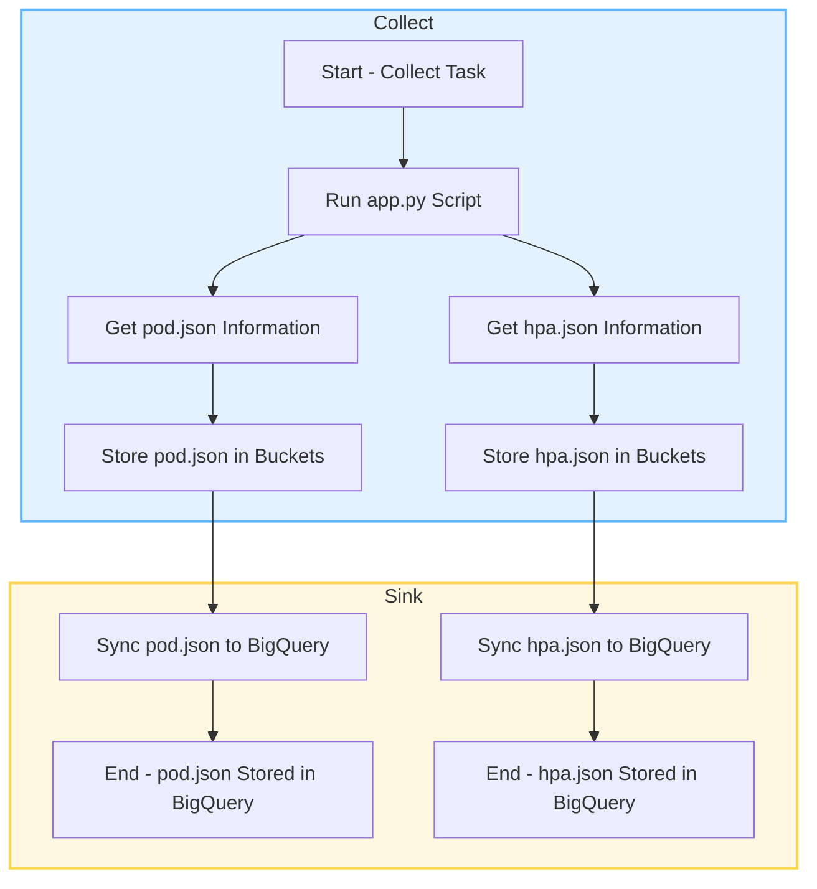
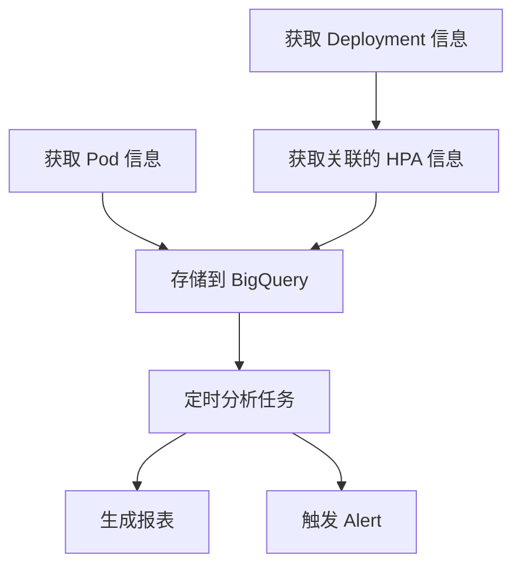
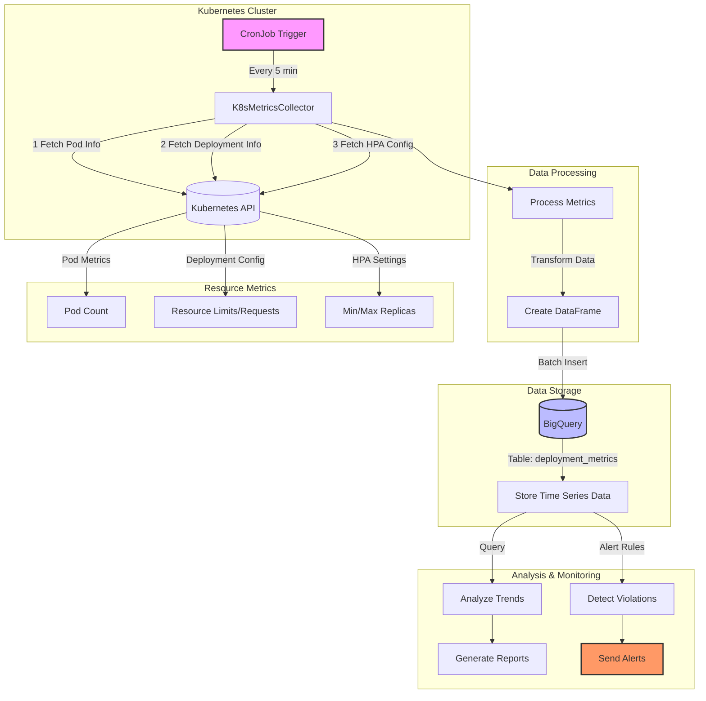
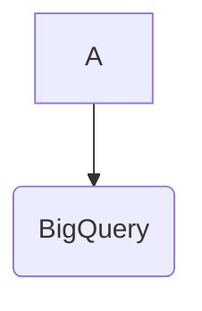
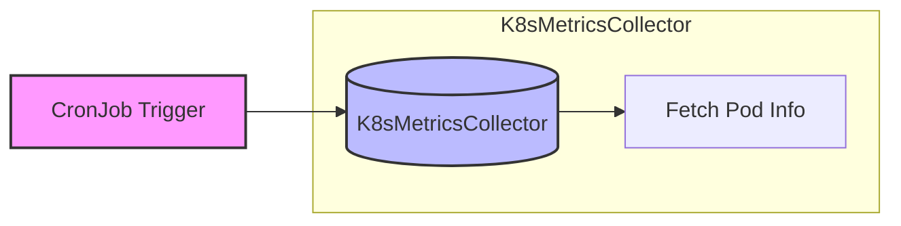

# summary 
比如我以往已经有一个定时任务sink-job去获取一些Pod的信息.其是一个Python的脚本 比如拿到Pod的CPU和内存的定义.
我现在需要增加这样一个需求.我还需要拿到Deployment的HPA的定义值.我理解其实HPA的值其实和真实运行的Pod数量是有关系的.
我已经把获取的Pod数据放在了对应的Bigquery里面
我现在想通过deployment再拿一些数据.我怎么去实现这个逻辑比较好?
帮我设计这个方案

# get hpa target deployment name

你可以通过 Kubernetes 的 API 或 kubectl 命令来获取所有 HPA 的信息，并将其导出为 JSON 格式，排除特定的命名空间（如 kube-system、aibang-core 和 default）。下面是一个完整的流程：

思路与步骤
	1.	过滤命名空间
使用 kubectl get hpa 命令并结合 --all-namespaces 选项获取所有命名空间的 HPA 信息，使用 jq 工具过滤掉特定命名空间。
	2.	保持信息完整
使用 -o json 获取 HPA 的详细 JSON 信息，包含 CPU 和内存的资源目标、当前状态等。
	3.	导出到 BigQuery 格式
将输出结果转换为 BigQuery 支持的格式，例如 JSON Lines (.ndjson) 文件。
	4.	高效执行
使用 Kubernetes 的 API 批量获取信息，避免每个命名空间单独调用，提升性能。

脚本示例

以下是一个 Bash 脚本，支持自动化获取 HPA 信息并排除特定命名空间：
```bash
#!/bin/bash

# 定义需要排除的命名空间
EXCLUDE_NAMESPACES=("kube-system" "aibang-core" "default")

# 拼接 jq 的过滤条件
EXCLUDE_FILTER=$(printf '.metadata.namespace != "%s" and ' "${EXCLUDE_NAMESPACES[@]}")
EXCLUDE_FILTER="${EXCLUDE_FILTER% and }"

# 获取所有 HPA 信息并过滤命名空间
kubectl get hpa --all-namespaces -o json | jq -c "[.items[] | select($EXCLUDE_FILTER)]" > hpa_data.json

# 检查文件是否为空
if [[ -s hpa_data.json ]]; then
  echo "HPA 信息已保存到 hpa_data.json 文件。"
else
  echo "未找到符合条件的 HPA。"
  exit 1
fi

# 转换为 BigQuery 支持的格式 (JSON Lines)
jq -c '.[]' hpa_data.json > hpa_data.ndjson

# 打印结果并提示
echo "转换完成，文件 hpa_data.ndjson 可直接导入 BigQuery。"
```
BigQuery 导入步骤
	1.	将文件上传到 GCS（Google Cloud Storage）

gsutil cp hpa_data.ndjson gs://<your-bucket-name>/hpa_data.ndjson


	2.	在 BigQuery 中创建表
使用以下命令创建表：

bq load --autodetect --source_format=NEWLINE_DELIMITED_JSON <your-dataset-name>.<your-table-name> gs://<your-bucket-name>/hpa_data.ndjson


	3.	验证数据
在 BigQuery 中运行查询验证导入的 HPA 数据是否完整。

输出字段完整性说明

输出的 JSON 格式会保留以下关键字段：

字段名称	描述
metadata.name	HPA 名称
metadata.namespace	命名空间
spec.scaleTargetRef	HPA 绑定的目标资源
spec.minReplicas	最小副本数
spec.maxReplicas	最大副本数
spec.metrics	监控指标配置（CPU、内存等）
status.currentReplicas	当前副本数
status.desiredReplicas	期望副本数

优化和注意事项
	•	并发优化
如果 HPA 数量较多，可以直接通过 Kubernetes 的 API Server 使用批量请求来提升性能。
	•	日志与监控
将输出的日志存储到日志系统（如 Stackdriver Logging）中，便于排查数据导入过程中的问题。
	•	定时任务
使用 cronjob 在 Kubernetes 中定时运行上述脚本，定期将 HPA 数据更新到 BigQuery。

如果需要进一步调整或将其整合到现有 Pipeline，请告诉我！


```json
{
  "apiVersion": "autoscaling/v2",
  "kind": "HorizontalPodAutoscaler",
  "metadata": {
    "name": "example-hpa",
    "namespace": "production",
    "creationTimestamp": "2025-01-20T12:34:56Z",
    "resourceVersion": "123456789",
    "uid": "d3b4a7ac-f9d4-11e9-8eb2-42010a8a0064"
  },
  "spec": {
    "scaleTargetRef": {
      "apiVersion": "apps/v1",
      "kind": "Deployment",
      "name": "example-app-deployment"
    },
    "minReplicas": 2,
    "maxReplicas": 10,
    "metrics": [
      {
        "type": "Resource",
        "resource": {
          "name": "cpu",
          "targetAverageUtilization": 50
        }
      },
      {
        "type": "Resource",
        "resource": {
          "name": "memory",
          "targetAverageUtilization": 80
        }
      }
    ]
  },
  "status": {
    "conditions": [
      {
        "lastTransitionTime": "2025-01-20T12:34:56Z",
        "message": "Replica count scaled from 2 to 4",
        "reason": "NewScale",
        "status": "True",
        "type": "AbleToScale"
      },
      {
        "lastTransitionTime": "2025-01-20T12:34:56Z",
        "message": "New size: 4; reason: CPU utilization (percentage of request) above target",
        "reason": "ScaleUp",
        "status": "True",
        "type": "ScalingUp"
      },
      {
        "lastTransitionTime": "2025-01-20T12:34:56Z",
        "message": "New size: 2; reason: memory resource utilization (percentage of request) above target",
        "reason": "ScaleDown",
        "status": "True",
        "type": "ScalingDown"
      }
    ],
    "currentMetrics": [
      {
        "resource": {
          "current": {
            "averageUtilization": 60,
            "averageValue": "100m",
            "value": "100m"
          },
          "name": "cpu"
        },
        "type": "Resource"
      },
      {
        "resource": {
          "current": {
            "averageUtilization": 52,
            "averageValue": "3284510",
            "value": "3284510"
          },
          "name": "memory"
        },
        "type": "Resource"
      }
    ],
    "currentReplicas": 4,
    "desiredReplicas": 2,
    "lastScaleTime": "2025-01-20T12:34:56Z"
  }
}
```

- 基于您提供的 JSON 数据设计的 BigQuery 表结构，仅保留对存储分析有用的字段，去除冗余数据，同时保持关键字段的完整性。表字段设计如下：


以下是基于您提供的 JSON 数据设计的 BigQuery 表结构，仅保留对存储分析有用的字段，去除冗余数据，同时保持关键字段的完整性。表字段设计如下：

BigQuery 表设计

表名：hpa_data

| 字段名              | 类型          | 描述                                                                         |
| ------------------- | ------------- | ---------------------------------------------------------------------------- |
| name                | STRING        | HPA 的名称 (metadata.name)                                                   |
| namespace           | STRING        | HPA 所在命名空间 (metadata.namespace)                                        |
| creation_timestamp  | TIMESTAMP     | HPA 创建时间 (metadata.creationTimestamp)                                    |
| resource_version    | STRING        | 资源版本 (metadata.resourceVersion)                                          |
| uid                 | STRING        | HPA 唯一标识符 (metadata.uid)                                                |
| scale_target_kind   | STRING        | 目标对象的类型 (spec.scaleTargetRef.kind)                                    |
| scale_target_name   | STRING        | 目标对象的名称 (spec.scaleTargetRef.name)                                    |
| min_replicas        | INT           | 最小副本数 (spec.minReplicas)                                                |
| max_replicas        | INT           | 最大副本数 (spec.maxReplicas)                                                |
| metric_type         | STRING        | 指标类型 (spec.metrics[].type)                                               |
| metric_name         | STRING        | 资源名称 (spec.metrics[].resource.name)                                      |
| target_utilization  | INT           | 目标平均利用率 (spec.metrics[].resource.targetAverageUtilization)            |
| current_utilization | INT           | 当前平均利用率 (status.currentMetrics[].resource.current.averageUtilization) |
| current_value       | STRING        | 当前值 (status.currentMetrics[].resource.current.value)                      |
| current_replicas    | INT           | 当前副本数 (status.currentReplicas)                                          |
| desired_replicas    | INT           | 期望副本数 (status.desiredReplicas)                                          |
| last_scale_time     | TIMESTAMP     | 最后扩缩容时间 (status.lastScaleTime)                                        |
| scaling_conditions  | ARRAY<STRUCT> | 扩缩容条件 (status.conditions)                                               |


	1.	核心字段：
	•	name、namespace：用来唯一标识 HPA 对象的关键字段。
	•	scale_target_kind、scale_target_name：表示 HPA 关联的目标资源。
	•	min_replicas、max_replicas：定义 HPA 的副本数范围。
	•	metric_type、metric_name、target_utilization、current_utilization：存储每个监控指标的具体数据。
	•	current_replicas、desired_replicas：监控扩缩容实际执行的副本数。
	•	last_scale_time：扩缩容的时间戳。
	2.	嵌套字段：
	•	scaling_conditions（ARRAY<STRUCT>）：表示扩缩容的所有条件（status.conditions），每个条件包含：
	•	type：条件类型（如 AbleToScale、ScalingUp）。
	•	status：条件状态（如 True、False）。
	•	reason：触发条件的原因。
	•	message：条件描述信息。
	•	lastTransitionTime：条件最后变更的时间。

DDL 创建语句

以下是创建上述 BigQuery 表的 SQL：
```sql
CREATE TABLE `project_id.dataset_id.hpa_data` (
  name STRING NOT NULL,
  namespace STRING NOT NULL,
  creation_timestamp TIMESTAMP,
  resource_version STRING,
  uid STRING,
  scale_target_kind STRING,
  scale_target_name STRING,
  min_replicas INT64,
  max_replicas INT64,
  metric_type STRING,
  metric_name STRING,
  target_utilization INT64,
  current_utilization INT64,
  current_value STRING,
  current_replicas INT64,
  desired_replicas INT64,
  last_scale_time TIMESTAMP,
  scaling_conditions ARRAY<STRUCT<
    type STRING,
    status STRING,
    reason STRING,
    message STRING,
    lastTransitionTime TIMESTAMP
  >>
);
```
示例数据映射

根据您提供的 JSON，以下是插入到 BigQuery 表中的示例行：
```json
{
  "name": "example-hpa",
  "namespace": "production",
  "creation_timestamp": "2025-01-20T12:34:56Z",
  "resource_version": "123456789",
  "uid": "d3b4a7ac-f9d4-11e9-8eb2-42010a8a0064",
  "scale_target_kind": "Deployment",
  "scale_target_name": "example-app-deployment",
  "min_replicas": 2,
  "max_replicas": 10,
  "metric_type": "Resource",
  "metric_name": "cpu",
  "target_utilization": 50,
  "current_utilization": 60,
  "current_value": "100m",
  "current_replicas": 4,
  "desired_replicas": 2,
  "last_scale_time": "2025-01-20T12:34:56Z",
  "scaling_conditions": [
    {
      "type": "AbleToScale",
      "status": "True",
      "reason": "NewScale",
      "message": "Replica count scaled from 2 to 4",
      "lastTransitionTime": "2025-01-20T12:34:56Z"
    },
    {
      "type": "ScalingUp",
      "status": "True",
      "reason": "ScaleUp",
      "message": "New size: 4; reason: CPU utilization (percentage of request) above target",
      "lastTransitionTime": "2025-01-20T12:34:56Z"
    },
    {
      "type": "ScalingDown",
      "status": "True",
      "reason": "ScaleDown",
      "message": "New size: 2; reason: memory resource utilization (percentage of request) above target",
      "lastTransitionTime": "2025-01-20T12:34:56Z"
    }
  ]
}
```

- flow

# enhance sink-job logic using chatgpt
要在现有的 sink-job 基础上扩展功能，从 Kubernetes Deployment 获取 HPA（Horizontal Pod Autoscaler） 的定义值，并将这些数据存储到 BigQuery 中，您可以按照以下方案实现。

设计方案

新需求分析
	1.	需要获取的数据：
	•	HPA 的配置值，包括：
	•	minReplicas（最小副本数）
	•	maxReplicas（最大副本数）
	•	当前 HPA 的 target 指标（如 CPU 或 内存 的目标值，单位 %）。
	•	Deployment 的关联 HPA 的实际状态（如 currentReplicas 和 desiredReplicas）。
	2.	数据来源：
	•	HPA 配置和状态：通过 Kubernetes API 获取。
	•	Deployment 元数据：从 Deployment 资源中获取与 HPA 的关联。
	3.	数据存储：
	•	将新的 HPA 数据和现有的 Pod 数据一起存储到 BigQuery 中，用于后续的分析和报表。

实现步骤

1. 扩展 sink-job 的功能

扩展 sink-job 的逻辑，让它能够通过 Kubernetes API 获取与 Deployment 相关联的 HPA 信息。可以使用 Kubernetes 的 Python 客户端来实现。

2. 获取 HPA 信息

使用 Kubernetes API 的 list_namespaced_horizontal_pod_autoscaler 方法来查询 HPA 信息。

示例代码：
```python
from kubernetes import client, config

def get_hpa_data(namespace):
    # 加载 Kubernetes 配置
    config.load_kube_config()

    # 创建 HPA API 客户端
    autoscaling_api = client.AutoscalingV2Api()

    # 获取所有 HPA 信息
    hpa_list = autoscaling_api.list_namespaced_horizontal_pod_autoscaler(namespace)
    hpa_data = []
    for hpa in hpa_list.items:
        hpa_data.append({
            "name": hpa.metadata.name,
            "namespace": hpa.metadata.namespace,
            "min_replicas": hpa.spec.min_replicas,
            "max_replicas": hpa.spec.max_replicas,
            "target_metric": hpa.spec.metrics,
            "current_replicas": hpa.status.current_replicas,
            "desired_replicas": hpa.status.desired_replicas
        })
    return hpa_data
```
3. 关联 Deployment 和 HPA

HPA 通常通过 scaleTargetRef 字段指定目标资源（如 Deployment）。可以通过以下步骤获取关联关系：
	•	在 HPA 的 scaleTargetRef 字段中找到目标 Deployment 的名字。
	•	查询该 Deployment 的详细信息。

示例：
```python
def get_hpa_target_deployment(hpa):
    if hpa.spec.scale_target_ref.kind == "Deployment":
        return hpa.spec.scale_target_ref.name
    return None
```
4. 将数据存储到 BigQuery

扩展现有的 BigQuery 表结构，加入 HPA 相关的字段。例如：

| deployment_name | namespace | min_replicas | max_replicas | target_metric | current_replicas | desired_replicas | timestamp           |
| --------------- | --------- | ------------ | ------------ | ------------- | ---------------- | ---------------- | ------------------- |
| my-deployment   | default   | 2            | 8            | CPU: 50%      | 3                | 5                | 2025-01-13 12:00:00 |


在 Python 中使用 google-cloud-bigquery 库将 HPA 数据写入 BigQuery：

示例：
```python 
from google.cloud import bigquery

def save_to_bigquery(dataset_id, table_id, hpa_data):
    client = bigquery.Client()
    table_ref = client.dataset(dataset_id).table(table_id)
    rows_to_insert = [
        {
            "deployment_name": hpa["name"],
            "namespace": hpa["namespace"],
            "min_replicas": hpa["min_replicas"],
            "max_replicas": hpa["max_replicas"],
            "target_metric": str(hpa["target_metric"]),
            "current_replicas": hpa["current_replicas"],
            "desired_replicas": hpa["desired_replicas"],
            "timestamp": datetime.datetime.utcnow()
        }
        for hpa in hpa_data
    ]
    errors = client.insert_rows_json(table_ref, rows_to_insert)
    if errors:
        print(f"Failed to insert rows: {errors}")
    else:
        print("HPA data successfully written to BigQuery")
```
1. 集成到现有 sink-job 中

将上述逻辑集成到现有的定时任务中，确保：
	•	每次运行时同时抓取 Pod 和 HPA 的数据。
	•	在 BigQuery 中按时间戳进行统一存储。

改进的工作流程

优化建议
	1.	实时性增强：
	•	考虑使用 Kubernetes 的 watch 机制来监听 HPA 和 Deployment 的状态变化，实时捕获数据变化并更新 BigQuery。
	2.	定时任务频率：
	•	如果没有实时监控的需求，可以保持现有定时任务的执行频率（如每天或每小时运行一次）。
	3.	数据完整性：
	•	在 BigQuery 表中增加字段以区分 Pod 数据和 HPA 数据。
	•	定期校验 HPA 数据的正确性，避免数据不一致。

最终结果

通过上述方案，您将实现一个更完善的监控与数据分析系统，既能采集 Pod 的运行状态，又能关联 HPA 的配置信息，用于监控、优化和报表分析。


# enhance sink-job logic using claude

我来帮你设计扩展现有sink-job的方案，以获取HPA和Deployment的信息。


```python
from kubernetes import client, config
from google.cloud import bigquery
from datetime import datetime
import pandas as pd

class K8sMetricsCollector:
    def __init__(self):
        # Initialize kubernetes client
        config.load_incluster_config()  # 如果在集群内运行
        self.core_v1 = client.CoreV1Api()
        self.apps_v1 = client.AppsV1Api()
        self.autoscaling_v1 = client.AutoscalingV1Api()
        
        # Initialize BigQuery client
        self.bq_client = bigquery.Client()
        
    def get_deployment_info(self, namespace):
        """获取Deployment的基本信息"""
        deployments = self.apps_v1.list_namespaced_deployment(namespace)
        deployment_data = []
        
        for deployment in deployments.items:
            deploy_name = deployment.metadata.name
            
            # 获取HPA信息
            try:
                hpa = self.autoscaling_v1.read_namespaced_horizontal_pod_autoscaler(
                    deploy_name, 
                    namespace
                )
                hpa_min_replicas = hpa.spec.min_replicas
                hpa_max_replicas = hpa.spec.max_replicas
                hpa_current_replicas = hpa.status.current_replicas if hpa.status.current_replicas else 0
                hpa_target_cpu = None
                
                # 获取CPU目标值
                if hpa.spec.target_cpu_utilization_percentage:
                    hpa_target_cpu = hpa.spec.target_cpu_utilization_percentage
            except client.exceptions.ApiException:
                hpa_min_replicas = None
                hpa_max_replicas = None
                hpa_current_replicas = None
                hpa_target_cpu = None
            
            # 获取Deployment当前状态
            deployment_data.append({
                'timestamp': datetime.utcnow(),
                'namespace': namespace,
                'deployment_name': deploy_name,
                'desired_replicas': deployment.spec.replicas,
                'current_replicas': deployment.status.ready_replicas,
                'hpa_min_replicas': hpa_min_replicas,
                'hpa_max_replicas': hpa_max_replicas,
                'hpa_current_replicas': hpa_current_replicas,
                'hpa_target_cpu': hpa_target_cpu,
                'resource_limits_cpu': self._get_container_resources(deployment.spec.template.spec.containers[0], 'limits', 'cpu'),
                'resource_limits_memory': self._get_container_resources(deployment.spec.template.spec.containers[0], 'limits', 'memory'),
                'resource_requests_cpu': self._get_container_resources(deployment.spec.template.spec.containers[0], 'requests', 'cpu'),
                'resource_requests_memory': self._get_container_resources(deployment.spec.template.spec.containers[0], 'requests', 'memory')
            })
            
        return deployment_data
    
    def _get_container_resources(self, container, resource_type, metric):
        """Helper方法来获取容器资源配置"""
        try:
            return container.resources.__getattribute__(resource_type).__getattribute__(metric)
        except AttributeError:
            return None
    
    def save_to_bigquery(self, data, table_id):
        """保存数据到BigQuery"""
        df = pd.DataFrame(data)
        
        job_config = bigquery.LoadJobConfig(
            write_disposition="WRITE_APPEND",
        )
        
        job = self.bq_client.load_table_from_dataframe(
            df, table_id, job_config=job_config
        )
        job.result()  # 等待任务完成
        
    def run(self, namespace, table_id):
        """主运行方法"""
        deployment_data = self.get_deployment_info(namespace)
        self.save_to_bigquery(deployment_data, table_id)

# 使用示例
if __name__ == "__main__":
    collector = K8sMetricsCollector()
    collector.run(
        namespace="your-namespace",
        table_id="your-project.your_dataset.deployment_metrics"
    )

```

这个设计方案有以下几个关键点：

1. 数据采集：
   - 获取Deployment基本信息
   - 获取HPA配置（最小/最大副本数、目标CPU使用率）
   - 获取资源配置（CPU/内存的requests和limits）
   - 获取当前运行状态（期望副本数、实际副本数）

2. 数据存储：
   - 使用BigQuery存储所有指标
   - 支持时间序列分析
   - 便于与现有Pod数据关联分析

3. 建议的BigQuery表结构：

```sql
CREATE TABLE `your-project.your_dataset.deployment_metrics` (
  timestamp TIMESTAMP,
  namespace STRING,
  deployment_name STRING,
  desired_replicas INT64,
  current_replicas INT64,
  hpa_min_replicas INT64,
  hpa_max_replicas INT64,
  hpa_current_replicas INT64,
  hpa_target_cpu INT64,
  resource_limits_cpu STRING,
  resource_limits_memory STRING,
  resource_requests_cpu STRING,
  resource_requests_memory STRING
)
PARTITION BY DATE(timestamp)
```

4. 使用建议：

- 建议将这个收集器作为CronJob运行，比如每5分钟运行一次
- 可以设置适当的重试机制和错误处理
- 考虑添加监控指标，以监控收集器本身的健康状况

5. 数据分析示例：

```sql
-- 检查副本数超过HPA最大值的情况
SELECT 
  timestamp,
  deployment_name,
  current_replicas,
  hpa_max_replicas
FROM 
  `your-project.your_dataset.deployment_metrics`
WHERE 
  current_replicas > hpa_max_replicas
  AND DATE(timestamp) = CURRENT_DATE()
ORDER BY 
  timestamp DESC
```

6. 可以考虑的扩展：

- 添加label选择器过滤特定Deployment
- 收集更多HPA相关指标（如内存目标值）
- 添加告警规则（如副本数异常波动）
- 与现有Pod指标数据关联分析

你觉得这个方案如何？是否需要收集其他指标或添加其他功能？


---

- simple flow 

---
- only an example of subgraph


让我为你详细解释这个工作流程：

1. 触发阶段
   - CronJob定时触发（每5分钟）
   - 初始化K8sMetricsCollector类
   - 建立必要的API客户端连接

2. 数据采集阶段
   - 从Kubernetes API获取三类数据：
     * Pod信息
     * Deployment配置
     * HPA设置
   - 并行收集资源指标数据

3. 数据处理阶段
   - 处理原始指标数据
   - 转换为标准DataFrame格式
   - 添加时间戳和元数据

4. 数据存储阶段
   - 将处理后的数据写入BigQuery
   - 使用分区表优化存储
   - 保证数据一致性

5. 分析和监控阶段
   - 分析数据趋势
   - 检测异常情况
   - 触发必要的告警
   - 生成分析报告

关键指标收集：
```
Pod相关：
- 当前运行Pod数量
- Pod状态

Deployment相关：
- 期望副本数
- 实际副本数
- 资源限制配置

HPA相关：
- 最小副本数
- 最大副本数
- 当前副本数
- CPU目标使用率
```

这个工作流程的优势：
1. 清晰的数据流向
2. 模块化的设计
3. 可扩展的架构
4. 完整的监控覆盖
5. 灵活的分析能力

你觉得这个流程图是否清晰地展示了整个工作流程？是否需要添加或修改某些环节？
